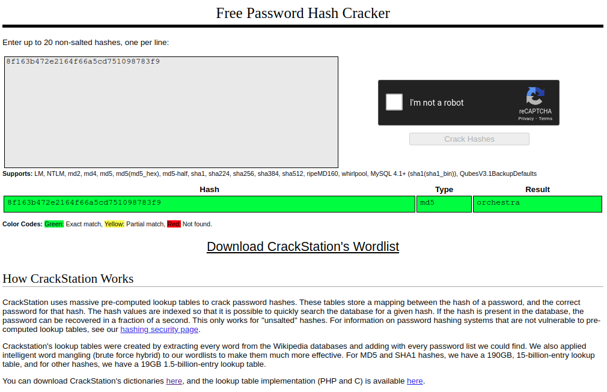

# My First Hash (beginner)
Here's your flag: `8f163b472e2164f66a5cd751098783f9` Psyc! Its encrypted. You think I'd give it to you that easily? Definitely don't look at my code tho -><- (when you find the flag, put it in `bctf{}` format)

## Files
* my-first-hash.py

## Solution
The python script show that the hash algorithm is MD5:
```python
import hashlib
from sys import exit

flag = '8f163b472e2164f66a5cd751098783f9'

str = input("Enter the flag\n")
str = hashlib.md5(str.encode())

if str.digest().hex() == flag:
    print("Congrats! You got the flag!")
else:
    print("Nope. Try again!")

exit()
```

MD5 is no longer considered to be secure and can be cracked pretty easily.

For that we can use a tool like https://crackstation.net/:


So the flag is `bctf{orchestra}`