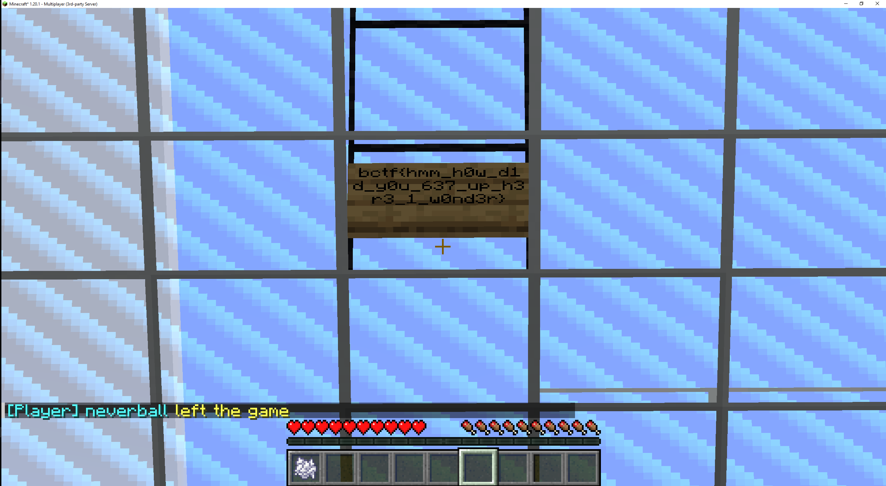

# Parkour (easy)
Completely unrelated to CTF Minecraft parkour.

`chall.pwnoh.io:13389`

## Solution
To get the flag you have to solve a parkour in Minecraft. I tried and I failed. So I took a different path.

The flag is probably on a sign at the end of the parkour. So I downloaded and installed a [Xray ressource pack](https://resource-packs.de/xray/?utm_source=youtube&utm_medium=description&utm_campaign=pvpacks) and a [zooming mod](https://www.curseforge.com/minecraft/mc-mods/wi-zoom/install/4770990).

Maybe this is a kind of cheating, but CTF challenges are meant to be hacking challenges, right?

With the mods you can easily read the flag:
