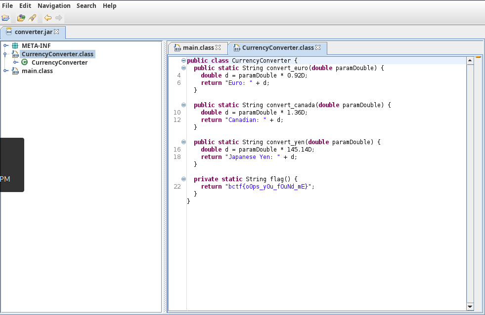

# Currency Converter (beginner)
Need to convert USD to another currency? Well I hope its either Euros, Canadian, or Yen!

## Files
* converter.jar

## Solution
We can decompile this JAR file with a tool like [JD-GUI](https://java-decompiler.github.io/).

If we decompile the file, we find a class called `CurrencyConverter.class`. Inhere is the flag in the function `flag()`:
