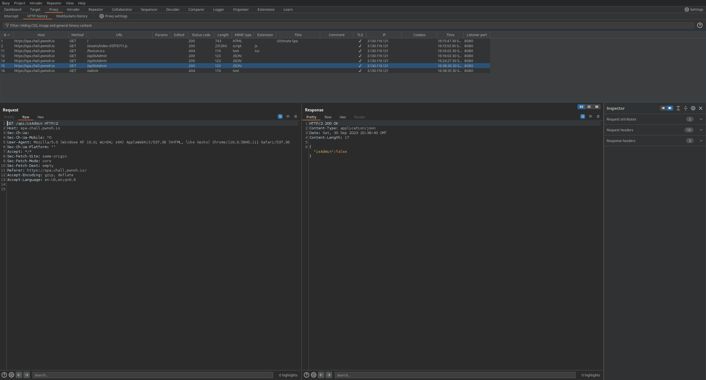
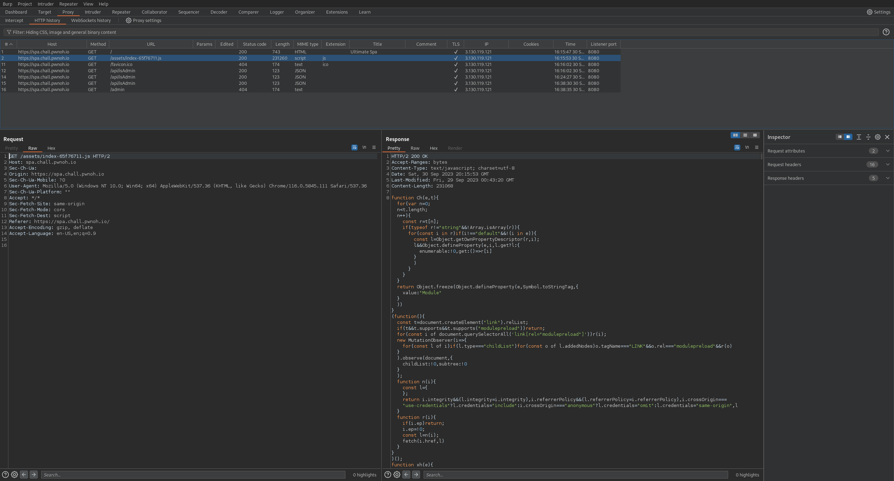

# Spa (easy)
Enjoy a relaxing visit to our spa.

https://spa.chall.pwnoh.io

## Solution
The website itself doesn't look that unusual. 

If we take a look at http data with Burp, we can see that there is a request to `/api/isAdmin`:


Also, we can find a js file in the data or if we investigate the page source:


If we search for _admin_ or _api_ in this js file, we find this function:
```js
const ag = "YmN0Zns3aDNfdWw3MW00NzNfNXA0XzE1XzRfcjM0YzdfNXA0fQo=";

function cg() {
    const e = ch({
        queryKey: ["admin"],
        queryFn: () => fetch("/api/isAdmin").then(t => t.json())
    });
    return e.data === void 0 || !e.data.isAdmin ? $.jsx($.Fragment, {
        children: "Unauthorized"
    }) : $.jsx($.Fragment, {
        children: $.jsxs("div", {
            id: "ocean",
            className: "full vignette",
            children: [$.jsx(fh, {}), $.jsxs("div", {
                className: "content",
                children: [$.jsx("h1", {
                    children: "Admin page"
                }), $.jsx("p", {
                    children: atob(ag)
                })]
            })]
        })
    })
}
```

So if we try to access `/admin` and the api `/api/isAdmin` returns true, then the admin page is opened and the variable `ag` is used. This variable contains a Base64 encoded string.

If we try to decode this strings, we find the flag:
```
$ printf YmN0Zns3aDNfdWw3MW00NzNfNXA0XzE1XzRfcjM0YzdfNXA0fQo= | base64 -d
bctf{7h3_ul71m473_5p4_15_4_r34c7_5p4}
$
```