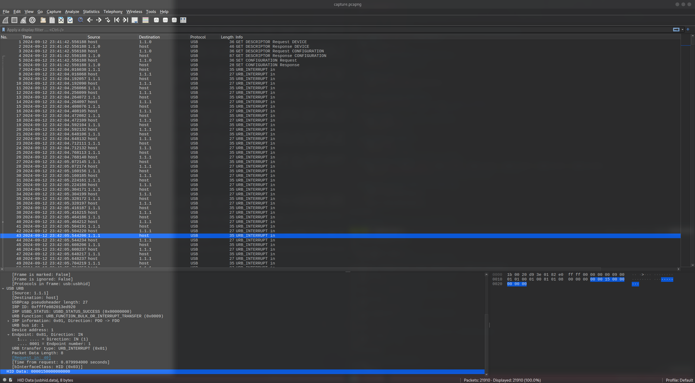

# duck-pics (100 points)

## Data
* capture.pcapng

## Solution
The PCAP contains some USB traffic. Searching a bit around, shows that the traffic is probably from a USB keybaord and the packages are the keystrokes, that the keyboard sent to the PC. The transmitted data can be found under the header 'HID Data':



The shown data contains `0x15` which is the keystroke for `r`. I found a list of the keys in other writeups of similar challenges ([1](https://gist.github.com/Rajchowdhury420/49476d46479184f5fd590057ef30bd92), [2](https://abawazeeer.medium.com/kaizen-ctf-2018-reverse-engineer-usb-keystrok-from-pcap-file-2412351679f4)). Take a look at my [solution script](./duck-pics.py) to see all of them.

There are a few different types of data, but they are all in the same scheme:
1. `0000170000000000` - normal keystroke (`t`)
2. `0000171500000000` - two simultaneous keystrokes (`t` & `r`) (can be ignored, since those aren't printed)
2. `0200000000000000` - shift keystroke
3. `0200050000000000` - shift keystroke of another key (`B`)
4. `0100000000000000` - ctrl keystroke
5. `01002a0000000000` - ctrl keystroke of another key (`ctrl + del`)

We can extract the HID data of all packages with `tshark`:
```
tshark -r capture.pcapng -T fields -e usbhid.data | grep -E "^.{16}$" | grep -v 0000000000000000 > data.txt
```

If we run the script, we get the following text:
```
Bblog entry #216

Ttitle: Tthe Strange and unsettling Rreality ofDucks' Spiral-SshapedDPpenises.

Tthere are some facts you stumvle uppon in life that leave you changed.  I'm not talking about grand revelations like realizing the meaning of existence, but rather those little, often unwanted, tidbits of knowledge that somehow manage to worm theirway into your brain and stay there.  Forever.....  Ffor me, one of thoss facts is this: ducks have spiral-shaped penieses.

Now, before you click away, thinking this is some sort of absurd prank or outlandish clickbait-let me assure yu, this is real. *Ttoo** real, if I may say.  Dducks, those quaint little creatures that waddle by ponds and quack at passersby, have genitalia that corkscrew in way I never thought possible or necessary. Tthe first time I learned about this, my immediate response was a bewildered why[ctrl+del]"why?" followed by a slow creeping discomfort that I havn't been able to shake off since.

I suppose the first question we should all ask is, "How did I even come across this information?"  Wwell, Llike all unexpected journeys, it began innocently enogh. I was deep into an internet rabbit hole one evening, starting with wholesome videos of duckligs learning to swim. Tthat should have been my cue to stop. But the curiosity machine that is the internet is relentless, and after clicking from one nature documentary to another, I stumbled upon the unsettling fact that male ducks, SPECIFICALLY  drakes, have penises that are shaped like corkscrews.

Aat first,  I didn't believe it.  I mean, why would a duck's reproductive organ *nee* to resemble soething you open a bottle of wine??? Iit felt like one of those quirky, unnecessary adaptations that evolution sometimes comes up with for reasons that no one really asked for. but the more I read  (and I readALOT), the more uncomforatble  I became.  I couldn't stop imagining it.

[CapsLock][CapsLock][CapsLock]magine ducks waddling around, their spiral-shaped anatomy hidden beneath those seeminglt innocent feathers, waiting for just the right moment,  It's bizarrely elaborate for a bird, considering that mst birds don't even *have8* penises.  Tthey make do with something called a cloacal kiss, where their reproductive organs briefly touch. Dducks, on the other hand, went the extra miile with a complex, coiled machanism. Iit's almost as if nature, in some strange fit of whimsy said, "You know what ducks need?  A penis that looks like a piece of pasta."

But it doesn't stop there. Oh no. Aas if the spiral shape wasn't unsettling enough, the whole process of duck reproduction is fraught with weirdness and, frankly, biol[ctrl+del]violence.  Ffemale ducks, it turns out, evolved a counter-spiral that's right-[ctrl+del][ctrl+del][ctrl+del]reproductive tract to fend off unwanted advances, because yes, the duck world is rife with reproductive coercion. Tthat's right-nature designed an entire system where male and female anatomy are *8at odds* with each other, spiraling in opposite directtions, all in the name of, wwll, survival?

So now, every time I see a duck floating gracefully across a pong, I cn't help but feel a little uneasy,.  On the surface, they seem calm, composed, and perfectly harmless. But now that I know what's going on beneath thoss features, I can't unsee it. The piral-shped tspiral-shaped truth is always there, lurking in the background. and honestly, it makes my interactions with ducks,,, awkward. I mean, how am I supposed to look at them the same way again?

[tab][tab][tab][tab][ctrl+tT]enterthefl[ctrl+del]entertheflag.com


bctf{Sst[ctrl+del]SteAl[ctrl+del]St0p_s3nd1Ng_m3_DuCK_p1c$}

[tab][tab]I think what makes it particularly uncomforatble is the juxtaposition between the image we have of ducks and this peculiar biological fact.  Dducks are often associated with peaceful, picturesque moments.  You feed them bread crumbs in the park.  You watch them swim in calm, srene pongs. And then there's this *SPIRAL PENIS SITUATION* lurking that[ctrl+del]just under the surface  (literally and figuratively....).

This revelation has caused me to question a lot of thigs, Is nature inherently weird? Are there more unsettling facts about animals I don't know yet-and do I event  *8want* to know? Ccould  I have gone my whole life without knowing this about ducks, and I[ctrl+del]would I be happier for it?

In the end, there's no real resolution here, no epiphany that wraps this uncomfortable fact into a neat little bow. Ducks have spiral-shaped penises, and that's just how the world works. Bbut even as Ii sit here writing this, with me words than necessary on a subject I never intended to delve into, I ca't shake the deeling that something has shifted in my understanding of the animal kingdom, nature, and life.

Sso the next time you see a duck gliding elegantly across a lake, just remember: beneath that calm exterior is a corkscrew of evolutionary weirdness that will haunt you forever.
```

The order of shifted keystrokes is not always the same. Resulting in outputs like _Bblog_, but the text was pretty good reconstructed. Looking a bit through it, will give us the flag:
```
bctf{Sst[ctrl+del]SteAl[ctrl+del]St0p_s3nd1Ng_m3_DuCK_p1c$}
```

If we remove the deleted characters from `ctrl + del` we got: 
```
bctf{St0p_s3nd1Ng_m3_DuCK_p1c$}
```
