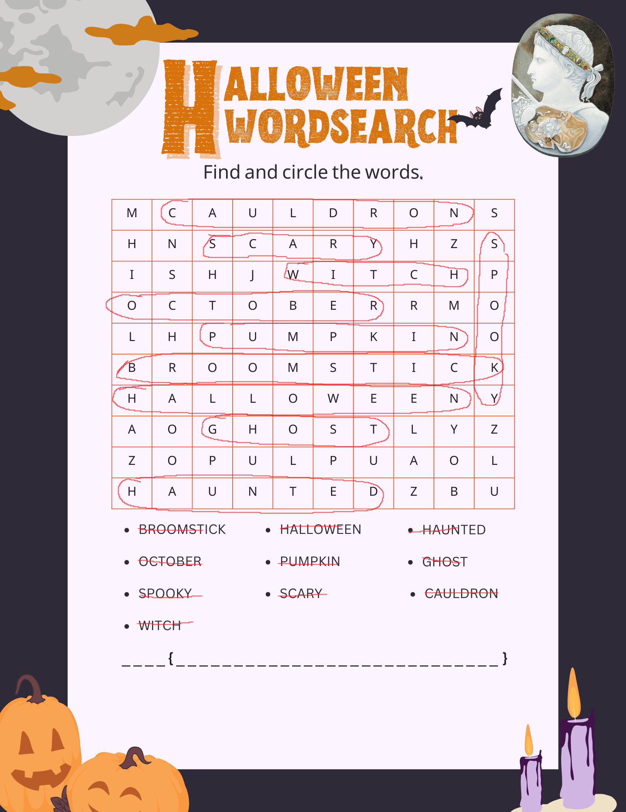

# Letter Soup (10 points)
We believe we have ran into one of the newest members of DEADFACE while they were waiting for the train. The member seemed to have gotten spooked and stood up suddenly to jump on the train right before the doors shut. They seemed to have gotten away, but dropped this innocent looking word search. I believe this member might be actually a courier for DEADFACE. Let’s solve the word search to decode the mystery message. We believe the message might tell us their next move.

Submit the flag as `flag{TARGETNAME}` (e.g., `flag{THISISTHEANSWER}`)

[Download Image](https://tinyurl.com/mr2yufep)
SHA1: ec82f7bae41b800ef1d1ef5f00e97ffb43c737a5

## Solution
Searching and marking the words in the letters shows the following picture:

If we note down the letters that are not circled we got: `MSHNHZISHJRMLHAOLYZZOPULPUAOLZBU`

Those are 32 characters. The flag at the bottom is also 32 characters long. So probably it is encrypted somehow. Since those are all uppercase letters, it could be ROT again.

Throwing the text into CyberChef again and iterate through the ROT amount we get a valid text for ROT 19: `FLAGASBLACKFEATHERSSHINEINTHESUN`

So the flag is: `flag{ASBLACKFEATHERSSHINEINTHESUN}`