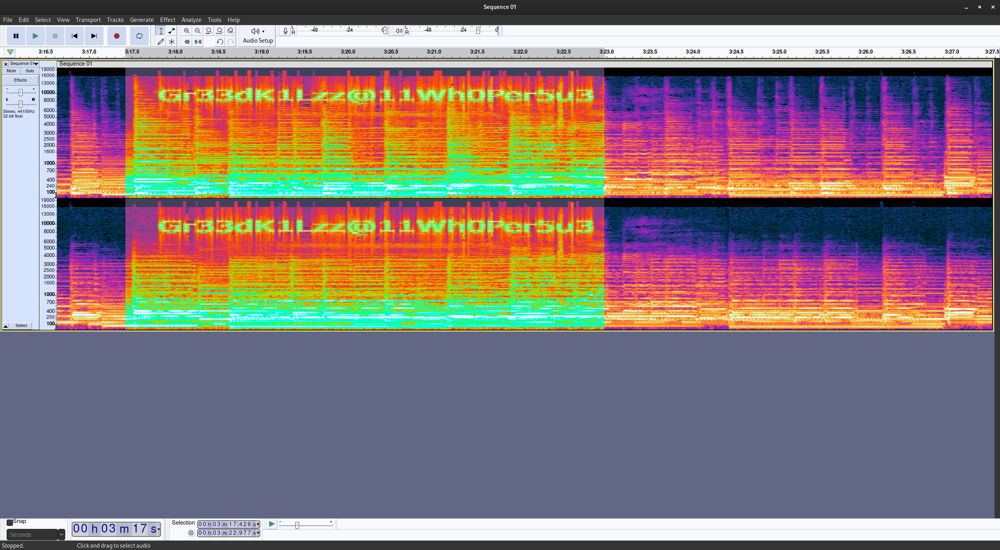
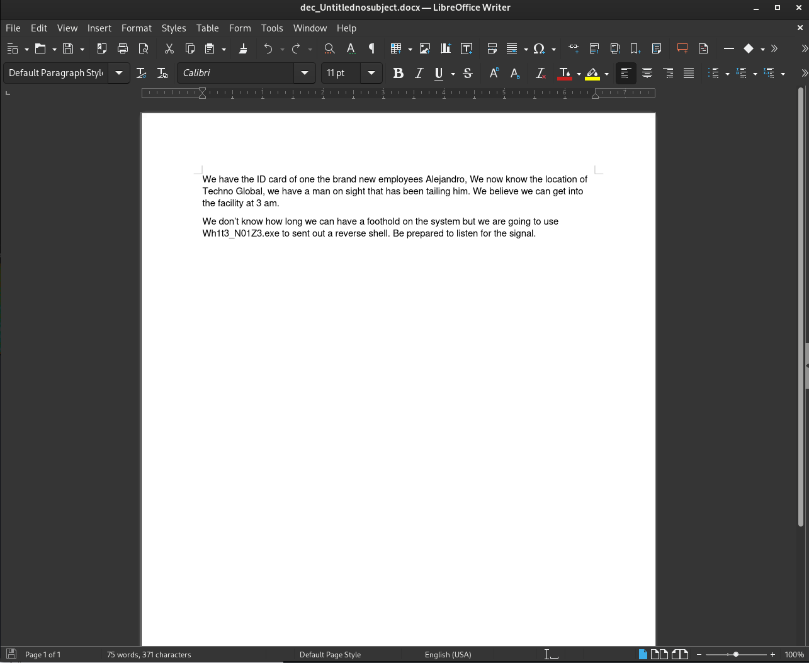

# Tin Balloon (150 points)
We've discovered that DEADFACE was somehow able to extract a fair amount of data from Techno Global Research Industries. We are still working out the details, but we believe they crafted custom malware to gain access to one of TGRI's systems. We intercepted a Word document that we believe mentions the name of the malware, in addition to an audio file that was part of the same conversation. We're not sure what the link is between the two files, but I'm sure you can figure it out!

Submit the flag as: `flag{executable_name}`. Example: `flag{malware.exe}`.

[Download ZIP](https://tinyurl.com/y2wcd4wv)
SHA1: 19d82c3dc14b342c3e3bd1e5761378ab821475e4

## Solution
If we listen into the audio file we find some random noises at about 3:15. Inspecting this section with Audacity and switching to the Spectogram view, shows the following message:


The word document is encrypted, so maybe this is the key to decrypt it:
```
$ file Untitlednosubject.docx
Untitlednosubject.docx: CDFV2 Encrypted

$ msoffcrypto-tool Untitlednosubject.docx dec_Untitlednosubject.docx -p Gr33dK1Lzz@11Wh0Per5u3
$

$ file dec_Untitlednosubject.docx
dec_Untitlednosubject.docx: Microsoft Word 2007+
$
```

The guess was right. The content of the document contains the malware name:


So the flag is: `flag{Wh1t3_N01Z3.exe}`