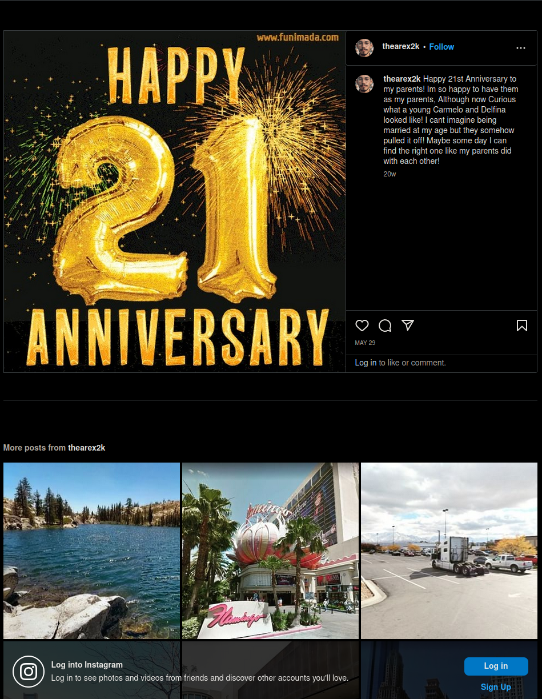

# Mama y Papa (10 points)
Alejandro has been seen as an easy mark for DEADFACE. Do a sweep of his social media to see what information DEADFACE was able to gather on Alejandro. Scroll through Alejandros Social media to find out the name of his father and mother.

Submit the flag as: `flag{father<3mother}`. Example: `flag{John<3Susan}`.

## Solution
Searching for Alejandro in the [Ghost Town](https://ghosttown.deadface.io/) forum, guides us to the following thread:

In here we find a link to his [Facebook profile](https://www.facebook.com/profile.php?id=100092649204317):

In his Facebook profile we can't find that much information. The only interesting thing is this post:

His parents had their 21st anniversary.

According to the forum thread, he has also a LinkedIn and Instagram profile. Since his name is pretty usual and many times found, we can use Google Lens to look up with his profile picture. This was also mentioned in the forum. This brings us to several LinkedIn posts:

With the [LinkedIn](https://www.linkedin.com/posts/alejandro-ricardo-montoya-de-la-rosa-rodriguez-1b0a92278_techentrepreneur-businessmindset-entrepreneurship-activity-7118058221658898432-b9Wy) profile we got his full name. Just searching for this name shows up his [Instagram](https://www.instagram.com/thearex2k/) profile:

Looking through the posts here, we find a picture saying "Happy 21 Anniversary". This post should get our attention if we remember the Facebook post. Opening the post shows us the names of his parents:

So the flag is: `flag{Carmelo<3Delfina}`