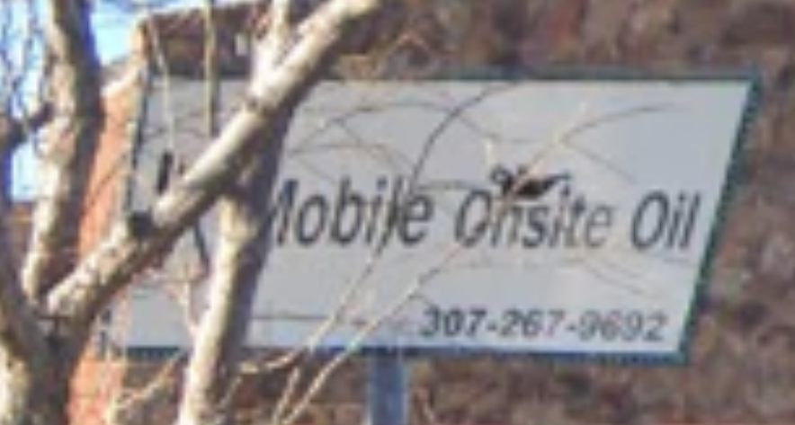
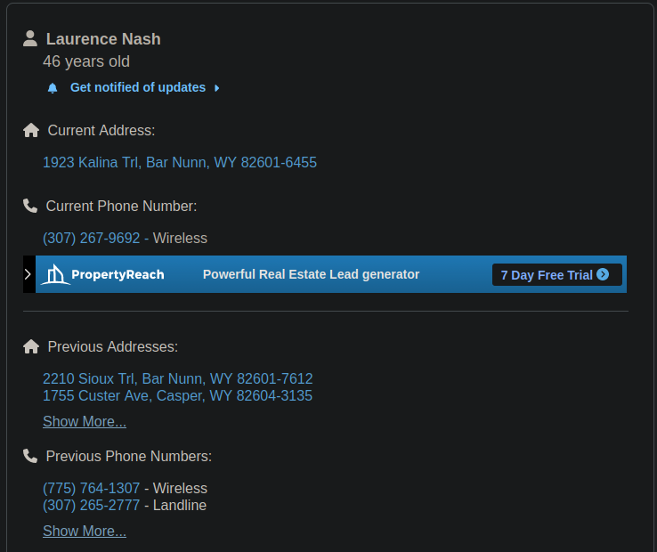

# Nice Vacation (20 points)
Alejandro has been on a road trip to get to his new job working for Techno Global industries. This one one of the first paces he stopped at according to his Instagram.

Submit the flag as `flag{City. state abreviation}`. Example: `flag{Denver, CO}`.

[Download Image](https://tinyurl.com/u5u7we8b)
SHA1: b5656528384d4556af025507981a80520609ca26

## Solution
On the picture we find a phone number on a sign:

If we look up this number for example with https://www.usphonebook.com/ we find the following entry:

I tried both addresses  `Bar Nunn, WY` and `Casper, WY`. The second was the right one. The flag is `flag{Casper, WY}`