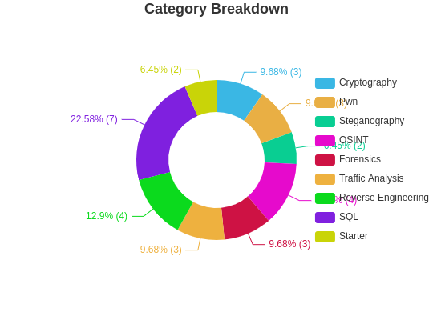

# DEADFACE CTF 2023

## Ranking

## Challenges

### Reverse Engineering (4/9)
| Challenge                                                              | Points | Status     |
| ---------------------------------------------------------------------- | ------ | ---------- |
| [Cereal Killer 05](./Reverse_Engineering/Cereal_Killer_05.md)          | 10     | Solved     |
| [Cereal Killer 01](./Reverse_Engineering/Cereal_Killer_01.md)          | 50     | Solved     |
| [Gamertime: Cheat Code](./Reverse_Engineering/Gamertime_Cheat_Code.md) | 50     | Solved     |
| My Daily Macros                                                        | 70     | Not solved |
| [Cereal Killer 02](./Reverse_Engineering/Cereal_Killer_02.md)          | 100    | Solved     |
| STARvin for Secrets 1: Lind                                            | 100    | Not solved |
| Cereal Killer 04                                                       | 200    | Not solved |
| Cereal Killer 03                                                       | 300    | Not solved |
| Cereal Killer 06                                                       | 500    | Not solved |

### Capstone (0/1)
| Challenge       | Points | Status     |
| --------------- | ------ | ---------- |
| End of the Road | 500    | Not solved |

### Pwn (3/7)
| Challenge                                 | Points | Status     |
| ----------------------------------------- | ------ | ---------- |
| [Host Busters 3](./Pwn/Host_Busters_3.md) | 100    | Solved     |
| [Host Busters 5](./Pwn/Host_Busters_5.md) | 100    | Solved     |
| Scamazon 1                                | 200    | Not solved |
| [Host Busters 4](./Pwn/Host_Busters_4.md) | 300    | Solved     |
| Gamertime: Need for Speed                 | 300    | Not solved |
| Beat it, kid                              | 300    | Not solved |
| Internal                                  | 400    | Not solved |

### Steganography (2/8)
| Challenge                                                            | Points | Status     |
| -------------------------------------------------------------------- | ------ | ---------- |
| [You've Been Ransomwared](./Steganography/Youve_Been_Ransomwared.md) | 10     | Solved     |
| [Fetching Secrets](./Steganography/Fetching_Secrets.md)              | 20     | Solved     |
| Electric Steel                                                       | 150    | Not solved |
| Terms and Conditions May Apply                                       | 150    | Not solved |
| Syncopated Beat                                                      | 300    | Not solved |
| Sneaky Static                                                        | 300    | Not solved |
| The Wisdom of Knox                                                   | 300    | Not solved |
| The Pearl of Wisdom of Eliphaz                                       | 400    | Not solved |

### SQL (7/11)
| Challenge                                             | Points | Status     |
| ----------------------------------------------------- | ------ | ---------- |
| [Aurora Compromise](./SQL/Aurora_Compromise.md)       | 10     | Solved     |
| Foreign Keys                                          | 10     | Not solved |
| [Credit Compromise](./SQL/Credit_Compromise.md)       | 15     | Solved     |
| [Starypax](./SQL/Starypax.md)                         | 50     | Solved     |
| [Transaction Approved](./SQL/Transaction_Approved.md) | 100    | Solved     |
| Genovex Profits                                       | 100    | Not solved |
| [City Hoard](./SQL/City_Hoard.md)                     | 100    | Solved     |
| Order Up                                              | 125    | Not solved |
| [Counting STARs](./SQL/Counting_STARs.md)             | 150    | Solved     |
| [Clean Up on Aisle 5](./SQL/Clean_Up_on_Aisle_5.md)   | 300    | Solved     |
| SHAttered Dreams                                      | 400    | Not solved |

### Cryptography (3/11)
| Challenge                                        | Points | Status     |
| ------------------------------------------------ | ------ | ---------- |
| [Coin Code](./Cryptography/Coin_Code.md)         | 10     | Solved     |
| [Letter Soup](./Cryptography/Letter_Soup.md)     | 10     | Solved     |
| [B1Tz and B0tZ](./Cryptography/B1Tz_and_B0tZ.md) | 25     | Solved     |
| Refill on Soup                                   | 75     | Not solved |
| HAM JAM                                          | 75     | Not solved |
| Color Me Impressed                               | 75     | Not solved |
| 0ff Again On Aga1n                               | 100    | Not solved |
| Halloween +1                                     | 100    | Not solved |
| Up in the Air                                    | 250    | Not solved |
| Reflections                                      | 350    | Not solved |
| Slothy                                           | 375    | Not solved |

### Programming (0/2)
| Challenge                              | Points | Status     |
| -------------------------------------- | ------ | ---------- |
| Dead Drop                              | 30     | Not solved |
| The CDR of the CAR... RAH, RAH, RAH!!! | 350    | Not solved |

### Traffic Analysis (3/6)
| Challenge                                                                      | Points | Status     |
| ------------------------------------------------------------------------------ | ------ | ---------- |
| [Sometimes IT Lets You Down](./Traffic_Analysis/Sometimes_IT_Lets_You_Down.md) | 25     | Solved     |
| [Git Rekt](./Traffic_Analysis/Git_Rekt.md)                                     | 50     | Solved     |
| [Creepy Crawling](./Traffic_Analysis/Creepy_Crawling.md)                       | 75     | Solved     |
| UVB-76 (Hello, are you there?)                                                 | 75     | Not solved |
| Keys to the Kingdom                                                            | 100    | Not solved |
| Have a Cup of Coffee                                                           | 300    | Not solved |

### OSINT (4/9)
| Challenge                                 | Points | Status     |
| ----------------------------------------- | ------ | ---------- |
| [Mama y Papa](./OSINT/Mama_y_Papa.md)     | 10     | Solved     |
| [G(l)o Clouds!](./OSINT/Glo_Clouds.md)    | 10     | Solved     |
| [Nice Vacation](./OSINT/Nice_Vacation.md) | 20     | Solved     |
| Take a Seat Upon the Throne               | 20     | Not solved |
| Black Hat                                 | 25     | Not solved |
| Dark_Web_Dump                             | 50     | Not solved |
| Reveal Mirveal                            | 100    | Not solved |
| Settle in the Presence of Evil            | 225    | Not solved |
| [Feeling Lucky](./OSINT/Feeling_Lucky.md) | 250    | Solved     |

### BONUS (0/3)
| Challenge     | Points | Status     |
| ------------- | ------ | ---------- |
| Off the Rails | 30     | Not solved |
| Lilith        | 50     | Not solved |
| Zombie Math   | 200    | Not solved |

### Forensics (3/5)
| Challenge                                            | Points | Status     |
| ---------------------------------------------------- | ------ | ---------- |
| [What's the Wallet](./Forensics/Whats_the_Wallet.md) | 20     | Solved     |
| [Host Busters 1](./Forensics/Host_Busters_1.md)      | 50     | Solved     |
| Malum                                                | 75     | Not solved |
| [Tin Balloon](./Forensics/Tin_Balloon.md)            | 150    | Solved     |
| Host Busters 2                                       | 200    | Not solved |

### Starter (2/2)
| Challenge                           | Points | Status |
| ----------------------------------- | ------ | ------ |
| [Starter 1](./Starter/Starter_1.md) | 5      | Solved |
| [Starter 2](./Starter/Starter_2.md) | 5      | Solved |