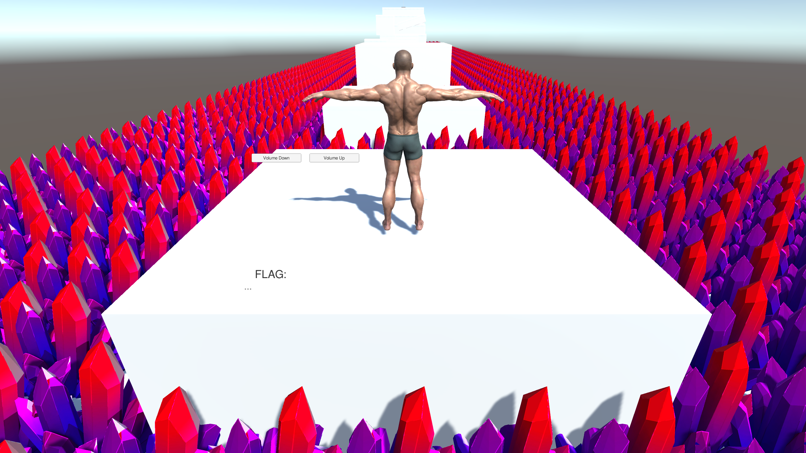
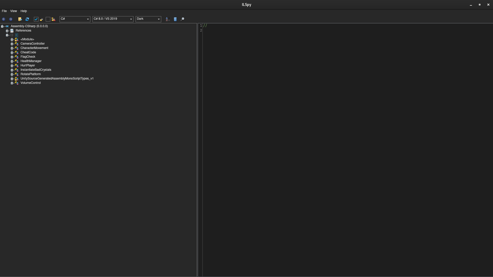
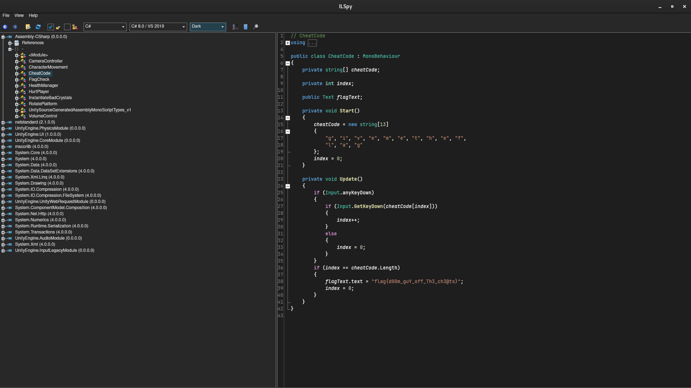
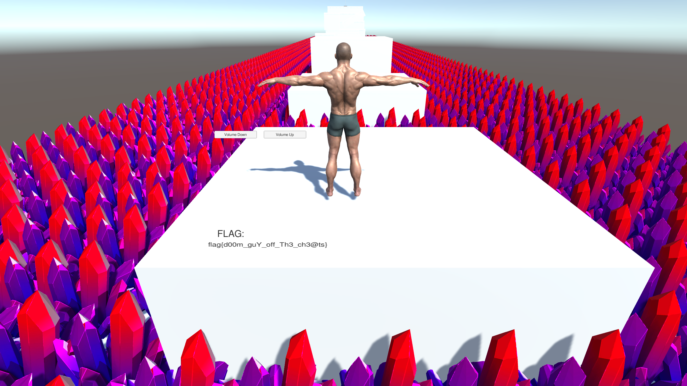

# Gamertime: Cheat Code (50 points)
DEADFACE has created a game to help recruit new young members. Apparently there is a flag hidden in the binary that can only be accessed by entering a cheatcode that is used as a secret password before they allow these new recruits to join their ranks.

[Download for Mac](https://tinyurl.com/2d2bxxak)
SHA1: 68faeca76e5a7e84c572251042c949b6c80e28db

[Download for Linux](https://tinyurl.com/bdep4p49)
SHA1: f9569a936afb904b834c228be61715dce60cfbd1

[Download for Windows](https://tinyurl.com/29vfe36w)
SHA1: 5d282bb76b4c21ca60f8e063a28ed3ed29ae129d

## Solution
We got a game programmed with the Unity Engine. In the have to jump with our character over some platforms until we reach a flag:

But the last jump is not solvable. So let's reverse the game files. In a Unity game the relevant function are stored in the file `Assembly-CSharp.dll`. Usual it is stored in the Managed folder: `linux_gamer_time/linux_gamertime_new/linux_gamer_time2_Data/Managed/Assembly-CSharp.dll`

Since is a .dll file, we can reverse it with ILSpy.

In the file we find the following functions:

We know that we have to use a cheat code. So interesting for us is the function `CheatCode`:

In here we find the cheat code: `givemetheflag`

So if we start the game and enter the code we get the flag:
