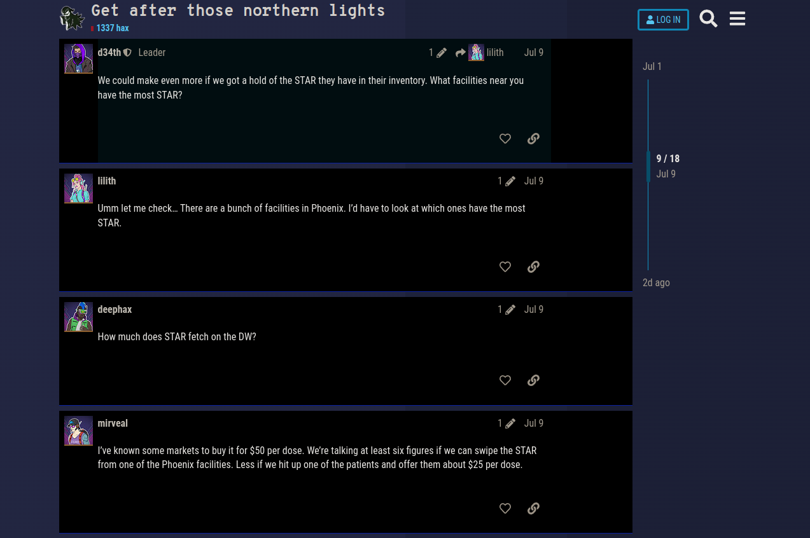

# Clean Up on Aisle 5 (300 points)
Based on Ghost Town conversations, DEADFACE is going to try to compromise an Aurora Health pharmacy to get their hands on STAR. Turbo Tactical wants to provide security personnel at Aurora with information about which facility, aisle, and bin contains the most STAR, since it is likely what DEADFACE will target.

Provide the facility_id, aisle, and bin where the most STAR is kept in the city DEADFACE is targeting. Submit the flag as flag{facility_id-aisle-bin}.

Example: `flag{123-4-8}`

Use the database dump from Aurora Compromise.

## Solution
In the forum we can find a [thread](https://ghosttown.deadface.io/t/get-after-those-northern-lights/103/9) were the actors are talking about STAR. One post says that a bunch of facilities is located in Phoenix:


So this is probably the city were we have to find the facility with the highest amount of STAR.

To do so, we have to join the tables inventory, drugs and facilities. Then we search for the city Phoenix and the drug Starypax and sort it by the quantity:
```
MariaDB [ctf]> select inventory.facility_id,inventory.locator,facilities.city,inventory.qty from inventory,drugs,facilities where inventory.drug_id=drugs.drug_id and drugs.drug_name='Starypax' and inventory.facility_id=facilities.facility_id and facilities.city='Phoenix' order by inventory.qty;
+-------------+---------+---------+------+
| facility_id | locator | city    | qty  |
+-------------+---------+---------+------+
|        1113 | A43B39  | Phoenix |  137 |
|        1022 | A8B24   | Phoenix |  159 |
|         215 | A45B34  | Phoenix |  463 |
|        1110 | A17B49  | Phoenix |  573 |
|         442 | A23B24  | Phoenix | 1382 |
|        1388 | A30B23  | Phoenix | 1853 |
|         178 | A17B32  | Phoenix | 2023 |
|          40 | A39B38  | Phoenix | 2411 |
|         434 | A43B51  | Phoenix | 2480 |
|        1058 | A7B25   | Phoenix | 2524 |
|         706 | A4B20   | Phoenix | 2573 |
|         567 | A11B51  | Phoenix | 2737 |
|         412 | A11B44  | Phoenix | 2740 |
+-------------+---------+---------+------+
13 rows in set (0.005 sec)

MariaDB [ctf]> 
```

Corresponding to the database documentation the aisle and bin are written to the locator column of the inventory table:
```
The aisle (represented as “A”) and the bin (represented as “B”) where the drug is stored in the associated facility.
```

So the number behind A is the aisle and the number behind B is the bin.

The flag is then `flag{412-11-44}`.