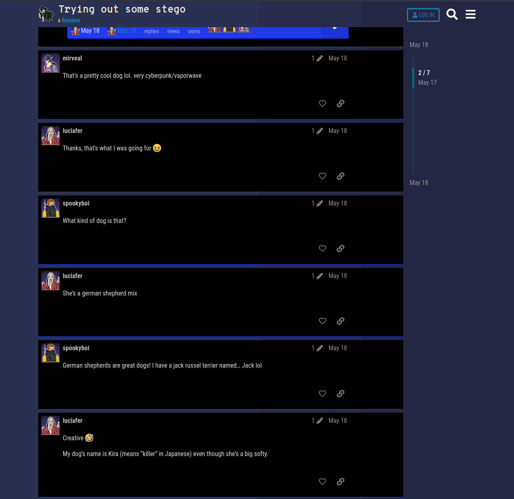
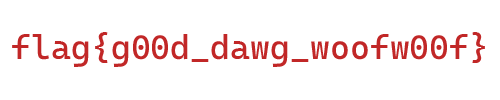

# Fetching Secrets (20 points)
This image was found on Ghost Town. Looks like one of DEADFACE’s newest members is new to steganography. See if you can find any hidden information in this image. Knowing information about the image may help to reveal the flag.

Submit the flag as: `flag{flag_text}`.

[Download Image](https://tinyurl.com/5457w9ww)
SHA1: 378f0b4e793aac93d5333d854d552e56aae08ede

## Solution
Searching for stego in the forum brings us to this [thread](https://ghosttown.deadface.io/t/trying-out-some-stego/95). In here was the picture posted and the user chat about the kind of dog and naming:


So maybe there is something hidden in the file that can be extracted with one of the words `shepherd`, `Kira`, `kira`, `killer`.

Gave it a try and got the flag:
```
$ steghide extract -sf cyberdog.jpg -p kira -xf extracted
wrote extracted data to "extracted".
```
