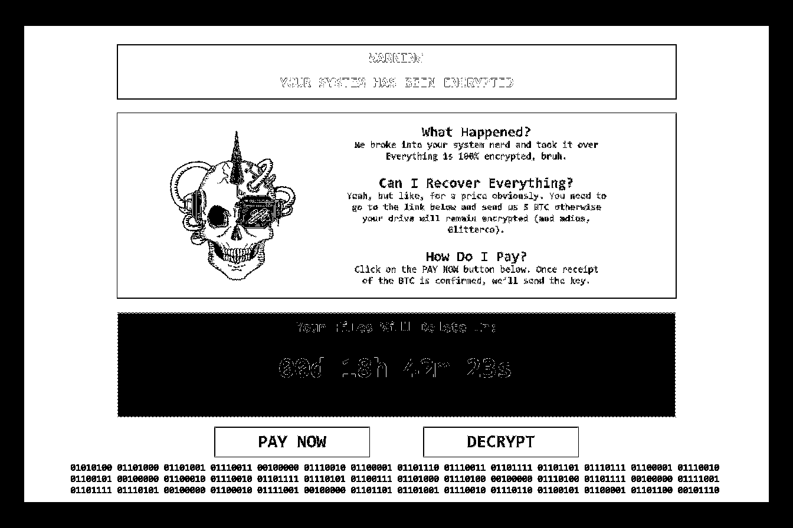

# You've Been Ransomwared (10 points)
DEADFACE is taunting GlitterCo with their latest ransomware attack. According to our intel, the attackers like to leave a calling card in their attacks. If we can figure out which DEADFACE actor executed this attack, we might be able to figure out a way around paying. Can you find anything in this screenshot that might point to which attacker ran this ransomware attack?

Submit the flag as `flag{attacker_name}`.

[Download Image](https://tinyurl.com/4mxurcfw)
SHA1: 6e653b2efc61cb6c9df39c45ccc0f73549e07910

## Solution
With a tool like `stegsolve` we can iterate through several color modes. Then we can find binary numbers at the bottom of the file:

The code is: `01010100 01101000 01101001 01110011 00100000 01110010 01100001 01101110 01110011 01101111 01101101 01110111 01100001 01110010 01100101 00100000 01100010 01110010 01101111 01110101 01100111 01101000 01110100 00100000 01110100 01101111 00100000 01111001 01101111 01110101 00100000 01100010 01111001 00100000 01101101 01101001 01110010 01110110 01100101 01100001 01101100 00101110`

If we decode this to ASCII we get: `This ransomware brought to you by mirveal.`

So the flag is: `flag{mirveal}`