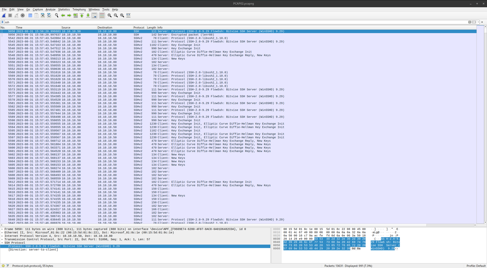

# Creepy Crawling (75 points)
One of our clients, TGRI, had an SSH server compromised at one of their smaller remote locations. Their only security analyst was fired and “accidentally” deleted information specific to the attack. Thankfully, TGRI still has the PCAP that captured the SSH brute force attack. What SSH protocol did TGRI run that was eventually compromised by DEADFACE?

Submit the SSH protocol as the flag: `flag{SSH-1.1.1: Simple SSH Server}`

[Download PCAPNG File](https://tinyurl.com/4eca8prr)
SHA1SUM: d402c9123b03cdcdf68fee34b2a5729bfb5f867c

## Solution
We can filter the PCAP for SSH traffic. Than we find the answer right in the first package:

The flag is `flag{SSH-2.0-9.29 FlowSsh: Bitvise SSH Server (WinSSHD) 9.29}`