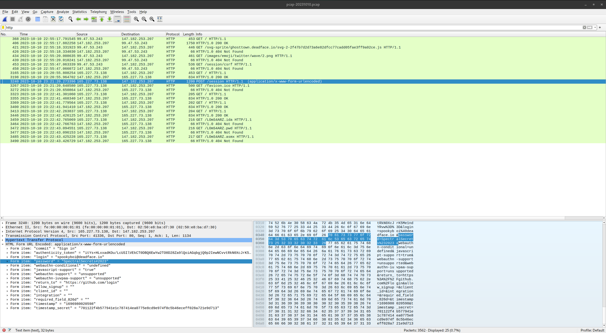

# Git Rekt (50 points)
One of our teammates at Turbo Tactical ran a phishing campaign on spookyboi and thinks spookyboi may have submitted credentials. We need you to take a look at the PCAP and see if you can find the credentials.

Submit the password as the flag: `flag{password}`.

[Download File](https://tinyurl.com/2wf28u2h)
SHA1: 24a77e034712d8b4b637b1082bd5d38cf72139f2

## Solution
If we search for HTTP packets we find one POST request. In there we find some credentials:

The flag is: `flag{SpectralSecrets#2023}`