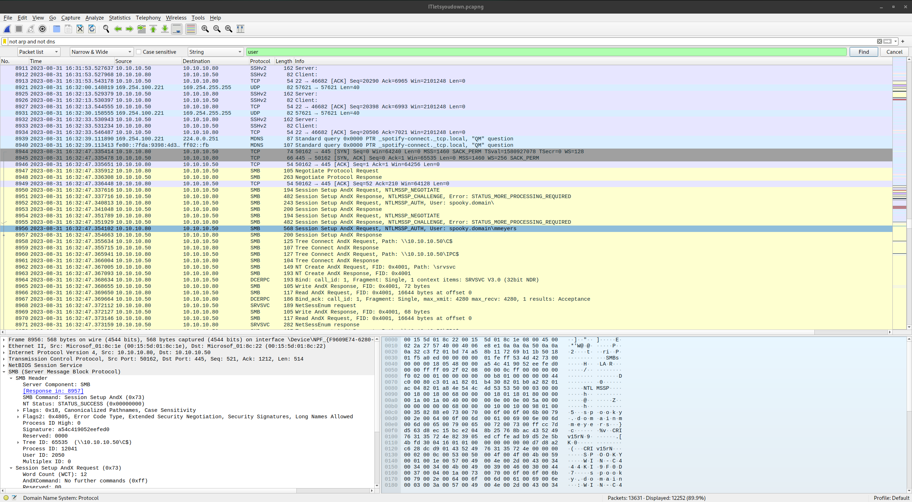

# Sometimes IT Lets You Down (25 points)
Lytton Labs has been having a slew of weird activity in the network lately. This recent PCAP capture we know contains a user account who compromised our domain controller. Can you figure out what user account was compromised?

Submit the flag as: `flag{username}`.

[Download PCAPNG](https://tinyurl.com/3mpmv23e)
SHA1: 8bf6c326ce5580e01c325dad45b6f611c8d6f48c

## Solution
I search for the strings 'user' in the PCAP and hopped through the packages. There ist many SMB traffic and one package show a username:

So the flag is `flag{mmeyers}`