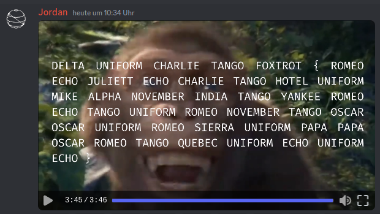

# discord (beginner)
Have you joined our discord yet (https://duc.tf/discord)?

We have a really helpful support team and lots of other competitors also paying in DUCTF 4.0

However, the support team are slowly being converted to the way of the monke. So apologies for the delays that might occur because of that.

Why don't you take a listen to the custom hold video the support team made in #rules while you wait for your tickets to be answered.

Note: Flag is in flag format, in all uppercase with no spaces.

## Solution
For this challenge we have to join the named discord server and hop to the _rules_ channel. Over here we can find the rules:
```
Welcome to DownUnderCTF 2023.
Please read the rules before you start hacking.

CTF Rules:
The flag format is described using this regex: /^DUCTF{.*}$/
The following is a sample of a valid flag. Any flag not in a similar format is a false flag.  DUCTF{th1s_i5_4_s4mpl3_fl4g'+!-.@#$%?}
Team size is up to 5 players to be eligible for prizes (see prizes for more details).
DDoS attacks are strictly prohibited.
You are not allowed to brute-force any challenge on a server, unless specified otherwise.
Collaboration between competing teams is not allowed.
Flag hoarding is not allowed.
Decision taken by organisers in DownUnderCTF regarding all disputes is final.

Ground Rules:
Treat everyone with respect. We do not tolerate any kind of harassment. If you have a concern for any reason, please contact an admin immediately.
Posting flags in any channel is strictly prohibited.
Please do not share links for pirated software, books or tools.
Keep the content mostly SFW.
Do not post write-ups until the CTF is over.
Do not hack the CTF infrastructure.
Do not advertise other CTFs/Discord servers/events without asking an organizer/admin.
Violation of any of the rules may lead to deletion of the messages, or even getting banned from the Discord server and DUCTF 2023.
Regarding all disputes, the decision by admins is final.
IMPORTANT: Have fun!

How do I get help? / Do you have an issue with a challenge?
request-support is your friend! Open a ticket and fill in the template. A DUCTF organiser will be with you ASAP to fix your issue! Though be patient, we may be in different time zones.

Happy Hacking!
```

Below the rules is also a video with a weird spoken text and video over monkeys. At the end of the video, the voice actor is saying letters in the NATO alphabet. In the last seconds of the video are the letters also printed on the display:


From that we get our flag: `DUCTF{REJECTHUMANITYRETURNTOOURSUPPORTQUEUE}`
