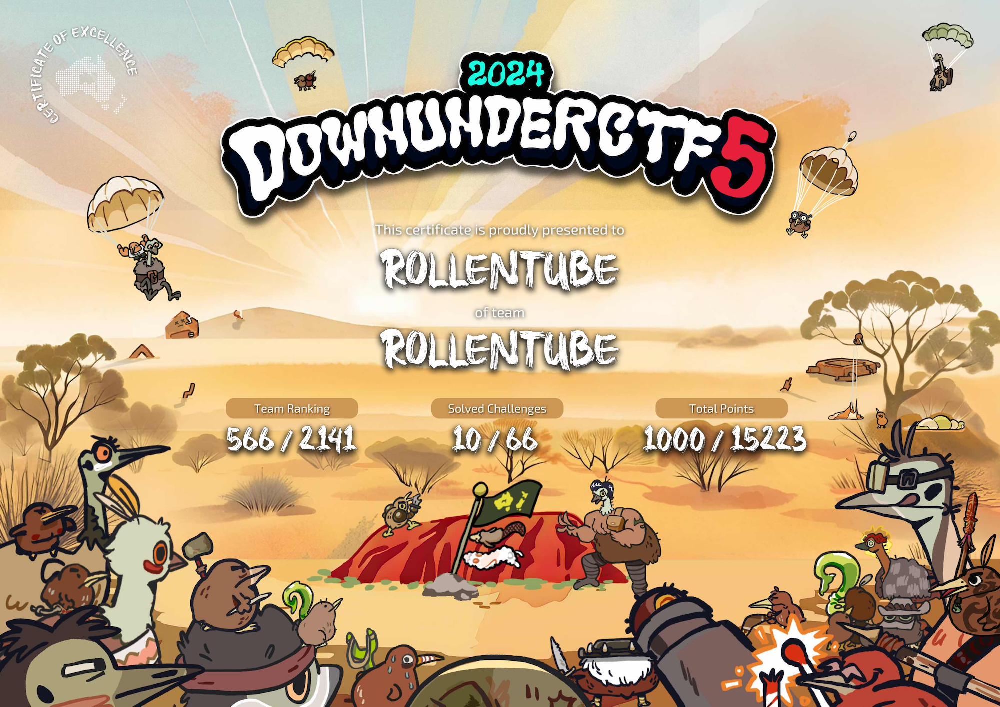

# DownUnderCTF 2024

## Challenges
### beginner (3/10)
| Challenge                                                | Category | Status     |
| -------------------------------------------------------- | -------- | ---------- |
| [tldr please summarise](./misc/tldr_please_summarise.md) | misc     | Solved     |
| [parrot the emu](./web/parrot_the_emu.md)                | web      | Solved     |
| Sun Zi's Perfect Math Class                              | crypto   | Not solved |
| [zoo feedback form](./web/zoo_feedback_form.md)          | web      | Solved     |
| shufflebox                                               | crypto   | Not solved |
| number mashing                                           | rev      | Not solved |
| Intercepted Transmissions                                | misc     | Not solved |
| vector overflow                                          | pwn      | Not solved |
| yawa                                                     | pwn      | Not solved |
| sssshhhh                                                 | rev      | Not solved |

### crypto (0/8)
| Challenge               | Difficulty | Status     |
| ----------------------- | ---------- | ---------- |
| decrypt then eval       | easy       | Not solved |
| my array generator      | easy       | Not solved |
| V for Vieta             | easy       | Not solved |
| three line crypto       | medium     | Not solved |
| super party computation | medium     | Not solved |
| Poly1305 OTM            | medium     | Not solved |
| AES                     | hard       | Not solved |
| kyber decryption oracle | hard       | Not solved |

### pwn (0/6)
| Challenge              | Difficulty | Status     |
| ---------------------- | ---------- | ---------- |
| sign in                | easy       | Not solved |
| pac shell              | easy       | Not solved |
| sheep farm simulator   | medium     | Not solved |
| Faulty Kernel          | hard       | Not solved |
| ESPecially secure boot | medium     | Not solved |
| mirage                 | hard       | Not solved |

### rev (0/7)
| Challenge                   | Difficulty | Status     |
| --------------------------- | ---------- | ---------- |
| rusty vault                 | easy       | Not solved |
| jmp flag                    | easy       | Not solved |
| pressing buttons            | medium     | Not solved |
| dungeon                     | medium     | Not solved |
| Ternary Brained             | medium     | Not solved |
| average assembly assignment | medium     | Not solved |
| adorable encrypted animal   | hard       | Not solved |

### web (0/7)
| Challenge          | Difficulty | Status     |
| ------------------ | ---------- | ---------- |
| co2                | easy       | Not solved |
| hah got em         | easy       | Not solved |
| i am confusion     | medium     | Not solved |
| co2v2              | medium     | Not solved |
| sniffy             | easy       | Not solved |
| waifu              | medium     | Not solved |
| Prisoner Processor | hard       | Not solved |

### hardware (0/7)
| Challenge     | Difficulty | Status     |
| ------------- | ---------- | ---------- |
| Sounds Nice   | easy       | Not solved |
| I See         | easy       | Not solved |
| The Door      | medium     | Not solved |
| Crash Landing | medium     | Not solved |
| sirkit        | hard       | Not solved |
| Birdloader    | medium     | Not solved |
| DUCTF         | hard       | Not solved |

### forensics (3/6)
| Challenge                                                      | Difficulty | Status      |
| -------------------------------------------------------------- | ---------- | ----------- |
| [Baby's First Forensics](./forensics/Babys_First_Forensics.md) | beginner   | Solved      |
| [SAM I AM](./forensics/SAM_I_AM.md)                            | beginner   | Solved      |
| [Bad Policies](./forensics/Bad_Policies.md)                    | beginner   | Solved      |
| Macro Magic                                                    | easy       | Not solved  |
| emuc2                                                          | easy       | Not solved  |
| [Lost in Memory](./forensics/Lost_in_Memory.md)                | medium     | Not solved* |
_*solved after the competition ends with the last piece of help from other writeups_

### osint (2/6)
| Challenge                                           | Difficulty | Status     |
| --------------------------------------------------- | ---------- | ---------- |
| [offtheramp](./osint/offtheramp.md)                 | beginner   | Solved     |
| cityviews                                           | easy       | Not solved |
| Bridget Lives                                       | easy       | Not solved |
| [back to the jungle](./osint/back_to_the_jungle.md) | easy       | Solved     |
| They're Making Decoys                               | medium     | Not solved |
| marketing                                           | beginner   | Not solved |

### misc (2/9)
| Challenge                    | Difficulty | Status     |
| ---------------------------- | ---------- | ---------- |
| [discord](./misc/discord.md) | beginner   | Solved     |
| survey                       | beginner   | Solved     |
| Wacky Recipe                 | easy       | Not solved |
| DNAdecay                     | easy       | Not solved |
| WebSocket VPN                | medium     | Not solved |
| the other minimal php        | medium     | Not solved |
| mkductfiso                   | medium     | Not solved |
| pkijs<                       | medium     | Not solved |
| pkijs=                       | medium     | Not solved |