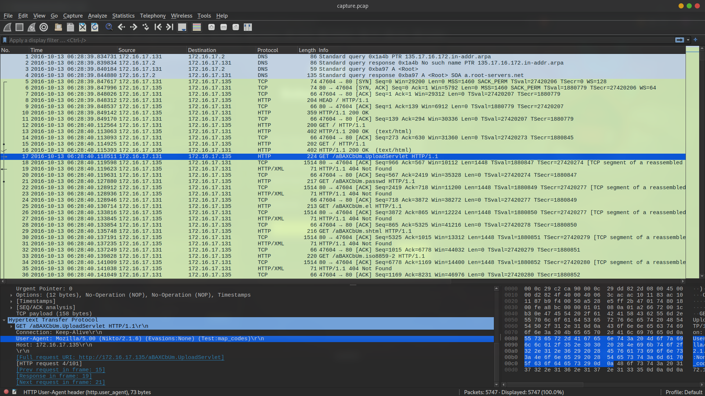

# Baby's First Forensics
They've been trying to breach our infrastructure all morning! They're trying to get more info on our covert kangaroos! We need your help, we've captured some traffic of them attacking us, can you tell us what tool they were using and its version?

NOTE: Wrap your answer in the DUCTF{}, e.g. DUCTF{nmap_7.25}

## Data
* capture.pcap

## Solution
If we inspect the PCAP file, we can see several HTTP requests. Looking in the `User-Agent` section of a few packets, shows the program that was used:

So the flag is `DUCTF{Nikto_2.1.6}`
