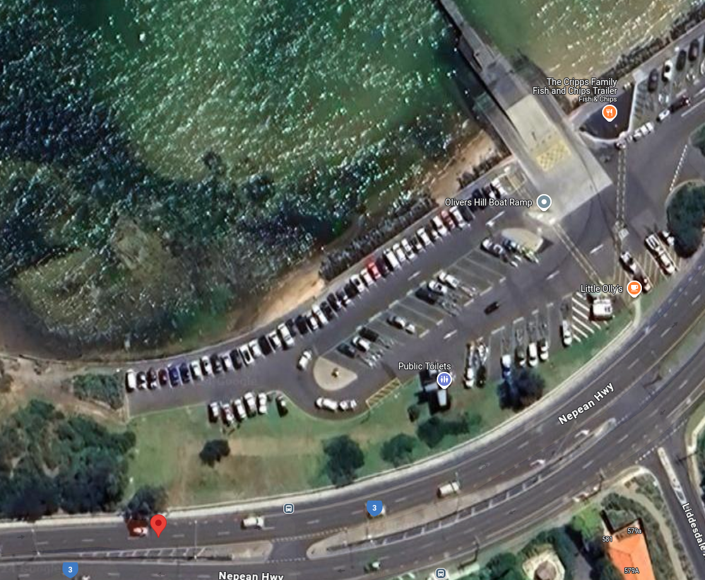

# offtheramp
That looks like a pretty cool place to escape by boat, EXAMINE the image and discover the name of this structure.

NOTE: Flag is case-insensitive and requires placing inside `DUCTF{}`! e.g `DUCTF{name_of_structure}`

## Data
* offtheramp.jpeg

## Solution
In the metadata of the picture we can find GPS information:
```
$ exiftool offtheramp.jpeg
[...]
GPS Altitude                    : 35 m Above Sea Level
GPS Latitude                    : 38 deg 9' 15.95" S
GPS Longitude                   : 145 deg 6' 29.69" E
GPS Position                    : 38 deg 9' 15.95" S, 145 deg 6' 29.69" E
$
```

We can search with Google Maps for the position `38°9'15.95"S 145°6'29.69"E` and find the following spot:


So the flag is `DUCTF{olivers_hill_boat_ramp}`.
