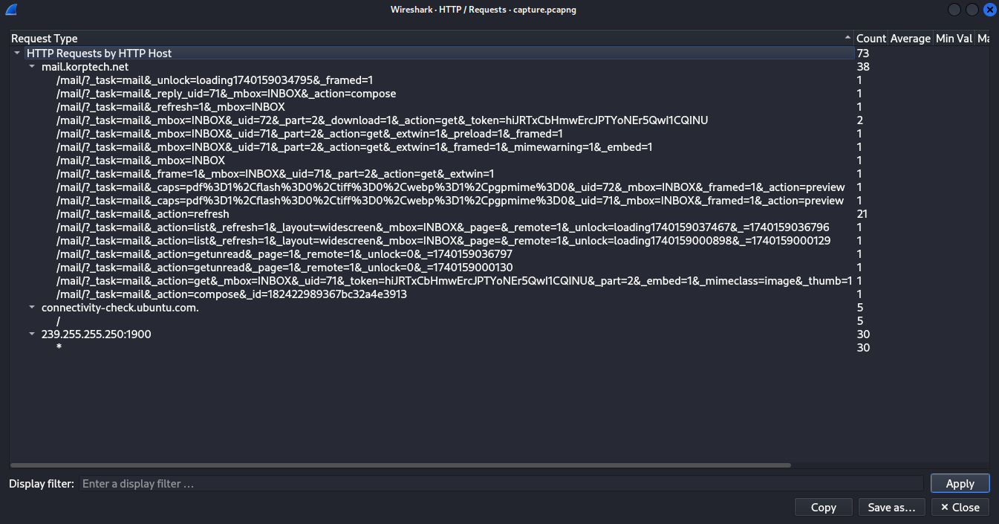
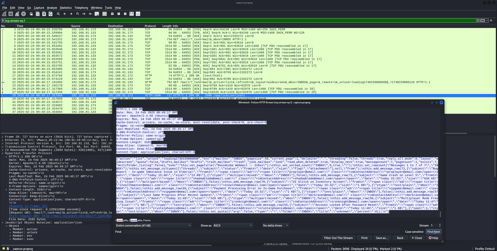
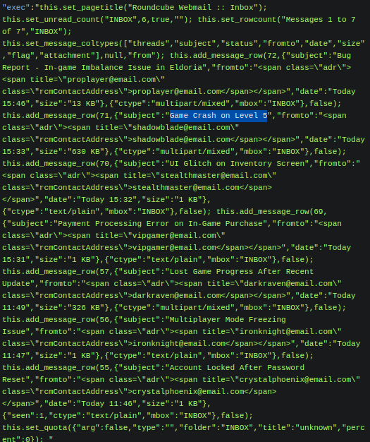
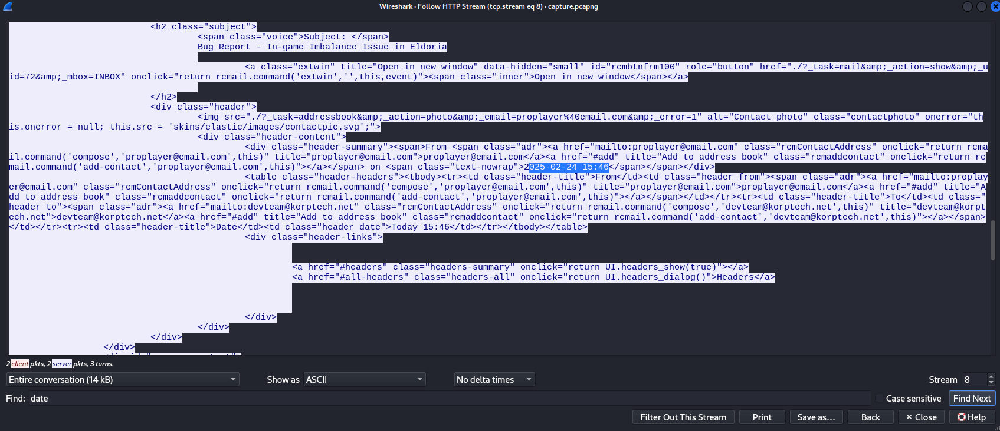
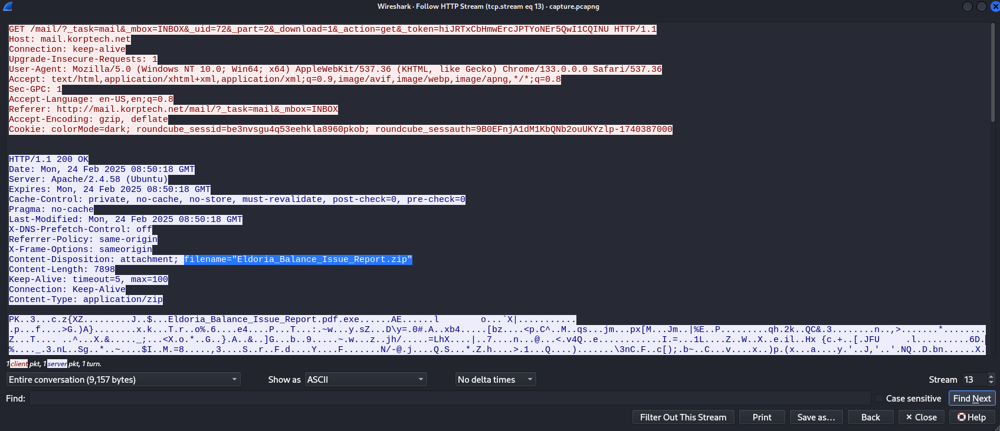
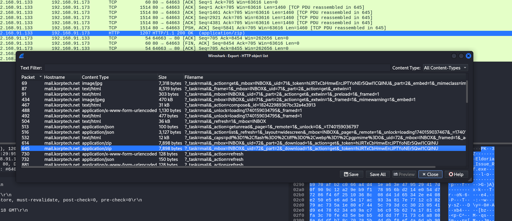
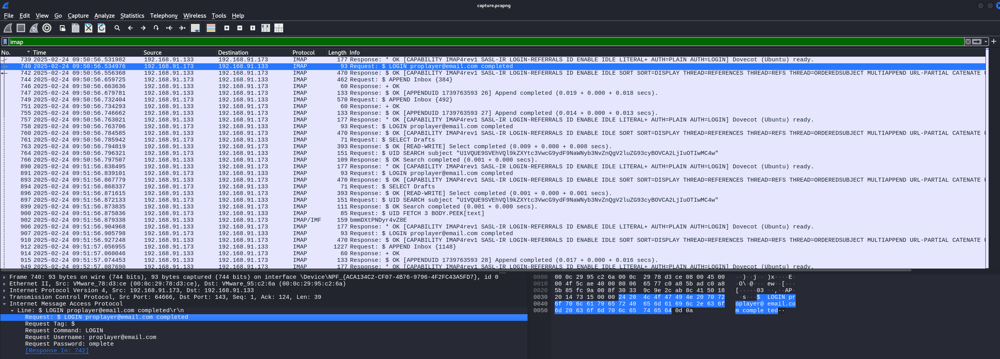

# Silent Trap
## 1. What is the subject of the first email that the victim opened and replied to?
The HTTP streams shows the interaction of the user with a web interface for his mail.

We can take a look at the HTTP statistics to see all request:



From the request, we can see that two mails were opened. UID 71 & 72. It seems like the user downloaded something from the UID 72.

The following request shows the INBOX. There were several email reporting bugs in a short period of time. They all contain some attachments:



If we extract the JSON data, we can get a better view of all mails:



I just tried the subjects of both UIDs. The subject `Game Crash on Level 5` was the flag.
## 2. On what date and time was the suspicious email sent? (Format: YYYY-MM-DD_HH:MM) (for example: 1945-04-30_12:34)
The suspicious email is probably the UID 72, since the attachment of it was downloaded. The user opened the mail in the web view, so we can find the content and some metadata:



The user received the mail at the following time: `2025-02-24_15:46`
## 3. What is the MD5 hash of the malware file?
We can find the download of the file in the HTTP traffic:



The HTTP data can be extracted via `File -> Export Objects -> HTTP ...`

Here we can find the ZIP file:



Once downloaded we can verify the zip:
```
┌──(kali㉿kali)-[~/Desktop/htb/cyberapocolapse/silent_trap]
└─$ file %3f_task=mail\&_mbox=INBOX\&_uid=72\&_part=2\&_download=1\&_action=get\&_token=hiJRTxCbHmwErcJPTYoNEr5QwI1CQINU
%3f_task=mail&_mbox=INBOX&_uid=72&_part=2&_download=1&_action=get&_token=hiJRTxCbHmwErcJPTYoNEr5QwI1CQINU: Zip archive data, at least v5.1 to extract, compression method=AES Encrypted

┌──(kali㉿kali)-[~/Desktop/htb/cyberapocolapse/silent_trap]
└─$ md5sum %3f_task=mail\&_mbox=INBOX\&_uid=72\&_part=2\&_download=1\&_action=get\&_token=hiJRTxCbHmwErcJPTYoNEr5QwI1CQINU 
cfe9f2109fee272e3826e90dee5b688a  %3f_task=mail&_mbox=INBOX&_uid=72&_part=2&_download=1&_action=get&_token=hiJRTxCbHmwErcJPTYoNEr5QwI1CQINU

┌──(kali㉿kali)-[~/Desktop/htb/cyberapocolapse/silent_trap]
└─$ 
```

It's encrypted, but the key was named in the mail:
```
<div id="messagebody"><div class="message-part" id="message-part1"><div class="pre"><span style="white-space:nowrap">Dear..Eldoria..Development..Team,</span><br>
<br>
I hope this message finds you well. I...ve been playing *Tales from Eldoria* recently and have come across an in-game issue that I believe could impact the balance of gameplay for many players.<br>
<br>
It seems that there...s a small exploit within the in-game economy system that allows players to accumulate resources far too quickly. This results in some players being able to progress significantly faster than others, which is creating a rather unfair advantage.<br>
<br>
While this isn...t a game-breaking bug, it does affect the overall player experience and could lead to frustration among those who are not using the exploit. I...ve attached a PDF file with more details on how to reproduce the issue, as well as some suggestions for a fix. Archive password is eldoriaismylife<br>
<br>
Looking forward to seeing this fixed soon. Thanks for your hard work on the game!<br>
<br>
<span style="white-space:nowrap">Best..regards,</span><br>
<span style="white-space:nowrap">A..concerned..player</span></div></div></div>
```

The password is: `eldoriaismylife`

```
┌──(kali㉿kali)-[~/Desktop/htb/cyberapocolapse/silent_trap]
└─$ 7z x %3f_task=mail\&_mbox=INBOX\&_uid=72\&_part=2\&_download=1\&_action=get\&_token=hiJRTxCbHmwErcJPTYoNEr5QwI1CQINU

7-Zip 24.09 (x64) : Copyright (c) 1999-2024 Igor Pavlov : 2024-11-29
 64-bit locale=en_US.UTF-8 Threads:2 OPEN_MAX:1024

Scanning the drive for archives:
1 file, 7898 bytes (8 KiB)

Extracting archive: %3f_task=mail&_mbox=INBOX&_uid=72&_part=2&_download=1&_action=get&_token=hiJRTxCbHmwErcJPTYoNEr5QwI1CQINU
--
Path = %3f_task=mail&_mbox=INBOX&_uid=72&_part=2&_download=1&_action=get&_token=hiJRTxCbHmwErcJPTYoNEr5QwI1CQINU
Type = zip
Physical Size = 7898

    
Enter password (will not be echoed):
Everything is Ok

Size:       18944
Compressed: 7898

┌──(kali㉿kali)-[~/Desktop/htb/cyberapocolapse/silent_trap]
└─$ 
```

The found EXE is the malware that we are looking for. We can get the MD5 hash for the next flag:
```
┌──(kali㉿kali)-[~/Desktop/htb/cyberapocolapse/silent_trap]
└─$ file Eldoria_Balance_Issue_Report.pdf.exe 
Eldoria_Balance_Issue_Report.pdf.exe: PE32 executable (GUI) Intel 80386 Mono/.Net assembly, for MS Windows, 3 sections

┌──(kali㉿kali)-[~/Desktop/htb/cyberapocolapse/silent_trap]
└─$ md5sum Eldoria_Balance_Issue_Report.pdf.exe                                                                           
c0b37994963cc0aadd6e78a256c51547  Eldoria_Balance_Issue_Report.pdf.exe

┌──(kali㉿kali)-[~/Desktop/htb/cyberapocolapse/silent_trap]
└─$ 
```

The file hash is: `c0b37994963cc0aadd6e78a256c51547`

## 4. What credentials were used to log into the attacker's mailbox? (Format: username:password)
The credentials can be found in the IMAP traffic:



The credentials are: `proplayer@email.com:completed`
## 5. What is the name of the task scheduled by the attacker?
## 6. What is the API key leaked from the highly valuable file discovered by the attacker?