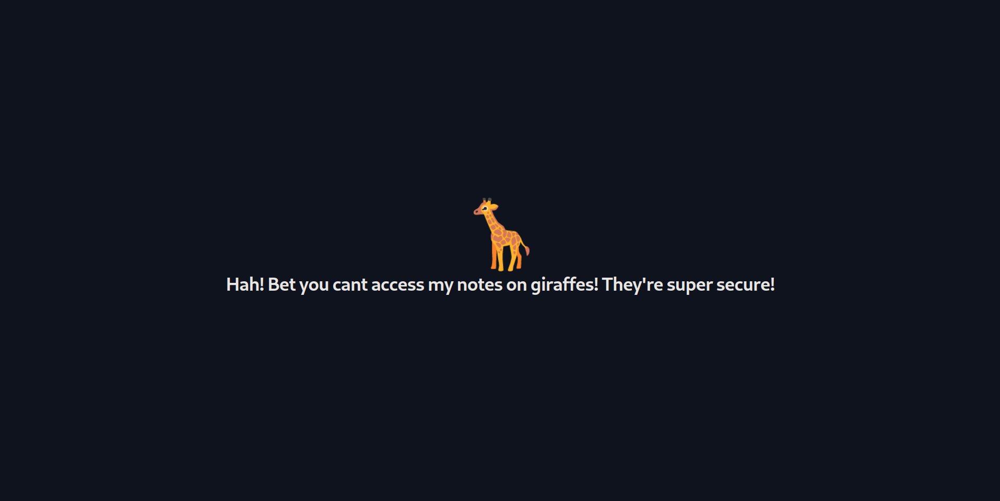
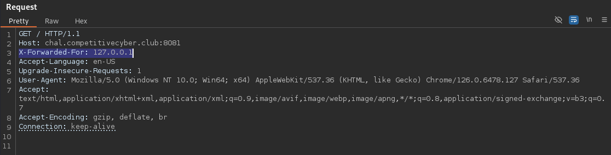
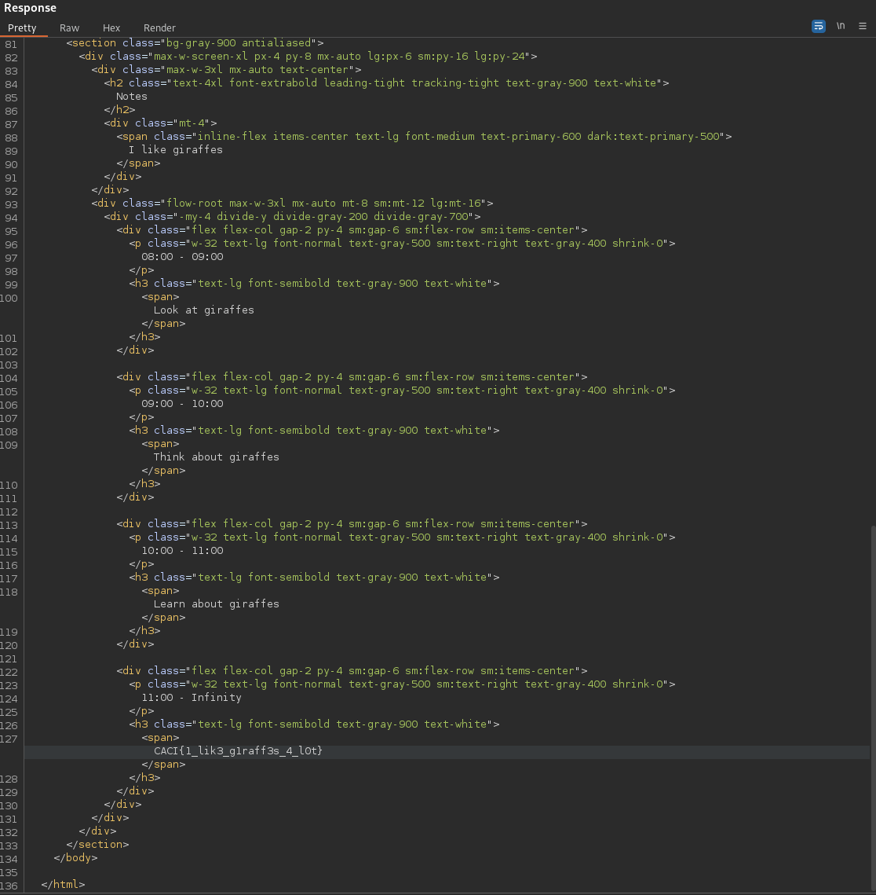

# giraffe notes (Easy)
I bet you can't access my notes on giraffes!

http://chal.competitivecyber.club:8081

Flag format: `CACI{.*}`

## Data
* `index.php`

## Solution
If we access the URL, we see the following website:



Nothing interesting to find here.

If we take a look into the PHP file, we notice those lines at the beginning:
```php
<?php
$allowed_ip = ['localhost', '127.0.0.1'];

if (isset($_SERVER['HTTP_X_FORWARDED_FOR']) && in_array($_SERVER['HTTP_X_FORWARDED_FOR'], $allowed_ip)) {
    $allowed = true;
} else {
    $allowed = false;
}
?>

[...]

```

The hostname/IP `localhost`/`127.0.0.1` is declared as allowed IP, and it's checked via the `X-Forwarded-For` HTTP header (further details on the header can be found [here](https://en.wikipedia.org/wiki/X-Forwarded-For), but it's not important for this challenge).

Further, in the code, the variable `allowed` is checked:
```php
<?php
if (!$allowed) {
?>

[...]

<?php
} else {
?>

[...]

<?php
}
?>
```

So if the IP from the header matches, we get another content. We can set the header for example with Burp:



And as response, we get the site with the flag:



