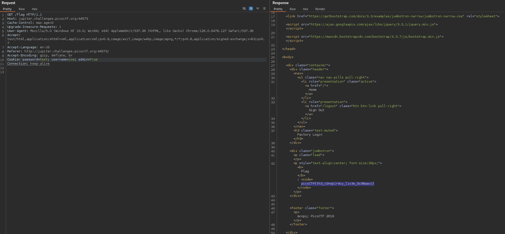

# logon (Easy)
The factory is hiding things from all of its users. Can you login as Joe and find what they've been looking at? https://jupiter.challenges.picoctf.org/problem/44573/ or http://jupiter.challenges.picoctf.org:44573

## Solution
If we inspect the HTTP traffic of a login attempt, we can see that the server sets 3 cookies for the POST request and redirects it:

We can change the value of the `admin` cookie and resend the redirected GET request to get the flag:

