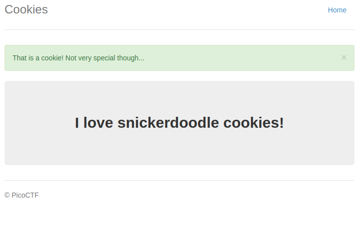
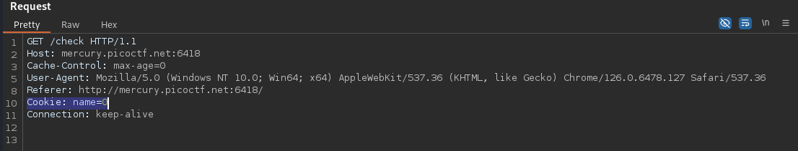
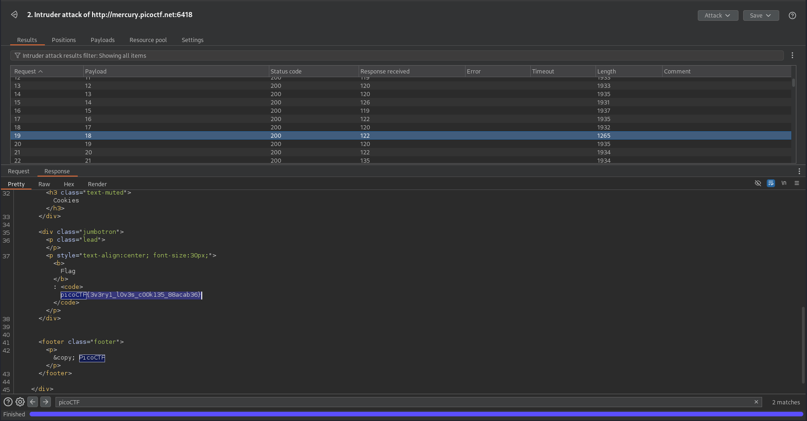

# Cookies (Easy)
Who doesn't love cookies? Try to figure out the best one. http://mercury.picoctf.net:6418/

## Solution
The website shows a form to search for cookie types:

If we enter the given one _snickerdoodle_, we get a valid response:

We can inspect the HTTP traffic and see that the cookie is accessed via `/check` with the cookie HTTP header:

If we iterate through the numbers, we get valid responses for different cookies. We can just set up an Intruder for this value and check the different responses. There was one with a different length. This one contained the flag:

