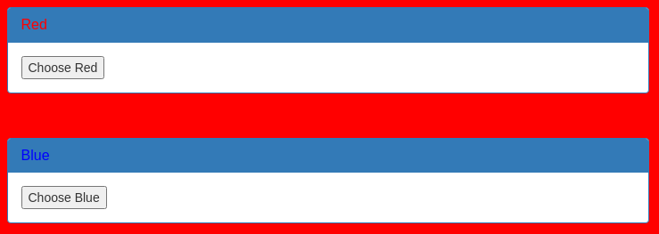
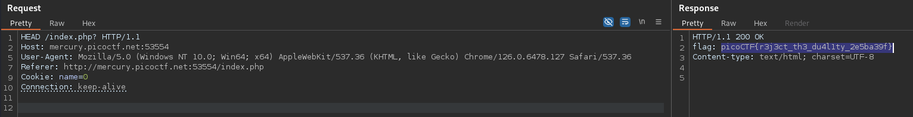

# GET aHEAD (Easy)
Find the flag being held on this server to get ahead of the competition http://mercury.picoctf.net:53554/

## Solution
The website shows two buttons, which are changing the site red or blue:

If we inspect the source code or the HTTP traffic, we can see, that _Red_ creates a GET and _Blue_ a POST request. Depending on the request, the action is choosen. So we can just try more [request methods](https://developer.mozilla.org/en-US/docs/Web/HTTP/Methods), we can find a good catch with the method HEAD:

