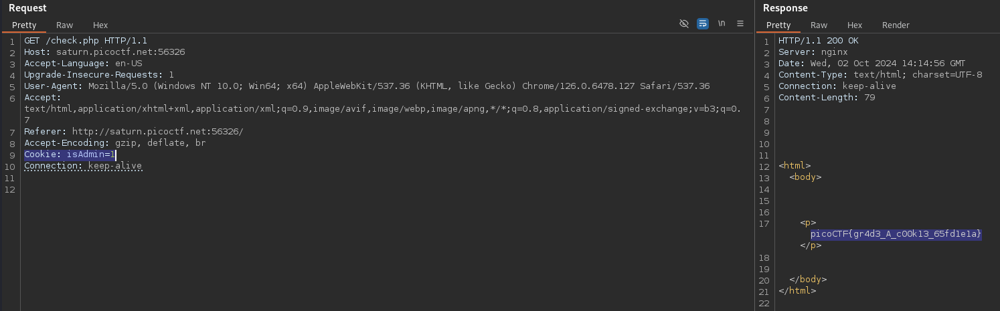

# Power Cookie (Medium)
Can you get the flag?

Go to this website and see what you can discover.

## Solution
If we access the website and check the HTTP traffic, we can notice the function `continueAsGuest()`, that is called if we click _Continue as guest_:
```js
function continueAsGuest()
{
  window.location.href = '/check.php';
  document.cookie = "isAdmin=0";
}
```

So there is a cookie `isAdmin`, which is set to `0`. We can simply adjust this value to `1` and resent the request to get the flag:


