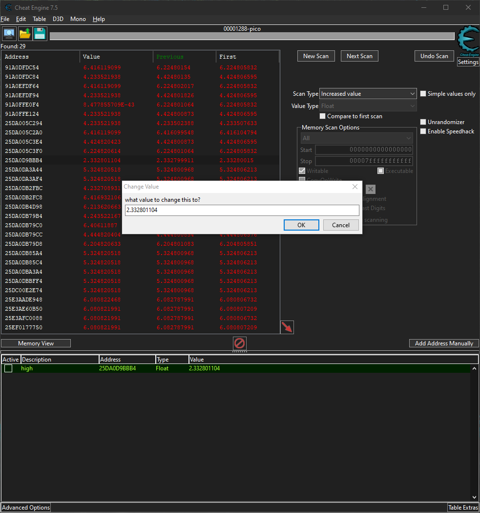

# No way out
Put this flag in standard picoCTF format before submitting. If the flag was h1\_1m\_7h3\_f14g submit picoCTF{h1\_1m\_7h3\_f14g} to the platform.

## Files
- win.zip
- mac.app.zip

## Solution
If we start the game we find ourself in a small location and outside of the walls is a flag. Probably this is where we have to go. But we cant jump out because of hidden walls. To get out of here we have two approaches. One is to rewrite the game binaries and the other is using Cheat Engine. To get the flag I used the second one, but I will explain the approach of flashing the binary aswell.

### Rewrite binary
With dnSpy (https://github.com/dnSpy/dnSpy) we can reverse the binaries, change it and compile it again. Our game is a game written with the Unity Engine as we can see by the files in the directory.

The relevant file for us is _win/pico\_Data/Managed/Assembly-CSharp.dll_. In here we have the functions, which are responsible for the behavior of our figure and the interaction with the environment.

To break out of the walls we can edit the value of the jump high to increase our jumps and jump over the hidden walls. The part of the code is the following (EvolveGames/PlayerController):
```c#
        if (Input.GetButton("Jump") && canMove && characterController.isGrounded && !isClimbing)
		{
			moveDirection.y = jumpSpeed;
		}
		else
		{
			moveDirection.y = y;
		}
```

You have to rewrite either the variable 'jumpSpeed' or change the input to a fixed number. After that compile it and replace it in the game folder.

### Cheat Engine
With Cheat Engine we can access and manipulate the memory regions that a process is using. So the theory here is to determine the adresses were the value of the player position (x, y, z) is stored. Espacially we are interested in manipulating the high of the player.

My final approach was to hop in this corner:


Now doing picking the process in Cheat Engine and hitting 'New Scan' with unknown values. Now Cheat Engines has registered all values related to the process in the memory. Now we change our position in form that we jumped down of the platform. After that we select 'Decreased value' and hit 'Next Search', since our high has decreased by the last scan. We still have a lot of findings. So what we can do now, is to hop on the ladder, climbing up and scanning for increased values or climbing down and scanning for decreased values. By this we filtering out many values.

Also we can just stand still and filtering out for values that not have changed. In the memory are many values that are changing constantly. So hitting the next scan with this option a few times will also filter out some addresses.

At last I hopped back into my corner with a few addresses left. The value for the high should be really close to the 'First' value of the address. From a few tries I figured out that the high at this position is ~2.33.


If we safe this address we can change its value. This easiest way I found, was to change the value to ~0.33 while standing in the corner. With the change our high decreases and we teleport to the ground outside the walls.

Here we can now move towards the big flag. Reaching it will print out the flag onto our screen.


## My failure
I also managed to break out of the walls during the competion, but I tried to changed some values in the Assembly-CSharp.dll and forgot to undo the flashing. So breaking out and running to the flag didnt give me any more output.

The function APTX/OnTriggerEnter is probably responsible for triggering the flag. So I changed the condition in hope that the 'Mysterous' action will be done without hitting the secret collision. It does not. And it wont print it anymore if you reach it, obviously.
