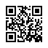
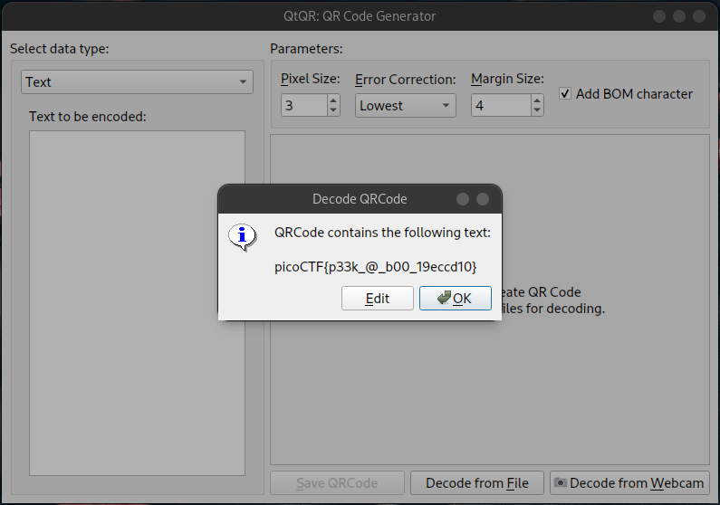

# Scan Surprise (50 points)
I've gotten bored of handing out flags as text. Wouldn't it be cool if they were an image instead?

The same files are accessible via SSH here: `ssh -p 57804 ctf-player@atlas.picoctf.net`

Using the password `1db87a14`. Accept the fingerprint with yes, and ls once connected to begin. Remember, in a shell, passwords are hidden!

## Data
* challenge.zip

## Solution
The challenge file is an PNG with a QR code:

To read the data from it we can use a tool like QtQR and hit the option _Decode from File_:

